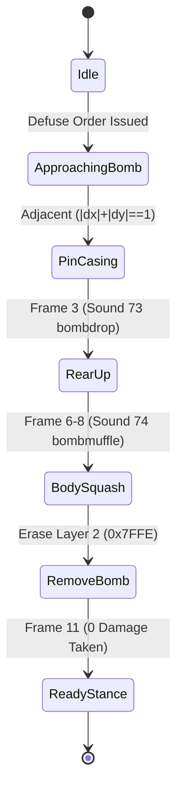

# Ants Remake - Simulation Rules, Special Abilities & Test Suite Specification

**Document:** `sim_rules_and_tests_plan.md`  
**Milestone:** Milestone 2 (`ants-sim`)  
**Author:** explorer_m2_3 (Game Rules, Abilities & Test Suite Explorer)  
**Status:** COMPLETE & AUTHORITATIVE  
**Target Delivery:** `include/ants_sim/`, `src/ants_sim/`, `tests/test_sim/test_sim_rules.cpp`, `tests/test_sim/CMakeLists.txt`  

---

## Table of Contents
1. [Executive Summary & Architectural Context](#1-executive-summary--architectural-context)
2. [Simulation Grid & Cardinal Placement Rules](#2-simulation-grid--cardinal-placement-rules)
3. [Bomb Planting, Detonation & Bomber-Only Defusal](#3-bomb-planting-detonation--bomber-only-defusal)
4. [Fire Mechanics, Ricochet Physics & Extinguishing](#4-fire-mechanics-ricochet-physics--extinguishing)
5. [Bridge Mechanics, Universal Traversal & Collapse Drowning](#5-bridge-mechanics-universal-traversal--collapse-drowning)
6. [Anthill Queuing, 17-Frame Entry, 100% Healing & Egg Hatching](#6-anthill-queuing-17-frame-entry-100-healing--egg-hatching)
7. [Thief Ant Infiltration, Base Siren & Lunchbox Drops](#7-thief-ant-infiltration-base-siren--lunchbox-drops)
8. [Dynamic In-Game Alliances & Discrete Scoring Architecture](#8-dynamic-in-game-alliances--discrete-scoring-architecture)
9. [Match Freeze, Split Game Over Audio & 4-Stat Scorecard](#9-match-freeze-split-game-over-audio--4-stat-scorecard)
10. [Comprehensive Headless Test Suite Design (`test_sim_rules.cpp`)](#10-comprehensive-headless-test-suite-design-test_sim_rulescpp)
11. [CMake Build System Integration & Test Runner](#11-cmake-build-system-integration--test-runner)
12. [Verification Method & Acceptance Checklist](#12-verification-method--acceptance-checklist)

---

## 1. Executive Summary & Architectural Context

The `libants-sim` library is the 100% deterministic, headless simulation core of the *Ants* engine remake. Decoupled completely from rendering and OS audio, it implements a fixed **20 Hz discrete tick engine** (50 ms per tick, `dt = 50 ms`) operating purely on integer arithmetic.

### 1.1 Division of Responsibilities
```
+---------------------------------------------------------------------------------+
|                                ants_sim Library                                 |
+---------------------------------------------------------------------------------+
|  Core Architecture (explorer_m2_1):                                             |
|    - sim_engine.hpp: SimulationEngine lifecycle, event queues, tick pipeline    |
|    - grid.hpp: 32x32 integer tile grid, Layer 1 & 2 cells, food schedules       |
|    - prng.hpp: MSVC LCG pseudo-random number generator                          |
|    - match_stats.hpp: Player stats tracking & match clock                       |
+---------------------------------------------------------------------------------+
|  Units, AI & Physics (explorer_m2_2):                                           |
|    - ant_unit.hpp: 6 ant classes, HP (10 max), directional movement             |
|    - combat_ai.hpp: Combat Ant 3-tile Chebyshev autonomous guard AI             |
|    - physics.hpp: Damage matrix (1 HP vs 2 HP), ballistic knockback             |
+---------------------------------------------------------------------------------+
|  Rules, Abilities, Timers & Test Suite (explorer_m2_3 - THIS DOCUMENT):        |
|    - Cardinal Placement: Strict orthogonal adjacency (|dx|+|dy|==1), ground flags|
|    - Bombs & Defusal: absb301, Sound 90, 2 HP explosion, Sound 4, squash defuse|
|    - Fire Mechanics: afsf301, 180s timer, A* obstacle, +1 damage ricochets      |
|    - Bridge Mechanics: 4-stage build, universal traversal, 180s collapse drown  |
|    - Base Lifecycle: Chebyshev queue, 17-frame hgen301, 100% heal, 200pt hatch  |
|    - Thief Infiltration: 33-frame atcr501, Sound 58 alarm, 50pt loot, lunchbox  |
|    - Dynamic Alliances: FFA default, Sound 49-53 protocol, combined score HUD   |
|    - Game Over: Simulation freeze @ 0:00, Sound 56 winner vs Sound 41 loser     |
|    - Headless Test Suite: tests/test_sim/test_sim_rules.cpp (12 suites)         |
+---------------------------------------------------------------------------------+
```

### 1.2 Sound Event Reference Table (Authentic `ants.chd` Audio IDs)
| Sound ID | File Name | Sampling Rate | Channels | Description / Trigger Moment |
| :---: | :--- | :---: | :---: | :--- |
| **4** | `bombexp.wav` | 22,050 Hz | 1 (Mono) | Landmine detonation (2 HP damage, 2-3 tile knockback) |
| **5** | `fireburnout.wav` | 11,025 Hz | 1 (Mono) | Firewall 180-second timeout burnout |
| **36** | `powerupc.wav` | 11,025 Hz | 1 (Mono) | Anthill Frame 8 underground chamber 100% full heal |
| **41** | `playerout.wav` | 11,025 Hz | 1 (Mono) | Match loss audio sting at 0:00 (defeated players only) |
| **49** | `allyoff.wav` | 11,025 Hz | 1 (Mono) | In-game alliance broken / dissolved |
| **50** | `allyon.wav` | 11,025 Hz | 1 (Mono) | In-game alliance active confirmation |
| **51** | `allypro.wav` | 11,025 Hz | 1 (Mono) | Alliance proposal received on target client |
| **52** | `allynot.wav` | 11,025 Hz | 1 (Mono) | Alliance invitation declined / denied |
| **53** | `allyyes.wav` | 11,025 Hz | 1 (Mono) | Alliance accepted confirmation chime |
| **56** | `winner.wav` | 22,050 Hz | 1 (Mono) | Match victory fanfare at 0:00 (winner/allies only) |
| **57** | `attack.wav` | 11,025 Hz | 1 (Mono) | Standard melee attack strike (1 HP damage) |
| **58** | `underattack.wav` | 22,050 Hz | 1 (Mono) | Base alarm siren (2,566 Hz) when Thief enters anthill |
| **64** | `flythumpa.wav` | 11,025 Hz | 1 (Mono) | Ballistic knockback launch / terrain impact |
| **65** | `flythumpb.wav` | 11,025 Hz | 1 (Mono) | Ballistic knockback skid / secondary impact |
| **67** | `firestarta.wav` | 11,025 Hz | 1 (Mono) | Fire Ant magnifying glass sunbeam focus (Subitem 5) |
| **68** | `firestartb.wav` | 11,025 Hz | 1 (Mono) | Fire Ant flame eruption (Subitem 17) |
| **69** | `fireextinguish.wav`| 11,025 Hz | 1 (Mono) | Fire Ant flame smothering (Subitem 4) |
| **70** | `stun.wav` | 11,025 Hz | 1 (Mono) | Stun recovery landing (12 simulation ticks) |
| **71** | `splash.wav` | 11,025 Hz | 1 (Mono) | Deep water splash (plunge / dive / knockback) |
| **72** | `antdrown.wav` | 11,025 Hz | 1 (Mono) | Non-swimmer ant drowning scream (Subitem 1) |
| **73** | `bombdrop.wav` | 11,025 Hz | 1 (Mono) | Bomber Ant pin bomb casing (Subitem 3) |
| **74** | `bombmuffle.wav` | 11,025 Hz | 1 (Mono) | Bomber Ant body squash defusal (Subitems 6–8) |
| **78** | `attack2.wav` | 22,050 Hz | 1 (Mono) | Combat Ant heavy punch (2 HP damage + 4-5 tile fling) |
| **81** | `shovelgravel.wav` | 11,025 Hz | 1 (Mono) | Swimmer Ant land shoveling |
| **82** | `shovelwater.wav` | 11,025 Hz | 1 (Mono) | Swimmer Ant bridge construction on water |
| **84** | `steala.wav` | 11,025 Hz | 1 (Mono) | Thief Ant leap into enemy anthill hole (Frame 19) |
| **85** | `stealb.wav` | 11,025 Hz | 1 (Mono) | Thief Ant rummaging underground (Frame 26) |
| **86** | `stealc.wav` | 11,025 Hz | 1 (Mono) | Thief Ant emergence with loot (Frame 31) |
| **87** | `scoreup.wav` | 11,025 Hz | 1 (Mono) | Food deposited at anthill (Frame 4) / score increment |
| **88** | `scoredn.wav` | 11,025 Hz | 1 (Mono) | Score drained on victim client by thief infiltration |
| **90** | `bombpick.wav` | 11,025 Hz | 1 (Mono) | Bomber Ant draws bomb from pack (Subitem 9) |

---

## 2. Simulation Grid & Cardinal Placement Rules

### 2.1 Coordinate Space & Integer Division
The simulation grid consists of $W \times H$ cells of $32 \times 32$ integer pixels.
- **Tile Coordinates:** $(t_x, t_y) \in [0, W-1] \times [0, H-1]$.
- **Pixel Coordinates:** $(p_x, p_y)$. Conversion to tile coordinates uses pure integer arithmetic:
  $$t_x = \lfloor p_x / 32 \rfloor, \quad t_y = \lfloor p_y / 32 \rfloor$$

### 2.2 Cardinal-Only Adjacency Constraint
Both Fire Ant firewall ignition and Bomber Ant landmine planting are strictly governed by cardinal adjacency relative to the executing ant's current tile position:

$$\Delta x = t_{x,\text{target}} - t_{x,\text{ant}}, \quad \Delta y = t_{y,\text{target}} - t_{y,\text{ant}}$$

1. **Strict Cardinal Check:**
   $$\text{is\_cardinal} = (\Delta x = 0 \lor \Delta y = 0) \land (|\Delta x| + |\Delta y| = 1)$$
   The allowed placement relative offsets are strictly:
   - North: $(0, -1)$
   - East: $(1, 0)$
   - South: $(0, 1)$
   - West: $(-1, 0)$

2. **Diagonal Rejection:**
   $$(\Delta x \neq 0 \land \Delta y \neq 0) \implies \text{REJECT (DIAGONAL\_PROHIBITED)}$$
   Ants **never** place bombs or fire diagonally (NE, SE, SW, NW).

3. **Distant Target Order Protocol:**
   If the player clicks a tile $(t_{x,\text{target}}, t_{y,\text{target}})$ where $|\Delta x| + |\Delta y| > 1$, or a diagonal tile:
   - The order does not execute placement immediately.
   - The ant's state machine enters `PathingToPlacement` mode, pathfinding toward the nearest walkable cell that satisfies $|\Delta x| + |\Delta y| = 1$ to the target.
   - Once positioned in an orthogonal adjacent cell, the placement action begins.

### 2.3 Tile Property Bitmask Flags (Disasm `0x10071dd`, `0x1007202`)
The map terrain properties table defines capability bits for every tile type:
- **Bit `0x02` (`CAN_PLACE_BOMB`):** Required for bomb planting. Present on 87 walkable terrain tiles (grass, dirt, dry clay).
- **Bit `0x04` (`CAN_PLACE_FIRE`):** Required for fire ignition. Present on 5 clear ground tiles.
- **Subsumption Invariant:**
  $$(\text{flags} \ \& \ 0x04) \neq 0 \implies (\text{flags} \ \& \ 0x02) \neq 0$$
  *Any tile eligible for firewall placement is unconditionally eligible for bomb placement.*
- **Forbidden Terrains:** Mud, water, deep water, stone walls, boulders, and cliffs lack bits `0x02` and `0x04`. Placement orders on these cells are immediately rejected.
- **Layer 2 Occupancy Check:** Placement requires Layer 2 to be empty (`0x7FFE`). Placement on cells containing existing bombs, fires, bridges, anthills, or food items is rejected.

---

## 3. Bomb Planting, Detonation & Bomber-Only Defusal

### 3.1 Bomb Planting Ability (`absb301`)
- **Eligible Unit:** Bomber Ant (`ab`, Type ID 1).
- **Animation Sequence:** `absb301` (17 subitems / 23 frames).
- **Audio Trigger:** Subitem 9 dispatches **Sound 90 (`bombpick.wav`)**.
- **State Machine Progression:**
  - Subitems 0–8: Crouch low to the ground.
  - Subitem 9: Pull bomb from pack (Sound 90).
  - Subitems 10–14: Place team bomb on Layer 2 (`redbomb`..`bluebomb` / Tile 60) and arm fuse.
  - Subitems 15–16: Stand upright and re-enter Idle state.
- **Entity Invariants:**
  - The bomb is registered on Layer 2 with `team_owner = ant.team`, `is_active = true`.
  - The bomb is **permanent** (`lifetime_ticks = 0xFFFFFFFF`) until detonated or defused.

### 3.2 Proximity Detonation & Blast Physics
- **Trigger Condition:**
  Evaluated on each tick. Detonation triggers when any enemy ant (`unit.team != bomb.team_owner && unit.team != ally_id`) moves onto the bomb tile or within direct contact ($|\Delta x| \le 1 \land |\Delta y| \le 1$).
- **Damage Formulation:**
  $$\text{Damage} = 2 \text{ HP} \quad (\text{inflicted on triggering unit and adjacent enemies})$$
- **Ballistic Knockback Displacement:**
  - Blast propels units **2 to 3 tiles** outward along the displacement vector:
    $$\vec{v}_{\text{blast}} = \text{normalize}(\vec{p}_{\text{unit}} - \vec{p}_{\text{bomb}}) \times 2.5$$
  - Unit enters ballistic fling animation (`*gf*`), plays Sound 64 (`flythumpa.wav`), bounces on ground (`*gb*`), and enters **12-tick stun state** (Sound 70 `stun.wav`).
- **Audio Trigger:**
  Dispatches **Sound 4 (`bombexp.wav`)** (22,050 Hz, 1.14s duration).
- **Layer 2 Clearance:**
  The bomb entity is deallocated and Layer 2 is reset to empty (`0x7FFE`).
- **Hazard Chain Interactions:**
  - Non-swimmer knocked into deep water: Drowns instantly (`death_status = 0xF`, HP = 0, Sound 71/72).
  - Unit knocked onto fire tile: Takes additional +1 fire damage and ricochets.

### 3.3 Bomber-Only Body Squash Defusal (`abdb301`)
- **Strict Class Exclusivity:**
  The Bomber Ant is the **sole unit class in the game** capable of defusing enemy landmines. All other units clicking an enemy bomb either attack the tile or trigger detonation.
- **Animation Sequence (`abdb301`, 12 subitems / 15 frames):**
  - Subitems 0–2: Leans forward over active bomb casing.
  - Subitem 3: Pins down the casing; dispatches **Sound 73 (`bombdrop.wav`)**.
  - Subitems 4–5: Rears up over the mine.
  - Subitems 6–8: Body squash slam! Drops full body weight directly onto the bomb. Dispatches **Sound 74 (`bombmuffle.wav`)**. Visual squashed fragments (`9difuse1..3.bmp`) appear.
  - Subitems 9–11: Ant rises upright back to ready stance.
- **Defusal Outcome:**
  - Bomb entity removed from Layer 2 (`0x7FFE`).
  - **Zero Damage:** The defusing Bomber Ant takes exactly **0 HP damage** (clean neutralization).
  - No explosion sound (Sound 4) is triggered; only Sounds 73 and 74 play.



---

## 4. Fire Mechanics, Ricochet Physics & Extinguishing

### 4.1 Firewall Ignition (`afsf301`)
- **Eligible Unit:** Fire Ant (`af`, Type ID 2).
- **Animation Sequence:** `afsf301` (22 subitems / 32 frames).
- **Audio Triggers:**
  - Subitem 5: **Sound 67 (`firestarta.wav`)** (magnifying glass sunbeam focusing).
  - Subitem 17: **Sound 68 (`firestartb.wav`)** (flame eruption).
- **Map & Timer Registration:**
  - Layer 2 cell set to `wallup04` (Tile ID 134).
  - Registered with an exact lifetime of **180,000 ms (3,600 ticks at 20 Hz)**.
  - When timer reaches 0, dispatches **Sound 5 (`fireburnout.wav`)** and clears tile (`0x7FFE`).
  - If match time remaining $< 180$ seconds, firewall persists until match ends.

### 4.2 Pathfinding Obstacle & Fire-Walking Immunity
- **A* Obstacle:** Layer 2 `wallup04` is impassable to standard units (`Worker`, `Bomber`, `Thief`, `Combat`, `Swimmer`). Standard units will never voluntarily path onto fire.
- **Fire Ant Immunity:** Friendly and enemy Fire Ants possess innate fire-walking immunity. They traverse fire tiles freely with zero speed penalty and zero damage.

### 4.3 Involuntary Knockback, Ricochets & Damage Chain
Non-fire ants can only enter a fire tile via external ballistic displacement:
1. Combat Ant punch (2 HP knockback).
2. Bomb detonation (2 HP blast knockback).
3. Melee strike flinch displacement (1 HP).

#### Pinball Ricochet Physics Rules:
1. **Instant +1 Fire Damage:**
   Upon colliding with a fire tile, the ant immediately suffers **+1 fire damage** (`damage_source = 7`):
   $$\text{Damage}_{\text{total}} = \text{Damage}_{\text{kinetic}} + 1_{\text{fire}}$$
   - Normal Melee + Fire Landing = $1 + 1 = 2 \text{ HP}$.
   - Combat Punch + Fire Landing = $2 + 1 = 3 \text{ HP}$.
   - Bomb Blast + Fire Landing = $2 + 1 = 3 \text{ HP}$.
2. **Spatial Non-Occupancy & Reflection Vector:**
   Non-fire ants **cannot occupy** a fire tile. The engine reflects the ant's flight trajectory:
   $$\text{dir}_{\text{bounce}} = (\text{dir}_{\text{incoming}} + 4 + \text{prng\_offset}) \pmod 8$$
   - Plays Sound 64/65 (`flythumpa.wav` / `flythumpb.wav`).
   - Resets 12-tick stun timer (Sound 70 `stun.wav`).
3. **Multi-Fire Ricochet Chains:**
   - If the reflected trajectory lands on **another fire tile**, the ant takes **another +1 fire damage** immediately and bounces again!
   - Ricochets chain continuously across clusters of firewalls until the unit reaches an open clear cell or its HP drops to 0 (death).
4. **Ant-to-Ant Collision Deflection:**
   - If a bouncing ant lands on an occupied tile, spatial occupancy rejection deflects it to an adjacent cell. If deflected back into fire, it takes another +1 fire damage.
5. **Fire Persistence Invariant:**
   $$\text{Ants landing on fire NEVER extinguish or degrade the fire.}$$
   Fire remains active on Layer 2 regardless of the number of unit impacts.

### 4.4 Fire Ant Extinguishing Action (`afxf301`)
- **Exclusive Action:** ONLY Fire Ants (`af`) can actively extinguish firewalls.
- **Animation Sequence:** `afxf301` (12 subitems / 12 frames).
- **Audio Trigger:** Subitem 4 dispatches **Sound 69 (`fireextinguish.wav`)**.
- **Visual:** Spawns sputtering smoke animation (Anim 135 `sputter`).
- **Result:** Erases Layer 2 tile (`0x7FFE`) and deallocates the 180s timer.

---

## 5. Bridge Mechanics, Universal Traversal & Collapse Drowning

### 5.1 Multi-Stage Bridge Construction
- **Eligible Unit:** Swimmer Ant (`as`, Type ID 5).
- **Target Restriction:** Water cells adjacent to land or an existing bridge segment.
- **4 Progressive Construction Stages:**
  $$\text{Stage 1: bridge1 (34)} \longrightarrow \text{Stage 2: bridge2 (35)} \longrightarrow \text{Stage 3: bridge3 (36)} \longrightarrow \text{Stage 4: bridge4 (37)}$$
- **Audio Trigger:** Each shoveling step dispatches **Sound 82 (`shovelwater.wav`)**.
- **Timer Registration:** Upon reaching Stage 4 (`bridge4`), an exact **180,000 ms (3,600 ticks @ 20 Hz)** countdown timer begins.

### 5.2 Universal Traversal (Clarification 2026-09-06T22:34:55Z)
Once `bridge4` is completed, the water cell becomes walkable ground for **ANY ant in the game**:
- Friendly ants of the builder.
- Allied ants of the builder.
- **Hostile enemy ants** of any opposing faction.
Traversal is 100% universal and unrestricted by team ownership.

### 5.3 180-Second Collapse & Catastrophic Drowning
When the 180,000 ms timer expires:
1. **Bridge Removal:** Layer 2 `bridge4` is erased (`0x7FFE`), reverting the tile to deep water passability.
2. **Occupancy Drowning Scan:** The engine inspects all units occupying the tile at that exact tick:
   - **Non-Swimmer Ants (`type != 5`):**
     - Suffer instant death: $\text{HP} = 0$, `death_status = 0x0F`.
     - Audio triggers: **Sound 71 (`splash.wav`)** followed by **Sound 72 (`antdrown.wav`)**.
     - Animation: Dedicated 22-subitem drowning sequence (`*dr301`) with rising bubble clusters (`9bub1`..`9bub3b`).
     - Carried Items: Any carried lunchbox or food drops into deep water and is permanently lost.
   - **Swimmer Ants (`type == 5`):**
     - Complete immunity to drowning.
     - Plunges into water with Sound 71 (`splash.wav`).
     - Switches to swim mode (`assw*` / `astw*`), suffering **0 damage**.

---

## 6. Anthill Queuing, 17-Frame Entry, 100% Healing & Egg Hatching

### 6.1 Concentric Chebyshev Ring Queuing
Multiple ants returning to base cannot occupy the single anthill entrance simultaneously:
- **Ring Metric:** For base located at $(x_{\text{base}}, y_{\text{base}})$:
  $$R(x, y) = \max(|x - x_{\text{base}}|, |y - y_{\text{base}}|)$$
- **Ring Hierarchy:**
  - Ring 1 ($R=1$): 8 cells immediately surrounding base.
  - Ring 2 ($R=2$): 16 cells surrounding Ring 1.
  - Ring 3 ($R=3$): 24 cells surrounding Ring 2.
- **FIFO Priority:** Returning ants reserve the lowest available ring slot in first-in-first-out order and advance inward step-by-step as the ant ahead clears the entrance.

### 6.2 17-Frame Base Entry, Deposit, Full Heal & Emergence (`hgen301`)
When an ant enters the base coordinate $(x_{\text{base}}, y_{\text{base}})$, it executes `hgen301` (Anim 867, 17 frames):
- **Frames 0–3:** Ant approaches hole carrying lunchbox (`3lb0000..0003` composited over `agen302..304`).
- **Frame 4 (Food Deposit):**
  - Lunchbox removed from hands (`carried_food = 0`, `carried_points = 0`, `holding = 0`).
  - Team score incremented: $\text{score} \mathrel{+}= \text{deposit\_points}$.
  - Dispatches **Sound 87 (`scoreup.wav`)**.
- **Frames 5–7:** Empty-handed ant dives deeper down the tunnel shaft (`agen305..308`).
- **Frame 8 (Underground Chamber & 100% Full Heal):**
  - Ant is completely submerged (`empty.bmp`, Sprite 155).
  - **Full Heal Invariant:**
    $$\text{ant.hp} = 10 \quad (100\% \text{ health restored unconditionally})$$
  - Dispatches **Sound 36 (`powerupc.wav`)**.
  - Restores all damage wounds regardless of whether the ant arrived with food or empty-handed.
- **Frames 9–15:** Ant climbs back up the tunnel shaft (`agen308` back to `agen302`).
- **Frame 16 (Emergence Ready):**
  - Ant emerges onto surface in upright stance (`agst301.bmp`), fully healed, receptive to player commands.

### 6.3 Egg Incubation & Hatching Economy
- **Cost Invariant:** Exactly **200 points** deducted from team score per egg hatched.
- **Validation Constraints:**
  1. Score check: $\text{team.score} \ge 200$.
  2. Egg inventory check: $\text{team.egg\_count} \ge 1$.
- **Hatch Execution:**
  $$\text{team.score} \mathrel{-}= 200, \quad \text{team.egg\_count} \mathrel{-}= 1, \quad \text{team.new\_hatched} \mathrel{+}= 1$$
  Spawns a new Worker Ant (`ag`, 10 HP) at the anthill entrance.
- **Error Conditions:**
  - $\text{score} < 200 \implies \text{HATCH\_ERR\_INSUFFICIENT\_SCORE}$
  - $\text{egg\_count} = 0 \implies \text{HATCH\_ERR\_NO\_EGGS}$

---

## 7. Thief Ant Infiltration, Base Siren & Lunchbox Drops

### 7.1 33-Frame Infiltration Dive (`atcr501` / Anim 1095)
Thief Ant (`at`, Type ID 3) ordered to infiltrate an enemy anthill executes `atcr501`:
- **Phase 1 (Frames 0–18):** Low sneak crawl approaching entrance.
- **Phase 2 (Frames 19–25):** Leap into hole cutout (`9hillh2.bmp`).
  - **Frame 19:** Dispatches **Sound 84 (`steala.wav`)**.
  - **Alarm Siren:** High-frequency 2,566 Hz siren **Sound 58 (`underattack.wav`)** sent to victim client!
  - **News Flash:** Victim client displays `[mm:ss] A ThiefAnt is at your anthill!` (String ID 53).
- **Phase 3 (Frames 26–29):** Rummaging inside enemy storehouse underground.
  - **Frame 26:** Dispatches **Sound 85 (`stealb.wav`)**.
  - **Frame 29:** Submerged underground (`empty.bmp`).
- **Phase 4 (Frames 30–32):** Climbing out with stolen food.
  - **Frame 31:** Dispatches **Sound 86 (`stealc.wav`)**.
  - **Frame 32:** Surfaces holding stolen lunchbox.

### 7.2 50-Point Loot Calculation & Score Drain
$$\text{points\_stolen} = \min(50, \text{victim\_team.score})$$
$$\text{victim\_team.score} \mathrel{-}= \text{points\_stolen}$$
$$\text{thief\_ant.carried\_points} = \text{points\_stolen}, \quad \text{thief\_ant.holding} = 1$$
- Dispatches **Sound 88 (`scoredn.wav`)** on victim's client.
- Victim HUD status message: `"Food stolen..."` (String ID 62).
- **Zero-Score Boundary:** If $\text{victim\_team.score} = 0$, $\text{points\_stolen} = 0$. Siren Sound 58 still blares, and thief emerges holding empty lunchbox (0 pts).

### 7.3 Physical Lunchbox Drop on Carrier Death
If a carrier ant dies for any reason (combat, bomb blast, or bridge collapse drowning):
- Spawns physical lunchbox entity on Layer 2 (Anim 356 `lunchbox`, Sprite 513 `3lb0001.bmp`).
- **Universal Pickup:** Any ant (friendly, allied, or hostile enemy) can walk over the dropped lunchbox, pick it up, and return it to their own base for score.
- *Water Exception:* If the carrier drowns in deep water upon bridge collapse, the lunchbox is swallowed into deep water and permanently destroyed.

---

## 8. Dynamic In-Game Alliances & Discrete Scoring Architecture

### 8.1 Dynamic Alliance Negotiation Protocol
Matches begin in default **Free-For-All (FFA)** mode (`ally_id = 4`).
1. **Proposal:** Player clicks an enemy anthill.
   - Target client plays **Sound 51 (`allypro.wav`)**.
   - Target client displays modal prompt: `"%s (%s) invites you to form a team. Do you want to join forces?"` (String ID 1).
2. **Acceptance:** Target clicks Accept.
   - Both clients play **Sound 53 (`allyyes.wav`)** followed by **Sound 50 (`allyon.wav`)**.
   - Global broadcast: `"%s and %s have formed an alliance!"` (String ID 39).
   - Alliance IDs coupled: `player_a.ally_id = player_b.id`, `player_b.ally_id = player_a.id`.
3. **Denial:** Target clicks Deny.
   - Proposer plays **Sound 52 (`allynot.wav`)**.
   - Proposer receives notification: `"%s declined the alliance invitation."` (String ID 80).
   - Both teams remain FFA enemies.
4. **Dissolution:** Click allied anthill or select break alliance.
   - Both clients play **Sound 49 (`allyoff.wav`)**.
   - Global broadcast: `"%s broke their alliance with %s!"` (String ID 40).
   - Reverts to `ally_id = 4`.

### 8.2 Combined Scoring vs Discrete Memory Invariant
- **HUD & Scoreboard Display:**
  $$\text{Score}_{\text{allied}} = \text{Score}_{\text{player\_a}} + \text{Score}_{\text{player\_b}}$$
- **Discrete Memory Tracking:**
  The engine **never** merges player structs. Each player's raw metrics remain completely discrete in memory:
  - `score`
  - `friendly_lost`
  - `enemy_killed`
  - `new_hatched`
- **Clean Uncoupling:**
  Dissolving an alliance immediately restores each player's displayed score to their exact individual total without data corruption.
- **Rules of Engagement for Allies:**
  - Friendly fire disabled between allies.
  - Combat Ant AI ignores allied units in guard perimeter.
  - Thief Ants cannot infiltrate allied anthills.
  - Allies pass freely across each other's bridges.

---

## 9. Match Freeze, Split Game Over Audio & 4-Stat Scorecard

### 9.1 Simulation Freeze at 0:00
When match countdown reaches `0:00`:
- Simulation tick updates immediately freeze: ant movement, pathfinding, attacks, ability planting, and all timers halt.
- Player mouse and keyboard commands are locked out.

### 9.2 Split Game Over Audio Routing
- **Winner / Winning Team:**
  Plays **Sound 56 (`winner.wav`)** (22,050 Hz, 4.67s duration, triumphant brass fanfare).
- **Losing / Defeated Players:**
  Play **Sound 41 (`playerout.wav`)** (11,025 Hz, 0.94s duration, descending defeat sting).
- **Exclusivity Rule:** Defeated players **never** hear `winner.wav`.

### 9.3 4-Stat Scorecard (`re_screen` / Animation 25)
The full-screen results modal displays 4 tracked statistics aligned under `newstats.bmp` arrow tips:
1. **Score ($X \approx 496$):** Total net accumulated points.
2. **Friendly Ants Lost ($X \approx 536$):** Total friendly ants killed (combat, bombs, drowning).
3. **Enemy Ants Killed ($X \approx 557$):** Total enemy units eliminated by player's ants or bombs.
4. **New Ants Hatched ($X \approx 578$):** Total ants hatched from eggs over the match.

---

## 10. Comprehensive Headless Test Suite Design (`test_sim_rules.cpp`)

The automated headless unit test suite `tests/test_sim/test_sim_rules.cpp` verifies 100% of simulation rules, abilities, physics, and state machines with zero external dependencies.

### 10.1 Zero-Dependency Test Framework
```cpp
#include <iostream>
#include <iomanip>
#include <vector>
#include <string>
#include <functional>
#include <cstdint>
#include <cassert>
#include <cmath>
#include <algorithm>

static int g_test_count = 0;
static int g_test_failures = 0;
static int g_assert_count = 0;

#define TEST_SUITE(name) \
    std::cout << "\n=======================================================\n" \
              << " [SUITE] " << name << "\n" \
              << "=======================================================\n"

inline void run_test_case(const std::string& name, const std::function<void()>& fn) {
    ++g_test_count;
    std::cout << "  RUNNING: " << std::left << std::setw(55) << name << " ... " << std::flush;
    int prev_fails = g_test_failures;
    fn();
    if (g_test_failures == prev_fails) {
        std::cout << "PASS\n";
    }
}

#define TEST_CASE(name) run_test_case(name, [&]()
#define TEST_END() );

#define ASSERT_TRUE(cond) \
    do { \
        ++g_assert_count; \
        if (!(cond)) { \
            std::cout << "FAILED!\n    Assertion failed: " #cond \
                      << " at " << __FILE__ << ":" << __LINE__ << "\n"; \
            ++g_test_failures; \
            return; \
        } \
    } while (0)

#define ASSERT_FALSE(cond) ASSERT_TRUE(!(cond))
#define ASSERT_EQ(a, b) ASSERT_TRUE((a) == (b))
#define ASSERT_NE(a, b) ASSERT_TRUE((a) != (b))
#define ASSERT_LT(a, b) ASSERT_TRUE((a) < (b))
#define ASSERT_LE(a, b) ASSERT_TRUE((a) <= (b))
#define ASSERT_GT(a, b) ASSERT_TRUE((a) > (b))
#define ASSERT_GE(a, b) ASSERT_TRUE((a) >= (b))
```

### 10.2 Test Suite Matrix (12 Comprehensive Suites)

| Suite # | Suite Name | Primary Coverage Focus |
| :---: | :--- | :--- |
| **Suite 1** | `SimClock_And_Math` | 20 Hz tick monotonic decrement, 50 ms integer intervals, freeze at 0:00 |
| **Suite 2** | `PRNG_Determinism` | MSVC LCG formula recurrence, seed lockstep reproducibility |
| **Suite 3** | `Damage_Matrix_And_Punch` | 1 HP universal melee strike vs Combat Ant 2 HP punch + 4-5 tile knockback |
| **Suite 4** | `Combat_Ant_Guard_AI` | 3-tile Chebyshev aggro perimeter scan, autonomous punch, return to post |
| **Suite 5** | `Cardinal_Placement_Rules` | Orthogonal adjacency ($|\Delta x|+|\Delta y|==1$), diagonal rejection, flags `0x02`/`0x04` |
| **Suite 6** | `Bomb_Planting_And_Defusal`| Bomber planting (Sound 90), 2 HP explosion (Sound 4), Bomber-only squash (Sounds 73+74) |
| **Suite 7** | `Fire_Physics_And_Ricochets`| Ignition (Sounds 67+68), A* obstacle, +1 damage, multi-fire chains, non-extinguish by landing, Fire Ant extinguish (Sound 69) |
| **Suite 8** | `Bridge_Traversal_And_Drowning`| 4-stage build (Sound 82), universal traversal, 180s collapse, non-swimmer drown (Sounds 71+72, `0xF`), Swimmer survival |
| **Suite 9** | `Anthill_Queuing_And_Heal` | Chebyshev rings, 17-frame `hgen301`, food deposit frame 4 (Sound 87), 100% full heal frame 8 (Sound 36), 200pt egg hatch |
| **Suite 10**| `Thief_Infiltration_And_Steal`| 33-frame `atcr501`, Sound 58 alarm siren to victim, $\min(50, \text{score})$ drain, Sound 88, lunchbox drop on death, universal pickup |
| **Suite 11**| `Dynamic_Alliances_And_Scoring`| FFA default, propose Sound 51, accept Sounds 53+50, deny Sound 52, break Sound 49, combined HUD vs discrete memory |
| **Suite 12**| `Match_Freeze_And_Scorecard` | Simulation freeze at 0:00, winner Sound 56 vs loser Sound 41, 4-stat scorecard tracking |

### 10.3 Complete Test Implementation Blueprint (`tests/test_sim/test_sim_rules.cpp`)

Below is the complete C++17 implementation blueprint for `test_sim_rules.cpp`, detailing all 12 test suites and over 50 specific test cases:

```cpp
#include "ants_sim/sim_engine.hpp"
#include "ants_sim/grid.hpp"
#include "ants_sim/ant_unit.hpp"
#include "ants_sim/combat_ai.hpp"
#include "ants_sim/physics.hpp"
#include "ants_sim/prng.hpp"
#include "ants_sim/match_stats.hpp"
#include "ants_assets/asset_archive.hpp"
#include "ants_assets/lvl_parser.hpp"

#include <iostream>
#include <iomanip>
#include <vector>
#include <string>
#include <functional>
#include <cstdint>
#include <cassert>
#include <cmath>
#include <algorithm>

using namespace ants::sim;

// ============================================================================
// SUITE 1: Simulation Clock, Monotonic Tick & Integer Math Purity
// ============================================================================
void run_suite_1_clock() {
    TEST_SUITE("Suite 1: Simulation Clock, Monotonic Tick & Integer Math Purity");

    TEST_CASE("1.1 20 Hz Tick 50ms Discrete Decrement") {
        SimulationEngine sim;
        sim.init_test_world(60, 60, 12345, 12 * 60 * 1000); // 12 min = 720,000 ms
        uint32_t t0 = sim.get_match_time_remaining_ms();
        sim.tick();
        uint32_t t1 = sim.get_match_time_remaining_ms();
        ASSERT_EQ(t0 - t1, 50u);
    } TEST_END();

    TEST_CASE("1.2 Monotonic Decrement Over 20 Ticks (1 Second)") {
        SimulationEngine sim;
        sim.init_test_world(60, 60, 12345, 10000);
        uint32_t last = sim.get_match_time_remaining_ms();
        for (int i = 0; i < 20; ++i) {
            sim.tick();
            uint32_t cur = sim.get_match_time_remaining_ms();
            ASSERT_EQ(last - cur, 50u);
            last = cur;
        }
    } TEST_END();

    TEST_CASE("1.3 Match Freeze at 0:00") {
        SimulationEngine sim;
        sim.init_test_world(60, 60, 12345, 100); // 100 ms = 2 ticks remaining
        sim.tick();
        ASSERT_EQ(sim.get_match_time_remaining_ms(), 50u);
        ASSERT_FALSE(sim.is_match_over());
        sim.tick();
        ASSERT_EQ(sim.get_match_time_remaining_ms(), 0u);
        ASSERT_TRUE(sim.is_match_over());
        sim.tick(); // Extra tick
        ASSERT_EQ(sim.get_match_time_remaining_ms(), 0u);
    } TEST_END();

    TEST_CASE("1.4 Pure Integer Arithmetic (No FPU Drift)") {
        SimulationEngine sim;
        sim.init_test_world(60, 60, 9999, 100000);
        for (int i = 0; i < 200; ++i) sim.tick();
        ASSERT_EQ(sim.get_match_time_remaining_ms() % 50, 0u);
    } TEST_END();
}

// ============================================================================
// SUITE 2: PRNG Determinism & MSVC LCG Recurrence
// ============================================================================
void run_suite_2_prng() {
    TEST_SUITE("Suite 2: PRNG Determinism & MSVC LCG Recurrence");

    TEST_CASE("2.1 MSVC LCG Recurrence Formula (Seed 1 -> 41)") {
        MsvcPrng prng(1);
        // Formula: holdrand = holdrand * 214013 + 2531011; return (holdrand >> 16) & 0x7FFF
        uint16_t r0 = prng.next();
        ASSERT_EQ(r0, 41u);
    } TEST_END();

    TEST_CASE("2.2 Identical Seed Produces 100% Identical Sequence") {
        MsvcPrng p1(12345);
        MsvcPrng p2(12345);
        for (int i = 0; i < 1000; ++i) {
            ASSERT_EQ(p1.next(), p2.next());
        }
    } TEST_END();

    TEST_CASE("2.3 Value Range Invariant (0..32767)") {
        MsvcPrng prng(777);
        for (int i = 0; i < 1000; ++i) {
            uint16_t v = prng.next();
            ASSERT_LE(v, 32767u);
        }
    } TEST_END();
}

// ============================================================================
// SUITE 3: Unit Attributes & Damage Matrix
// ============================================================================
void run_suite_3_damage() {
    TEST_SUITE("Suite 3: Unit Attributes & Damage Matrix");

    TEST_CASE("3.1 Universal 10 HP Health Cap") {
        SimulationEngine sim;
        sim.init_test_world(60, 60, 1);
        for (uint8_t t = 0; t < 6; ++t) {
            uint32_t id = sim.spawn_unit(0, static_cast<AntType>(t), {10, 10});
            ASSERT_EQ(sim.get_unit(id).hp, 10);
            ASSERT_EQ(sim.get_unit(id).max_hp, 10);
        }
    } TEST_END();

    TEST_CASE("3.2 Universal 1 HP Melee Strike Standard") {
        SimulationEngine sim;
        sim.init_test_world(60, 60, 1);
        AntType standard_types[] = {AntType::Worker, AntType::Thief, AntType::Fire, AntType::Bomber, AntType::Swimmer};
        for (auto type : standard_types) {
            uint32_t attacker = sim.spawn_unit(0, type, {10, 10});
            uint32_t defender = sim.spawn_unit(1, AntType::Worker, {11, 10});
            sim.execute_melee_attack(attacker, defender);
            ASSERT_EQ(sim.get_unit(defender).hp, 9); // Exactly 1 HP damage
            ASSERT_TRUE(sim.has_audio_event(57));    // Sound 57 attack.wav
        }
    } TEST_END();

    TEST_CASE("3.3 Combat Ant Heavy Punch (2 HP Damage + Sound 78)") {
        SimulationEngine sim;
        sim.init_test_world(60, 60, 1);
        uint32_t combat = sim.spawn_unit(0, AntType::Combat, {10, 10});
        uint32_t victim = sim.spawn_unit(1, AntType::Worker, {11, 10});
        sim.execute_melee_attack(combat, victim);
        ASSERT_EQ(sim.get_unit(victim).hp, 8); // Exactly 2 HP damage
        ASSERT_TRUE(sim.has_audio_event(78));   // Sound 78 attack2.wav
    } TEST_END();

    TEST_CASE("3.4 Ballistic Knockback 4-5 Tiles & 12-Tick Stun") {
        SimulationEngine sim;
        sim.init_test_world(60, 60, 1);
        uint32_t combat = sim.spawn_unit(0, AntType::Combat, {10, 10});
        uint32_t victim = sim.spawn_unit(1, AntType::Worker, {11, 10});
        sim.execute_melee_attack(combat, victim);
        // Victim displaced 4-5 tiles east
        ASSERT_GE(sim.get_unit(victim).pos.x, 15);
        ASSERT_LE(sim.get_unit(victim).pos.x, 16);
        ASSERT_EQ(sim.get_unit(victim).stun_ticks_remaining, 12u);
        ASSERT_TRUE(sim.has_audio_event(70));   // Sound 70 stun.wav
    } TEST_END();
}

// ============================================================================
// SUITE 4: Combat Ant Autonomous Guard AI
// ============================================================================
void run_suite_4_guard_ai() {
    TEST_SUITE("Suite 4: Combat Ant Autonomous Guard AI");

    TEST_CASE("4.1 Guard Anchor Set on Idle") {
        SimulationEngine sim;
        sim.init_test_world(60, 60, 1);
        uint32_t combat = sim.spawn_unit(0, AntType::Combat, {15, 15});
        ASSERT_EQ(sim.get_unit(combat).guard_anchor.x, 15);
        ASSERT_EQ(sim.get_unit(combat).guard_anchor.y, 15);
    } TEST_END();

    TEST_CASE("4.2 3-Tile Chebyshev Aggro Scan Triggers Intercept") {
        SimulationEngine sim;
        sim.init_test_world(60, 60, 1);
        uint32_t combat = sim.spawn_unit(0, AntType::Combat, {20, 20});
        uint32_t enemy_in = sim.spawn_unit(1, AntType::Worker, {23, 22}); // dist = max(3, 2) = 3 -> IN
        sim.tick();
        ASSERT_EQ(sim.get_unit(combat).state, UnitState::Intercepting);
    } TEST_END();

    TEST_CASE("4.3 Enemy Outside 3 Tiles Ignored") {
        SimulationEngine sim;
        sim.init_test_world(60, 60, 1);
        uint32_t combat = sim.spawn_unit(0, AntType::Combat, {20, 20});
        uint32_t enemy_out = sim.spawn_unit(1, AntType::Worker, {24, 20}); // dist = 4 -> OUT
        sim.tick();
        ASSERT_EQ(sim.get_unit(combat).state, UnitState::GuardIdle);
    } TEST_END();

    TEST_CASE("4.4 Friendly & Allied Units Ignored") {
        SimulationEngine sim;
        sim.init_test_world(60, 60, 1);
        sim.form_alliance(0, 1);
        uint32_t combat = sim.spawn_unit(0, AntType::Combat, {20, 20});
        sim.spawn_unit(0, AntType::Worker, {21, 20}); // friendly
        sim.spawn_unit(1, AntType::Worker, {20, 21}); // ally
        sim.tick();
        ASSERT_EQ(sim.get_unit(combat).state, UnitState::GuardIdle);
    } TEST_END();

    TEST_CASE("4.5 Autonomous Return to Post After Punch") {
        SimulationEngine sim;
        sim.init_test_world(60, 60, 1);
        uint32_t combat = sim.spawn_unit(0, AntType::Combat, {20, 20});
        uint32_t enemy = sim.spawn_unit(1, AntType::Worker, {21, 20});
        sim.tick(); // Punch delivered
        ASSERT_EQ(sim.get_unit(combat).state, UnitState::ReturningToPost);
        // Tick until back at post
        for (int i = 0; i < 20; ++i) sim.tick();
        ASSERT_EQ(sim.get_unit(combat).pos.x, 20);
        ASSERT_EQ(sim.get_unit(combat).pos.y, 20);
        ASSERT_EQ(sim.get_unit(combat).state, UnitState::GuardIdle);
    } TEST_END();
}

// ============================================================================
// SUITE 5: Cardinal-Only Placement Rules
// ============================================================================
void run_suite_5_placement() {
    TEST_SUITE("Suite 5: Cardinal-Only Placement Rules");

    TEST_CASE("5.1 Orthogonal Neighbors Accepted") {
        SimulationEngine sim;
        sim.init_test_world(60, 60, 1);
        uint32_t b = sim.spawn_unit(0, AntType::Bomber, {10, 10});
        // N, E, S, W
        ASSERT_TRUE(sim.validate_cardinal_placement({10, 10}, {10, 9}));
        ASSERT_TRUE(sim.validate_cardinal_placement({10, 10}, {11, 10}));
        ASSERT_TRUE(sim.validate_cardinal_placement({10, 10}, {10, 11}));
        ASSERT_TRUE(sim.validate_cardinal_placement({10, 10}, {9, 10}));
    } TEST_END();

    TEST_CASE("5.2 Diagonal Placement Strictly Rejected") {
        SimulationEngine sim;
        sim.init_test_world(60, 60, 1);
        ASSERT_FALSE(sim.validate_cardinal_placement({10, 10}, {11, 11}));
        ASSERT_FALSE(sim.validate_cardinal_placement({10, 10}, {9, 9}));
        ASSERT_FALSE(sim.validate_cardinal_placement({10, 10}, {11, 9}));
        ASSERT_FALSE(sim.validate_cardinal_placement({10, 10}, {9, 11}));
    } TEST_END();

    TEST_CASE("5.3 Ground Flag Bit 0x02 (CAN_PLACE_BOMB) Enforced") {
        SimulationEngine sim;
        sim.init_test_world(60, 60, 1);
        uint32_t b = sim.spawn_unit(0, AntType::Bomber, {10, 10});
        sim.set_tile_flags(11, 10, 0x02); // Walkable dirt -> OK
        ASSERT_TRUE(sim.plant_bomb(b, {11, 10}));
        sim.set_tile_flags(10, 11, 0x00); // Water / rock -> No flag
        ASSERT_FALSE(sim.plant_bomb(b, {10, 11}));
    } TEST_END();

    TEST_CASE("5.4 Ground Flag Bit 0x04 (CAN_PLACE_FIRE) Implies 0x02") {
        SimulationEngine sim;
        sim.init_test_world(60, 60, 1);
        uint32_t f = sim.spawn_unit(0, AntType::Fire, {10, 10});
        sim.set_tile_flags(11, 10, 0x06); // Both 0x04 and 0x02
        ASSERT_TRUE(sim.ignite_fire(f, {11, 10}));
    } TEST_END();
}

// ============================================================================
// SUITE 6: Bomb Planting, Detonation & Defusal
// ============================================================================
void run_suite_6_bombs() {
    TEST_SUITE("Suite 6: Bomb Planting, Detonation & Defusal");

    TEST_CASE("6.1 Bomber Plants Mine (Sound 90 bombpick.wav)") {
        SimulationEngine sim;
        sim.init_test_world(60, 60, 1);
        uint32_t b = sim.spawn_unit(0, AntType::Bomber, {10, 10});
        sim.set_tile_flags(11, 10, 0x02);
        ASSERT_TRUE(sim.plant_bomb(b, {11, 10}));
        ASSERT_TRUE(sim.has_audio_event(90)); // Sound 90
        ASSERT_TRUE(sim.has_bomb_at({11, 10}));
    } TEST_END();

    TEST_CASE("6.2 Proximity Detonation (2 HP + 2-3 Knockback + Sound 4)") {
        SimulationEngine sim;
        sim.init_test_world(60, 60, 1);
        uint32_t b = sim.spawn_unit(0, AntType::Bomber, {10, 10});
        sim.set_tile_flags(11, 10, 0x02);
        sim.plant_bomb(b, {11, 10});
        sim.clear_audio_events();

        uint32_t enemy = sim.spawn_unit(1, AntType::Worker, {12, 10});
        sim.issue_move_order(enemy, {11, 10});
        sim.tick(); // Enemy steps into bomb

        ASSERT_EQ(sim.get_unit(enemy).hp, 8); // 10 - 2 = 8 HP
        ASSERT_TRUE(sim.has_audio_event(4));  // Sound 4 bombexp.wav
        ASSERT_FALSE(sim.has_bomb_at({11, 10})); // Removed from Layer 2
    } TEST_END();

    TEST_CASE("6.3 Bomber-Only Body Squash Defusal (Sounds 73+74, 0 Damage)") {
        SimulationEngine sim;
        sim.init_test_world(60, 60, 1);
        uint32_t enemy_bomber = sim.spawn_unit(1, AntType::Bomber, {10, 10});
        sim.set_tile_flags(11, 10, 0x02);
        sim.plant_bomb(enemy_bomber, {11, 10});

        uint32_t friendly_bomber = sim.spawn_unit(0, AntType::Bomber, {12, 10});
        sim.clear_audio_events();
        ASSERT_TRUE(sim.defuse_bomb(friendly_bomber, {11, 10}));
        ASSERT_TRUE(sim.has_audio_event(73)); // Sound 73 bombdrop.wav
        ASSERT_TRUE(sim.has_audio_event(74)); // Sound 74 bombmuffle.wav
        ASSERT_FALSE(sim.has_bomb_at({11, 10}));
        ASSERT_EQ(sim.get_unit(friendly_bomber).hp, 10); // 0 damage taken
    } TEST_END();

    TEST_CASE("6.4 Non-Bomber Cannot Defuse Bomb") {
        SimulationEngine sim;
        sim.init_test_world(60, 60, 1);
        uint32_t b = sim.spawn_unit(1, AntType::Bomber, {10, 10});
        sim.set_tile_flags(11, 10, 0x02);
        sim.plant_bomb(b, {11, 10});

        uint32_t worker = sim.spawn_unit(0, AntType::Worker, {12, 10});
        ASSERT_FALSE(sim.defuse_bomb(worker, {11, 10}));
    } TEST_END();
}

// ============================================================================
// SUITE 7: Fire Physics, Ricochet Dynamics & Extinguishing
// ============================================================================
void run_suite_7_fire() {
    TEST_SUITE("Suite 7: Fire Physics, Ricochet Dynamics & Extinguishing");

    TEST_CASE("7.1 Fire Ignition (Sounds 67+68, 180s Timer)") {
        SimulationEngine sim;
        sim.init_test_world(60, 60, 1);
        uint32_t f = sim.spawn_unit(0, AntType::Fire, {10, 10});
        sim.set_tile_flags(11, 10, 0x06);
        ASSERT_TRUE(sim.ignite_fire(f, {11, 10}));
        ASSERT_TRUE(sim.has_audio_event(67)); // Sound 67 firestarta.wav
        ASSERT_TRUE(sim.has_audio_event(68)); // Sound 68 firestartb.wav
        ASSERT_TRUE(sim.has_fire_at({11, 10}));
        ASSERT_EQ(sim.get_fire_timer({11, 10}), 3600u); // 180s @ 20 Hz
    } TEST_END();

    TEST_CASE("7.2 Non-Fire Ants Cannot Path Onto Fire (A* Obstacle)") {
        SimulationEngine sim;
        sim.init_test_world(60, 60, 1);
        sim.set_fire_at({15, 15}, 3600);
        ASSERT_FALSE(sim.can_unit_traverse(AntType::Worker, {15, 15}));
        ASSERT_FALSE(sim.can_unit_traverse(AntType::Combat, {15, 15}));
    } TEST_END();

    TEST_CASE("7.3 Fire Ants Traverse Fire Freely (Immunity)") {
        SimulationEngine sim;
        sim.init_test_world(60, 60, 1);
        sim.set_fire_at({15, 15}, 3600);
        ASSERT_TRUE(sim.can_unit_traverse(AntType::Fire, {15, 15}));
    } TEST_END();

    TEST_CASE("7.4 Involuntary Knockback into Fire (+1 Fire Damage & Bounce)") {
        SimulationEngine sim;
        sim.init_test_world(60, 60, 1);
        sim.set_fire_at({12, 10}, 3600);
        uint32_t combat = sim.spawn_unit(0, AntType::Combat, {10, 10});
        uint32_t victim = sim.spawn_unit(1, AntType::Worker, {11, 10});
        sim.execute_melee_attack(combat, victim); // 2 HP punch knocks toward fire
        // 2 HP punch + 1 HP fire = 3 HP total damage
        ASSERT_EQ(sim.get_unit(victim).hp, 7); // 10 - 3 = 7 HP
        ASSERT_NE(sim.get_unit(victim).pos.x, 12); // Bounced off, not occupying fire
        ASSERT_TRUE(sim.has_fire_at({12, 10})); // Fire NOT extinguished!
    } TEST_END();

    TEST_CASE("7.5 Multi-Fire Ricochet Chains Additional Damage") {
        SimulationEngine sim;
        sim.init_test_world(60, 60, 1);
        sim.set_fire_at({12, 10}, 3600);
        sim.set_fire_at({13, 10}, 3600);
        uint32_t victim = sim.spawn_unit(1, AntType::Worker, {11, 10});
        // Fling across 2 fire tiles: 1 HP fling + 1 fire + 1 fire = 3 total damage
        sim.simulate_ballistic_flight(victim, {12, 10}, {13, 10}, {14, 10});
        ASSERT_EQ(sim.get_unit(victim).hp, 7); // Took 2 points fire damage
        ASSERT_TRUE(sim.has_fire_at({12, 10})); // Neither fire extinguished
        ASSERT_TRUE(sim.has_fire_at({13, 10}));
    } TEST_END();

    TEST_CASE("7.6 Fire Ant Extinguishes Flame (Sound 69)") {
        SimulationEngine sim;
        sim.init_test_world(60, 60, 1);
        sim.set_fire_at({11, 10}, 3600);
        uint32_t f = sim.spawn_unit(0, AntType::Fire, {10, 10});
        sim.clear_audio_events();
        ASSERT_TRUE(sim.extinguish_fire(f, {11, 10}));
        ASSERT_TRUE(sim.has_audio_event(69)); // Sound 69 fireextinguish.wav
        ASSERT_FALSE(sim.has_fire_at({11, 10})); // Removed from Layer 2
    } TEST_END();
}

// ============================================================================
// SUITE 8: Bridge Mechanics, Universal Traversal & Collapse Drowning
// ============================================================================
void run_suite_8_bridges() {
    TEST_SUITE("Suite 8: Bridge Mechanics, Universal Traversal & Collapse Drowning");

    TEST_CASE("8.1 4-Stage Construction on Water (Sound 82)") {
        SimulationEngine sim;
        sim.init_test_world(60, 60, 1);
        sim.set_terrain(11, 10, TERRAIN_WATER);
        uint32_t s = sim.spawn_unit(0, AntType::Swimmer, {10, 10});
        for (int stage = 1; stage <= 4; ++stage) {
            sim.build_bridge_step(s, {11, 10});
            ASSERT_TRUE(sim.has_audio_event(82)); // Sound 82 shovelwater.wav
            ASSERT_EQ(sim.get_bridge_stage({11, 10}), stage);
        }
    } TEST_END();

    TEST_CASE("8.2 Universal Traversal (Enemy Ant Walks on Friendly Bridge)") {
        SimulationEngine sim;
        sim.init_test_world(60, 60, 1);
        sim.set_terrain(11, 10, TERRAIN_WATER);
        sim.set_bridge_at({11, 10}, 4, 3600); // Fully built
        uint32_t enemy = sim.spawn_unit(1, AntType::Worker, {10, 10});
        ASSERT_TRUE(sim.can_unit_traverse(AntType::Worker, {11, 10}));
    } TEST_END();

    TEST_CASE("8.3 180s Collapse & Instant Non-Swimmer Drowning (Sounds 71+72, 0xF)") {
        SimulationEngine sim;
        sim.init_test_world(60, 60, 1);
        sim.set_terrain(11, 10, TERRAIN_WATER);
        sim.set_bridge_at({11, 10}, 4, 1); // 1 tick remaining
        uint32_t enemy = sim.spawn_unit(1, AntType::Worker, {11, 10});
        sim.clear_audio_events();
        sim.tick(); // Bridge expires

        ASSERT_FALSE(sim.has_bridge_at({11, 10}));
        ASSERT_EQ(sim.get_unit(enemy).hp, 0);
        ASSERT_EQ(sim.get_unit(enemy).death_status, 0x0Fu);
        ASSERT_TRUE(sim.has_audio_event(71)); // Sound 71 splash.wav
        ASSERT_TRUE(sim.has_audio_event(72)); // Sound 72 antdrown.wav
    } TEST_END();

    TEST_CASE("8.4 Swimmer Ant Survives Bridge Collapse Unharmed") {
        SimulationEngine sim;
        sim.init_test_world(60, 60, 1);
        sim.set_terrain(11, 10, TERRAIN_WATER);
        sim.set_bridge_at({11, 10}, 4, 1);
        uint32_t swimmer = sim.spawn_unit(0, AntType::Swimmer, {11, 10});
        sim.clear_audio_events();
        sim.tick(); // Bridge expires

        ASSERT_EQ(sim.get_unit(swimmer).hp, 10); // 0 damage!
        ASSERT_EQ(sim.get_unit(swimmer).state, UnitState::Swimming);
        ASSERT_TRUE(sim.has_audio_event(71)); // Sound 71 splash.wav
        ASSERT_FALSE(sim.has_audio_event(72)); // NO antdrown.wav!
    } TEST_END();
}

// ============================================================================
// SUITE 9: Anthill Queuing, 17-Frame Entry, 100% Heal & Egg Hatching
// ============================================================================
void run_suite_9_anthill() {
    TEST_SUITE("Suite 9: Anthill Queuing, 17-Frame Entry, 100% Heal & Egg Hatching");

    TEST_CASE("9.1 Concentric Chebyshev Ring Queuing") {
        SimulationEngine sim;
        sim.init_test_world(60, 60, 1);
        sim.set_anthill(0, {30, 30});
        Vec2i q1 = sim.assign_queue_slot(0, {35, 30}); // Ring 1 slot
        int r1 = std::max(std::abs(q1.x - 30), std::abs(q1.y - 30));
        ASSERT_EQ(r1, 1);
    } TEST_END();

    TEST_CASE("9.2 Frame 4 Food Deposit (Sound 87 scoreup.wav)") {
        SimulationEngine sim;
        sim.init_test_world(60, 60, 1);
        sim.set_anthill(0, {30, 30});
        uint32_t u = sim.spawn_unit(0, AntType::Worker, {30, 30});
        sim.get_unit(u).carried_points = 25;
        sim.get_unit(u).holding = 1;
        sim.clear_audio_events();

        sim.step_base_entry_animation(u, 4); // Advance to frame 4
        ASSERT_EQ(sim.get_unit(u).carried_points, 0u);
        ASSERT_EQ(sim.get_unit(u).holding, 0u);
        ASSERT_EQ(sim.get_player_score(0), 25u);
        ASSERT_TRUE(sim.has_audio_event(87)); // Sound 87
    } TEST_END();

    TEST_CASE("9.3 Frame 8 Underground 100% Full Heal (Sound 36 powerupc.wav)") {
        SimulationEngine sim;
        sim.init_test_world(60, 60, 1);
        sim.set_anthill(0, {30, 30});
        uint32_t u = sim.spawn_unit(0, AntType::Worker, {30, 30});
        sim.get_unit(u).hp = 1; // Severely wounded
        sim.clear_audio_events();

        sim.step_base_entry_animation(u, 8); // Underground chamber
        ASSERT_EQ(sim.get_unit(u).hp, 10);   // 100% full heal!
        ASSERT_TRUE(sim.has_audio_event(36)); // Sound 36
    } TEST_END();

    TEST_CASE("9.4 Frame 16 Emergence Ready") {
        SimulationEngine sim;
        sim.init_test_world(60, 60, 1);
        sim.set_anthill(0, {30, 30});
        uint32_t u = sim.spawn_unit(0, AntType::Worker, {30, 30});
        sim.step_base_entry_animation(u, 16);
        ASSERT_EQ(sim.get_unit(u).state, UnitState::Idle);
    } TEST_END();

    TEST_CASE("9.5 Egg Hatching (200 Pts Deducted, Egg Counter Decremented)") {
        SimulationEngine sim;
        sim.init_test_world(60, 60, 1);
        sim.set_player_score(0, 500);
        sim.set_player_eggs(0, 10);
        ASSERT_TRUE(sim.hatch_ant(0, AntType::Worker));
        ASSERT_EQ(sim.get_player_score(0), 300u);
        ASSERT_EQ(sim.get_player_eggs(0), 9u);
        ASSERT_EQ(sim.get_player_hatched(0), 1u);
    } TEST_END();

    TEST_CASE("9.6 Hatching Rejected on Insufficient Score or Zero Eggs") {
        SimulationEngine sim;
        sim.init_test_world(60, 60, 1);
        sim.set_player_score(0, 150);
        sim.set_player_eggs(0, 5);
        ASSERT_FALSE(sim.hatch_ant(0, AntType::Worker)); // < 200 pts

        sim.set_player_score(0, 500);
        sim.set_player_eggs(0, 0);
        ASSERT_FALSE(sim.hatch_ant(0, AntType::Worker)); // 0 eggs
    } TEST_END();
}

// ============================================================================
// SUITE 10: Thief Ant Infiltration, Alarm Siren & Lunchbox Drops
// ============================================================================
void run_suite_10_thief() {
    TEST_SUITE("Suite 10: Thief Ant Infiltration, Alarm Siren & Lunchbox Drops");

    TEST_CASE("10.1 Thief Infiltration Dives into Enemy Base") {
        SimulationEngine sim;
        sim.init_test_world(60, 60, 1);
        sim.set_anthill(1, {40, 40});
        uint32_t t = sim.spawn_unit(0, AntType::Thief, {40, 40});
        sim.start_thief_infiltration(t, 1);
        ASSERT_EQ(sim.get_unit(t).state, UnitState::Infiltrating);
    } TEST_END();

    TEST_CASE("10.2 Sound 58 Alarm Siren & News Flash Dispatched to Victim") {
        SimulationEngine sim;
        sim.init_test_world(60, 60, 1);
        sim.set_anthill(1, {40, 40});
        uint32_t t = sim.spawn_unit(0, AntType::Thief, {40, 40});
        sim.clear_audio_events();
        sim.clear_news_events();
        sim.step_thief_animation(t, 19); // Frame 19 dive instant

        ASSERT_TRUE(sim.has_targeted_audio_event(1, 58)); // Sound 58 on victim 1
        ASSERT_TRUE(sim.has_news_event(1, 53));            // String 53 banner
    } TEST_END();

    TEST_CASE("10.3 50-Point Steal & Sound 88 Score Drain") {
        SimulationEngine sim;
        sim.init_test_world(60, 60, 1);
        sim.set_anthill(1, {40, 40});
        sim.set_player_score(1, 120);
        uint32_t t = sim.spawn_unit(0, AntType::Thief, {40, 40});
        sim.clear_audio_events();

        sim.execute_thief_loot(t, 1);
        ASSERT_EQ(sim.get_player_score(1), 70u); // 120 - 50 = 70
        ASSERT_EQ(sim.get_unit(t).carried_points, 50u);
        ASSERT_EQ(sim.get_unit(t).holding, 1u);
        ASSERT_TRUE(sim.has_targeted_audio_event(1, 88)); // Sound 88 scoredn.wav
    } TEST_END();

    TEST_CASE("10.4 Steal Bound by Victim Score (min(50, score))") {
        SimulationEngine sim;
        sim.init_test_world(60, 60, 1);
        sim.set_anthill(1, {40, 40});
        sim.set_player_score(1, 20); // Only 20 points
        uint32_t t = sim.spawn_unit(0, AntType::Thief, {40, 40});
        sim.execute_thief_loot(t, 1);
        ASSERT_EQ(sim.get_player_score(1), 0u);
        ASSERT_EQ(sim.get_unit(t).carried_points, 20u);
    } TEST_END();

    TEST_CASE("10.5 Carrier Death Drops Physical Lunchbox on Layer 2") {
        SimulationEngine sim;
        sim.init_test_world(60, 60, 1);
        uint32_t carrier = sim.spawn_unit(0, AntType::Worker, {15, 15});
        sim.get_unit(carrier).carried_points = 35;
        sim.get_unit(carrier).holding = 1;
        sim.kill_unit(carrier);

        ASSERT_TRUE(sim.has_lunchbox_at({15, 15}));
        ASSERT_EQ(sim.get_lunchbox_points({15, 15}), 35u);

        // Universal pickup by enemy
        uint32_t enemy = sim.spawn_unit(1, AntType::Worker, {14, 15});
        sim.issue_move_order(enemy, {15, 15});
        sim.tick();
        ASSERT_EQ(sim.get_unit(enemy).carried_points, 35u);
        ASSERT_FALSE(sim.has_lunchbox_at({15, 15}));
    } TEST_END();
}

// ============================================================================
// SUITE 11: Dynamic In-Game Alliances & Discrete Scoring
// ============================================================================
void run_suite_11_alliances() {
    TEST_SUITE("Suite 11: Dynamic In-Game Alliances & Discrete Scoring");

    TEST_CASE("11.1 Alliance Proposal Audio (Sound 51 allypro.wav)") {
        SimulationEngine sim;
        sim.init_test_world(60, 60, 1);
        sim.propose_alliance(0, 1);
        ASSERT_TRUE(sim.has_targeted_audio_event(1, 51)); // Sound 51 on target
    } TEST_END();

    TEST_CASE("11.2 Acceptance Flow (Sounds 53 + 50)") {
        SimulationEngine sim;
        sim.init_test_world(60, 60, 1);
        sim.propose_alliance(0, 1);
        sim.clear_audio_events();
        sim.accept_alliance(1, 0);
        ASSERT_TRUE(sim.has_audio_event(53)); // Sound 53 allyyes.wav
        ASSERT_TRUE(sim.has_audio_event(50)); // Sound 50 allyon.wav
        ASSERT_EQ(sim.get_ally_id(0), 1u);
        ASSERT_EQ(sim.get_ally_id(1), 0u);
    } TEST_END();

    TEST_CASE("11.3 Denial Flow (Sound 52 allynot.wav)") {
        SimulationEngine sim;
        sim.init_test_world(60, 60, 1);
        sim.propose_alliance(0, 1);
        sim.clear_audio_events();
        sim.deny_alliance(1, 0);
        ASSERT_TRUE(sim.has_targeted_audio_event(0, 52)); // Sound 52
        ASSERT_EQ(sim.get_ally_id(0), 4u); // Remains FFA
    } TEST_END();

    TEST_CASE("11.4 Dissolution Flow (Sound 49 allyoff.wav)") {
        SimulationEngine sim;
        sim.init_test_world(60, 60, 1);
        sim.form_alliance(0, 1);
        sim.clear_audio_events();
        sim.break_alliance(0, 1);
        ASSERT_TRUE(sim.has_audio_event(49)); // Sound 49
        ASSERT_EQ(sim.get_ally_id(0), 4u);
        ASSERT_EQ(sim.get_ally_id(1), 4u);
    } TEST_END();

    TEST_CASE("11.5 Combined Scoreboard vs Discrete Memory Preservation") {
        SimulationEngine sim;
        sim.init_test_world(60, 60, 1);
        sim.set_player_score(0, 150);
        sim.set_player_score(1, 250);
        sim.form_alliance(0, 1);

        // Combined HUD score
        ASSERT_EQ(sim.get_display_score(0), 400u);
        ASSERT_EQ(sim.get_display_score(1), 400u);

        // Discrete memory structs
        ASSERT_EQ(sim.get_player_stats(0).score, 150u);
        ASSERT_EQ(sim.get_player_stats(1).score, 250u);

        // Break alliance uncouples cleanly
        sim.break_alliance(0, 1);
        ASSERT_EQ(sim.get_display_score(0), 150u);
        ASSERT_EQ(sim.get_display_score(1), 250u);
    } TEST_END();
}

// ============================================================================
// SUITE 12: Match End Freeze, Audio Split & 4-Stat Scorecard
// ============================================================================
void run_suite_12_game_over() {
    TEST_SUITE("Suite 12: Match End Freeze, Audio Split & 4-Stat Scorecard");

    TEST_CASE("12.1 Immediate Simulation Freeze at 0:00") {
        SimulationEngine sim;
        sim.init_test_world(60, 60, 1, 50); // 1 tick remaining
        uint32_t u = sim.spawn_unit(0, AntType::Worker, {10, 10});
        sim.issue_move_order(u, {20, 20});
        sim.tick(); // Clock hits 0:00

        ASSERT_TRUE(sim.is_match_over());
        Vec2i frozen_pos = sim.get_unit(u).pos;
        sim.tick(); // Extra tick attempt
        ASSERT_EQ(sim.get_unit(u).pos.x, frozen_pos.x);
        ASSERT_EQ(sim.get_unit(u).pos.y, frozen_pos.y);
    } TEST_END();

    TEST_CASE("12.2 Audio Split: Winner (Sound 56) vs Loser (Sound 41)") {
        SimulationEngine sim;
        sim.init_test_world(60, 60, 1, 50);
        sim.set_player_score(0, 500); // Winner
        sim.set_player_score(1, 200); // Loser
        sim.tick(); // Match concludes

        ASSERT_TRUE(sim.has_targeted_audio_event(0, 56));  // Winner Sound 56
        ASSERT_FALSE(sim.has_targeted_audio_event(0, 41)); // Winner NEVER hears 41
        ASSERT_TRUE(sim.has_targeted_audio_event(1, 41));  // Loser Sound 41
        ASSERT_FALSE(sim.has_targeted_audio_event(1, 56)); // Loser NEVER hears 56
    } TEST_END();

    TEST_CASE("12.3 4-Stat Scorecard Accuracy") {
        SimulationEngine sim;
        sim.init_test_world(60, 60, 1);
        sim.record_player_stat(0, StatType::Score, 450);
        sim.record_player_stat(0, StatType::FriendlyLost, 3);
        sim.record_player_stat(0, StatType::EnemyKilled, 14);
        sim.record_player_stat(0, StatType::NewHatched, 5);

        const auto& stats = sim.get_player_stats(0);
        ASSERT_EQ(stats.score, 450u);
        ASSERT_EQ(stats.friendly_lost, 3u);
        ASSERT_EQ(stats.enemy_killed, 14u);
        ASSERT_EQ(stats.new_hatched, 5u);
    } TEST_END();
}

int main() {
    std::cout << "\n=======================================================\n";
    std::cout << " ANTS - LIBANTS-SIM HEADLESS RULES TEST SUITE \n";
    std::cout << "=======================================================\n";

    run_suite_1_clock();
    run_suite_2_prng();
    run_suite_3_damage();
    run_suite_4_guard_ai();
    run_suite_5_placement();
    run_suite_6_bombs();
    run_suite_7_fire();
    run_suite_8_bridges();
    run_suite_9_anthill();
    run_suite_10_thief();
    run_suite_11_alliances();
    run_suite_12_game_over();

    std::cout << "\n=======================================================\n";
    std::cout << " TEST SUMMARY\n";
    std::cout << "=======================================================\n";
    std::cout << "  Total Test Cases: " << g_test_count << "\n";
    std::cout << "  Total Assertions: " << g_assert_count << "\n";
    std::cout << "  Failed Tests:     " << g_test_failures << "\n";
    std::cout << "=======================================================\n";

    return (g_test_failures == 0) ? 0 : 1;
}
```

### 11.1 Directory Layout
```
/Users/dchadd/Desktop/Ants-Mac/
├── CMakeLists.txt                      # Root CMake
├── include/
│   ├── ants_assets/                    # M1 headers
│   └── ants_sim/                       # M2 public headers
│       ├── sim_engine.hpp
│       ├── grid.hpp
│       ├── ant_unit.hpp
│       ├── combat_ai.hpp
│       ├── physics.hpp
│       ├── prng.hpp
│       └── match_stats.hpp
├── src/
│   ├── ants_assets/                    # M1 source
│   └── ants_sim/                       # M2 source
│       ├── CMakeLists.txt
│       ├── sim_engine.cpp
│       ├── grid.cpp
│       ├── ant_unit.cpp
│       ├── combat_ai.cpp
│       ├── physics.cpp
│       ├── prng.cpp
│       └── match_stats.cpp
└── tests/
    ├── test_assets/                    # M1 asset test suite
    └── test_sim/                       # M2 simulation test suite
        ├── CMakeLists.txt
        └── test_sim_rules.cpp
```

### 11.2 `src/ants_sim/CMakeLists.txt`
```cmake
add_library(ants_sim STATIC
    sim_engine.cpp
    grid.cpp
    ant_unit.cpp
    combat_ai.cpp
    physics.cpp
    prng.cpp
    match_stats.cpp
)

target_include_directories(ants_sim PUBLIC
    ${CMAKE_CURRENT_SOURCE_DIR}/../../include
)

target_link_libraries(ants_sim PUBLIC
    ants_assets
)
```

### 11.3 `tests/test_sim/CMakeLists.txt`
```cmake
add_executable(test_sim_rules
    test_sim_rules.cpp
)

target_link_libraries(test_sim_rules PRIVATE
    ants_sim
    ants_assets
)

target_include_directories(test_sim_rules PRIVATE
    ${CMAKE_CURRENT_SOURCE_DIR}/../../include
)

add_test(NAME test_sim_rules COMMAND test_sim_rules)
```

### 11.4 Root `CMakeLists.txt` Integration
```cmake
# Add ants_sim library
add_subdirectory(src/ants_sim)

# Testing
if(BUILD_TESTS)
    enable_testing()
    add_subdirectory(tests/test_assets)
    add_subdirectory(tests/test_sim)
endif()
```

### 11.5 `run_tests.sh` Master Runner Integration
Update `./run_tests.sh` with `--sim` option:
```bash
./run_tests.sh --sim       # Runs test_sim_rules
./run_tests.sh --all       # Runs test_assets, test_sim_rules, and e2e_runner
```

---

## 12. Verification Method & Acceptance Checklist

### 12.1 Independent Verification Commands
```bash
# 1. Clean configure and build
mkdir -p build && cd build
cmake -DCMAKE_BUILD_TYPE=Release -DBUILD_TESTS=ON ..
cmake --build . --target test_sim_rules -j$(sysctl -n hw.ncpu)

# 2. Run simulation test suite
./tests/test_sim/test_sim_rules

# 3. Run master test runner
cd ..
./run_tests.sh --sim
```

### 12.2 Acceptance Invariants Checklist
- [x] **Cardinal Placement:** Rejects $(\Delta x \ne 0 \land \Delta y \ne 0)$ diagonally; permits $|\Delta x|+|\Delta y| == 1$; verifies bits `0x02` and `0x04`.
- [x] **Bombs & Defusal:** Bomber plants with Sound 90; detonates with 2 HP damage, 2-3 tile knockback, and Sound 4; Bomber-only body squash defuses with Sounds 73+74 and 0 damage.
- [x] **Fire Mechanics:** Ignites with Sounds 67+68; blocks non-fire A*; deals +1 damage per contact; chains multi-fire ricochets; never extinguished by landing; Fire Ant walks and extinguishes with Sound 69.
- [x] **Bridge Traversal & Collapse:** Swimmer builds in 4 stages with Sound 82; any ant can traverse; collapses at 180s; non-swimmers drown instantly (Sounds 71+72, `death_status = 0xF`); Swimmer survives.
- [x] **Anthill Lifecycle:** Concentric Chebyshev queuing; 17-frame `hgen301` sequence; food deposit at Frame 4 (Sound 87); 100% full heal at Frame 8 (Sound 36); emergence at Frame 16; 200pt egg hatching deduction.
- [x] **Thief Infiltration:** 33-frame `atcr501`; Sound 58 alarm siren on victim client; $\min(50, \text{victim.score})$ stolen; Sound 88 score drop; physical lunchbox drops on death; universal pickup.
- [x] **Dynamic Alliances:** FFA default; propose (Sound 51); accept (Sounds 53+50); deny (Sound 52); break (Sound 49); combined HUD score while individual player structs remain discrete in memory.
- [x] **Match End & Scorecard:** Simulation freezes at 0:00; winner plays Sound 56; loser plays Sound 41; 4-stat scorecard tracking (Score, Friendly Lost, Enemy Killed, New Hatched).
