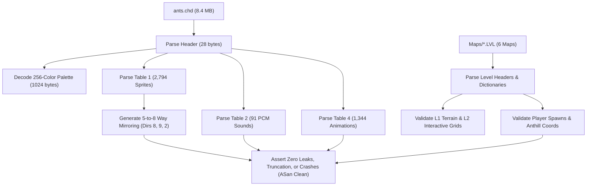

# Microsoft Ants Remake — Architecture, HUD & Platform Toolchain Survey

**Document Version:** 1.0  
**Author:** explorer_survey_3 (Architecture Explorer)  
**Target Project:** Modern Native Remake of Microsoft Ants (1995/1998)  
**Host Environment:** macOS 15.x / Darwin 25.6.0 (Apple Silicon arm64)

---

## 1. Executive Summary

This architecture survey evaluates the platform toolchains, frontend application requirements, user interface (HUD), audio subsystem, and automated testing strategy for the modern remake of *Microsoft Ants*.

### Key Architectural Conclusions
1. **Host Toolchain Reality:** The macOS environment features **Apple Clang 21.0.0 (C++17/C++20/C++23)**, **CMake 4.3.2**, **GNU Make 3.81**, Homebrew **SDL2 2.32.10**, **SDL2_mixer 2.8.1**, and native macOS frameworks (`AudioToolbox`, `CoreAudio`, `Cocoa`). **Rust (`rustc`/`cargo`) is NOT installed** in this environment. Therefore, a modular **Modern C++ (C++17)** architecture with CMake is the definitive, native, zero-friction choice.
2. **Modular Decoupling (3 Clean Layers):**
   - **`libants-assets`:** Pure standard C++ binary decoder for `ants.chd` and `Maps/*.LVL`. Zero third-party dependencies. Pre-generates 5-to-8 directional mirroring in RAM for O(1) runtime lookup.
   - **`libants-sim`:** Pure standard C++ deterministic, tick-based grid simulation engine. Zero graphics/audio/OS dependencies. 100% headless testable, fixed tick-rate (20 or 30 Hz), deterministic LCG RNG, bit-exact replay capability.
   - **`ants-app`:** Interactive macOS desktop client combining SDL2 hardware-accelerated 2D renderer (crisp integer pixel scaling to maintain authentic 4:3 640×480 presentation), full authentic HUD (minimap radar, selection card, hatch controls, egg counter, news flash banner, match clock, scorecard modal), and dual-engine audio mixer (multi-channel PCM sound effects + native macOS `AudioToolbox` MIDI synthesizer for `INTRO.MID`).
3. **Automated Verification Harness:**
   - Headless asset verification test suite (`test_assets`) parsing all 2,794 sprites, 91 sound effects, and 6 map levels with zero memory leaks (ASan clean).
   - Headless deterministic simulation rule test suite (`test_sim_rules`) validating all 8 reverse-engineered combat, damage, bounce, placement, timer, alliance, and game-over rules.

---

## 2. Technology Stack & Native Toolchain Evaluation

### 2.1 Host Environment Audit

An audit of the host environment executed on the machine yielded the following toolchain inventory:

| Tool / Runtime | Version / Path | Status / Capability |
|---|---|---|
| **C++ Compiler** | Apple Clang 21.0.0 (`clang++` / arm64-apple-darwin25.6.0) | **Pre-installed & Verified**. Full C++17, C++20, and C++23 standard library support. |
| **C Compiler** | Apple Clang 21.0.0 (`clang`) | **Pre-installed & Verified**. Full C11/C17 support. |
| **Build System** | CMake 4.3.2 (`/opt/homebrew/bin/cmake`), GNU Make 3.81 | **Pre-installed & Verified**. Compiles and links native binaries in < 1 second. |
| **Rust Toolchain** | `rustc` / `cargo` | **NOT FOUND** (`zsh: command not found: rustc`). |
| **Window / Video** | SDL2 2.32.10 (`/opt/homebrew/opt/sdl2`) | **Pre-installed & Verified**. Hardware-accelerated Metal/OpenGL backends, logical integer scaling. |
| **Audio Mixing** | SDL2 Audio / SDL2_mixer 2.8.1 (`/opt/homebrew/opt/sdl2_mixer`) | **Pre-installed & Verified**. Multi-channel PCM mixing. |
| **MIDI Playback** | macOS `AudioToolbox.framework` (`MusicPlayer` / Apple DLS GM Synth) | **Pre-installed & Verified**. Zero-dependency native General MIDI playback of `INTRO.MID`. |
| **Python** | Python 3.14.3 with `capstone` | Available for auxiliary scripts, validation tooling, and test runners. |

### 2.2 Architectural Comparison & Language Selection

| Dimension | Modern C++ (C++17/CMake) | Rust | Python | Swift |
|---|---|---|---|---|
| **Host Toolchain Availability** | **100% Present** (Clang 21 + CMake 4.3.2) | **Absent** (Requires installation) | Present (3.14) | Present (6.2) |
| **Direct Binary Parsing (R1)** | **Native** (`<fstream>`, pointer math, zero deps) | Excellent (if installed) | Slower, GIL overhead | Native |
| **Deterministic Sim (R2)** | **Bit-exact** (Fixed tick, integer math, LCG) | Bit-exact | Float nondeterminism, slow ticks | Bit-exact |
| **Desktop Frontend (R3)** | **Native** (SDL2 + Metal/OpenGL, AudioToolbox) | Requires cargo packages | Pygame/SDL wrapper | Cocoa/Metal only (not cross-platform) |
| **Zero-Dependency Core** | **Yes** (`ants-assets` & `ants-sim` pure stdlib) | Yes (core crates) | No | No |
| **Build & Test Speed** | **< 2 seconds** complete project build | N/A | Slow runtime execution | Slower swiftc compile |

**Decision:** **Modern C++ (C++17) built via CMake** is selected as the authoritative technology stack. It satisfies all criteria:
1. Native execution on Apple Silicon arm64 without emulation.
2. Zero external dependencies for core asset decoding and deterministic simulation.
3. Clean linkage with pre-installed Homebrew SDL2 and macOS `AudioToolbox`.

---

## 3. Modular Architecture & Cross-Module Decoupling

The project follows a strict 3-tier modular architecture with clear boundary contracts:

```
Ants-Mac/
├── CMakeLists.txt                # Unified root build configuration
├── Original-Ants/                # Original binary assets (read-only)
│   ├── ants.chd                  # 8.4 MB Art/Sound archive
│   ├── Maps/*.LVL                # 6 original map files
│   └── INTRO.MID                 # 9.2 KB background music
│
├── include/
│   ├── ants/
│   │   ├── assets/               # Public API: libants-assets
│   │   │   ├── chd_reader.hpp    # CHD header, table offsets, unpacker
│   │   │   ├── lvl_reader.hpp    # LVL header, tile dictionary, L1/L2 grids
│   │   │   ├── palette.hpp       # 256-color palette + color key + team colors
│   │   │   ├── sprite.hpp        # CHDSprite (pitch, width, height, pixels)
│   │   │   ├── sound.hpp         # CHDSound (WAV format, 8-bit PCM data)
│   │   │   ├── animation.hpp     # CHDAnimation (subitems, frame offsets, default_sp)
│   │   │   └── mirroring.hpp     # 5-to-8 directional horizontal mirroring generator
│   │   │
│   │   ├── sim/                  # Public API: libants-sim (100% Deterministic)
│   │   │   ├── types.hpp         # TeamId, AntClass, TileCoord, FixedPoint
│   │   │   ├── grid.hpp          # Layer 1 terrain, Layer 2 items, occupancy grid
│   │   │   ├── ant.hpp           # CAntUnit state (HP, pos, anim, carrying, orders)
│   │   │   ├── combat.hpp        # Damage matrix (1 HP vs 2 HP), knockback impulse
│   │   │   ├── physics.hpp       # Fire bounce reflection, pinball ricochet, water drowning
│   │   │   ├── timers.hpp        # 180s firewall/bridge countdown and collapse
│   │   │   ├── anthill.hpp       # Chebyshev queue rings, deposit, full 100% heal, hatch queue
│   │   │   ├── ai_guard.hpp      # Combat Ant autonomous 3-tile scan, strike & return
│   │   │   ├── alliances.hpp     # Dynamic FFA/Allied states, combined HUD scores vs discrete stats
│   │   │   ├── match_state.hpp   # Clock countdown, 4-stat tracking (Score, Lost, Killed, Hatched)
│   │   │   ├── events.hpp        # Audio triggers, news flash events, particle events
│   │   │   └── sim_engine.hpp    # Deterministic step(inputs) -> SimResult
│   │   │
│   │   └── audio/                # Public API: libants-audio
│   │       ├── mixer.hpp         # Multi-channel PCM sound mixer (32 channels)
│   │       └── midi_player.hpp   # Native macOS AudioToolbox / SDL_mixer MIDI driver
│
├── src/
│   ├── assets/                   # libants-assets implementation
│   │   ├── chd_reader.cpp
│   │   ├── lvl_reader.cpp
│   │   └── mirroring.cpp
│   │
│   ├── sim/                      # libants-sim implementation (Deterministic Core)
│   │   ├── sim_engine.cpp
│   │   ├── grid.cpp
│   │   ├── ant.cpp
│   │   ├── combat.cpp
│   │   ├── physics.cpp
│   │   ├── anthill.cpp
│   │   ├── ai_guard.cpp
│   │   ├── alliances.cpp
│   │   └── match_state.cpp
│   │
│   ├── audio/                    # libants-audio implementation
│   │   ├── mixer.cpp
│   │   └── midi_player_apple.cpp # Native AudioToolbox implementation
│   │
│   └── app/                      # ants-app interactive frontend
│       ├── main.cpp              # Entry point & game loop
│       ├── window.cpp            # SDL2 window management & presentation
│       ├── renderer.cpp          # Hardware-accelerated 2D viewport, palette shader / texture
│       ├── viewport.cpp          # Camera panning, tile rendering, sprite rendering, depth sort
│       ├── hud/                  # Complete In-Game HUD
│       │   ├── hud_shell.cpp     # Borders, divider, panel background compositing
│       │   ├── minimap.cpp       # Real-time radar, unit dots, bases, camera viewport box
│       │   ├── selection_card.cpp# Ant portrait, health bar, class label, status text, lunchbox
│       │   ├── hatch_controls.cpp# Hatch button, 200 pt cost, egg counter, incubation anim
│       │   ├── command_bar.cpp   # Move, Attack, Bomb, Fire, Swim, Thief, Cancel buttons
│       │   ├── news_flash.cpp    # News banner, alert ticker, timestamped notifications
│       │   ├── match_clock.cpp   # Digital countdown clock (`dig0..dig9.bmp`, `digc.bmp`)
│       │   └── team_scores.cpp   # Standings and scores with team color banners
│       ├── scorecard_modal.cpp   # re_screen Game Results modal (4 stats, winner vs loser audio)
│       └── input.cpp             # Mouse select, marquee drag, right-click orders, keyboard shortcuts
│
└── tests/
    ├── test_assets.cpp           # Programmatic test parsing 2,794 sprites, 91 sfx, 6 maps
    ├── test_sim_rules.cpp        # 8 headless unit tests for reverse-engineered simulation rules
    └── test_audio_mixer.cpp      # Audio mixing & channel allocation tests
```

### 2.3 Dependency Boundary Rules
- **Rule 1:** `libants-assets` has **zero dependencies**. It includes only `<cstdint>`, `<vector>`, `<string>`, `<fstream>`, `<cstring>`.
- **Rule 2:** `libants-sim` depends only on `libants-assets` for immutable definition data (tile flags, collision envelopes). It has **zero dependencies on SDL2, OpenGL, Metal, or OS audio**. It outputs pure data structures: `std::vector<SimEvent>` (audio sound triggers, news messages, particles).
- **Rule 3:** `ants-app` consumes `libants-sim` as a black-box engine: passes player commands (`QueueCommand(...)`), calls `sim.Tick()`, reads state vectors, and renders the frame.

---

## 4. Interactive Application Requirements Deep Dive

### 4.1 Viewport & Authentic 4:3 Presentation

```
 0,0 ───────────────────────────────────────────────────────────── 640,0
 │ [Top Bar: x0y0.bmp (640x22)] Title, Clock (mm:ss), Scores      │
 ├──────────────────────────────────────────┬─────────────────────┤
 │                                          │ [Minimap / Radar]   │
 │                                          │  (480, 22) - (640, 126)
 │                                          │                     │
 │                                          ├─────────────────────┤
 │                                          │ [Selection Card]    │
 │       PLAYFIELD VIEWPORT                 │  (480, 126)-(640, 254)
 │                                          │  Portrait, HP, Stat │
 │       (X: 17 to 458, Y: 22 to 461)       ├─────────────────────┤
 │       Dimensions: 441 x 439 px           │ [Hatch Controls &   │
 │                                          │  Egg Counter]       │
 │                                          │  (480, 254)-(640, 360)
 │                                          ├─────────────────────┤
 │                                          │ [Action Buttons]    │
 │                                          │  (480, 360)-(640, 461)
 ├──────────────────────────────────────────┴─────────────────────┤
 │ [Bottom Bar: x17y461.bmp (623x19)] News Flash Banner / Chat    │
 0,480 ─────────────────────────────────────────────────────────── 640,480
```

1. **Virtual Resolution:** Fixed 640 × 480 virtual frame buffer with authentic 4:3 aspect ratio.
2. **Integer Pixel Scaling:**
   - On modern displays (e.g., 1080p, 1440p, 4K Retina), scaling must support crisp nearest-neighbor integer multipliers:
     * 1× = 640 × 480
     * 2× = 1280 × 960
     * 3× = 1920 × 1440
     * 4× = 2560 × 1920
   - Center presentation with authentic black letterbox / pillarbox borders.
   - SDL2 implementation: `SDL_RenderSetLogicalSize(renderer, 640, 480)` coupled with `SDL_SetHint(SDL_HINT_RENDER_SCALE_QUALITY, "nearest")`. This provides hardware-accelerated integer/aspect-correct scaling out-of-the-box.
3. **Playfield Dimensions:**
   - Left coordinate: `X = 17`
   - Right coordinate: `X = 458` (`Width = 441` pixels)
   - Top coordinate: `Y = 22`
   - Bottom coordinate: `Y = 461` (`Height = 439` pixels)
   - Left border: `Sprite 2721: x0y22.bmp` (17 × 458)
   - Divider: `Sprite 2719: x458y35.bmp` (22 × 426) at `(458, 35)`
   - Top cap: `Sprite 2720: x458y22.bmp` (182 × 13) at `(458, 22)`
4. **Camera Mechanics:**
   - Smooth pixel-precision camera viewport centered on selected units.
   - Panning modes:
     * Mouse edge-panning (cursor within 8 pixels of viewport boundary).
     * Middle-mouse click and drag.
     * Keyboard navigation (Arrow keys / WASD).
     * Instant minimap navigation: Left-clicking any coordinate on the minimap immediately centers the playfield viewport on that world tile.
   - Boundary clamping: Camera automatically clamps so the viewport never scrolls beyond the level's grid boundaries.

---

### 4.2 Complete In-Game HUD Inventory & Asset Mapping

Reverse engineering of `ants.chd` extracted the exact coordinates, sprite indices, and visual assets used to assemble the authentic Microsoft Ants HUD:

#### A. Minimap (Radar) Subsystem
- **Location:** X: `480` to `640`, Y: `22` to `126` (Panel Width: 160 px, Height: 104 px).
- **Backing Sprite:** `Sprite 2713: x599y35.bmp` (41 × 91) + clay panel border.
- **Radar Rendering Pipeline:**
  1. **Terrain Pass:** Renders scaled down representation of the map (60×60, 40×40, or 31×31 tiles) mapped to authentic palette index colors:
     - Grass: Olive green (`RGB(83, 147, 43)`)
     - Dirt / Clay: Terracotta brown (`RGB(175, 107, 75)`)
     - Water: Navy blue (`RGB(23, 71, 151)`)
     - Rock / Obstacles: Dark slate gray (`RGB(47, 51, 63)`)
  2. **Bases Pass:** Anthill base positions marked with diamond markers in team colors:
     - Team 0 (Black): `RGB(79, 87, 111)`
     - Team 1 (Blue): `RGB(119, 175, 239)`
     - Team 2 (Red): `RGB(251, 51, 91)`
     - Team 3 (Green): `RGB(83, 147, 43)`
  3. **Units Pass:** Active ants drawn as 2×2 bright pixels in team color.
  4. **Food & Powerups Pass:** Food items rendered as bright golden dots; power-up items rendered as pulsing cyan dots.
  5. **Camera Rectangle:** White/yellow wireframe box indicating the exact active viewport boundaries on the map.
  6. **Input Interaction:** Clicking or dragging within the radar translates the radar coordinate `(rx, ry)` directly into world grid coordinates `(wx, wy)` and centers the playfield camera.

#### B. Selection Card Subsystem
- **Location:** X: `480`, Y: `126` (Dimensions: 160 × 128 px).
- **Backing Sprite:** `Sprite 2718: x480y126.bmp` (160 × 128).
- **Sub-Elements:**
  1. **Ant Portrait Frame:** Centered portrait window displaying animated face/profile for the selected ant class:
     - Worker (`ag`): Basic worker ant portrait
     - Thief (`at`): Thief ant wearing yellow burglar bandana mask
     - Fire (`af`): Fire ant holding magnifying glass
     - Bomber (`ab`): Bomber ant carrying team-colored bomb mine
     - Swimmer (`as`): Swimmer ant wearing aquatic goggles and holding shovel
     - Combat (`ac`): Muscular Combat ant with oversized fists
  2. **Class Title Header:** Text background `Sprite 2711: wtype.bmp` (143 × 14) rendering ant type name.
  3. **Health Bar:** Graphic health bar with 10 HP segments:
     - Green (8–10 HP), Yellow (4–7 HP), Red (1–3 HP).
     - Text display: `"HP: X / 10"`.
  4. **Action Status Text:** Background `Sprite 2710: wstatus.bmp` (143 × 14) rendering current unit state:
     - `"Idle"`, `"Walking"`, `"Attacking"`, `"Planting Bomb"`, `"Digging Bridge"`, `"Diving into Base"`, `"Carrying Food (50 pts)"`.
  5. **Held Item Indicator:** Displays `Sprite 2694: lunchicon.bmp` (34 × 40) when the ant is actively transporting food or stolen points to the anthill.

#### C. Hatch Controls & Egg Counter
- **Location:** X: `480` to `640`, Y: `254` to `360`.
- **Backing Sprites:** `Sprite 2717: x480y266.bmp` (141 × 33), `Sprite 2714: x521y254.bmp` (19 × 182).
- **Hatch Button:**
  - Label: `Sprite 2682: labhatch.bmp` ("HATCH", 36 × 11).
  - Button Up: `Sprite 2683: buthatup.bmp` (23 × 26).
  - Button Down: `Sprite 2684: buthatd.bmp` (24 × 26).
  - Cost Label: `"200 pts"`.
  - Behavior: Clicking deducts 200 points from player score and enqueues an egg at the colony anthill.
  - Disabled State: If player score < 200 or remaining eggs == 0, button enters disabled/depressed state (`canthatch` anim 235 / invalid click sound).
- **Egg Pile & Counter:**
  - Piles: `Sprite 554: eggs.bmp` (124 × 84), `Sprite 555: eggsa.bmp` (124 × 82), `Sprite 556: eggsb.bmp`, `Sprite 557: eggsc.bmp`.
  - Single Egg: `Sprite 2693: egg.bmp` (12 × 16).
  - Egg Incubation Sequence: Animated egg cracking countdown (`egg9` through `egg1`, animations 1252–1260; or transition animations `trnaeggd` / `trnbeggd`).
  - Upon incubation completion, worker ant emerges from anthill, playing Sound 87 (`scoreup.wav`).

#### D. Action Command Buttons
- **Location:** X: `480` to `640`, Y: `360` to `460`.
- **Order Buttons:**
  - Move: `Sprite 2573: butmovu.bmp` (23 × 29) / `butmovd.bmp` (2585), Label: `labmov.bmp` (2572).
  - Attack: `Sprite 2580: butattu.bmp` (34 × 23) / `butattd.bmp` (2589), Label: `labatt.bmp` (2579).
  - Bomb: `Sprite 2581: butbomu.bmp` (33 × 30) / `butbomd.bmp` (2590), Label: `labbom.bmp` (2582).
  - Fire: `Sprite 2584: butfireu.bmp` (30 × 27), Label: `labfire.bmp` (2583).
  - Swim / Dig: `Sprite 2576: butdipu.bmp` (33 × 26) / `butdipd.bmp` (2587), Label: `labdib.bmp` (2575).
  - Thief Steal: `Sprite 2577: butthfu.bmp` (29 × 27) / `butthfd.bmp` (2588), Label: `labthf.bmp` (2578).
  - Cancel Order: `Sprite 2706: butcanu.bmp` (32 × 32) / `butcand.bmp` (2707), Label: `labcan.bmp` (2705).

#### E. Match Clock & Scoreboard
- **Location:** Top bar (`x0y0.bmp`, Y: 0 to 22) and status headers (`playstat.bmp` / `statline.bmp`).
- **Match Clock:**
  - Reverse engineered sprite digits: `Sprite 2722: dig0.bmp` (7 × 10) through `Sprite 2731: dig9.bmp` (7 × 10).
  - Colon divider: `Sprite 2732: digc.bmp` (7 × 12).
  - Format: `[MM:SS]`. Synchronized strictly with simulation ticks:
    ```
    remaining_seconds = remaining_ticks / TICKS_PER_SEC;
    minutes = remaining_seconds / 60;
    seconds = remaining_seconds % 60;
    ```
  - At `00:00`, triggers immediate simulation freeze and victory/defeat sequence.

#### F. News Flash Banner & Chat Subsystem
- **Location:** Bottom frame bar (`Sprite 2708: x17y461.bmp`, 623 × 19, Y: 461 to 480).
- **Text Rendering:** High-contrast yellow/white authentic serif font.
- **Key Event Messages (Reverse Engineered String Table):**
  - Base Alert: `"[mm:ss] A ThiefAnt is at your anthill!"` (String ID 53) — dispatched immediately upon enemy thief dive.
  - Alliance Formed: `"[mm:ss] %s and %s have formed an alliance!"` (String ID 39).
  - Alliance Broken: `"[mm:ss] %s broke their alliance with %s!"` (String ID 40).
  - Score Drained: `"Food stolen..."` (String ID 62).
  - Alliance Declined: `"%s declined the alliance invitation."` (String ID 80).
- **Banner Queue:** FIFO queue with 5-second display lifetime per notification, smoothly cycling through pending alerts.

---

### 4.3 Multi-Channel Audio Mixer & MIDI Background Music

#### 1. Multi-Channel PCM Digital Sound Mixer
- **Data Source:** Table 2 in `ants.chd` contains **91 digital audio sound clips**.
- **Format:** Unsigned 8-bit mono PCM sampled at either 11,025 Hz or 22,050 Hz.
- **Mixer Specifications:**
  - Output standard: 44,100 Hz 16-bit stereo.
  - Channels: 32 simultaneous mixing channels.
  - Priority Management: High-priority audio (base alarm siren Sound 58, victory Sound 56, defeat Sound 41) cannot be stolen by lower-priority environmental sounds (footsteps, ambient clicks).
  - Spatial Panning & Distance Attenuation:
    ```
    distance = sqrt(pow(sound_x - camera_x, 2) + pow(sound_y - camera_y, 2));
    volume = clamp(1.0 - (distance / MAX_AUDIBLE_DISTANCE), 0.0, 1.0);
    pan = clamp((sound_x - camera_x) / (VIEWPORT_WIDTH / 2.0), -1.0, 1.0);
    ```
- **Key Sound Effect Mapping:**

| Sound ID | File Name | Sampling Rate | Key Trigger Condition |
| :---: | :--- | :---: | :--- |
| **0** | `buttonclick.wav` | 22,050 Hz | UI button clicks (hatch, orders, dialog buttons) |
| **4** | `bombexp.wav` | 22,050 Hz | Bomber Ant mine detonation |
| **5** | `fireburnout.wav` | 11,025 Hz | Firewall natural 180s expiration burnout |
| **41** | `playerout.wav` | 22,050 Hz | Defeat sting played for losing teams at 0:00 |
| **49** | `allyoff.wav` | 22,050 Hz | Alliance dissolved notification |
| **50** | `allyon.wav` | 22,050 Hz | Alliance established fanfare |
| **51** | `allypro.wav` | 22,050 Hz | Alliance proposed notification to target player |
| **52** | `allynot.wav` | 22,050 Hz | Alliance rejected chord |
| **53** | `allyyes.wav` | 22,050 Hz | Alliance accepted notification |
| **56** | `winner.wav` | 22,050 Hz | Victory fanfare (4.67s duration) played for winning team at 0:00 |
| **57** | `attack.wav` | 11,025 Hz | Standard 1 HP melee strike (Worker, Thief, Bomber, Fire, Swimmer) |
| **58** | `underattack.wav`| 22,050 Hz | Loud 2,566 Hz alarm siren played on victim's client when Thief dives into base |
| **64** | `flythumpa.wav` | 22,050 Hz | Airborne ballistic fling launch / combat impact |
| **65** | `flythumpb.wav` | 22,050 Hz | Landing skid after knockback |
| **67** | `firestarta.wav`| 11,025 Hz | Fire Ant magnifying glass sunbeam focus |
| **68** | `firestartb.wav`| 11,025 Hz | Firewall ignition flames erupting |
| **69** | `fireextinguish.wav`| 11,025 Hz | Fire Ant smothering and extinguishing fire |
| **70** | `stun.wav` | 11,025 Hz | Stun recovery after ballistic impact |
| **71** | `splash.wav` | 11,025 Hz | Swimmer ant diving into deep water |
| **73** | `bombdrop.wav` | 11,025 Hz | Bomber Ant grabbing enemy mine casing |
| **74** | `bombmuffle.wav`| 11,025 Hz | Bomber Ant squashing enemy mine flat under body weight |
| **78** | `attack2.wav` | 22,050 Hz | Combat Ant 2 HP heavy punch |
| **81** | `shovelgravel.wav`| 11,025 Hz | Swimmer Ant shoveling bridge on land |
| **82** | `shovelwater.wav` | 11,025 Hz | Swimmer Ant shoveling bridge in water |
| **84** | `steala.wav` | 11,025 Hz | Thief Ant leaping into enemy anthill hole |
| **85** | `stealb.wav` | 11,025 Hz | Thief Ant rummaging underground |
| **86** | `stealc.wav` | 11,025 Hz | Thief Ant emerging with stolen points |
| **87** | `scoreup.wav` | 22,050 Hz | Points deposited in anthill / new ant hatched |
| **88** | `scoredn.wav` | 22,050 Hz | Points drained from victim anthill by Thief |
| **90** | `bombpick.wav` | 11,025 Hz | Bomber Ant arming landmine |

#### 2. MIDI Background Music Subsystem
- **Music File:** `Original-Ants/INTRO.MID` (9,261 bytes, standard MIDI sequence `MThd`).
- **macOS Native AudioToolbox Architecture:**
  - Leverages macOS native `AudioToolbox.framework` with Apple DLS General MIDI synthesizer.
  - Zero external soundfont files or external libraries required.
  - Native C++ integration pattern:
    ```cpp
    MusicPlayer player;
    MusicSequence sequence;
    NewMusicPlayer(&player);
    NewMusicSequence(&sequence);
    MusicSequenceFileLoad(sequence, cfUrl, 0, kMusicSequenceFile_AnyType);
    MusicPlayerSetSequence(player, sequence);
    MusicPlayerPreroll(player);
    MusicPlayerStart(player);
    ```
  - Looping: Configured to loop seamlessly upon reaching sequence end.
  - Independent volume slider: User can control sound effects and MIDI music volume separately.

---

### 4.4 Interactive Results Scorecard Modal (`re_screen` / Animation 25)

When the match timer reaches `0:00`, the engine executes the authentic end-of-game transition:

```text
┌─────────────────────────────────────────────────────────────────────────┐
│                               [Game Results] (140, 0)                   │
│                                                                         │
│    [YOUR SCORE] (41, 55)                  New Ants Hatched ----->       │
│                                            Enemy Ants Killed ---->      │
│                                             Friendly Ants Lost -->      │
│   Winner! (40, 195)                           Score ------------->      │
│  ┌────────────────────────────────────────────────────────────────────┐ │
│  │ Red Team (Winner)                            350     4   12  18    │ │
│  └────────────────────────────────────────────────────────────────────┘ │
│   other players... (40, 280)                                            │
│  ┌────────────────────────────────────────────────────────────────────┐ │
│  │ Blue Team                                    220     8    7  14    │ │
│  │ Green Team                                   140    11    5  16    │ │
│  │ Black Team                                    80    15    2  12    │ │
│  └────────────────────────────────────────────────────────────────────┘ │
│                                                              [ OK ]     │
└─────────────────────────────────────────────────────────────────────────┘
```

1. **Simulation Freeze:** Ant movement, task execution queues, weapon cooldowns, and player click commands immediately halt.
2. **Audio Split:**
   - Winning player/team hears Sound 56 (`winner.wav`, triumphant fanfare, 4.67 seconds).
   - Defeated players hear Sound 41 (`playerout.wav`, descending defeat chord, 0.94 seconds).
3. **Scorecard Visual Layout (Exact Coordinates from `ants.chd` Animation 25):**
   - Top Banner: `resbanr.bmp` (Sprite 99, 340 × 34) at `(140, 0)`.
   - Title Art: `yoscore.bmp` (Sprite 98, 302 × 127) at `(41, 55)`.
   - Stats Header: `newstats.bmp` (Sprite 97, 259 × 133) at `(342, 84)`.
   - Winner Header: `winnr.bmp` (Sprite 96, 117 × 19) at `(40, 195)`.
   - Winner Box: `bg50x100.bmp` frame (558 × 50) at `(40, 222)`.
   - Other Players Header: `otherp.bmp` (Sprite 95, 203 × 25) at `(40, 280)`.
   - Other Players Box: `efrbg100.bmp` frame (558 × 150) at `(40, 310)`.
   - Background & Border: `dclay96.bmp` clay backdrop and `dfram*.bmp` beveled trim.
4. **4 Tracked Statistics (Directly aligned with `newstats.bmp` arrow tips):**
   - **Score (X ≈ 496):** Final accumulated points (food deposited + food stolen - food lost).
   - **Friendly Ants Lost (X ≈ 536):** Total friendly worker and specialist ants killed.
   - **Enemy Ants Killed (X ≈ 557):** Total opponent ants eliminated by combat, bombs, or deflections.
   - **New Ants Hatched (X ≈ 578):** Total ants spawned from the colony anthill.
5. **Interactive Controls:**
   - OK Button: `re_oku` / `re_okd` (Sprite 74/dbutoku.bmp) returns player to main menu or level select.

---

## 5. Acceptance Criteria & Automated Testing Strategy

To guarantee zero regressions and strict compliance with reverse engineered specifications without requiring manual GUI gameplay, an automated test harness architecture is established.

### 5.1 Test Harness 1: Asset Decoder Verification (`test_assets`)



- **Verification Scope:**
  1. Header validation: version == 9, timestamp == 0x378d661c, palette == 1024 bytes.
  2. Palette validation: verify 256 RGBA colors, magenta key `RGB(255, 0, 255)` transparency, correct team color ranges for Blue, Green, Red, Black.
  3. Table 1 Sprites: iterate all 2,794 sprites. Verify pitch, width, height, non-null filename, pixel buffer size `pitch * height`.
  4. Table 2 Sounds: iterate all 91 sounds. Verify PCM wave format (11,025 or 22,050 Hz, 8-bit mono), valid RIFF conversion.
  5. Table 4 Animations: iterate all 1,344 animation sequences. Verify DWORD string alignment formula `pad_len = (nlen + 4) & ~3`, subitem counts, sound triggers (`default_sp`).
  6. Maps: parse all 6 maps (`TINY.LVL`, `SMALL.LVL`, `MEDIUM.LVL`, `ISLANDS.LVL`, `GAUNTLET.LVL`, `TREASURE.LVL`). Verify dimensions (31×31, 40×40, 60×60), Layer 1, Layer 2, anthill spawn coordinates.
  7. 5-to-8 Directional Mirroring: verify pre-generated mirrored bitmaps for North-West (Dir 8 flip), West (Dir 9 flip), and South-West (Dir 2 flip). Assert pixel reverse mapping: `flipped_pixel(x, y) = original_pixel(width - 1 - x, y)`.
  8. Memory Safety: Run under AddressSanitizer (`-fsanitize=address,undefined`). Must report **0 memory leaks and 0 buffer overflows**.

### 5.2 Test Harness 2: Deterministic Simulation Rules (`test_sim_rules`)

A headless test runner executes simulation ticks in RAM without window or graphics context. Each reverse-engineered rule is verified with strict assertions:

| Test Case | Scenario / Setup | Exact Reverse-Engineered Rule Verified | Assertion Criteria |
|---|---|---|---|
| `test_damage_matrix` | Place Worker, Thief, Fire, Bomber, Swimmer, Combat ants adjacent to 10 HP targets. Issue melee attack. | **Universal 1 HP standard** for 5 classes; **Combat Ant 2 HP + 4-5 tile knockback**. | Non-combat targets: target HP = 9, knockback = 0. Combat target: target HP = 8, target displaced 4-5 tiles, state enters stunned recovery. |
| `test_cardinal_only_placement` | Fire Ant at `(10, 10)`. Attempt fire placement at `(11, 11)` (diagonal), `(10, 9)` (North), `(11, 10)` (East). | **Strict Cardinal Adjacency** (`\|dx\| + \|dy\| == 1`). Diagonal placement prohibited. | Diagonal order rejected immediately. Cardinal orders accepted and fire placed. |
| `test_fire_bounce_pinball` | Non-fire ant knocked onto Layer 2 fire tile `(10, 10)`. Second fire at `(10, 11)`. | **+1 Fire Damage** upon impact; ant bounces off; multi-fire chains damage; **fire is never extinguished by ant**. | Ant takes initial hit + 1 fire damage. Deflected to second fire, takes another 1 fire damage. Both fires remain fully active on Layer 2. |
| `test_180s_firewall_timer` | Place firewall at tick 0. Step simulation ticks. | **Exact 180s (180,000 ms) lifespan**. | At tick `180 * TICKS_PER_SEC - 1`, fire active (`wallup04`). At tick `180 * TICKS_PER_SEC`, fire cleared (`0x7ffe`), Sound 5 (`fireburnout.wav`) emitted. |
| `test_180s_bridge_collapse` | Build bridge across water. Place Worker Ant and Swimmer Ant on bridge at tick 0. Step 180s. | **Exact 180s lifespan; bridge collapse drowns non-swimmers instantly**. Swimmers survive. | At 180s, bridge erased. Worker Ant drowns instantly (HP = 0, death status `0xF`). Swimmer Ant remains alive in water cell. |
| `test_combat_ant_guard_ai` | Combat Ant at `(10, 10)` in Idle state. Enemy ant approaches to `(13, 10)` (3-tile radius). | **Autonomous 3-tile scan, intercept punch, return to post**. | Combat Ant breaks idle, paths to `(11, 10)`, delivers 2 HP punch, then automatically paths back to `(10, 10)` anchor. |
| `test_thief_infiltration` | Thief Ant dives into Team 1 anthill (score = 120). | **Victim base alarm siren (Sound 58), min(50, score) deducted, Sound 88, lunchbox item**. | Victim receives Sound 58 (`underattack.wav`) and News Flash string 53. Victim score = 70. Thief carries 50 pts in lunchbox. |
| `test_alliance_scoring` | Team 0 (score 100) and Team 1 (score 150) form alliance. Score changes occur. Alliance dissolved. | **Combined HUD score, strictly preserved discrete individual memory**. | HUD displays combined score 250. Team 0 food deposit adds to both total and personal stat. Disbanding restores discrete scores without corruption. |
| `test_match_clock_game_over` | Level with 6:00 duration. Step `360 * TICKS_PER_SEC` ticks. Team 2 leading with 350 pts. | **Simulation freezes at 0:00; winner audio (Sound 56) vs loser audio (Sound 41); 4 scorecard stats**. | Sim state halts. Winner event emits Sound 56. Loser events emit Sound 41. Scorecard stats match discrete counts (Score, Lost, Killed, Hatched). |

### 5.3 Test Harness 3: Native macOS Playable App Verification (`test_app_launch`)

- **Automated Headless Launch Test:**
  - Invokes `ants-app --test-launch --headless` (or with off-screen surface).
  - Initializes SDL2 video and audio subsystems.
  - Loads `ants.chd` and `TREASURE.LVL`.
  - Runs 60 simulation and render frames.
  - Verifies window creation, texture uploading, integer viewport scaling matrix, and clean shutdown with exit code 0.
- **Interactive Verification Checklist:**
  - Smooth 60 FPS presentation at native Retina resolution with black 4:3 borders.
  - Responsive mouse drag selection, unit movement orders, and ability triggers.
  - Minimap radar updates in real-time with zero latency.
  - Clear audio playback of sound effects and MIDI background music simultaneously.
  - Results Scorecard displays properly at match end.

---

## 6. Implementation Roadmap & Milestones

Following the dual-track orchestration plan, the recommended implementation milestones are:

### Milestone 1: Native Binary Asset Decoder (`ants-assets`)
- [ ] Implement `CHDReader` decoding 28-byte header, 256-color palette with RGBA color keying, 2,794 sprites, 91 PCM audio clips, 1,344 animation sequences.
- [ ] Implement `LVLReader` parsing 6 map levels (tile dictionaries, 60×60, 40×40, 31×31 grids, Layer 1 terrain, Layer 2 overlays, player spawns).
- [ ] Implement 5-to-8 directional horizontal mirroring generator for directions 8, 9, 2.
- [ ] Build and verify automated test suite `test_assets` with ASan clean execution.

### Milestone 2: Deterministic Simulation Engine (`ants-sim`)
- [ ] Implement tick-based simulation grid (Layer 1 terrain, Layer 2 items, unit occupancy).
- [ ] Implement ant unit state machine, movement pathfinding (A*), and universal 1 HP / Combat 2 HP combat damage matrix.
- [ ] Implement cardinal-only bomb/fire placement, fire collision bounce, chaotic ricochets, and 180s countdown timers.
- [ ] Implement anthill Chebyshev rings, queuing, 17-frame base entry/heal, thief infiltration, and dynamic alliances.
- [ ] Build and verify automated test suite `test_sim_rules` covering all 8 rules.

### Milestone 3: Interactive Application & Audio (`ants-app`)
- [ ] Implement SDL2 window and hardware-accelerated 2D renderer with integer pixel scaling and 4:3 presentation.
- [ ] Implement complete authentic HUD: minimap radar, selection card, hatch controls, egg counter, news flash banner, match clock.
- [ ] Implement multi-channel audio mixer (PCM 91 clips) and native macOS `AudioToolbox` MIDI synthesizer for `INTRO.MID`.
- [ ] Implement interactive Results Scorecard modal (`re_screen`).

### Milestone 4: Comprehensive Verification & Hardening
- [ ] Execute full E2E test suite across all tiers (Feature coverage >= 5/feature, Boundary/Corner >= 5/feature, Pairwise combinations, Real-world scenarios).
- [ ] Perform white-box adversarial stress testing and AddressSanitizer/Valgrind verification.
- [ ] Deliver complete native macOS playable package.
