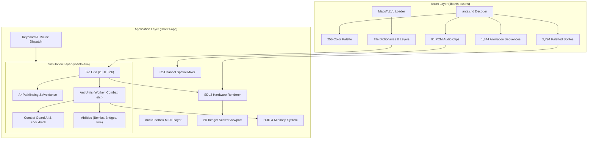

# Ants (1998) — Modern Cross-Platform Engine Remake

A faithful, high-performance, deterministic C++17 native engine remake and port of the 1998 classic real-time strategy game **Ants**.

The engine directly loads raw original binary assets (`ants.chd` and `Maps/*.LVL`) without pre-conversion, faithfully executing authentic gameplay mechanics, deterministic 20Hz simulation, 32-channel spatial audio, MIDI score playback, and an SDL2 hardware-accelerated 2D viewport.

---

## Highlights & Features

- **Direct Binary Asset Pipeline (`libants-assets`)**:
  - Runtime parser for `Original-Ants/ants.chd` (header, 256-color palette, 2,794 raw paletted sprite bitmaps, 91 PCM audio clips, and 1,344 animation sequences).
  - Runtime parser for `Original-Ants/Maps/*.LVL` (tile dictionaries, terrain layers, items, and player spawn coordinates).
  - On-the-fly 5-to-8 directional sprite mirroring for $O(1)$ directional lookups.
  - Zero proprietary runtimes or pre-processing needed.

- **Deterministic 20Hz Simulation Engine (`libants-sim`)**:
  - Discrete tick simulation matching authentic timing and movement rules.
  - Authentic unit types: **Worker**, **Combat**, **Fire**, **Bomber**, **Swimmer**, and **Thief** ants.
  - Unit combat mechanics: 1 HP standard melee, Combat Ant 2 HP attack with 4-space ballistic knockback, and autonomous guard AI (3-tile perimeter patrol & return-to-post).
  - Special ability mechanics:
    - **Bomber**: Plant mines; defuse friendly mines on single-click; hit/detonate friendly mines on multi/shift-select for water gap jumps.
    - **Fire**: Plant firewalls; immune to flame; extinguish fire hazards.
    - **Swimmer**: Build and multi-stage demolish bridges; underwater immunity to melee damage; continuous bobbing/snorkeling animations.
    - **Thief**: Infiltrate enemy anthills, steal up to 50 score points, trigger alarm sirens (`underattack.wav`), and drop lunchboxes on defeat.
  - Power-up transformation lifecycle: Units walk onto power-ups, disappear into the transformation cocoon, emerge after 11 ticks, and treat uninstructed power-ups as obstacles.
  - Bridge mechanics: Bridge locomotion matching mud speed; 180-second duration; non-swimmers drown if a bridge collapses beneath them.
  - Dynamic alliances: In-game FFA-to-allied diplomacy by clicking enemy anthills, combined scoreboard totals with discrete per-player statistics in memory.

- **Modern Audio & Presentation (`libants-app`)**:
  - Hardware-accelerated SDL2 renderer with integer scaling, crisp pixel filtering, and authentic 4:3 viewport preservation.
  - 32-channel spatial sound mixer for positional sound effects (panning and distance attenuation).
  - Native MIDI playback engine streaming authentic soundtrack (`INTRO.MID`) on the title and battlefield selection screens.
  - Interactive HUD with minimap, selection cards, egg count, unit health toggles, and chat overlay.
  - Full-screen post-match results scorecard.

- **Interactive Asset Catalog & Inspector**:
  - Standalone HTML5/Canvas inspector (`asset_catalog/index.html`) to browse and preview all 2,794 sprites, 91 audio samples, and 1,344 animation sequences directly in any modern browser.

- **Rigorous Automated Testing**:
  - 100% pass rate across 78 integration tests (1,207 assertions) and 506 opaque-box End-to-End (E2E) verification tests.

---

## Directory Structure

```text
Ants-Mac/
├── asset_catalog/          # Interactive web-based asset catalog and sprite/audio inspector
│   ├── index.html          # Browser application for asset inspection
│   ├── catalog_data.js     # Indexed metadata for sprites, audio clips, and animations
│   ├── sounds/             # Decoded 91 authentic WAV sound effects (IDs 0..90)
│   └── sprites/            # Decoded 2,794 paletted PNG sprites (IDs 0..2793)
├── docs/                   # Reverse-engineering documentation and specifications
│   ├── GAME_REVERSE_ENGINEERING.md  # Comprehensive technical mechanics reference
│   └── BUILD_AND_RUN.md             # Native and Docker build/run instructions
├── include/                # Public C++ headers
│   ├── ants_assets/        # Archive decoders, map loaders, sprite/sound structs
│   ├── ants_sim/           # Simulation engine, grid topology, ant units, combat AI
│   └── ants_app/           # SDL2 application, renderer, HUD, audio mixer, MIDI
├── Original-Ants/          # Authentic 1998 game data
│   ├── ants.chd            # Packed binary sprites, audio, palettes, animations
│   └── Maps/               # Binary .LVL maps (Treasure, Small, Rivers, Islands, etc.)
├── src/                    # Implementation source code
│   ├── ants_assets/        # Asset decompression, palette mapping, mirroring
│   ├── ants_sim/           # Tick loop, pathfinding (A*), unit state machine, physics
│   └── ants_app/           # Windowing, input handling, viewport camera, rendering
├── tests/                  # Automated verification test suites
│   ├── e2e/                # Standalone 506-test opaque-box E2E test runner
│   ├── test_assets/        # Binary asset parsing unit tests
│   ├── test_sim/           # Simulation rule validation and challenger tests
│   └── test_app/           # End-to-end application integration tests (78 tests)
├── CMakeLists.txt          # Root CMake build configuration
├── run_tests.sh            # Master test suite runner script
└── start_game.sh           # One-click build and launch script
```

---

## Prerequisites & Dependencies

### macOS
Install the required tools and libraries via [Homebrew](https://brew.sh/):

```bash
brew install cmake sdl2
```

- **Compiler**: Clang supporting C++17 (Xcode Command Line Tools: `xcode-select --install`).
- **Audio**: Built-in macOS AudioToolbox framework is used for MIDI playback (no extra MIDI synthesis packages required).

### Linux / Other Platforms
```bash
sudo apt-get update && sudo apt-get install -y cmake g++ libsdl2-dev
```

---

## Play in Browser (WebAssembly)

Play the remake instantly in any modern web browser (Chrome, Firefox, Safari, Edge) without installing anything:

👉 **[Play Ants Online at beta.playants.org](https://beta.playants.org)**

- **Authentic 1998 Asset Pipeline**: Full 8.1 MB archive (`ants.chd`, maps, and audio) packed into browser memory.
- **Hardware-Accelerated 2D Viewport**: Pixel-crisp 4:3 display scaling with WebGL2 rendering.
- **32-Channel Spatial Sound**: Authentic ant voice clips, explosions, and melee sound effects powered by Web Audio.

### Self-Hosting with Docker (`beta.playants.org`)

To build and run the high-performance container on your Docker server:

```bash
# Build and launch with Docker Compose
docker compose up -d --build

# Or build and launch with Docker directly
docker build -t ants-beta .
docker run -d -p 19980:80 --name ants-beta ants-beta
```

### Building the Web Port Locally (without Docker)
```bash
./build_web.sh
python3 -m http.server 8080 -d dist
# Open http://localhost:8080
```

---

## Building and Running Locally (Native Desktop)

### Quick Launch
To automatically build and launch the native desktop game in one step:

```bash
./start_game.sh
```

### Manual CMake Build

1. Configure CMake in release mode:
   ```bash
   cmake -B build -DCMAKE_BUILD_TYPE=Release
   ```

2. Compile the project with all CPU cores:
   ```bash
   cmake --build build -j"$(sysctl -n hw.ncpu || nproc)"
   ```

3. Launch the game executable:
   ```bash
   ./build/src/ants_app/ants
   ```

### Running with AddressSanitizer (ASan)
```bash
cmake -B build_asan -DCMAKE_BUILD_TYPE=Debug -DENABLE_ASAN=ON
cmake --build build_asan -j8
./build_asan/src/ants_app/ants
```

---

## Controls & Hotkeys

### Battlefield Selection Screen
- **Up / Down / Number Keys `1`–`6`**: Highlight map (Treasure, Small, Rivers, Islands, Large, Great Divide).
- **Double Click / Enter / `START GAME` Button**: Launch match.
- **`INTRO.MID`**: Loops during map selection and stops when the match begins.

### Mouse Controls
| Action | Trigger | Description |
|---|---|---|
| **Select Unit** | Left Click on Friendly Ant | Selects a single ant. |
| **Move Order** | Left Click on Terrain | Issues move order to selected ant(s). |
| **Attack Order** | Left Click on Enemy Ant | Orders selected combat/melee ants to engage target. |
| **Marquee Selection** | Left Click & Drag ($>4\text{px}$) | Selects all friendly units within rectangular box. |
| **Minimap Navigation** | Left Click on Minimap | Instantly centers camera on clicked map coordinate. |
| **Special Ability** | Right Click on Field | Context-sensitive ability for active unit type: |
| | | • **Bomber**: Plant mine / defuse existing friendly mine. |
| | | • **Fire Ant**: Ignite firewall / extinguish blaze. |
| | | • **Swimmer**: Dig / build bridge or demolish existing bridge. |
| | | • **Thief**: Infiltrate enemy anthill. |
| **Bomb Hit (Jump)** | Multi-Select / Shift + Click | Forces Bomber or non-bomber to walk onto friendly bomb to detonate it and jump water gaps. |

### Camera & Viewport Navigation
- **Edge Pan Scrolling**: Move cursor within 24 pixels of window boundaries to pan camera smoothly.
- **Arrow Keys / WASD**: Pan camera freely in cardinal/diagonal directions.
- **Spacebar**: Center camera on currently selected unit.
- **`H`**: Center camera on home anthill base.

### Hotkeys & Shortcuts
| Key | Function |
|---|---|
| **`Esc`** | Open / close Quick Quit confirmation dialog; dismiss open modals. |
| **`L`** or **`Ctrl + L`** | Toggle overhead unit health bars (ON / OFF). |
| **`Ctrl + G`** | Toggle terrain tile grid display (ON / OFF). |
| **`A`** or **`Ctrl + A`** | Select all friendly ants on the battlefield. |
| **`N`** | Cycle selection to next friendly ant. |
| **`P`** | Cycle selection to previous friendly ant. |
| **`M`** | Toggle background music soundtrack. |
| **`C`** | Clear active selection / cancel armed order mode. |

---

## Testing & Verification

The project enforces strict regression guarantees with automated test suites spanning decoders, simulation rules, application integration, and opaque-box end-to-end scenarios.

### Master Test Suite
To run all test suites in sequence:

```bash
./run_tests.sh
```

### Running Specific Suites
```bash
./run_tests.sh --assets   # Raw asset decoder unit tests (test_assets)
./run_tests.sh --sim      # Simulation rules & challenger tests (test_sim_rules)
./run_tests.sh --app      # Application integration tests (test_app_integration)
./run_tests.sh --e2e      # Opaque-box E2E test runner (506 tests across 4 tiers)
./run_tests.sh --asan     # Rebuild and run with AddressSanitizer
```

### Standalone E2E Test Runner
The E2E test suite validates all 49 game features across 4 tiers:
```bash
# Build standalone E2E runner
cmake -S tests/e2e -B build_e2e
cmake --build build_e2e

# Run all 506 tests
./build_e2e/e2e_runner --all

# Run specific tiers
./build_e2e/e2e_runner --tier 1   # Tier 1: Feature Coverage (245 tests)
./build_e2e/e2e_runner --tier 2   # Tier 2: Boundary & Corner Cases (245 tests)
./build_e2e/e2e_runner --tier 3   # Tier 3: Cross-Feature Pairwise (10 tests)
./build_e2e/e2e_runner --tier 4   # Tier 4: Real-World Workloads (6 full matches)
```

---

## Asset Catalog & Inspector

The repository includes a web-based inspector to inspect and preview all authentic assets extracted from `ants.chd`:

- **Sprites**: 2,794 paletted PNGs with zoom levels (1x, 2x, 3x, 4x), bounding boxes, registration origins, and background styles.
- **Audio Clips**: 91 WAV sound effects with wave previews and instant audio playback.
- **Animations**: 1,344 animation sequences with frame-accurate multi-subitem compositing, timing, and frame sound triggers.

### Launching the Inspector
Simply open the HTML file in your browser:

```bash
open asset_catalog/index.html
```

Or serve via Python HTTP server:

```bash
python3 -m http.server 8080 -d asset_catalog
# Open http://localhost:8080 in your browser
```

---

## Architecture Overview



---

## Technical Specifications

- **Language**: ISO C++17 (`-std=c++17`)
- **Compilation Flags**: `-Wall -Wextra -Wpedantic -Wconversion -Wshadow -Wnon-virtual-dtor` (Zero compiler warnings allowed)
- **Target Platforms**: macOS 11+ (Apple Silicon & Intel x86_64), Linux x86_64
- **Framerate & Simulation Clock**:
  - Presentation: 60 FPS interpolated rendering
  - Simulation: 20 Hz deterministic tick engine (50 ms per tick)
- **Audio Engine**: 22,050 Hz 16-bit mono/stereo mixer with spatial panning and logarithmic distance attenuation

---

## License & Historical Preservation

This project is a clean-room educational remake and historical preservation effort. All original game data (`ants.chd`, maps, and audio) belong to their respective original creators.
