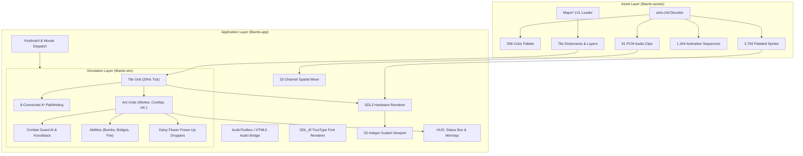

# Ants (1998) — Modern Cross-Platform Engine Remake

A faithful, high-performance, deterministic C++17 native engine remake and port of the 1998 classic real-time strategy game **Ants**.

The engine directly loads raw original binary assets (`ants.chd` and `Maps/*.LVL`) without pre-conversion, faithfully executing authentic gameplay mechanics, deterministic 20Hz simulation, 32-channel spatial audio, MIDI/MP3 score playback, TrueType font rendering, and an SDL2 hardware-accelerated 2D viewport.

---

## 🎮 Play in Browser (WebAssembly)

Play the remake instantly in any modern web browser (Chrome, Firefox, Safari, Edge) without installing anything:

👉 **[Play Ants Online at beta.playants.org](https://beta.playants.org)**

- **Authentic 1998 Asset Pipeline**: Full 8.1 MB archive (`ants.chd`, maps, and audio) packed into browser virtual memory.
- **Hardware-Accelerated 2D Viewport**: Pixel-crisp 4:3 display scaling with WebGL2 rendering.
- **32-Channel Spatial Sound & Soundtrack**: Authentic ant voice clips, explosions, and spatial SFX via Web Audio, with pre-rendered soundtrack streaming (`INTRO`, `ANTS2A`, `ANTS2B`, `ANTSFUN3`).
- **Interactive Asset Catalog**: Browse all 2,794 sprites, 91 sound effects, and 1,344 animation sequences at **[beta.playants.org/asset_catalog/](https://beta.playants.org/asset_catalog/)**.

---

## Highlights & Implemented Systems

- **Direct Binary Asset Pipeline (`libants-assets`)**:
  - Runtime parser for `Original-Ants/ants.chd` (header, 256-color palette, 2,794 raw paletted sprite bitmaps, 91 PCM audio clips, and 1,344 animation sequences).
  - Runtime parser for `Original-Ants/Maps/*.LVL` (header duration, tile dictionaries, terrain layers, items, and player spawn coordinates).
  - On-the-fly 5-to-8 directional sprite mirroring for $O(1)$ directional lookups.
  - Zero external conversion tools or pre-processing needed.

- **Deterministic 20Hz Simulation Engine (`libants-sim`)**:
  - Discrete tick simulation matching authentic timing and movement rules (50 ms per tick).
  - Authentic unit types: **Worker**, **Combat**, **Fire**, **Bomber**, **Swimmer**, and **Thief** ants.
  - Authentic map duration parsing directly from `.LVL` binary headers (e.g. 6 min for `TINY`, 8 min for `SMALL`, 10 min for `MEDIUM`/`GAUNTLET`, 12 min for `ISLANDS`/`TREASURE`).
  - **8-Connected Diagonal Pathfinding**: Evaluates all 8 directions with authentic diagonal cost scaling ($\sqrt{2} \approx 1.414$), navigating intentional diagonal map chokepoints.
  - **Intermediate Food Obstacle Pathfinding**: Food morsels act as impassable terrain during normal movement orders, preventing units from trampling or unintentionally consuming food. Units only harvest when explicitly commanded.
  - **Power-Up Lifecycle & Droppers**:
    - Units walk onto power-ups, enter transformation cocoons (`getpow`), and emerge after 11 ticks.
    - Daisy flower droppers (`flower1`, Anim 421) on maps like `SMALL.LVL` and `GAUNTLET.LVL` drop power-ups via 9-frame falling droplet animations (`FD_*`) with sound 62 (`powerdrip.wav`) based on authentic Block 4 waypoint intervals (15s on Small, 30s on Gauntlet) and weighted class probabilities.
  - **Special Abilities**:
    - **Bomber**: Plant mines (28-tick sequence); defuse friendly mines on single-click; detonate friendly mines on multi/shift-select to launch units across water gaps.
    - **Fire**: Ignite firewalls (40-tick cooldown); immune to flame; extinguish fire hazards.
    - **Swimmer**: Build and multi-stage demolish bridges; underwater immunity to melee damage; continuous bobbing/snorkeling animations.
    - **Thief**: Infiltrate enemy anthills, steal up to 50 score points, trigger alarm sirens (`underattack.wav`), and drop lunchboxes on defeat.
  - **Anthill Base Emergence & Dwelling**: Units dwelling at base heal; exiting units and newborn ants play the authentic 9-frame `*hatch` emergence sequence with sound 43 (`exithill.wav`).
  - **Enemy Ant Inspection**: Clicking enemy units when no friendly unit is selected shows selection brackets (`*ears`) and their overhead health bar without allowing friendly command dispatch.
  - **Match Audio Cues**: 1-minute alert (`onemin.wav`), 30-second warning (`thirtysec.wav`), 10-second countdown clicks (`countdown.wav`), defeat fanfare (`losers.wav`), and player drop-out (`playerout.wav`).

- **Modern Audio & Presentation (`libants-app`)**:
  - Hardware-accelerated SDL2 renderer with integer scaling, crisp pixel filtering, and authentic 4:3 viewport preservation.
  - Embedded TrueType font rendering (`Original-Ants/Arial.ttf`) for smooth ant names, news alerts, and chat messages.
  - 32-channel spatial sound mixer for positional sound effects (stereo panning and logarithmic distance attenuation).
  - Native AudioToolbox MIDI playback on macOS and HTML5 audio streaming on WebAssembly.
  - Interactive HUD with minimap, selection cards, egg count, health bars, and recessed news status box (`wstatus.bmp`).

- **Interactive Asset Catalog & Inspector**:
  - Standalone web inspector (`asset_catalog/index.html`) with responsive design, searching, filtering, and instant asset downloads (⬇ WAV audio, ⬇ PNG sprites, ⬇ composite canvas frames).

- **Automated Verification & Zero-Warning Standard**:
  - 100% pass rate across **125 integration tests (2,645 assertions)** and **506 opaque-box End-to-End (E2E) verification tests**.
  - Strict compilation under `-Wall -Wextra -Werror -Wsign-conversion`.

---

## Current Status & Roadmap

The remake provides a complete, playable, standalone experience with authentic assets, deterministic simulation, and cross-platform builds. Active work continues to refine 1:1 behavioral parity against the original 1998 binary:

| System / Area | Status | Notes & Active Focus |
|---|---|---|
| **Asset Decoding (`.chd`, `.lvl`)** | ✅ Complete | Full palette, sprite, animation, sound, and map parsing. |
| **Audio Engine (SFX & Music)** | ✅ Complete | 32-channel spatial mixer, MIDI on macOS, HTML5 audio bridge on Web. |
| **Renderer & Viewport** | ✅ Complete | SDL2 hardware renderer, 4:3 integer scaling, TrueType font rendering. |
| **HUD & Interface** | ✅ Complete | Recessed status news box, chat overlay, minimap, team switching. |
| **WebAssembly & Cloud Beta** | ✅ Complete | Docker containerized deployment at `beta.playants.org`. |
| **Unit Movement & Locomotion** | 🟡 Active Calibration | 8-directional pathfinding, corner traversal, and base queuing are implemented; ongoing tuning for crowded group steering, ant collision nudging, and diagonal slip feel. |
| **Combat & Knockback Physics** | 🟡 Active Calibration | Basic attack cooldowns, Combat Ant 4-tile fling, pushback deflection against rock barriers, and water drowning are implemented; fine-tuning multi-unit melee target reacquisition and exact stun durations. |
| **Multiplayer Networking** | 📋 Planned | Deterministic lockstep protocol over WebSockets / UDP. |

---

## Directory Structure

```text
Ants-Mac/
├── asset_catalog/          # Interactive web-based asset catalog and sprite/audio inspector
│   ├── index.html          # Browser application for asset inspection
│   ├── catalog_data.js     # Indexed metadata for sprites, audio clips, and animations
│   ├── sounds/             # Decoded 91 authentic WAV sound effects (IDs 0..90)
│   └── sprites/            # Decoded 2,794 paletted PNG sprites (IDs 0..2793)
├── docker/                 # Container deployment configuration
│   └── nginx.conf          # Nginx server config with caching, CORS, and WASM headers
├── docs/                   # Reverse-engineering documentation and specifications
│   ├── GAME_REVERSE_ENGINEERING.md  # Comprehensive technical mechanics reference
│   └── BUILD_AND_RUN.md             # Native and Docker build/run instructions
├── include/                # Public C++ headers
│   ├── ants_assets/        # Archive decoders, map loaders, sprite/sound structs
│   ├── ants_sim/           # Simulation engine, grid topology, ant units, combat AI
│   └── ants_app/           # SDL2 application, renderer, HUD, audio mixer, MIDI
├── Original-Ants/          # Authentic 1998 game data
│   ├── ants.chd            # Packed binary sprites, audio, palettes, animations
│   ├── Arial.ttf           # Authentic TrueType font
│   ├── *.mp3 / *.MID       # Soundtrack audio files
│   └── Maps/               # Binary .LVL maps (Treasure, Small, Rivers, Islands, etc.)
├── src/                    # Implementation source code
│   ├── ants_assets/        # Asset decompression, palette mapping, mirroring
│   ├── ants_sim/           # Tick loop, pathfinding (A*), unit state machine, physics
│   └── ants_app/           # Windowing, input handling, viewport camera, rendering
├── tests/                  # Automated verification test suites
│   ├── e2e/                # Standalone 506-test opaque-box E2E test runner
│   ├── test_assets/        # Binary asset parsing unit tests
│   ├── test_sim/           # Simulation rule validation and challenger tests
│   └── test_app/           # Application integration tests (125 tests across 12 suites)
├── web/                    # WebAssembly shell, splash overlay, and web styles
├── CMakeLists.txt          # Root CMake build configuration
├── docker-compose.yml      # Service definition for beta.playants.org
├── Dockerfile              # Multi-stage Emscripten + Nginx build
├── run_tests.sh            # Master test suite runner script
└── start_game.sh           # One-click build and launch script
```

---

## Prerequisites & Dependencies

### macOS
Install the required tools and libraries via [Homebrew](https://brew.sh/):

```bash
brew install cmake sdl2 sdl2_ttf
```

- **Compiler**: Clang supporting C++17 (Xcode Command Line Tools: `xcode-select --install`).
- **Audio**: Built-in macOS AudioToolbox framework is used for MIDI playback (zero extra soundfont packages required).

### Linux
```bash
sudo apt-get update && sudo apt-get install -y cmake g++ libsdl2-dev libsdl2-ttf-dev
```

---

## Building and Running Locally

### Quick Launch (Desktop)
To automatically build and launch the native desktop game in one step:

```bash
./start_game.sh
```

### Manual CMake Build

1. Configure CMake in release mode:
   ```bash
   cmake -B build -DCMAKE_BUILD_TYPE=Release
   ```

2. Compile the project with all CPU cores:
   ```bash
   cmake --build build -j"$(sysctl -n hw.ncpu || nproc)"
   ```

3. Launch the game executable:
   ```bash
   ./build/src/ants_app/ants
   ```

### Running with AddressSanitizer (ASan)
```bash
cmake -B build_asan -DCMAKE_BUILD_TYPE=Debug -DENABLE_ASAN=ON
cmake --build build_asan -j8
./build_asan/src/ants_app/ants
```

---

## Self-Hosting with Docker (`beta.playants.org`)

To build and run the high-performance container on your Docker server:

```bash
# Build and launch with Docker Compose
docker compose up -d --build

# Or build and launch with Docker directly
docker build -t ants-beta .
docker run -d -p 19980:80 --name ants-beta ants-beta
```

### Building the Web Port Locally
```bash
./build_web.sh
python3 -m http.server 8080 -d dist
# Open http://localhost:8080
```

---

## Controls & Hotkeys

### Battlefield Selection Screen
- **Up / Down / Number Keys `1`–`6`**: Highlight map (Treasure, Small, Rivers, Islands, Large, Great Divide).
- **Double Click / Enter / `START GAME` Button**: Launch match.
- **Soundtrack**: Loops during map selection and stops or transitions when the match begins.

### Mouse Controls
| Action | Trigger | Description |
|---|---|---|
| **Select Friendly Ant** | Left Click on Friendly Ant | Selects a single ant unit. |
| **Inspect Enemy Ant** | Left Click on Enemy Ant | When no friendly unit is selected, selects enemy ant to view health and selection brackets. |
| **Move Order** | Left Click on Terrain | Issues move order to selected ant(s). Intermediate food tiles are avoided. |
| **Harvest Order** | Left Click on Food Morsel | Instructs ant to harvest food item and return it to base. |
| **Attack Order** | Left Click on Enemy Ant | Orders selected combat/melee ants to engage target. |
| **Marquee Selection** | Left Click & Drag ($>4\text{px}$) | Selects all friendly units within rectangular box. |
| **Minimap Navigation** | Left Click on Minimap | Instantly centers camera on clicked map coordinate. |
| **Special Ability** | Right Click on Field | Context-sensitive ability for active unit type: |
| | | • **Bomber**: Plant mine / defuse existing friendly mine. |
| | | • **Fire Ant**: Ignite firewall / extinguish blaze. |
| | | • **Swimmer**: Dig bridge on water / demolish existing bridge. |
| | | • **Thief**: Infiltrate enemy anthill. |
| **Bomb Hit (Jump)** | Multi-Select / Shift + Click | Forces Bomber or non-bomber to walk onto friendly bomb to detonate it and jump water gaps. |

### Team Switching & Testing Shortcuts
| Key | Function |
|---|---|
| **`Ctrl + 1` / `⌘1`** | Switch to Team 0 (Green Ants). |
| **`Ctrl + 2` / `⌘2`** | Switch to Team 1 (Red Ants). |
| **`Ctrl + 3` / `⌘3`** | Switch to Team 2 (Blue Ants). |
| **`Ctrl + 4` / `⌘4`** | Switch to Team 3 (Black Ants). |
| **`Ctrl + Tab` / `Ctrl + C`** | Cycle control to the next available team. |

### Camera & Hotkeys
| Key | Function |
|---|---|
| **Edge Pan Scrolling** | Move cursor within 24 pixels of window boundaries to pan camera smoothly. |
| **Arrow Keys / WASD** | Pan camera freely in cardinal/diagonal directions. |
| **`Spacebar`** | Center camera on currently selected unit. |
| **`H`** | Center camera on home anthill base. |
| **`Esc`** | Open / close Quick Quit confirmation dialog; dismiss open modals. |
| **`L`** or **`Ctrl + L`** | Toggle overhead unit health bars (ON / OFF). |
| **`Ctrl + G`** | Toggle terrain tile grid display (ON / OFF). |
| **`A`** or **`Ctrl + A`** | Select all friendly ants on the battlefield. |
| **`N` / `P`** | Cycle selection to next / previous friendly ant. |
| **`M`** | Toggle background music soundtrack. |
| **`C`** | Clear active selection / cancel armed order mode. |

---

## Testing & Verification

The project enforces strict regression guarantees with automated test suites spanning decoders, simulation rules, application integration, and opaque-box end-to-end scenarios.

### Master Test Suite
To run all test suites in sequence:

```bash
./run_tests.sh
```

### Running Specific Suites
```bash
./run_tests.sh --assets   # Raw asset decoder unit tests (test_assets)
./run_tests.sh --sim      # Simulation rules & challenger tests (test_sim_rules)
./run_tests.sh --app      # Application integration tests (125 tests across 12 suites)
./run_tests.sh --e2e      # Opaque-box E2E test runner (506 tests across 4 tiers)
./run_tests.sh --asan     # Rebuild and run with AddressSanitizer
```

### Standalone E2E Test Runner
The E2E test suite validates all 49 game features across 4 tiers:
```bash
# Build standalone E2E runner
cmake -S tests/e2e -B build_e2e
cmake --build build_e2e

# Run all 506 tests
./build_e2e/e2e_runner --all

# Run specific tiers
./build_e2e/e2e_runner --tier 1   # Tier 1: Feature Coverage (245 tests)
./build_e2e/e2e_runner --tier 2   # Tier 2: Boundary & Corner Cases (245 tests)
./build_e2e/e2e_runner --tier 3   # Tier 3: Cross-Feature Pairwise (10 tests)
./build_e2e/e2e_runner --tier 4   # Tier 4: Real-World Workloads (6 full matches)
```

---

## Asset Catalog & Inspector

The repository includes a web-based inspector to inspect and preview all authentic assets extracted from `ants.chd`:

- **Sprites**: 2,794 paletted PNGs with zoom levels (1x, 2x, 3x, 4x), bounding boxes, registration origins, background styles, and one-click PNG downloads.
- **Audio Clips**: 91 WAV sound effects with wave previews, instant audio playback, and WAV downloads.
- **Animations**: 1,344 animation sequences with frame-accurate multi-subitem compositing, timing, frame sound triggers, and composite PNG frame export.

### Launching the Inspector
Simply open the HTML file in your browser:

```bash
open asset_catalog/index.html
```

Or visit the online version at **[beta.playants.org/asset_catalog/](https://beta.playants.org/asset_catalog/)**.

---

## Architecture Overview



---

## Reverse Engineering & Historical Preservation

This project is a clean-room educational remake and historical preservation effort. All mechanics, timings, and constants are reverse-engineered directly from the original 1998 binary executable (`Ants.exe`) using Capstone disassembly to achieve authentic 1:1 fidelity.

Comprehensive disassembly addresses, opcode traces, and formulas are actively documented in **[`docs/GAME_REVERSE_ENGINEERING.md`](docs/GAME_REVERSE_ENGINEERING.md)**. All original game assets belong to their respective copyright holders.
