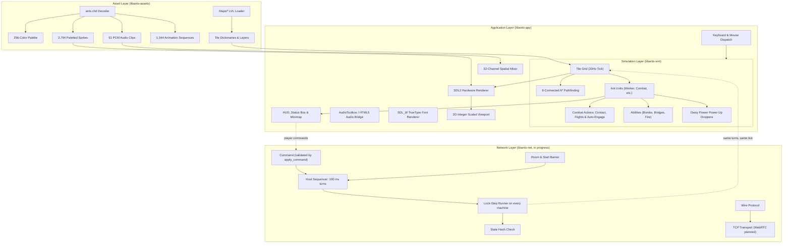

# Ants (1998) — Modern Cross-Platform Engine Remake

A faithful, high-performance, deterministic C++17 native engine remake and port of the 1998 classic real-time strategy game **Ants**.

The engine directly loads raw original binary assets (`ants.chd` and `Maps/*.LVL`) without pre-conversion, faithfully executing authentic gameplay mechanics, deterministic 20Hz simulation, 32-channel spatial audio, MIDI/MP3 score playback, TrueType font rendering, and an SDL2 hardware-accelerated 2D viewport.

**Current version: v0.0.66** (shown on screen next to the FPS meter). Every release is listed in the **[changelog](CHANGELOG.md)**, which is also published at **[beta.playants.org/changelog.html](https://beta.playants.org/changelog.html)**. Since v0.0.24 every system is re-derived from the disassembly of the original `Ants.exe` (see [Reverse Engineering](#reverse-engineering--historical-preservation)); multiplayer over a network (host / join over TCP) works and is still being extended (see [Network Port](#network-port-in-progress)).

---

## 🎮 Play in Browser (WebAssembly)

Play the remake instantly in any modern web browser (Chrome, Firefox, Safari, Edge) without installing anything:

👉 **[Play Ants Online at beta.playants.org](https://beta.playants.org)**

- **Authentic 1998 Asset Pipeline**: Full 8.1 MB archive (`ants.chd`, maps, and audio) packed into browser virtual memory.
- **Hardware-Accelerated 2D Viewport**: Pixel-crisp 4:3 display scaling with WebGL2 rendering.
- **32-Channel Spatial Sound & Soundtrack**: Authentic ant voice clips, explosions, and spatial SFX via Web Audio, with pre-rendered soundtrack streaming (`INTRO`, `ANTS2A`, `ANTS2B`, `ANTSFUN3`).
- **Interactive Asset Catalog**: Browse all 2,794 sprites, 91 sound effects, and 1,344 animation sequences at **[beta.playants.org/asset_catalog/](https://beta.playants.org/asset_catalog/)**.

---

## Highlights & Implemented Systems

- **Direct Binary Asset Pipeline (`libants-assets`)**:
  - Runtime parser for `Original-Ants/ants.chd` (header, 256-color palette, 2,794 raw paletted sprite bitmaps, 91 PCM audio clips, and 1,344 animation sequences).
  - Runtime parser for `Original-Ants/Maps/*.LVL` (header duration, tile dictionaries, terrain layers, items, and player spawn coordinates). It reads a map the way the original's loader does, so the community's maps load too (checked with `POPcOrN`, `Bombz Away` and `OCEAN`, which is not square: 81 rows of 100 columns): the header lists the rows first, bytes after the final word are never read, and that final word is every team's egg stock as it stands (the community editor's template ends with 32766).
  - On-the-fly 5-to-8 directional sprite mirroring for $O(1)$ directional lookups.
  - Zero external conversion tools or pre-processing needed.

- **Deterministic 20Hz Simulation Engine (`libants-sim`)**:
  - Discrete tick simulation matching authentic timing and movement rules (50 ms per tick).
  - Authentic unit types: **Worker**, **Combat**, **Fire**, **Bomber**, **Swimmer**, and **Thief** ants.
  - Authentic map duration parsing directly from `.LVL` binary headers (e.g. 6 min for `TINY`, 8 min for `SMALL`, 10 min for `MEDIUM`/`GAUNTLET`, 12 min for `ISLANDS`/`TREASURE`).
  - **Frame-Exact Movement & Pathfinding**: There are no speed constants: an ant moves by the displacement of its current walk frame when the frame ends, on a millisecond clock (grass 4 px / 50 ms, sand 4 px / 40 ms, dirt 4 px / 60 ms, mud 2 px / 60 ms, swimming 3 px / 40 ms; every ant type walks at the same pace). Paths come from a port of the original's asynchronous `PATHMGR` A* (one 1000-expansion slice per 50 ms per team, 8 directions), orders snap the ant to its tile centre like the original's `GoTo`, and walkers wait 300 ms behind a moving ant or re-plan around a standing one.
  - **Food Objects & Harvest**: A food pile is an object of the map (LVL Block 2: anchor, units, points per unit and a list of stage tiles whose 2 x 2 or 4 x 4 cells are solid for walkers, so paths avoid them). An ant only harvests when ordered onto the pile: it walks up to it, plays the `?gf` grab clip (action 5), and when the clip ends one unit is taken (the pile shows its next stage or disappears), the ant carries the points of one unit, "Got Food!" is posted and it heads for its hill; after the deposit it walks back to the pile. Two ants that begin on the last unit both get food, a lunchbox dropped by a dead carrier is a food object of one unit, and an ant that already carries food answers "Can't - already have food.".
  - **Power-Up Lifecycle & Droppers**:
    - An ant takes a power-up only when its walk ends on the power-up's tile (never from a distance): the type changes at once, the 770 ms `getpow` clip (action 4) plays with sounds 1 and 2, hit points stay, and an old power-up is dropped on a free neighbour tile (West twice as likely). An order given while the ant is crossing into the tile cancels the pick-up: the ant stands on the power-up and cannot be attacked (power-ups are solid obstacles for paths, attacks and knock-backs).
    - Daisy flower droppers (`flower1`, Anim 421) on maps like `SMALL.LVL` and `GAUNTLET.LVL` drop power-ups via 9-frame falling droplet animations (`FD_*`) with sound 62 (`powerdrip.wav`) based on authentic Block 4 waypoint intervals (15s on Small, 30s on Gauntlet) and weighted class probabilities.
  - **Special Abilities** (the original's action clips, with their frame sounds; a melee hit or a stun cancels an ability, a refused order plays the can't clip with "Can't do that..."):
    - **Bomber**: Plants a mine (an invisible solid placeholder until the clip ends) or defuses one; a bomb goes off when an ant walks onto it (several ants selected: the move click sends the first one onto a friendly bomb).
    - **Fire**: Ignites fire walls on grass, sand or dirt (never mud; a wall lives 180 s while more than 180 s of match time remain) and extinguishes them.
    - **Swimmer**: Builds a bridge in four passes on water and demolishes a finished one in four passes; drowning non-swimmers are caught by the shared bridge-collapse scan.
    - **Thief**: Raids an enemy anthill (`atcr501`, 3.5 s), moves up to 50 points at the end of the clip, sounds the alarm (`underattack.wav`) and drops a lunchbox when killed.
  - **Combat & Knock-back**: Contact is the attacker's step into the target tile (no range, no cooldown, one blow per order); hit points are lost at contact (1, a combat ant 2), the victim is thrown at the strike frame (`gh` one tile, combat ant `gb` four tiles), landings follow the original's block order (bomb, pile-up dispersal with the dust cloud, fire wall, water), death is deferred until the death clip ends, and the combat ant's only AI is the original's auto-engage (no guard post, no pursuit).
  - **Anthill Enter, Heal, Hatch & Raid**: An ant that reaches its hill's entrance plays the original enter clip (`?h0` / `h?h0`); its food scores and its health is restored when the clip ends, wounded ants take `(10 - hp) * 200` ms longer, and ants wait on a ring in front of the hill until the waiting-queue task (ANTHILLQ, every 200 ms) admits them one by one. An egg hatches 8 s after the click into a worker that plays `aghatch` with sound 43 (`exithill.wav`); a thief raid plays `atcr501` for 3.5 s and moves up to 50 points when it ends.
  - **Status Line & Messages**: The one-line status box under the unit card is a single slot (Ants.exe `PostStatus`): a new message replaces the old one, lives 5 s, and the six flashing ones (already carrying food, 1 minute / 30 seconds / 10 seconds left, a ThiefAnt at your anthill, a team made) flicker for 500 ms first. Selecting ants posts "Ready!", "BomberAnt selected.", "Where to?", "Thief here", "Yessir!" or "SwimmerAnt selected." (string 12 for a group), orders answer with the ant's voice and "On my way." / "Movin' out." / "Here I go..." / "Attack!" / "My pleasure..." / "Burn...", Stop posts "Stopping.", and nothing is shown while idle. The match clock is checked every 200 ms like the original's CHECKGO task: warnings at 1:00, 0:30 and eleven countdown steps from 0:10, and the match ends within 200 ms after 0:00.
  - **Alliance Texts & Chat Log**: Teaming up follows the original's protocol: the invitee gets the question (a modal dialog with Accept and Decline, keys `A`, `D` / `Esc`; `Would you like to accept?`, or the variant that says it ends the invitee's present team) and the allypro cue, the proposer a waiting dialog with Withdraw (`W` / `Esc`), a player who already has a team and asks another team (the ally pedestal) or attacks an ant or the hill of the own ally is asked first whether to break the team (Yes / No, `Y`, `N` / `Esc`), the proposer reads "%s accepted teaming up" / "%s rejected teaming up" (or the invitee "%s withdrew offer to team up"), a team that is made flashes "A team has been made." and writes the News Flash "%s (%s) and %s (%s) are a team now!" into the chat log (breaking it writes "... are no longer a team!"), and a drop-out writes "%s dropped out of the game!". The chat log keeps the original's entries: a header in the sender's team colour ("Name:" or "Name (To Teammate):", "[m:ss] News Flash:" for news) and a body of up to 100 characters wrapped and indented; chat needs the "Participate In Chat" option, F9 - F12 chat the quick-chat texts to everybody, and a team message reaches only the sender and the sender's allies.
  - **Edge Scrolling & Minimap**: The view scrolls like the original's input task (every 50 ms): the eight 12 px edge strips show the scroll arrows, only the 5 px inner strips scroll, the step is `scroll rate + 10` px around the target point of the pointer (about 55 - 60 px per tick at the default rate, 120 - 200 px/s at the slowest and 2100 px/s at the fastest setting), a strip that cannot move shows no arrow, and dialogs or a captured button stop it. Holding the left button on the minimap centres the view on the point under the pointer; nothing scrolls with the keyboard or the wheel.
  - **Pointer & Commands**: The cursor mode decides what a click does, exactly as in the original: over an ant the ant is picked with the original's sprite boxes (a 3 x 3 tile scan, the last box wins, no filters), other players' ants - allies too - give the attack cursor, food the food cursor, your own hill and the fog the move cursor, and a valid special target (a bomb for a bomber, an enemy hill for a thief, or with the ability pedestal latched: plantable ground, a fire wall, water or a bridge) the target cursor. A left drag of at most 4 px is a click at the release point, a bigger one is the red 1 px rubber band that selects your ants by positive-area overlap (Shift adds to a selection of your ants); the right button gives its order at the release, at the tile of the press point. The Move and ability pedestals only latch (a visual state that removes the band or turns valid tiles into targets and pops up after an accepted order), Stop stops the ants, locks the mouse for 250 ms and then deselects, the hatch pedestal exists only while eggs remain and the ally pedestal only with more than two players.
  - **Network Port (in progress)**: play with friends: one player hosts (`--host`), the others join (`--join host`). The setup screen becomes the room with every player's name and a thumb for the quality of the connection (green thumbs up, yellow sideways hand, red thumbs down, orange question mark), the host picks the map and the fog and presses START, everybody loads the same map file and the match begins for all at once. It is a deterministic lock-step of the players' commands (the host is the sequencer); a player who leaves drops out at the same moment everywhere, and the host may leave too: the other players agree on the lowest seat as the new host and the match goes on (as in the original, where nobody is special once a match runs). Raw TCP for a LAN or a forwarded port today; NAT traversal and the browser build follow. Details below in [Network Port](#network-port-in-progress).
  - **Keyboard, Buttons & Chat**: The keyboard is the original's: F1, F9 - F12, Enter, Esc = deselect, Ctrl+A / H / L / N / O / P / Q / S and nothing else (no Space, arrow or letter hotkeys); the chat box is always active and Enter / All / Team send its text; the top bar and chat buttons behave like the original's button class (a press captures, the click sound plays at the press, the action runs when the button is released while the pointer is still on it, leaving cancels it).
  - **Enemy Ant Inspection**: Clicking enemy units when no friendly unit is selected shows selection brackets (`*ears`, coloured by health) without allowing friendly command dispatch.
  - **End of the Match**: the match ends when the clock runs out (checked every 200 ms, like the original's CHECKGO task), when no team has an egg, a hatch or an ant left, when the teams that still have something are one alliance whose combined score is strictly the best (a tie is never a win), when a drop-out leaves one team or an allied pair alone, and when a player quits while exactly one other side is left (the quitter's row goes last on the results); with more sides left a quit is a drop-out (`docs/GAME_REVERSE_ENGINEERING.md` 5.47).
  - **Results Screen**: the original's (`docs/GAME_REVERSE_ENGINEERING.md` 5.49): "Waiting for scores..." for at least 250 ms, then one row per team or alliance ("Alice & Bob", the columns added up) in the original's order (score, the quitter last, the local team first on a tie it made) and positions (top row at y = 235, the others at 50 i + 273; numbers left aligned at x = 485 / 534 / 555 / 576), with the animated ant of each team; the winner or loser cue plays once when the rows appear; the Leave button appears with the rows; Enter, C, Q and X leave at any time, Esc does nothing.
  - **Options Screen & Settings**: the original's options window (`docs/GAME_REVERSE_ENGINEERING.md` 5.51): three sliders (Sound Volume, Music Volume, Map Scroll Rate) that work like the original's slider class (the thumb follows the pointer, the value is applied once at the release, whole numbers 0 - 99), two ON / OFF pairs (Participate In Chat, Show Quick Help at Startup) that act at the release, and the four Quick Chat edit fields (100 characters, F9 focused at the start, blinking caret, Enter closes, Esc does nothing). Every change is written at once and read back at the next start with the original's validity rule (see [Settings](#settings)).
  - **Match Audio Cues**: 1-minute alert (`1min.wav`), 30-second warning (`30sec.wav`), 10-second countdown (`countdwn.wav`), one winner or defeat sting per machine when the results open (`winner.wav` / `losers.wav`), and player drop-out (`playerout.wav`); "can't hatch" and the raid alarm are global cues, an accepted order clicks (`docs/GAME_REVERSE_ENGINEERING.md` 5.24b).

- **Modern Audio & Presentation (`libants-app`)**:
  - Hardware-accelerated SDL2 renderer with integer scaling, crisp pixel filtering, and authentic 4:3 viewport preservation.
  - TrueType text at the original's label sizes: every text is drawn at the cell height that `Ants.exe` gives its label (12 px status line and chat, 14 px score labels, 18 px setup screen and results, 24 px dialogs, 35 px start dialog text; see section 5.14 of the reverse engineering notes), in the original's "Franklin Gothic Medium" when a copy of that font is found next to the game or in the Windows fonts folder, and in the bundled Libre Franklin Medium (a free interpretation of the same Franklin Gothic, SIL Open Font License) otherwise; the health numbers (Ctrl+L) are white 8 x 15 pixel digits like the original's fixed system font.
  - 32-channel sound mixer with the original's sound law (Chebyshev distance over 2500 px, far-channel pan, DirectSound hundredths of a dB, the Sound Volume option inside every sound).
  - Native AudioToolbox MIDI playback on macOS and HTML5 audio streaming on WebAssembly.
  - Interactive HUD with minimap, selection cards, egg count, health-coloured selection ears, and recessed news status box (`wstatus.bmp`).

- **Interactive Asset Catalog & Inspector**:
  - Standalone web inspector (`asset_catalog/index.html`) with responsive design, searching, filtering, and instant asset downloads (⬇ WAV audio, ⬇ PNG sprites, ⬇ composite canvas frames).

- **Automated Verification & Zero-Warning Standard**:
  - 100% pass rate across **204 application integration tests (7,643 assertions)**, the simulation golden suites (movement, path planner, hill, combat, ability, power-up and food actions), the command-layer / state-hash suite, the lock-step network core, room and TCP transport suites, the render, HUD, status-message, input and pointer model suites and **506 opaque-box End-to-End (E2E) verification tests** (real counts in [Testing & Verification](#testing--verification)).
  - Zero warnings under `-Wall -Wextra -Wpedantic -Wconversion -Wshadow -Wnon-virtual-dtor`.

---

## Current Status & Roadmap

The remake provides a complete, playable, standalone experience with authentic assets, deterministic simulation, and cross-platform builds. Active work continues to refine 1:1 behavioral parity against the original 1998 binary:

| System / Area | Status | Notes & Active Focus |
|---|---|---|
| **Asset Decoding (`.chd`, `.lvl`)** | ✅ Complete | Full palette, sprite, animation, sound, and map parsing. |
| **Audio Engine (SFX & Music)** | ✅ Complete | 32-channel spatial mixer, MIDI on macOS, in-engine MP3 soundtrack on the web. |
| **Renderer & Viewport** | ✅ Complete | SDL2 hardware renderer, 4:3 integer scaling, TrueType font rendering, the original's sprite drawing rules. |
| **HUD, Pointer & Keyboard** | 🟢 Original Model | The original's HUD composites, pedestals, status line, chat log, pointer model (cursor table, rubber band, right button at release), edge scrolling and keyboard. Open: view origin (16, 21) at 442 x 440, the start-up flow. (The results screen, the setup screen, the options screen, the quick help and the chat input box are the original's since v0.0.63 - v0.0.66.) |
| **WebAssembly & Cloud Beta** | ✅ Complete | Docker containerized deployment at `beta.playants.org` (game, asset catalog, changelog page). |
| **Unit Movement & Locomotion** | 🟢 Original Model | Frame-exact walking, `PATHMGR` A*, blocking and bumping ported from `Ants.exe`. |
| **Hill, Food & Power-Ups** | 🟢 Original Action Model | Enter / heal / hatch / raid clips, the waiting ring, food objects with stages, pick-up at the landing and the standing-on-a-power-up rule. |
| **Abilities: Bombs, Fire & Bridges** | 🟢 Original Action Model | Plant, defuse, ignite, extinguish, bridge build and demolish as the original's action clips. |
| **Combat, Knockback & Collisions** | 🟢 Original Action Model | Contact, strike frame, `gh` / `gb` flights, landing blocks, pile-up dispersal, bomb victims, stun, deferred death and the combat ant auto-engage. |
| **Multiplayer: host / join over TCP** | 🟢 Playable (v0.0.46) | Lock-step core, room with names and connection thumbs, start barrier, roster, drop-out, predicted click feedback, chat; LAN / forwarded port. |
| **Multiplayer: host migration** | 🟢 Playable (v0.0.47) | The match goes on when the host leaves, as in the original: links between the guests, election of the lowest seat, resync of the turns, the old host dropped in the first turn of the new one. |
| **Multiplayer: NAT traversal (WebRTC, STUN / TURN)** | 📋 Planned | Data channels natively and in the browser, WebSocket signaling, coturn. Needs third-party libraries (asked first). |
| **Bot AI** | 🚫 None by design | Every ant command comes from a human player; the original has no computer players. |
| **Asset Viewer Overhaul** | 📋 Planned (last) | Verify the viewer's groups and that every animation loads and plays properly, then overhaul it; scheduled after everything else. |

### Roadmap (in order)
1. Network port: WebRTC + signaling + TURN deployment. (Host migration shipped in v0.0.47, the alliance dialogs in v0.0.50, the original's end-of-match rules in v0.0.62.)
2. View origin (16, 21) at 442 x 440.
3. Start-up flow (splash, loading, the single-player notice, More Help). (The results screen shipped in v0.0.63, the setup screen in v0.0.64, the options screen and the remembered settings in v0.0.65, the quick help and the chat input box in v0.0.66.)
4. Removal of the remaining invented visuals and timings, and the last non-original tests.
5. Asset viewer overhaul.
6. The comprehensive audit of the whole game against the original (visuals, animations, timing, sound, rules) has been done: results in [`docs/AUDIT_ONE_TO_ONE.md`](docs/AUDIT_ONE_TO_ONE.md) and [`docs/audit/`](docs/audit/); its ranked list of differences (hill queue defects, end-of-match rules, audio routing, the unbuilt results / options / start-up screens, view origin, minimap, fog reveal, chat, walking-frame cadence) replaces items 2 to 4 above as the work list, in eight proposed batches.

---

## Directory Structure

```text
Ants-Mac/
├── asset_catalog/          # Interactive web-based asset catalog and sprite/audio inspector
│   ├── index.html          # Browser application for asset inspection
│   ├── catalog_data.js     # Indexed metadata for sprites, audio clips, and animations
│   ├── sounds/             # Decoded 91 authentic WAV sound effects (IDs 0..90)
│   └── sprites/            # Decoded 2,794 paletted PNG sprites (IDs 0..2793)
├── docker/                 # Container deployment configuration
│   └── nginx.conf          # Nginx server config with caching, CORS, and WASM headers
├── docs/                   # Reverse-engineering documentation and specifications
│   ├── GAME_REVERSE_ENGINEERING.md  # Comprehensive technical mechanics reference (ground truth per system)
│   ├── NETWORK_PORT.md              # Network port design, wire format, milestones
│   ├── BUILD_AND_RUN.md             # Native and Docker build/run instructions
│   ├── ORIGINAL_BINARY_MAP.md       # Function map of Ants.exe (generated)
│   ├── TABLE4_ANIMATION_REFERENCE.md# Animation table reference
│   ├── legacy/Ants.exe.c            # Decompilation used only to navigate the binary
│   └── reverse_engineering/         # Verified movement reports and tables
├── include/                # Public C++ headers
│   ├── ants_assets/        # Archive decoders, map loaders, sprite/sound structs
│   ├── ants_sim/           # Simulation engine, grid, ant units, command layer, state hash
│   ├── ants_net/           # Lock-step protocol, sequencer, runner, sessions, room, TCP transport
│   └── ants_app/           # SDL2 application, renderer, HUD, audio mixer, MIDI, version
├── Original-Ants/          # Authentic 1998 game data
│   ├── ants.chd            # Packed binary sprites, audio, palettes, animations
│   ├── LibreFranklin-Medium.ttf  # Bundled text font (Libre Franklin, SIL Open Font License; licence: LibreFranklin-OFL.txt)
│   ├── *.mp3 / *.MID       # Soundtrack audio files
│   └── Maps/               # Binary .LVL maps: the six of the original; every .lvl in this folder is listed on the setup screen
├── src/                    # Implementation source code
│   ├── ants_assets/        # Asset decompression, palette mapping, mirroring
│   ├── ants_sim/           # Tick loop, PATHMGR A*, locomotion and action clips, combat, commands, state hash
│   ├── ants_net/           # Network core (no threads, no blocking calls) and TCP transport
│   └── ants_app/           # Windowing, input handling, viewport camera, rendering, HUD, setup screen
├── tests/                  # Automated verification test suites
│   ├── e2e/                # Standalone 506-test opaque-box E2E test runner
│   ├── test_assets/        # Binary asset parsing and movement-table parity tests
│   ├── test_sim/           # Simulation rules, golden action suites, command layer / state hash
│   ├── test_net/           # Lock-step core, room and TCP transport suites
│   ├── test_app/           # Application integration, render, HUD, status, input, pointer and options suites
│   └── data/               # Golden sample data (edge scrolling)
├── tools/                  # Reverse-engineering and generator scripts (Capstone analysis, table extraction, changelog page)
├── web/                    # WebAssembly shell, splash overlay, and web styles
├── CHANGELOG.md            # Running list of changes for every version (also served at /changelog.html)
├── CMakeLists.txt          # Root CMake build configuration
├── docker-compose.yml      # Service definition for beta.playants.org
├── Dockerfile              # Multi-stage Emscripten + Nginx build
├── build_web.sh            # Local WebAssembly build into dist/
├── run_tests.sh            # Master test suite runner script
├── start_game.sh / .bat    # One-click build and launch scripts (macOS / Linux, Windows)
└── AGENTS.md               # Project rules for contributors and coding agents
```

---

## Prerequisites & Dependencies

### macOS
Install the required tools and libraries via [Homebrew](https://brew.sh/):

```bash
brew install cmake sdl2 sdl2_ttf
```

- **Compiler**: Clang supporting C++17 (Xcode Command Line Tools: `xcode-select --install`).
- **Audio**: Built-in macOS AudioToolbox framework is used for MIDI playback (zero extra soundfont packages required).

### Linux
```bash
sudo apt-get update && sudo apt-get install -y cmake g++ libsdl2-dev libsdl2-ttf-dev
```

### Windows
Visual Studio 2022 Build Tools (MSVC) and CMake; SDL2 and SDL2_ttf are downloaded automatically by CMake. Run `start_game.bat` to build and launch, or see [`docs/BUILD_AND_RUN.md`](docs/BUILD_AND_RUN.md) for the step-by-step commands.

---

## Building and Running Locally

### Quick Launch (Desktop)
To automatically build and launch the native desktop game in one step:

```bash
./start_game.sh
```

### Manual CMake Build

1. Configure CMake in release mode:
   ```bash
   cmake -B build -DCMAKE_BUILD_TYPE=Release
   ```

2. Compile the project with all CPU cores:
   ```bash
   cmake --build build -j"$(sysctl -n hw.ncpu || nproc)"
   ```

3. Launch the game executable:
   ```bash
   ./build/src/ants_app/ants
   ```

### Running with AddressSanitizer (ASan)
```bash
cmake -B build_asan -DCMAKE_BUILD_TYPE=Debug -DENABLE_ASAN=ON
cmake --build build_asan -j8
./build_asan/src/ants_app/ants
```

### Command-Line Options
`./start_game.sh` and the executable accept:

| Option | Effect |
|---|---|
| `--map PATH` | Skip the setup screen and start a match on that `.LVL` file (for example `Original-Ants/Maps/SMALL.LVL`). Without `--map` a run that skips the setup screen plays the first map of the list. |
| `--map-select` | Start on the setup screen (the default). |
| `--seed N` | Random seed of the match. |
| `--player N` | The team you control (0 green, 1 red, 2 blue, 3 black). |
| `--fullscreen` | Start in fullscreen. |
| `--headless` | Hidden window with the dummy video driver (used by the tests). |
| `--screenshot FILE` / `--frames N` | Save a screenshot after N frames (default 5) and exit. |
| `--select-ant ID` / `--select-base TEAM` | Start with an ant or a hill selected (for screenshots). |
| `--open-options`, `--show-grid`, `--scorecard` | Show the options screen, the tile grid, or a sample results screen. |
| `--settings FILE` | Keep the remembered options in this file (see [Settings](#settings)). |

Names and network play:

| Option | Effect |
|---|---|
| `--name NAME` | Your name: the room, the HUD label, chat, the results rows and the simulation's texts. A network game says "Player" unless you give one (it never sends your user and machine name). |
| `-N<team><name>` / `--team-name <team> <name>` | The name of a team (0 green, 1 red, 2 blue, 3 black) in a local game (`-N1Bob` is the original's spelling). |
| `-pnum=<team>` | The original's spelling of `--player`. |
| `--host [port]` | Open a room on this machine (TCP, port 4001 unless given). |
| `--join host[:port]` | Join the room of a host (port 4001 unless given). |
| `--port N` | The port for `--host` / `--join`. |
| `--loopback` | With `--host`: accept only this machine (two copies on one computer). |

Try it on one computer: `./start_game.sh --host --loopback --name Alice`, then in a second terminal `./start_game.sh --join 127.0.0.1 --name Bob`.

---

## Self-Hosting with Docker (`beta.playants.org`)

To build and run the high-performance container on your Docker server:

```bash
# Build and launch with Docker Compose
docker compose up -d --build

# Or build and launch with Docker directly
docker build -t ants-beta .
docker run -d -p 19980:80 --name ants-beta ants-beta
```

The image serves the game at `/`, the asset catalog at `/asset_catalog/` and the changelog page at `/changelog.html` (built from `CHANGELOG.md` when the image is built).

### Building the Web Port Locally
```bash
./build_web.sh
python3 -m http.server 8080 -d dist
# Open http://localhost:8080
```

---

## Controls & Hotkeys

### Setup Screen (map selection)
- **The map list is searched, not built in**: every `.lvl` file of `Original-Ants/Maps/` is listed, sorted by the bytes of the file names (capitals before small letters), so a map that you drop into that folder - one of the community's maps, say - appears on the screen at once. The name, the description and the minutes come from the file's own header.
- **`Up` / `Down`** (or the arrow buttons): the previous / next map, wrapping round. **`Enter` or `S`** (or the `START` button): start. **`Q` or `X`** (or the Leave Game button): leave. The original's setup screen knows no other key: `Esc`, digits, `Left` / `Right`, `Space`, `F` and `D` do nothing.
- **The buttons are the original's button class**: a press captures the button (pressed picture, click sound) and the action happens at the release; moving off the button before the release cancels it for good. The **Fog of War On / Off** pair is silent and starts on Off. `START` locks the screen.
- The labels, the ant portrait and the thumb appear 500 ms after the screen is created (the original's refresh task), in the original's colour.
- **In a network room** the setup screen lists every player with a portrait in the player's colour, the name and a thumb: green thumbs up (round trip below 1.2 s), yellow sideways hand (below 1.8 s), red thumbs down (slower), orange question mark (not measured yet). Only the host changes the map and the fog and presses START (it needs a second player and every thumb); a guest sees the host's choice and can leave. The status line has the original's texts ("Press START when all players' thumbs have appeared.", "Waiting for the host to start the game...", "Trying to connect to the host...").
- **Soundtrack**: `INTRO` plays once on this screen, then random in-game pieces (`ANTS2A`, `ANTS2B`, `ANTSFUN3`) follow one another (docs 5.24e).

### Options Screen (`Ctrl + O` or the Options button)
- A window over the whole screen that takes every key and click while it is open; the game goes on behind it. **`Enter` closes it** (whatever has the focus), **`Esc` does nothing**, a click outside the card does nothing, and the **Return to Game** button closes it when released on the button.
- **Sliders** (Sound Volume, Music Volume, Map Scroll Rate): press on the track (188 - 418 px across, 20 px high), drag, release. The thumb follows the pointer; **the value is applied once, at the release**: the Sound Volume sets the volume and plays a test voice, the Music Volume sets the volume and starts a new piece, the Scroll Rate sets the edge scrolling speed. A plain click sets the value of the clicked place. The track end is 99.
- **Switches** (Participate In Chat, Show Quick Help at Startup): act at the release, like every button (a press only captures; leaving the button cancels it).
- **Quick Chat keys** (F9 - F12): click a field to edit it (the F9 field is active when the window opens), type up to 100 characters, Backspace deletes; every change is kept at once, and `F9` - `F12` in the game send the texts.

### Settings
The options are remembered between runs, as the original keeps them in the registry: `settings.ini` (lines of `name=value`: `Sound Volume`, `Music Volume`, `Scroll Speed`, `Participate In Chat`, `Show Quick Help at Startup`, `Quick Chat F9` ... `Quick Chat F12`, the original's names) in your per-user application folder (`~/Library/Application Support/Ants/Ants/` on macOS, `~/.local/share/Ants/Ants/` on Linux, `%APPDATA%\Ants\Ants\` on Windows), or in the browser's local storage on the web; `--settings FILE` uses another file. A value is used only when it is valid (a whole number from 0 to 99, and for the two switches the stored 0; otherwise the defaults apply: Sound 100, Music 65, Scroll 50, chat and quick help on, the quick chats of the original), and a headless run (tests) keeps its settings in memory only.

### Mouse Controls
| Action | Trigger | Description |
|---|---|---|
| **Select Friendly Ant** | Left Click on Friendly Ant | Selects a single ant unit (Shift adds it to / removes it from a selection of your ants). |
| **Inspect Enemy Ant** | Left Click on Enemy Ant | When no friendly unit is selected (or a hill or another ant is inspected), selects the ant to view its selection brackets. |
| **Move Order** | Left Click on Terrain | Issues move order to selected ant(s). Intermediate food tiles are avoided. |
| **Harvest Order** | Left Click on Food Morsel | Instructs ant to harvest food item and return it to base. |
| **Attack Order** | Left Click on Another Player's Ant | With your ants selected: orders them to engage the ant (the original's group order: ants that already attack that ant are skipped, the nearest one answers; the clickable area is the original's sprite box; allies show the attack cursor too). |
| **Marquee Selection** | Left Click & Drag ($>4\text{px}$ in either direction) | Selects your ants whose sprite box overlaps the red band (a shorter drag is a click at the release point; dragging over nothing deselects). |
| **Minimap Navigation** | Hold Left Button on Minimap | The view follows the point under the pointer while the button is held (every 50 ms); a right click on the minimap orders the selected ants there. |
| **Special Ability** | Right Click on Field (at the release) | A move for several ants, workers, combat ants and mixed groups, otherwise the ability of the single ant's type; or latch the ability pedestal and left-click a valid target: |
| | | • **Bomber**: Plant mine / defuse existing friendly mine. |
| | | • **Fire Ant**: Ignite firewall / extinguish blaze. |
| | | • **Swimmer**: Dig bridge on water / demolish existing bridge. |
| | | • **Thief**: Infiltrate enemy anthill. |
| **Bomb Hit (Jump)** | Click on a Friendly Bomb with Several Ants Selected | The move click sends the first ant onto the bomb, which sets it off (a single bomber defuses it instead). |

### No extra shortcuts
The game has exactly the original's keys (next section). Since v0.0.51 there are no shortcuts that the original did not have: no team switching (you play the team `-pnum=` gives you, or your seat in a network match; in a local game the other teams stand idle because the original has no computer players), no tile grid or music mute key, no screenshot key, no fullscreen key (`--fullscreen` starts in fullscreen; the operating system's own window controls still work).

### Camera & Hotkeys (the original's keyboard, Ants.exe `FUN_0102609a`)
| Key | Function |
|---|---|
| **Edge Scrolling** | Move the cursor to the edge: the arrow shows within 12 px, the view scrolls within the 5 px inner strip (every 50 ms; nothing scrolls with the keyboard or the wheel). |
| **Typing** | The chat box is always active (while "Participate In Chat" is on): printable keys and Backspace go into it, **`Enter`** sends the text (to your team when you have an ally, else to everybody); the **[All]** / **[Team]** buttons send it to everybody / your team. |
| **`F9` – `F12`** | Send the four quick chat texts (fresh key presses only, chat on). |
| **`F1`** | Quick help (closes with `C`, `X`, `Enter` or `Esc`, or with its Return button at the release; a click elsewhere does nothing). The quick help at the start of the program (when "Show Quick Help at Startup" is on) has the same keys and a START! button. |
| **`Esc`** | Deselect everything (there is no quit dialog on Esc). |
| **`Ctrl + A`** | Select all your ants (panel 3 for one, 4 for several, the voice of the first). |
| **`Ctrl + H`** | Select your home anthill (no hatching, no scrolling). |
| **`Ctrl + N` / `Ctrl + P`** | Select the next / previous ant (from the lowest selected one) and scroll just far enough to show it. |
| **`Ctrl + S`** | Stop the selected ants (no flash, no lock, no deselect). |
| **`Ctrl + O` / `Ctrl + Q`** | Options / quit dialog (quit dialog: `Y` yes, `N` or `Esc` no). |
| **`Ctrl + L`** | Show / hide every ant's hit points as white numbers. The numbers are **on by default** (an owner tweak: the original starts with them off). |
| *In a team dialog* | The offer to team up: `A` accepts, `D` / `Esc` declines; while you wait for the answer: `W` / `Esc` withdraws the offer; "Doing this will break your team": `Y` yes, `N` / `Esc` no. A dialog takes every key and click until it is answered. |

---

## Network Port (in progress)

The original game runs a full TCP mesh (port 4001) in which every machine simulates only its own team and broadcasts the results; it has no host / join interface (an external lobby starts every machine with its roster on the command line). The remake runs **one deterministic simulation on every machine** and sends only the players' intent (lock-step of commands): this also makes web play and NAT traversal possible. Design, wire format and milestones are in [`docs/NETWORK_PORT.md`](docs/NETWORK_PORT.md); what the original does is recorded in sections 5.46 - 5.48 of [`docs/GAME_REVERSE_ENGINEERING.md`](docs/GAME_REVERSE_ENGINEERING.md).

| Piece | State |
|---|---|
| Command layer (`Command`, `SimulationEngine::apply_command`, canonical order, byte-exact codec) | ✅ v0.0.43 |
| State hash (`state_hash()`, seven named parts) | ✅ v0.0.43 |
| Lock-step core: wire protocol, host sequencer, client runner, sessions, simulated network | ✅ v0.0.44 |
| Room (join, roster, map and fog, start barrier with a map-file hash check) and framed TCP transport | ✅ v0.0.45 |
| Host / join in the game (`--host`, `--join`), the room with names and connection thumbs, roster (teams without a player do not exist), drop-out through the turn stream, predicted click feedback, chat, waiting / out-of-sync messages, names from the command line | ✅ v0.0.46 |
| Host migration: the match goes on when the host leaves (as in the original): links between the guests, the turn log, election with epochs, resync, the old host dropped by the first turn of the new one | ✅ v0.0.47 |
| NAT traversal: ICE / STUN / TURN over WebRTC data channels, WebSocket signaling, coturn, the browser build | 📋 planned |
| Alliance dialogs: the invitation question, the waiting dialog, the break confirmation (teaming works between players; team chat reaches only the allies) | ✅ v0.0.50 |
| The original's end-of-match rules (CHECKGO elimination, the drop-out win test, quitting as a forfeit; the `Quit` command, protocol version 4) | ✅ v0.0.62 |

How a match runs: a turn is 100 ms (two ticks). The host stamps every command with the sender's seat (a peer cannot speak for another player), seals a turn every 100 ms with the commands in canonical order and sends it to everybody; every machine executes the same turns after a two-turn jitter buffer, waits at a missing turn and runs faster to catch up. Every 20 ticks the machines compare a hash of the whole gameplay state: a mismatch names the peer and the subsystem and freezes the match. Malformed, flooding or host-only messages are counted and the peer is thrown out after eight strikes; the game waits for a peer that lags by up to 3 s and drops one that is silent for 60 s (the original's drop-out time). A player who leaves drops out at the same tick on every machine: its ants die, its alliance ends, "%s dropped out of the game!" is written into the chat log. No bots: every ant command comes from a human player.

Host migration (v0.0.47): while the map loads, every guest connects to the guests above its seat (each announces a port in its `Hello`, the host passes the addresses on with the roster) and every machine keeps the last 30 s of turns. When the host's connection closes, or the host is silent for 10 s, the guests elect the lowest seat they still see alive (proposal, accept / refuse with an election number, one candidate per election); the winner collects how far everybody got, fetches the turns it lacks, becomes the host, tells the others and sends them the turns they miss; its first turn drops the old host (and any seat that did not follow) on every machine at the same tick. The game shows "The host left. Choosing a new host..." while it happens and "Bob is the host now." afterwards; orders given in the last ~300 ms before the host went are lost and must be given again. A match with one machine left goes on for it alone. Links between guests need the addresses the host saw, so on the internet this waits for the WebRTC transport too.

Limits of this release: raw TCP only (a LAN, a VPN or a forwarded port 4001; the browser build has no network yet), a host that dies in the first second of the match (before the links between guests are made) can split it, when a network match ends you return to the local setup screen, a player has one pending team offer at a time (the original queues several) and a match ends by the clock only (the original's elimination rules are not ported yet). Names are ASCII.

---

## Changelog & Versioning

The version (`include/ants_app/version.hpp`, currently `v0.0.66`) is bumped with every release and shown on screen next to the FPS meter. [`CHANGELOG.md`](CHANGELOG.md) lists what changed in every version, newest first, from the first commit to the release in progress; it is published on the beta site at [`/changelog.html`](https://beta.playants.org/changelog.html) and linked from the game page.

---

## Testing & Verification

The project enforces strict regression guarantees with automated test suites spanning decoders, simulation rules, application integration, and opaque-box end-to-end scenarios.

### Master Test Suite
To run all test suites in sequence:

```bash
./run_tests.sh
```

### Running Specific Suites
```bash
./run_tests.sh --assets   # Asset decoders and movement-table parity with Ants.exe (suites 1, 1.1)
./run_tests.sh --sim      # Simulation rules, golden action suites, command layer, lock-step network, room, TCP (suites 2.x)
./run_tests.sh --app      # Application integration, render, HUD, status, input, pointer and options suites (suites 3.x)
./run_tests.sh --e2e      # Opaque-box E2E test runner (506 tests across 4 tiers)
./run_tests.sh --asan     # Rebuild and run with AddressSanitizer
./run_tests.sh --clean    # Remove the build directories and rebuild first
```

### What the Suites Cover (v0.0.66, all passing)
| Suite | What it checks | Size |
|---|---|---|
| 1 Asset decoders | `ants.chd` header, palette, sprites, audio, event tags, Table 4 animations, `.LVL` maps, directional mirroring, fuzzing | 9 suites, 70,065 assertions |
| 1.1 Movement tables | Generated locomotion tables and clips equal the static tables inside `Ants.exe` and `ants.chd` | 7 suites, 120,582 assertions |
| 2 Simulation rules | Clock, PRNG, unit attributes, combat, placement, bombs, fire, bridges, hills, thieves, alliances, scoring, match end, the end rules (elimination, allied survivors, the drop-out win test, quitting) and the result rows | 14 suites, 2,398 assertions |
| 2.1 - 2.2 Challengers | Adversarial combat / hazard and lifecycle / economy / alliance scenarios | 288 and 213 assertions |
| 2.3 Path planner | Port of the original `PATHMGR` A* | 228 assertions |
| 2.4 Movement golden | 22 frame-exact timings from a reference model, blocking, bumping, terrain, solid bits | 17,710 assertions |
| 2.5 - 2.9 Action suites | Hill actions, combat actions, abilities, power-ups, food (golden cases from the disassembly) | 394 / 179 / 221 / 4,827 / 641 assertions |
| 2.10 Command layer | Codec fuzzing, validation, canonical order, engines fed permuted commands stay bit-identical, state-hash coverage field by field, rosters, drop-out, quit, the predicted acknowledgement | 22 tests, 504,366 assertions |
| 2.11 Lock-step core | Protocol fuzzing, sequencer, runner, host and three clients over links with latency and jitter play 90 s bit-identically, desync detection, hostile peers, drop-out at the same tick, silent peers, runner hooks; host migration on the simulated network (the host dying abruptly or silently, two seats dying together, the successor or the only holder of the missing turns dying mid-election, a silent guest, a partitioned old host, three host changes in a row, forged and garbage messages, the turn log) | 36 tests, 98,979 assertions |
| 2.12 Room | Joining, roster, map and fog, the start barrier, the connection thumbs (round trip tiers 1200 / 1800 ms) | 9 tests, 55,050 assertions |
| 2.13 TCP | Framing, hostile frames, a real-socket match | 6 tests, 60,122 assertions |
| 2.14 NetGame | The room, thumbs, the start barrier, a match with commands and chat, a guest that leaves, host migration over real sockets (the host leaving a two-, three- and four-player match, the links between guests, strangers on a guest's port, no election after the match is over), refused joins, map mismatch | 14 tests, 533 assertions |
| 3 Application integration | Whole-application behaviour through the HUD, renderer and simulation | 204 tests, 7,643 assertions |
| 3.1 - 3.5 Model suites | Render parity 303 checks (with the text sizes and the health-number font), HUD layout 736 (with the network room screen, the label sizes and wrapping, the three alliance dialogs, the results screen, the options screen's pictures and fields and the chat input box), status messages 263, input model 70, pointer model 339 | 1,711 checks |
| 3.6 Network application | The command line (names, `--host`, `--join`), a headless application as host and as guest of a room, start, a bit-identical match, chat, leaving, the host leaving (a two-player match is decided at once, in a three-player match the guest follows the new host and says so), a guest that quits (the quit ends the match on both machines), the score labels of a local game, teaming over three machines (an offer arrives as the question, Accept, team chat reaches only the ally, refusal, Withdraw) | 11 tests, 203 assertions |
| 3.7 Options | The original's slider (every configured value placed and read back, every pointer x, hit edges), latching button (pictures, capture, latch), edit field (focus, 100 characters, caret phases), the settings store (the validity rule, files, texts) and the options screen end to end | 135 checks |
| 4 E2E | Opaque-box scenarios in four tiers | 506 tests |

### Standalone E2E Test Runner
The E2E test suite validates all 49 game features across 4 tiers:
```bash
# Build standalone E2E runner
cmake -S tests/e2e -B build_e2e
cmake --build build_e2e

# Run all 506 tests
./build_e2e/e2e_runner --all

# Run specific tiers
./build_e2e/e2e_runner --tier 1   # Tier 1: Feature Coverage (245 tests)
./build_e2e/e2e_runner --tier 2   # Tier 2: Boundary & Corner Cases (245 tests)
./build_e2e/e2e_runner --tier 3   # Tier 3: Cross-Feature Pairwise (10 tests)
./build_e2e/e2e_runner --tier 4   # Tier 4: Real-World Workloads (6 full matches)
```

---

## Asset Catalog & Inspector

The repository includes a web-based inspector to inspect and preview all authentic assets extracted from `ants.chd`:

- **Sprites**: 2,794 paletted PNGs with zoom levels (1x, 2x, 3x, 4x), bounding boxes, registration origins, background styles, and one-click PNG downloads.
- **Audio Clips**: 91 WAV sound effects with wave previews, instant audio playback, and WAV downloads.
- **Animations**: 1,344 animation sequences with frame-accurate multi-subitem compositing, timing, frame sound triggers, and composite PNG frame export.

### Launching the Inspector
Simply open the HTML file in your browser:

```bash
open asset_catalog/index.html
```

Or visit the online version at **[beta.playants.org/asset_catalog/](https://beta.playants.org/asset_catalog/)**.

---

## Architecture Overview


```mermaid
flowchart TD
    subgraph Assets ["Asset Layer (libants-assets)"]
        CHD["ants.chd Decoder"] --> Palette["256-Color Palette"]
        CHD --> Sprites["2,794 Paletted Sprites"]
        CHD --> Sounds["91 PCM Audio Clips"]
        CHD --> Anims["1,344 Animation Sequences"]
        LVL["Maps/*.LVL Loader"] --> MapData["Tile Dictionaries & Layers"]
    end

    subgraph Sim ["Simulation Layer (libants-sim)"]
        MapData --> Grid["Tile Grid (20Hz Tick)"]
        Grid --> Path["8-Connected A* Pathfinding"]
        Grid --> Units["Ant Units (Worker, Combat, etc.)"]
        Units --> CombatAI["Combat Actions: Contact, Flights & Auto-Engage"]
        Units --> Abilities["Abilities (Bombs, Bridges, Fire)"]
        Units --> Droppers["Daisy Flower Power-Up Droppers"]
    end

    subgraph Net ["Network Layer (libants-net, in progress)"]
        Cmd["Command (validated by apply_command)"] --> Seq["Host Sequencer: 100 ms turns"]
        Seq --> Runner["Lock-Step Runner on every machine"]
        Runner --> Hash["State Hash Check"]
        Lobby["Room & Start Barrier"] --> Seq
        Wire["Wire Protocol"] --> TCP["TCP Transport (WebRTC planned)"]
    end

    subgraph App ["Application Layer (libants-app)"]
        Sprites --> Renderer["SDL2 Hardware Renderer"]
        Grid --> Renderer
        Sounds --> AudioMixer["32-Channel Spatial Mixer"]
        MIDI["AudioToolbox / HTML5 Audio Bridge"]
        TTF["SDL_ttf TrueType Font Renderer"]
        Renderer --> Viewport["2D Integer Scaled Viewport"]
        Units --> HUD["HUD, Status Box & Minimap"]
        Input["Keyboard & Mouse Dispatch"] --> Sim
    end

    Runner -. "same turns, same tick" .-> Grid
    HUD -. "player commands" .-> Cmd
```

---

## Reverse Engineering & Historical Preservation

This project is a clean-room educational remake and historical preservation effort. All mechanics, timings, and constants are reverse-engineered directly from the original 1998 binary executable (`Ants.exe`) using Capstone disassembly to achieve authentic 1:1 fidelity.

Comprehensive disassembly addresses, opcode traces, and formulas are actively documented in **[`docs/GAME_REVERSE_ENGINEERING.md`](docs/GAME_REVERSE_ENGINEERING.md)**. All original game assets belong to their respective copyright holders. The bundled text font, Libre Franklin Medium, is © The Libre Franklin Project Authors and licensed under the SIL Open Font License 1.1 (`Original-Ants/LibreFranklin-OFL.txt`).
