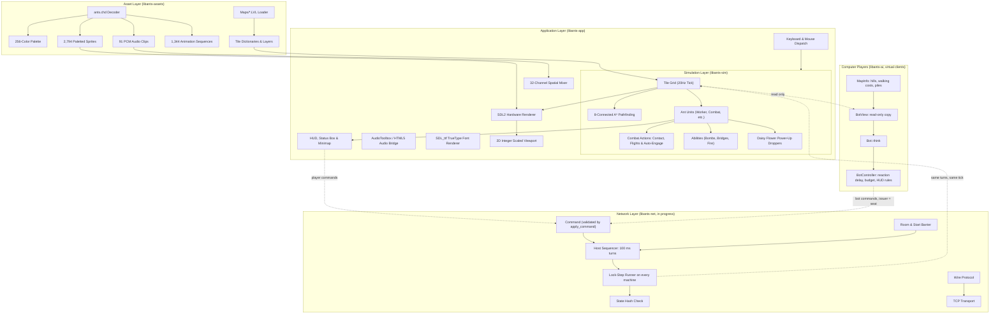

# Ants (1998) — Modern Cross-Platform Engine Remake

A faithful, high-performance, deterministic C++17 native engine remake and port of the 1998 classic real-time strategy game **Ants**.

The engine directly loads raw original binary assets (`ants.chd` and `Maps/*.LVL`) without pre-conversion, faithfully executing authentic gameplay mechanics, deterministic 20Hz simulation, 32-channel spatial audio, MIDI/MP3 score playback, TrueType font rendering, and an SDL2 hardware-accelerated 2D viewport.

**Current version: v0.0.89** (shown on screen next to the FPS meter). What is in progress, next and recently done: **[STATUS.md](STATUS.md)**. Every release is listed in the **[changelog](CHANGELOG.md)**, which is also published at **[beta.playants.org/changelog.html](https://beta.playants.org/changelog.html)**. Since v0.0.24 every system is re-derived from the disassembly of the original `Ants.exe` (see [Reverse Engineering](#reverse-engineering--historical-preservation)); multiplayer over a network (host / join over TCP) works and is still being extended (see [Network Port](#network-port-in-progress)).

---

## 🎮 Play in Browser (WebAssembly)

Play the remake instantly in any modern web browser (Chrome, Firefox, Safari, Edge) without installing anything:

👉 **[Play Ants Online at beta.playants.org](https://beta.playants.org)**

- **Four games on one page, synced through the game server**: **[beta.playants.org/four.html](https://beta.playants.org/four.html)** opens a room on the server, joins it with four frames (Green, Red, Blue, Black) and shows whether the four state hashes stay equal. (It works only on a game server that was started with demo rooms, `--demo-rooms N --demo-map TINY.LVL`, with the maps folder holding that map: see the server options below and the commented `command:` in `docker-compose.server.yml`.)
- **Authentic 1998 Asset Pipeline**: Full 8.1 MB archive (`ants.chd`, maps, and audio) packed into browser virtual memory.
- **Hardware-Accelerated 2D Viewport**: Pixel-crisp 4:3 display scaling with WebGL2 rendering.
- **32-Channel Spatial Sound & Soundtrack**: Authentic ant voice clips, explosions, and spatial SFX via Web Audio, with pre-rendered soundtrack streaming (`INTRO`, `ANTS2A`, `ANTS2B`, `ANTSFUN3`).
- **Interactive Asset Catalog**: Browse all 2,794 sprites, 91 sound effects, and 1,344 animation sequences at **[beta.playants.org/asset_catalog/](https://beta.playants.org/asset_catalog/)**.

---

## Highlights & Implemented Systems

- **Direct Binary Asset Pipeline (`libants-assets`)**:
  - Runtime parser for `Original-Ants/ants.chd` (header, 256-color palette, 2,794 raw paletted sprite bitmaps, 91 PCM audio clips, and 1,344 animation sequences).
  - Runtime parser for `Original-Ants/Maps/*.LVL` (header duration, tile dictionaries, terrain layers, items, and player spawn coordinates). It reads a map the way the original's loader does, so the community's maps load too (checked with `POPcOrN`, `Bombz Away` and `OCEAN`, which is not square: 81 rows of 100 columns): the header lists the rows first, bytes after the final word are never read, and that final word is every team's egg stock as it stands (the community editor's template ends with 32766).
  - On-the-fly 5-to-8 directional sprite mirroring for $O(1)$ directional lookups.
  - Zero external conversion tools or pre-processing needed.

- **Deterministic 20Hz Simulation Engine (`libants-sim`)**:
  - Discrete tick simulation matching authentic timing and movement rules (50 ms per tick).
  - Authentic unit types: **Worker**, **Combat**, **Fire**, **Bomber**, **Swimmer**, and **Thief** ants.
  - Authentic map duration parsing directly from `.LVL` binary headers (e.g. 6 min for `TINY`, 8 min for `SMALL`, 10 min for `MEDIUM`/`GAUNTLET`, 12 min for `ISLANDS`/`TREASURE`).
  - **Frame-Exact Movement & Pathfinding**: There are no speed constants: an ant moves by the displacement of its current walk frame when the frame ends, on a millisecond clock (grass 4 px / 50 ms, sand 4 px / 40 ms, dirt 4 px / 60 ms, mud 2 px / 60 ms, swimming 3 px / 40 ms; every ant type walks at the same pace). Paths come from a port of the original's asynchronous `PATHMGR` A* (one 1000-expansion slice per 50 ms per team, 8 directions), orders snap the ant to its tile centre like the original's `GoTo`, and walkers wait 300 ms behind a moving ant or re-plan around a standing one.
  - **Food Objects & Harvest**: A food pile is an object of the map (LVL Block 2: anchor, units, points per unit and a list of stage tiles whose 2 x 2 or 4 x 4 cells are solid for walkers, so paths avoid them). An ant only harvests when ordered onto the pile: it walks up to it, plays the `?gf` grab clip (action 5), and when the clip ends one unit is taken (the pile shows its next stage or disappears), the ant carries the points of one unit, "Got Food!" is posted and it heads for its hill; after the deposit it walks back to the pile. Two ants that begin on the last unit both get food, a lunchbox dropped by a dead carrier is a food object of one unit, and an ant that already carries food answers "Can't - already have food.".
  - **Power-Up Lifecycle & Droppers**:
    - An ant takes a power-up only when its walk ends on the power-up's tile (never from a distance): the type changes at once, the `getpow` clip (action 4, 840 ms) plays with sounds 1 and 2, hit points stay, and an old power-up is dropped on a free neighbour tile (West twice as likely). An order given while the ant is crossing into the tile cancels the pick-up: the ant stands on the power-up and cannot be attacked (power-ups are solid obstacles for paths, attacks and knock-backs).
    - Daisy flower droppers (`flower1`, Anim 421) on maps like `SMALL.LVL` and `GAUNTLET.LVL` drop power-ups via 9-frame falling droplet animations (`FD_*`) with sound 62 (`powerdrip.wav`) based on authentic Block 4 waypoint intervals (15s on Small, 30s on Gauntlet) and weighted class probabilities.
  - **Special Abilities** (the original's action clips, with their frame sounds; a melee hit or a stun cancels an ability, a refused order plays the can't clip with "Can't do that..."):
    - **Bomber**: Plants a mine (an invisible solid placeholder until the clip ends) or defuses one; a bomb goes off when an ant walks onto it (several ants selected: the move click sends the first one onto a friendly bomb).
    - **Fire**: Ignites fire walls on grass, sand or dirt (never mud; a wall lives 180 s while more than 180 s of match time remain) and extinguishes them.
    - **Swimmer**: Builds a bridge in four passes on water and demolishes a finished one in four passes; drowning non-swimmers are caught by the shared bridge-collapse scan.
    - **Thief**: Raids an enemy anthill (`atcr501`, 3.5 s), moves up to 50 points at the end of the clip, sounds the alarm (`anthill.wav`) and drops a lunchbox when killed.
  - **Combat & Knock-back**: Contact is the attacker's step into the target tile (no range, no cooldown, one blow per order); hit points are lost at contact (1, a combat ant 2), the victim is thrown at the strike frame (`gh` one tile, combat ant `gb` four tiles), landings follow the original's block order (bomb, pile-up dispersal with the dust cloud for ants that are not yours, fire wall without one, water), death is deferred until the death clip ends, and the combat ant's only AI is the original's auto-engage (no guard post, no pursuit).
  - **Anthill Enter, Heal, Hatch & Raid**: An ant that reaches its hill's entrance plays the original enter clip (`?h0` / `h?h0`); its food scores and its health is restored when the clip ends, wounded ants take `(10 - hp) * 200` ms longer, and ants wait on a ring in front of the hill until the waiting-queue task (ANTHILLQ, every 200 ms) admits them one by one. An egg hatches 8 s after the click into a worker that plays `aghatch` with sound 43 (`exithill.wav`); a thief raid plays `atcr501` for 3.5 s and moves up to 50 points when it ends.
  - **Status Line & Messages**: The one-line status box under the unit card is a single slot (Ants.exe `PostStatus`): a new message replaces the old one, lives 5 s, and the six flashing ones (already carrying food, 1 minute / 30 seconds / 10 seconds left, a ThiefAnt at your anthill, a team made) flicker for 500 ms first. Selecting ants posts "Ready!", "BomberAnt selected.", "Where to?", "Thief here", "Yessir!" or "SwimmerAnt selected." (string 12 for a group), orders answer with the ant's voice and "On my way." / "Movin' out." / "Here I go..." / "Attack!" / "My pleasure..." / "Burn...", Stop posts "Stopping.", and nothing is shown while idle. The match clock is checked every 200 ms like the original's CHECKGO task: warnings at 1:00, 0:30 and eleven countdown steps from 0:10, and the match ends within 200 ms after 0:00.
  - **Alliance Texts & Chat Log**: Teaming up follows the original's protocol: the invitee gets the question (a modal dialog with Accept and Decline, keys `A`, `D` / `Esc`; `Would you like to accept?`, or the variant that says it ends the invitee's present team) and the allypro cue, the proposer a waiting dialog with Withdraw (`W` / `Esc`), a player who already has a team and asks another team (the ally pedestal) or attacks an ant or the hill of the own ally is asked first whether to break the team (Yes / No, `Y`, `N` / `Esc`), the proposer reads "%s accepted teaming up" / "%s rejected teaming up" (or the invitee "%s withdrew offer to team up"), a team that is made flashes "A team has been made." and writes the News Flash "%s (%s) and %s (%s) are a team now!" into the chat log (breaking it writes "... are no longer a team!"), and a drop-out writes "%s dropped out of the game!". The chat log keeps the original's entries: a header in the sender's team colour ("Name:" or "Name (To Teammate):", "[m:ss] News Flash:" for news) and a body of up to 100 characters wrapped by pixels and set 10 px in (see **Chat Log Window** below); chat needs the "Participate In Chat" option, F9 - F12 chat the quick-chat texts to everybody, and a team message reaches only the sender and the sender's allies.
  - **Edge Scrolling & Minimap**: The map view is the original's (442 x 440 pixels at the screen pixel (16, 21)) and a match starts as in the original: the view scrolls just far enough to show the square around your hill (it does not centre it). The view scrolls like the original's input task (every 50 ms): the eight 12 px edge strips show the scroll arrows, only the 5 px inner strips scroll, the step is `scroll rate + 10` px around the target point of the pointer (about 55 - 60 px per tick at the default rate, 120 - 200 px/s at the slowest and 2100 px/s at the fastest setting), a strip that cannot move shows no arrow, and dialogs or a captured button stop it. Holding the left button on the minimap centres the view on the point under the pointer; nothing scrolls with the keyboard or the wheel.
  - **Pointer & Commands**: The cursor mode decides what a click does, exactly as in the original: over an ant the ant is picked with the original's sprite boxes (a 3 x 3 tile scan, the last box wins, no filters), other players' ants - allies too - give the attack cursor, food the food cursor, your own hill and the fog the move cursor, and a valid special target (a bomb for a bomber, an enemy hill for a thief, or with the ability pedestal latched: plantable ground, a fire wall, water or a bridge) the target cursor. A left drag of at most 4 px is a click at the release point, a bigger one is the red 1 px rubber band that selects your ants by positive-area overlap (Shift adds to a selection of your ants); the right button gives its order at the release, at the tile of the press point. The Move and ability pedestals only latch (a visual state that removes the band or turns valid tiles into targets and pops up after an accepted order), Stop stops the ants, locks the mouse for 250 ms and then deselects, the hatch pedestal exists only while eggs remain and the ally pedestal only with more than two players. An order that at least one selected ant needed makes the pedestal click or pop up even when every ant refuses it; only the closest ant's acceptance gives the voice, and a special order speaks only when it goes to exactly one ant. Shift clicks and drags that add or remove ants post the selection text like any other selection.
  - **Network Port (in progress)**: play with friends: one player hosts (`--host`), the others join (`--join host`). The setup screen becomes the room with every player's name and a thumb for the quality of the connection (green thumbs up, yellow sideways hand, red thumbs down, orange question mark), the host picks the map and the fog and presses START, everybody loads the same map file and the match begins for all at once. It is a deterministic lock-step of the players' commands (the host is the sequencer); a player who leaves drops out at the same moment everywhere, and the host may leave too: the other players agree on the lowest seat as the new host and the match goes on (as in the original, where nobody is special once a match runs). Raw TCP for a LAN or a forwarded port today; Internet play goes through the dedicated game server (no NAT traversal in the game); the browser build can join it. Details below in [Network Port](#network-port-in-progress).
  - **Keyboard, Buttons & Chat**: The keyboard is the original's: F1, F9 - F12, Enter, Esc = deselect, Ctrl+A / H / L / N / O / P / Q / S and nothing else (no Space, arrow or letter hotkeys); the chat box is always active and Enter / All / Team send its text; the top bar and chat buttons behave like the original's button class (a press captures, the click sound plays at the press, the action runs when the button is released while the pointer is still on it, leaving cancels it).
  - **Ant Animation in Real Time**: every clip that an ant plays, walking on every terrain, standing, swimming, diving, climbing, harvesting, can't-go and all the actions, steps at the moment a frame ends, as the original's real-time player does (`docs/GAME_REVERSE_ENGINEERING.md` 5.59): the frames and the displacements that end between two 50 ms simulation ticks are shown in advance (sand shows 40 ms steps smoothly, mud 60 ms, idle animations their own 150 / 75 ms), the selection ears and the hit-point number follow the sprite, and a frozen ant shows no number.
  - **Death & Burning**: a dying ant plays `death1` .. `death4` on its own sprite until it is removed (`docs/GAME_REVERSE_ENGINEERING.md` 5.60), keeping its hit-point number and its minimap dot; the flames of a dud bomb (`?bu`) are a sprite of the view container, drawn over every ant and hidden only on unexplored ground.
  - **Enemy Ant Inspection**: Clicking enemy units when no friendly unit is selected shows selection brackets (`*ears`, coloured by health) without allowing friendly command dispatch.
  - **End of the Match**: the match ends when the clock runs out (checked every 200 ms, like the original's CHECKGO task), when no team has an egg, a hatch or an ant left, when the teams that still have something are one alliance whose combined score is strictly the best (a tie is never a win), when a drop-out leaves one team or an allied pair alone, and when a player quits while exactly one other side is left (the quitter's row goes last on the results); with more sides left a quit is a drop-out (`docs/GAME_REVERSE_ENGINEERING.md` 5.47).
  - **Results Screen**: the original's (`docs/GAME_REVERSE_ENGINEERING.md` 5.49): "Waiting for scores..." for at least 250 ms, then one row per team or alliance ("Alice & Bob", the columns added up) in the original's order (score, the quitter last, the local team first on a tie it made) and positions (top row at y = 235, the others at 50 i + 273; numbers left aligned at x = 485 / 534 / 555 / 576), with the animated ant of each team; the winner or loser cue plays once when the rows appear; the Leave button appears with the rows; Enter, C, Q and X leave at any time, Esc does nothing.
  - **Options Screen & Settings**: the original's options window (`docs/GAME_REVERSE_ENGINEERING.md` 5.51): three sliders (Sound Volume, Music Volume, Map Scroll Rate) that work like the original's slider class (the thumb follows the pointer, the value is applied once at the release, whole numbers 0 - 99), two ON / OFF pairs (Participate In Chat, Show Quick Help at Startup) that act at the release, and the four Quick Chat edit fields (100 characters, F9 focused at the start, blinking caret, Enter closes, Esc does nothing). Every change is written at once and read back at the next start with the original's validity rule (see [Settings](#settings)).
  - **Fog of War**: the ground is uncovered the way the original does it (`docs/GAME_REVERSE_ENGINEERING.md` 5.54): a 13 x 13 square around an ant whenever the position of one of your ants or your teammate's is updated, nothing around a hill and nothing when a team forms; the ground's objects are drawn from three cells beyond the view, and an object whose anchor is unexplored is drawn again from every explored cell of its footprint (the original's second path of the layer-2 pass, `docs/GAME_REVERSE_ENGINEERING.md` 5.57); food is hidden only while neither its anchor nor a cell of its current stage's footprint is explored.
  - **Score Boxes**: the four score boxes are the original's (`docs/GAME_REVERSE_ENGINEERING.md` 5.53): the local team's in the top bar and the others in three bottom slots in team-index order, an allied team's box is half its colour and half its ally's and shows the two scores added, and the box of a team that does not play or has dropped out is covered with the original's `scorcovr` plate.
  - **Minimap**: the 119 x 91 image is painted the way the original's painter does it (`docs/GAME_REVERSE_ENGINEERING.md` 5.55): every pixel shows the object of the cell under it in the colour of the original's table (a tile that is not in the table: palette colour 0), bombs show the terrain, and in fog only power-ups, food and fire walls fall back to the fog colour while rocks, toys, bridges and every colony's hill keep theirs; fire walls show as yellow. There are no dots per object cell. The dots are rectangles on top of it: flowers and clovers (3 x 3 on a 60 x 60 map) and the ants, each at its pixel position (2 x 2 on a 60 x 60 map, 3 x 2 on 31 x 31), every ant until it is removed (dying and drowning ants too); in fog your own ants and your ally's show, enemies only on explored ground. The view frame is (251, 251, 255), `trunc(442 / scale) + 1` by `trunc(440 / scale) + 1` pixels, at the view's origin divided by the scale and kept inside the image. (The original's flash of an own or allied ant that was hit in the last 5 seconds is read but not ported until a screenshot of the original confirms it.)
  - **Chat Log Window**: the log box (482, 299, 138 x 101 px) is the original's window (`docs/GAME_REVERSE_ENGINEERING.md` 5.56): entries are stacked with one pixel between them, the header at the left edge and the body 10 px in, wrapped at 126 px by the font's real widths, a header wider than the box shows its end and a half line at the edge is cut in pixels. The window follows the newest entry smoothly (5 px every 50 ms); **holding the left button inside the log and moving the pointer scrolls it like a sheet, a pointer held outside scrolls 15 px every 100 ms, and releasing the button snaps back to the newest entries** (the original has no scroll bar, wheel or PageUp / PageDown, so the remake has none either). When the program ends after a match the chat log is written to `chat.txt` ("date @ time", then "header body" per entry) in the per-user application folder next to the settings (the original: its own folder).
  - **Match Audio Cues**: 1-minute alert (`1min.wav`), 30-second warning (`30sec.wav`), 10-second countdown (`countdwn.wav`), one winner or defeat sting per machine when the results open (`winner.wav` / `losers.wav`), and player drop-out (`playerout.wav`); "can't hatch" and the raid alarm are global cues, an accepted order clicks (`docs/GAME_REVERSE_ENGINEERING.md` 5.24b).

- **Modern Audio & Presentation (`libants-app`)**:
  - Hardware-accelerated SDL2 renderer with integer scaling, crisp pixel filtering, and authentic 4:3 viewport preservation.
  - TrueType text at the original's label sizes: every text is drawn at the cell height that `Ants.exe` gives its label (12 px status line and chat, 14 px score labels, 18 px setup screen and results, 24 px dialogs, 35 px start dialog text; see section 5.14 of the reverse engineering notes), in the original's "Franklin Gothic Medium" when a copy of that font is found next to the game or in the Windows fonts folder, and in the bundled Libre Franklin Medium (a free interpretation of the same Franklin Gothic, SIL Open Font License) otherwise; the health numbers (Ctrl+L) are white 8 x 15 pixel digits like the original's fixed system font.
  - 32-channel sound mixer with the original's sound law (Chebyshev distance over 2500 px, far-channel pan, DirectSound hundredths of a dB, the Sound Volume option inside every sound).
  - Native AudioToolbox MIDI playback on macOS and HTML5 audio streaming on WebAssembly.
  - Interactive HUD with minimap, selection cards, egg count, health-coloured selection ears, and recessed news status box (`wstatus.bmp`).

- **Interactive Asset Catalog & Inspector**:
  - Standalone web inspector (`asset_catalog/index.html`) with responsive design, searching, filtering, and instant asset downloads (⬇ WAV audio, ⬇ PNG sprites, ⬇ composite canvas frames).

- **Automated Verification & Zero-Warning Standard**:
  - 100% pass rate across **213 application integration tests (8,027 assertions)**, the simulation golden suites (movement, path planner, hill, combat, ability, power-up and food actions), the command-layer / state-hash suite, the lock-step network core, room and TCP transport suites, the render, HUD, status-message, input and pointer model suites and **506 opaque-box End-to-End (E2E) verification tests** (real counts in [Testing & Verification](#testing--verification)).
  - Zero warnings under `-Wall -Wextra -Wpedantic -Wconversion -Wsign-conversion -Wshadow -Wnon-virtual-dtor` (`cmake -B build -DANTS_WERROR=ON` turns them into errors).

---

## Current Status & Roadmap

The remake provides a complete, playable, standalone experience with authentic assets, deterministic simulation, and cross-platform builds. Active work continues to refine 1:1 behavioral parity against the original 1998 binary:

| System / Area | Status | Notes & Active Focus |
|---|---|---|
| **Asset Decoding (`.chd`, `.lvl`)** | ✅ Complete | Full palette, sprite, animation, sound, and map parsing. |
| **Audio Engine (SFX & Music)** | ✅ Complete | 32-channel spatial mixer, MIDI on macOS, in-engine MP3 soundtrack on the web. |
| **Renderer & Viewport** | ✅ Complete | SDL2 hardware renderer, 4:3 integer scaling, TrueType font rendering, the original's sprite drawing rules. |
| **HUD, Pointer & Keyboard** | 🟢 Original Model | The original's HUD composites, pedestals, status line, chat log, pointer model (cursor table, rubber band, right button at release), edge scrolling and keyboard. Open: the start-up flow. (The results screen, the setup screen, the options screen, the quick help and the chat input box are the original's since v0.0.63 - v0.0.66.) |
| **WebAssembly & Cloud Beta** | ✅ Complete | Docker containerized deployment at `beta.playants.org` (game, asset catalog, changelog page). |
| **Unit Movement & Locomotion** | 🟢 Original Model | Frame-exact walking, `PATHMGR` A*, blocking and bumping ported from `Ants.exe`. |
| **Hill, Food & Power-Ups** | 🟢 Original Action Model | Enter / heal / hatch / raid clips, the waiting ring, food objects with stages, pick-up at the landing and the standing-on-a-power-up rule. |
| **Abilities: Bombs, Fire & Bridges** | 🟢 Original Action Model | Plant, defuse, ignite, extinguish, bridge build and demolish as the original's action clips. |
| **Combat, Knockback & Collisions** | 🟢 Original Action Model | Contact, strike frame, `gh` / `gb` flights, landing blocks, pile-up dispersal, bomb victims, stun, deferred death and the combat ant auto-engage. |
| **Multiplayer: host / join over TCP** | 🟢 Playable (v0.0.46) | Lock-step core, room with names and connection thumbs, start barrier, roster, drop-out, predicted click feedback, chat; LAN / forwarded port. |
| **Multiplayer: host migration** | 🟢 Playable (v0.0.47) | The match goes on when the host leaves, as in the original: links between the guests, election of the lowest seat, resync of the turns, the old host dropped in the first turn of the new one. |
| **Multiplayer: dedicated server** | 🟢 Built (v0.0.83), browser client and four-games page (v0.0.84) | `ants_server`: many rooms per process, each run by a referee that plays nobody; rooms made by a lobby over an authenticated control interface; TCP for native clients, WebSocket for browsers and Electron; a Docker image; the browser build joins through a WebSocket and `web/four.html` plays four games on one page through the server. No NAT traversal in the game (a server is reachable by everybody). |
| **Bot AI** | 🔧 Plumbing, perception, the arena and the worker bot built (B1 - B3); the standard bot with its tactics is next | The original has no computer players: the 1:1 core never contains any. Bots are separate virtual clients (`ants_ai`) that use the public command interface (project rule 8, amended; design and status in [`docs/BOTS.md`](docs/BOTS.md)). Built: the controller (reaction delay, command budget, HUD rules), `--bot SEAT[:SPEC]` for local games, bot seats in rooms, the complete read-only view and the analysis of the map (`MapInfo`, each rule it takes from the engine pinned by a test against the engine's path finder), the headless runner `bot_arena`, and the **worker bot**: it harvests (one group move per pile starts the engine's own loop), declines invitations and never hatches, fights or raids; its numbers on every shipped map are pinned by a test. `standard` is the worker until the tactics of B4 exist. Off by default. |
| **Asset Viewer Overhaul** | 📋 Planned (last) | Verify the viewer's groups and that every animation loads and plays properly, then overhaul it; scheduled after everything else. |

### Roadmap (in order)
1. Network port: the in-game host / join screens, the deployment of the server. (The browser's WebSocket connection and the four-games page shipped in v0.0.84, the dedicated server in v0.0.83, host migration in v0.0.47, the alliance dialogs in v0.0.50, the original's end-of-match rules in v0.0.62.)
2. Start-up flow (splash, loading, the single-player notice, More Help). (The results screen shipped in v0.0.63, the setup screen in v0.0.64, the options screen and the remembered settings in v0.0.65, the quick help and the chat input box in v0.0.66.)
3. Removal of the remaining invented visuals and timings, and the last non-original tests.
4. Asset viewer overhaul.
5. The comprehensive audit of the whole game against the original (visuals, animations, timing, sound, rules) has been done: results in [`docs/AUDIT_ONE_TO_ONE.md`](docs/AUDIT_ONE_TO_ONE.md) and [`docs/audit/`](docs/audit/); its ranked list of differences (hill queue defects, end-of-match rules, audio routing, the unbuilt results / options / start-up screens, view origin, minimap, fog reveal, chat, walking-frame cadence) replaces items 2 and 3 above as the work list, in eight proposed batches.

---

## Directory Structure

```text
Ants-Mac/
├── asset_catalog/          # Interactive web-based asset catalog and sprite/audio inspector
│   ├── index.html          # Browser application for asset inspection
│   ├── catalog_data.js     # Indexed metadata for sprites, audio clips, and animations
│   ├── sounds/             # Decoded 91 authentic WAV sound effects (IDs 0..90)
│   └── sprites/            # Decoded 2,794 paletted PNG sprites (IDs 0..2793)
├── docker/                 # Container deployment configuration
│   └── nginx.conf          # Nginx server config with caching, CORS, and WASM headers
├── docs/                   # Reverse-engineering documentation and specifications
│   ├── GAME_REVERSE_ENGINEERING.md  # Comprehensive technical mechanics reference (ground truth per system)
│   ├── NETWORK_PORT.md              # Network port design, wire format, milestones
│   ├── BUILD_AND_RUN.md             # Native and Docker build/run instructions
│   ├── AUDIT_ONE_TO_ONE.md          # Audit of the whole game against the original, with the ranked list of differences
│   ├── BOTS.md                      # Plan for bots as virtual clients (off by default)
│   ├── audit/                       # One ledger per area of the audit
│   ├── binary_analysis.json         # Function map of Ants.exe (generated by tools/analyze_binary.py)
│   ├── chd_table4_animations.json   # Table 4 animations of ants.chd (generated by tools/dump_table4.py)
│   ├── ORIGINAL_BINARY_MAP.md       # Function map of Ants.exe (generated)
│   ├── TABLE4_ANIMATION_REFERENCE.md# Animation table reference
│   ├── legacy/Ants.exe.c            # Decompilation used only to navigate the binary
│   └── reverse_engineering/         # Verified movement reports and tables
├── include/                # Public C++ headers
│   ├── ants_assets/        # Archive decoders, map loaders, sprite/sound structs
│   ├── ants_sim/           # Simulation engine, grid, ant units, command layer, state hash
│   ├── ants_net/           # Lock-step protocol, sequencer, runner, sessions, room, TCP / WebSocket transports
│   ├── ants_ai/            # Computer players: Bot interface, view, map analysis, controller (budget, timing, HUD rules), idle bot, task model, worker bot, match runner, baselines
│   ├── ants_ctl/           # Strict JSON and the authenticated HTTP server of the game server's control interface
│   ├── ants_server/        # The dedicated server: map store, rooms, the door, control calls
│   └── ants_app/           # SDL2 application, renderer, HUD, audio mixer, MIDI, FPS overlay, version
├── Original-Ants/          # Authentic 1998 game data
│   ├── ants.chd            # Packed binary sprites, audio, palettes, animations
│   ├── LibreFranklin-Medium.ttf  # Bundled text font (Libre Franklin, SIL Open Font License; licence: LibreFranklin-OFL.txt)
│   ├── *.mp3 / *.MID       # Soundtrack audio files
│   └── Maps/               # Binary .LVL maps: the six of the original; every .lvl in this folder is listed on the setup screen
├── src/                    # Implementation source code
│   ├── ants_assets/        # Asset decompression, palette mapping, mirroring
│   ├── ants_sim/           # Tick loop, PATHMGR A*, locomotion and action clips, combat, commands, state hash
│   ├── ants_net/           # Network core (no threads, no blocking calls), TCP and WebSocket transports
│   ├── ants_ai/            # Computer players (virtual clients; no SDL, no sockets, no threads)
│   ├── ants_ctl/           # JSON library and HTTP server with a bearer secret
│   ├── ants_server/        # ants_server: the dedicated game server program
│   └── ants_app/           # Windowing, input handling, viewport camera, rendering, HUD, setup screen
├── tests/                  # Automated verification test suites
│   ├── e2e/                # Standalone 506-test opaque-box E2E test runner
│   ├── test_assets/        # Binary asset parsing and movement-table parity tests
│   ├── test_sim/           # Simulation rules, golden action suites, command layer / state hash
│   ├── test_net/           # Lock-step core, room, TCP, WebSocket and LAN discovery suites
│   ├── test_ai/            # Computer players: the controller, the idle bot, bot seats in rooms, the view, the map analysis, the match runner; the worker bot and its pinned baselines
│   ├── test_ctl/           # JSON library and control HTTP server suites
│   ├── test_server/        # Dedicated server suite (map store, rooms, the door, control calls)
│   ├── test_app/           # Application integration, render, HUD, status, input, pointer and options suites
│   ├── scripts/            # Shell suites: the start script's dry run, the dedicated server end to end
│   ├── data/               # Golden sample data (edge scrolling)
│   ├── TEST_INFRA.md       # Design of the E2E suite (a model of the rules, see its status note)
│   └── TEST_READY.md       # Status report of the E2E suite
├── tools/                  # Reverse-engineering and generator scripts (Capstone analysis, table extraction, changelog page) the map sweep (map_sweep.cpp) and the bot arena (bot_arena.cpp)
├── web/                    # WebAssembly shell, splash overlay, and web styles
├── .dockerignore           # What stays out of the Docker build context
├── .editorconfig           # Editor settings (UTF-8, LF, four spaces, no trailing blanks)
├── .gitattributes          # Line endings of scripts, binary files, the original's data kept byte for byte
├── CHANGELOG.md            # Running list of changes for every version (also served at /changelog.html)
├── CMakeLists.txt          # Root CMake build configuration
├── docker-compose.yml      # Service definition for beta.playants.org
├── docker-compose.server.yml # Example service of the dedicated game server
├── Dockerfile              # Multi-stage Emscripten + Nginx build
├── Dockerfile.server       # The dedicated game server alone (no SDL, no assets)
├── build_web.sh            # Local WebAssembly build into dist/
├── run_tests.sh            # Master test suite runner script
├── run_tests.bat           # Windows runner (part of the suites only, see docs/BUILD_AND_RUN.md)
├── start_game.sh / .bat    # One-click build and launch scripts (macOS / Linux, Windows)
├── THIRD_PARTY_NOTICES.md  # Third-party code and fonts in the repository or linked by the build, with their licences
└── AGENTS.md               # Project rules for contributors and coding agents
```

---

## Prerequisites & Dependencies

### macOS
Install the required tools and libraries via [Homebrew](https://brew.sh/):

```bash
brew install cmake sdl2 sdl2_ttf
```

- **Compiler**: Clang supporting C++17 (Xcode Command Line Tools: `xcode-select --install`).
- **Audio**: Built-in macOS AudioToolbox framework is used for MIDI playback (zero extra soundfont packages required).

### Linux
```bash
sudo apt-get update && sudo apt-get install -y cmake g++ libsdl2-dev libsdl2-ttf-dev
```

### Windows
Visual Studio 2022 Build Tools (MSVC) and CMake; SDL2 and SDL2_ttf are downloaded automatically by CMake. Run `start_game.bat` to build and launch, or see [`docs/BUILD_AND_RUN.md`](docs/BUILD_AND_RUN.md) for the step-by-step commands.

---

## Building and Running Locally

### Quick Launch (Desktop)
To automatically build and launch the native desktop game in one step:

```bash
./start_game.sh
```

By default the script opens **four games on this machine, one player each, in a 2 x 2 grid**, playing one networked match together: window 0 hosts (green, top left), windows 1 - 3 join (red, blue, black), every player gets a random name. Choose the map and press START in the green window. The windows do not grab the pointer (the game's own cursor shows only inside the window you point at, the screen edge scrolls only that window), and only the window that has the focus makes sound.

| Command | What starts |
|---|---|
| `./start_game.sh` | four players in a 2 x 2 grid (Windows: `start_game.bat`, same options) |
| `./start_game.sh --players N` | N windows, 1 - 4 (two sit side by side) |
| `./start_game.sh --single` | one plain game (the setup screen) |
| `./start_game.sh --dry-run` | print the command line of every window and stop |

A game's own options given without `--players` (`--host`, `--join`, `--lan-list`, `--headless`, `--screenshot`, `--map`) make it a single game, so the examples below still work. `ANTS_PORT` moves the room from port 4001, `ANTS_NAMES_SEED` makes the random names repeatable. `start_game.bat` was written without a Windows machine to run it on: if it misbehaves, the `--dry-run` output shows what it would start.

### Manual CMake Build

1. Configure CMake in release mode:
   ```bash
   cmake -B build -DCMAKE_BUILD_TYPE=Release
   ```

2. Compile the project with all CPU cores:
   ```bash
   cmake --build build -j"$(sysctl -n hw.ncpu || nproc)"
   ```

3. Launch the game executable:
   ```bash
   ./build/src/ants_app/ants
   ```

### Running with AddressSanitizer (ASan)
```bash
cmake -B build_asan -DCMAKE_BUILD_TYPE=Debug -DENABLE_ASAN=ON
cmake --build build_asan -j8
./build_asan/src/ants_app/ants
```

### Command-Line Options
`./start_game.sh` and the executable accept:

| Option | Effect |
|---|---|
| `--map PATH` | Skip the setup screen and start a match on that `.LVL` file (for example `Original-Ants/Maps/SMALL.LVL`). Without `--map` a run that skips the setup screen plays the first map of the list. |
| `--map-select` | Start on the setup screen (the default). |
| `--seed N` | Random seed of the match. |
| `--player N` | The team you control (0 green, 1 red, 2 blue, 3 black). |
| `--bot SEAT[:SPEC]` | A computer player at seat SEAT (0 to 3, not your own); repeat it for more. SPEC is `easy`, `medium` (the default), `hard`, `idle`, `worker` or `standard`, or `KIND:LEVEL` (`2:idle:hard`). The game then has the seats that are taken (you and the bots; an empty seat has no hill and no ants) and a bot is called "Bot (Medium)" unless `-N` / `--team-name` names it. Refused with a message: Fog of War on, your own seat, two bots on a seat, `--join`. With `--host` the room shows the bots as players and the host's machine runs them. See [Bots](#bots-computer-players). |
| `--fullscreen` | Start in fullscreen. |
| `--headless` | Hidden window with the dummy video driver (used by the tests). |
| `--screenshot FILE` / `--frames N` | Save a screenshot after N frames (default 5) and exit. |
| `--select-ant ID` / `--select-base TEAM` | Start with an ant or a hill selected (for screenshots). |
| `--open-options`, `--show-grid`, `--scorecard` | Show the options screen, the tile grid, or a sample results screen. |
| `--settings FILE` | Keep the remembered options in this file (see [Settings](#settings)). |
| `--title TEXT` | The window's title. |
| `--window-size W,H` / `--window-pos X,Y` | The size (at least 320,240) and the position of the window (native builds). |
| `--grid CxR --cell N` | Put the window into cell N (row by row, 0 = top left) of a grid over the usable part of the display: the largest 4:3 client area that fits the cell, title bar and frame included. `--display N` picks the display (the one the window opens on unless given). |
| `--audio-focus` | A window without the input focus is silent and holds its music (several games on one machine): the piece goes on where it left off when the window has the focus again. Without this option the original's rule applies: leaving the program closes the music and coming back starts a new random piece. |

Names and network play:

| Option | Effect |
|---|---|
| `--name NAME` | Your name: the room, the HUD label, chat, the results rows and the simulation's texts. A network game says "Player" unless you give one (it never sends your user and machine name). |
| `-N<team><name>` / `--team-name <team> <name>` | The name of a team (0 green, 1 red, 2 blue, 3 black) in a local game (`-N1Bob` is the original's spelling). |
| `-pnum:<team>` (also `-pnum=<team>`) | The original's spelling of `--player` (the original has the colon). |
| `--host [port]` | Open a room on this machine (TCP, port 4001 unless given). |
| `--join host[:port]` | Join the room of a host (port 4001 unless given). |
| `--join-url URL` | Join through a server's WebSocket door (`ws://` or `wss://`): the browser build's way (the page passes it from `?join=`). A native game refuses it with a message (exit status 1): it joins with `--join host[:port]`. |
| `--room CODE` | Join: the room of a server (letters, digits, `_`, `-`, up to 32; network protocol 6). Without it the host is a LAN / direct host. |
| `--token T` | Join: the credential that came with the room code (carried to the server, never interpreted by the game). |
| `--seat N` | With `--join`: ask for seat N (0 green, 1 red, 2 blue, 3 black); a seat that is taken gives the first free one (network protocol 5). |
| `--port N` | The port for `--host` / `--join`. |
| `--loopback` | With `--host`: accept only this machine (two copies on one computer). |
| `--lan-port N` | The UDP port on which an open room announces itself to the local network (4001 unless given; both machines must use the same one). |
| `--no-lan` | Do not announce the room on the local network (guests then need the address). |
| `--lan-list [seconds]` | Do not start the game: list the rooms that the local network announces (3 s unless given). Exit code 0 when a room was heard, 1 when none was, 2 when the port cannot be used. |

Try it on one computer: `./start_game.sh --host --loopback --name Alice`, then in a second terminal `./start_game.sh --join 127.0.0.1 --name Bob`.

On a local network: `./start_game.sh --host --name Alice` on one machine; `ants --lan-list` on another prints the room (`192.168.1.20:4001  "Alice"  TINY.LVL  1/4 players  v0.0.89`), and `./start_game.sh --join 192.168.1.20 --name Bob` joins it. The firewall of the host must let UDP and TCP port 4001 in.

---

## Self-Hosting with Docker (`beta.playants.org`)

To build and run the high-performance container on your Docker server:

```bash
# Build and launch with Docker Compose
docker compose up -d --build

# Or build and launch with Docker directly
docker build -t ants-beta .
docker run -d -p 19980:80 --name ants-beta ants-beta
```

The image serves the game at `/`, the asset catalog at `/asset_catalog/` and the changelog page at `/changelog.html` (built from `CHANGELOG.md` when the image is built).

### Building the Web Port Locally
```bash
./build_web.sh
python3 -m http.server 8080 -d dist
# Open http://localhost:8080
```

---

## Controls & Hotkeys

### Setup Screen (map selection)
- **The map list is searched, not built in**: every `.lvl` file of `Original-Ants/Maps/` is listed, sorted by the bytes of the file names (capitals before small letters), so a map that you drop into that folder - one of the community's maps, say - appears on the screen at once. The name, the description and the minutes come from the file's own header.
- **`Up` / `Down`** (or the arrow buttons): the previous / next map, wrapping round. **`Enter` or `S`** (or the `START` button): start. **`Q` or `X`** (or the Leave Game button): leave. The original's setup screen knows no other key: `Esc`, digits, `Left` / `Right`, `Space`, `F` and `D` do nothing.
- **The buttons are the original's button class**: a press captures the button (pressed picture, click sound) and the action happens at the release; moving off the button before the release cancels it for good. The hit test is the rectangle of the picture that shows (a press must hit the resting picture, every move until the release must stay on the pressed picture, so the click zone is where the two overlap and the thin strips of a larger picture do nothing); a button that appears under the pointer shows its hover picture at once. The **Fog of War On / Off** pair is silent and starts on Off. `START` locks the screen. The START button is not at the same place on the quick help and on the setup screen (3 px to the left, 2 px lower): the original's own data says so.
- The labels, the ant portrait and the thumb appear 500 ms after the screen is created (the original's refresh task), in the original's colour.
- **In a network room** the setup screen lists every player with a portrait in the player's colour, the name and a thumb: green thumbs up (round trip below 1.2 s), yellow sideways hand (below 1.8 s), red thumbs down (slower), orange question mark (not measured yet). **You are always the first row** (the original shows its own machine as the first slot of every screen; a guest sees itself, then the host, then the others), and the colour belongs to the player, not to the row. Only the host changes the map and the fog and presses START (it needs a second player and every thumb). **A guest sees another screen, as in the original** ("Game Set-Up", "WAITING FOR GAME TO START!"): no arrows, no START, no Fog of War buttons, a fixed "Fog of War?" box that shows the host's choice (No or Yes), the host's map name and the description from the guest's own copy of the file ("???" without it), and only `Q` / `X` or the Leave Game button do anything. The status line has the original's texts ("Press START when all players' thumbs have appeared.", "Waiting for the host to start the game...", "Trying to connect to the host...").
- **Soundtrack**: `INTRO` plays once on this screen, then random in-game pieces (`ANTS2A`, `ANTS2B`, `ANTSFUN3`) follow one another (docs 5.24e).

### Options Screen (`Ctrl + O` or the Options button)
- A window over the whole screen that takes every key and click while it is open; the game goes on behind it. **`Enter` closes it** (whatever has the focus), **`Esc` does nothing**, a click outside the card does nothing, and the **Return to Game** button closes it when released on the button.
- **Sliders** (Sound Volume, Music Volume, Map Scroll Rate): press on the track (188 - 418 px across, 20 px high), drag, release. The thumb follows the pointer; **the value is applied once, at the release**: the Sound Volume sets the volume and plays a test voice, the Music Volume sets the volume and starts a new piece, the Scroll Rate sets the edge scrolling speed. A plain click sets the value of the clicked place. The track end is 99.
- **Switches** (Participate In Chat, Show Quick Help at Startup): act at the release, like every button (a press only captures; leaving the button cancels it).
- **Quick Chat keys** (F9 - F12): click a field to edit it (the F9 field is active when the window opens), type up to 100 characters, Backspace deletes; every change is kept at once, and `F9` - `F12` in the game send the texts.

### Settings
The options are remembered between runs, as the original keeps them in the registry: `settings.ini` (lines of `name=value`: `Sound Volume`, `Music Volume`, `Scroll Speed`, `Participate In Chat`, `Show Quick Help at Startup`, `Quick Chat F9` ... `Quick Chat F12`, the original's names) in your per-user application folder (`~/Library/Application Support/Ants/Ants/` on macOS, `~/.local/share/Ants/Ants/` on Linux, `%APPDATA%\Ants\Ants\` on Windows), or in the browser's local storage on the web; `--settings FILE` uses another file. A value is used only when it is valid (a whole number from 0 to 99, and for the two switches the stored 0; otherwise the defaults apply: Sound 100, Music 65, Scroll 50, chat and quick help on, the quick chats of the original), and a headless run (tests) keeps its settings in memory only. The same folder receives `chat.txt`, the transcript of the chat log that the original writes when the program ends after a match.

### Mouse Controls
| Action | Trigger | Description |
|---|---|---|
| **Select Friendly Ant** | Left Click on Friendly Ant | Selects a single ant unit (Shift adds it to / removes it from a selection of your ants). |
| **Inspect Enemy Ant** | Left Click on Enemy Ant | When no friendly unit is selected (or a hill or another ant is inspected), selects the ant to view its selection brackets. |
| **Move Order** | Left Click on Terrain | Issues move order to selected ant(s). Intermediate food tiles are avoided. |
| **Harvest Order** | Left Click on Food Morsel | Instructs ant to harvest food item and return it to base. |
| **Attack Order** | Left Click on Another Player's Ant | With your ants selected: orders them to engage the ant (the original's group order: ants that already attack that ant are skipped, the nearest one answers; the clickable area is the original's sprite box; allies show the attack cursor too). |
| **Marquee Selection** | Left Click & Drag ($>4\text{px}$ in either direction) | Selects your ants whose sprite box overlaps the red band (a shorter drag is a click at the release point; dragging over nothing deselects). |
| **Minimap Navigation** | Hold Left Button on Minimap | The view follows the point under the pointer while the button is held (every 50 ms); a right click on the minimap orders the selected ants there. |
| **Scroll the Chat Log** | Hold Left Button inside the Chat Log and Move | Drags the log like a sheet (earlier lines while the pointer moves down); a pointer held outside scrolls 15 px every 100 ms; releasing the button snaps back to the newest entries. |
| **Special Ability** | Right Click on Field (at the release) | A move for several ants, workers, combat ants and mixed groups, otherwise the ability of the single ant's type; or latch the ability pedestal and left-click a valid target: |
| | | • **Bomber**: Plant mine / defuse existing friendly mine. |
| | | • **Fire Ant**: Ignite firewall / extinguish blaze. |
| | | • **Swimmer**: Dig bridge on water / demolish existing bridge. |
| | | • **Thief**: Infiltrate enemy anthill. |
| **Bomb Hit (Jump)** | Click on a Friendly Bomb with Several Ants Selected | The move click sends the first ant onto the bomb, which sets it off (a single bomber defuses it instead). |

### No extra shortcuts
The game has exactly the original's keys (next section). Since v0.0.51 there are no shortcuts that the original did not have: no team switching (you play the team `-pnum=` gives you, or your seat in a network match; in a local game the other teams stand idle because the original has no computer players), no tile grid or music mute key, no screenshot key, no fullscreen key (`--fullscreen` starts in fullscreen; the operating system's own window controls still work).

### Camera & Hotkeys (the original's keyboard, Ants.exe `FUN_0102609a`)
| Key | Function |
|---|---|
| **Edge Scrolling** | Move the cursor to the edge: the arrow shows within 12 px, the view scrolls within the 5 px inner strip (every 50 ms; nothing scrolls with the keyboard or the wheel). |
| **Typing** | The chat box is always active (while "Participate In Chat" is on): printable keys and Backspace go into it, **`Enter`** sends the text (to your team when you have an ally, else to everybody); the **[All]** / **[Team]** buttons send it to everybody / your team. |
| **`F9` – `F12`** | Send the four quick chat texts (fresh key presses only, chat on). |
| **`F1`** | Quick help (closes with `C`, `X`, `Enter` or `Esc`, or with its Return button at the release; a click elsewhere does nothing). The quick help at the start of the program (when "Show Quick Help at Startup" is on) has the same keys and a START! button. |
| **`Esc`** | Deselect everything (there is no quit dialog on Esc). |
| **`Ctrl + A`** | Select all your ants (panel 3 for one, 4 for several, the voice of the first). |
| **`Ctrl + H`** | Select your home anthill (no hatching, no scrolling). |
| **`Ctrl + N` / `Ctrl + P`** | Select the next / previous ant (from the lowest selected one) and scroll just far enough to show it. |
| **`Ctrl + S`** | Stop the selected ants (no flash, no lock, no deselect). |
| **`Ctrl + O` / `Ctrl + Q`** | Options / quit dialog (quit dialog: `Y` yes, `N` or `Esc` no). |
| **`Ctrl + L`** | Show / hide every ant's hit points as white numbers. The numbers are **on by default** (an owner tweak: the original starts with them off). |
| *In a team dialog* | The offer to team up: `A` accepts, `D` / `Esc` declines; while you wait for the answer: `W` / `Esc` withdraws the offer; "Doing this will break your team": `Y` yes, `N` / `Esc` no. A dialog takes every key and click until it is answered. |

---

## Network Port (in progress)

The original game runs a full TCP mesh (port 4001) in which every machine simulates only its own team and broadcasts the results; it has no host / join interface (an external lobby starts every machine with its roster on the command line). The remake runs **one deterministic simulation on every machine** and sends only the players' intent (lock-step of commands): this also makes web play and NAT traversal possible. Design, wire format and milestones are in [`docs/NETWORK_PORT.md`](docs/NETWORK_PORT.md); what the original does is recorded in sections 5.46 - 5.48 of [`docs/GAME_REVERSE_ENGINEERING.md`](docs/GAME_REVERSE_ENGINEERING.md).

| Piece | State |
|---|---|
| Command layer (`Command`, `SimulationEngine::apply_command`, canonical order, byte-exact codec) | ✅ v0.0.43 |
| State hash (`state_hash()`, seven named parts) | ✅ v0.0.43 |
| Lock-step core: wire protocol, host sequencer, client runner, sessions, simulated network | ✅ v0.0.44 |
| Room (join, roster, map and fog, start barrier with a map-file hash check) and framed TCP transport | ✅ v0.0.45 |
| Host / join in the game (`--host`, `--join`), the room with names and connection thumbs, roster (teams without a player do not exist), drop-out through the turn stream, predicted click feedback, chat, waiting / out-of-sync messages, names from the command line | ✅ v0.0.46 |
| Host migration: the match goes on when the host leaves (as in the original): links between the guests, the turn log, election with epochs, resync, the old host dropped by the first turn of the new one | ✅ v0.0.47 |
| Games on the local network: an open room announces itself (UDP broadcast, once a second), `--lan-list` shows what is on offer; the in-game host / join screens are next | ✅ v0.0.78 (discovery), 📋 screens |
| Internet play: **no NAT traversal in the game**; a dedicated server that everybody can reach hosts the rooms (see below); a lobby may still start the game with addresses on the command line | ✅ server v0.0.83 |
| The dedicated server (`ants_server`): rooms made over a control interface, a referee per room, TCP and WebSocket, a Docker image | ✅ v0.0.83 |
| Alliance dialogs: the invitation question, the waiting dialog, the break confirmation (teaming works between players; team chat reaches only the allies) | ✅ v0.0.50 |
| The original's end-of-match rules (CHECKGO elimination, the drop-out win test, quitting as a forfeit; the `Quit` command, protocol version 4) | ✅ v0.0.62 |

How a match runs: a turn is 100 ms (two ticks). The host stamps every command with the sender's seat (a peer cannot speak for another player), seals a turn every 100 ms with the commands in canonical order and sends it to everybody; every machine executes the same turns after a two-turn jitter buffer, waits at a missing turn and runs faster to catch up. Every 20 ticks the machines compare a hash of the whole gameplay state: a mismatch names the peer and the subsystem and freezes the match. Malformed, flooding or host-only messages are counted and the peer is thrown out after eight strikes; the game waits for a peer that lags by up to 3 s and drops one that is silent for 60 s (the original's drop-out time). A player who leaves drops out at the same tick on every machine: its ants die, its alliance ends, "%s dropped out of the game!" is written into the chat log. Every ant command comes from a person, or from a bot that the host runs through the same door (see [Bots](#bots-computer-players)).

Host migration (v0.0.47): while the map loads, every guest connects to the guests above its seat (each announces a port in its `Hello`, the host passes the addresses on with the roster) and every machine keeps the last 30 s of turns. When the host's connection closes, or the host is silent for 10 s, the guests elect the lowest seat they still see alive (proposal, accept / refuse with an election number, one candidate per election); the winner collects how far everybody got, fetches the turns it lacks, becomes the host, tells the others and sends them the turns they miss; its first turn drops the old host (and any seat that did not follow) on every machine at the same tick. The game shows "The host left. Choosing a new host..." while it happens and "Bob is the host now." afterwards; orders given in the last ~300 ms before the host went are lost and must be given again. A match with one machine left goes on for it alone. Links between guests need the addresses the host saw, so on the internet this waits for the WebRTC transport too.

Limits of this release: raw TCP only (a LAN, a VPN or a forwarded port 4001; rooms on the local network are announced and listed by `ants --lan-list`, the in-game screens for hosting and joining are not built yet; the browser build joins a game server through a WebSocket (`--join-url`) but cannot host or join a peer), a host that dies in the first second of the match (before the links between guests are made) can split it, when a network match ends you return to the local setup screen, a player has one pending team offer at a time (the original queues several) and a match ends by the clock only (the original's elimination rules are not ported yet). Names are ASCII.

---

## Bots (computer players)

The original 1998 game has no computer players, so the 1:1 core contains none and never will (project rule 8). A bot here is a **virtual client**: a seat whose commands are produced by a program (`ants_ai`) instead of a person. It reads the world through a read-only copy of what a player of its seat can see and sends the same `Command`s a mouse click makes, through the same door (the simulation of a local game, the sequencer of a room); the simulation validates every one of them, so a bot has a person's powers and cannot bend a rule. A game without `--bot` runs no bot code, and no state hash changes.

What exists (v0.0.85 plus milestones B2 and B3 of the plan in [`docs/BOTS.md`](docs/BOTS.md)): the plumbing, the bot's eyes, the headless arena, and the first bot that plays, the worker.

- **Off by default and always visible.** Bots exist only when asked for (`--bot`); a bot seat is named "Bot (Medium)" etc. on the HUD labels, in the chat log and on the results screen, and in a room it is a slot of its own kind (`Bot`) that a person cannot take, nor fake with a name that starts with "Bot (".
- **Fair.** The controller gives every bot a human pace: it looks at the world every 0.2 s (Hard) to 5 s (Easy), each command is released a reaction time later (0.4 s to 3 s, plus or minus 25 percent from the seat's own random numbers), and a token bucket limits the commands per second (3.0 / 1.5 / 0.4 with bursts of 10 / 6 / 2). It never sends more than 24 ants in one command (a chosen cap; the HUD lets a person send 32), a special order names one ant, it never quits, never attacks an ally, never orders an ant that is not its own, and never orders the same ant twice within half a second unless urgent. With Fog of War a bot would see through the fog, so a bot together with fog is **refused** everywhere (`check_setup`, the room, `NetGame`, the controller).
- **Local games**: `ants --map Original-Ants/Maps/TINY.LVL --bot 1:medium` (you at seat 0 against one bot), `ants --player 2 --bot 0:hard --bot 1:easy --bot 3:easy`.
- **Rooms**: `ants --host --bot 2` seats a bot at seat 2 of your room (guests take the first free seat, the room shows "Bot (Medium)" with the good thumb, START never waits for it). The host's machine runs the bot; a guest never does. The bot's commands enter the host's sequencer with the bot's seat, so every machine sees the same turns and the same state hash. The network protocol is unchanged (`SlotState::Bot` has been part of protocol 6 from the start). If the host leaves, its bot leaves with it (the new host drops the seat in its first turn, like any seat that did not follow).
- **What a bot sees** (`BotView`, `MapInfo`): a copy of what a player of its seat can know (its own ants exactly, the others' as the screen shows them, the score boxes, its own egg stock, the food piles) and the analysis of the map at the start (hills, walking costs on the engine's own step weights, how far each pile is for each hill, which ants can reach which piles, power-ups, the length of a trip). Other teams' hit points, carried points, eggs and orders are not in the view at all. The rules that the analysis takes from the engine are pinned by tests against the engine's own path finder: a flood fill agrees with it on 300 random pairs of tiles per shipped map, and no path the engine finds is cheaper than the analysis' optimum.
- **The bots** (`--bot SEAT[:KIND][:LEVEL]`): `idle` stands still and only reads the world (the test bot); **`worker`** harvests: every idle, empty-handed worker is sent to a food pile (one group move per pile starts the engine's own loop of bite, walk home, deliver, walk back, which then needs no more commands: the whole economy takes 0.001 to 0.06 commands per second), Easy to the nearest pile and at most 4 ants to a pile, Medium and Hard to the pile with the most points per trip. It learns from the next view when an order did nothing (a wall, a bomb: the pile is left alone for 45 s; an ant that is shut in is kept away from the pile instead of the pile from everybody), asks again for piles and ants that the map of the start took for shut off, never sends an ant that cannot reach the hill's side, never orders an ant that carries food onto a pile, orders at most 8 ants at a look (24 packed ants in one order jam the engine's path manager), sends a carrier home that has stood idle with its food for 900 ticks (40 when it is far from a gate that nobody queues at: the engine's "Can't go there." leaves such a carrier standing, and nothing in the original retries it), starts no trip that cannot be finished before the clock runs out, declines every invitation to team up, and never hatches (it is a fixed yardstick: hatching helps only a little on TINY seat 0 and loses on the other maps), fights, raids or uses a power-up. On ISLANDS no hill can walk to any food, so it does nothing there until the island hops of B4a. **`standard` is the worker until the tactics of B4 exist.** Its numbers (alone against idle bots, and four of them) are pinned for every shipped map and level in `tests/test_ai/baselines.inc` (suite 2.22).
- **The arena** (`bot_arena`, built on request, not part of the normal build): plays one or many matches of bots headless with the real engine, bit-reproducibly, from the command line:

  ```
  cmake --build build --target bot_arena
  ./build/bot_arena --map TINY,MEDIUM --seeds 1..8 --seat 0=standard:hard --seat 1=standard:easy --rotate --replay-check --threads 4 --out report.json
  ```

  `--map` takes shipped names (`shipped` for all six) or `.LVL` paths, `--seat N=KIND[:LEVEL]` puts a bot on a seat (a seat that is not named has no hill), `--ticks full|N`, `--latency-ticks N` (default 3: commands reach the engine at a 100 ms turn boundary, like in a room), `--rotate` plays every distinct arrangement of the bots over the seats (seats are not symmetric on a map), `--repeat N` plays each match N times and demands identical results, `--replay-check` feeds the commands that were applied into a fresh engine **without any bot** and demands the same state hash at every 20th tick and at the end. The JSON report has the scores, ticks, final hash, commands per second per seat and the replay result of every match (map names only, no paths); it says that `standard` is an alias of `worker` until B4. `bot_arena --selftest` is suite 2.21, and `bot_arena --write-baselines > tests/test_ai/baselines.inc` writes the table that suite 2.22 pins (do it on purpose, when the bot or the hill's banking changed).

---

## Changelog & Versioning

The version (`include/ants_app/version.hpp`, currently `v0.0.89`) is bumped with every release and shown on screen next to the FPS meter. [`CHANGELOG.md`](CHANGELOG.md) lists what changed in every version, newest first, from the first commit to the release in progress; it is published on the beta site at [`/changelog.html`](https://beta.playants.org/changelog.html) and linked from the game page.

---

## Testing & Verification

The project enforces strict regression guarantees with automated test suites spanning decoders, simulation rules, application integration, and opaque-box end-to-end scenarios.

### Master Test Suite
To run all test suites in sequence:

```bash
./run_tests.sh
```

### Running Specific Suites
```bash
./run_tests.sh --assets   # Asset decoders and movement-table parity with Ants.exe (suites 1, 1.1)
./run_tests.sh --sim      # Simulation rules, golden action suites, movement differential, command layer, lock-step network, room, TCP, dedicated server, computer players (suites 2.x)
./run_tests.sh --app      # Application integration, render, HUD, status, input, pointer and options suites (suites 3.x)
./run_tests.sh --e2e      # Opaque-box E2E test runner (506 tests across 4 tiers; runs against its own model, see below)
./run_tests.sh --asan     # Rebuild and run with AddressSanitizer
./run_tests.sh --clean    # Remove the build directories and rebuild first
```

### What the Suites Cover (v0.0.89, all passing)
| Suite | What it checks | Size |
|---|---|---|
| 1 Asset decoders | `ants.chd` header, palette, sprites, audio, event tags, Table 4 animations, `.LVL` maps, directional mirroring, fuzzing | 9 suites, 70,065 assertions |
| 1.1 Movement tables | Generated locomotion tables and clips equal the static tables inside `Ants.exe` and `ants.chd` | 7 suites, 120,582 assertions |
| 1.2 - 1.5 Asset challengers | Adversarial asset decoding (all 2,794 sprites and their mirroring, compass facings and boundary conversions, the interface of the level loader, in-place and aliased mirroring buffers) | 13,204,999 / 12,889,631 / 316 / 1,347,747 assertions |
| 2 Simulation rules | Clock, PRNG, unit attributes, combat, placement, bombs, fire, bridges, hills, thieves, alliances, scoring, match end, the end rules (elimination, allied survivors, the drop-out win test, quitting) and the result rows | 14 suites, 2,398 assertions |
| 2.1 - 2.2 Challengers | Adversarial combat / hazard and lifecycle / economy / alliance scenarios | 288 and 213 assertions |
| 2.3 Path planner | Port of the original `PATHMGR` A* | 228 assertions |
| 2.4 Movement golden | 22 frame-exact timings from a reference model, blocking, bumping, terrain, solid bits | 17,710 assertions |
| 2.5 - 2.9 Action suites | Hill actions, combat actions, abilities, power-ups, food (golden cases from the disassembly) | 394 / 179 / 234 / 4,827 / 654 assertions |
| 2.10 Command layer | Codec fuzzing, validation, canonical order, engines fed permuted commands stay bit-identical, state-hash coverage field by field, rosters, drop-out, quit, the predicted acknowledgement | 24 tests, 506,393 assertions |
| 2.11 Lock-step core | Protocol fuzzing, sequencer, runner, host and three clients over links with latency and jitter play 90 s bit-identically, a dedicated server's host without a seat referees four clients bit-identically and names a diverging one, a client of a server does not elect itself host, desync detection, hostile peers, drop-out at the same tick, silent peers, runner hooks; host migration on the simulated network (the host dying abruptly or silently, two seats dying together, the successor or the only holder of the missing turns dying mid-election, a silent guest, a partitioned old host, three host changes in a row, forged and garbage messages, the turn log) | 40 tests, 99,726 assertions |
| 2.12 Room | Joining, roster, map and fog, seat requests and the Hello layouts, the start barrier, the connection thumbs (round trip tiers 1200 / 1800 ms), the map names of the community (protocol 6), room codes and tokens | 13 tests, 57,289 assertions |
| 2.13 TCP | Framing, hostile frames, a real-socket match | 6 tests, 60,122 assertions |
| 2.14 NetGame | The room, thumbs, the start barrier, a match with commands and chat, a guest that leaves, host migration over real sockets (the host leaving a two-, three- and four-player match, the links between guests, strangers on a guest's port, no election after the match is over), refused joins, map mismatch, the room announcing itself on the local network (changes, start, failed start, leaving) | 18 tests, 605 assertions |
| 2.15 Movement differential | Two independent models of the original, written from the disassembly and fed only with the raw tables of `Ants.exe` and the frames of `ants.chd`, against the remake: the A* of `PathRequest::Step` on 1,500 random maps (every path tile for tile) and the walk of a delivered path on 1,000 random walks (every position change with its time); a self-check breaks one rule of the walk model at a time | 3 tests, 1,019 assertions |
| 2.16 LAN discovery | The datagram (layout, limits, refusal of everything that is not a whole and sane message, 20,000 fuzzed datagrams), an announcer and browsers over real UDP sockets (appearing, changing, goodbye, expiry, telling rooms apart, garbage, the size of the list, the pace, broadcast) | 12 tests, 4,995 assertions |
| 2.17 WebSocket transport | RFC 6455: the SHA-1 and base64 vectors and the accept key, the frame codec for every length with random masks fed whole, byte by byte and in chunks, fragmentation, every protocol error with its close status, 200,000 fuzzed streams that never crash, hang or allocate more than the limit, the upgrade handshake (accepted variants and every refusal), a real-socket client for messages of every size in both directions, ping / pong, the close handshake, stuck and slow readers, 1000 random messages echoed through the `Connection` interface | 22 tests, 1.17 million assertions |
| 2.13.1 Control interface | The strict JSON library (vectors, 200,000 fuzzed documents, round trips) and the loopback HTTP server with its bearer secret (the right and every wrong secret, limits, timeouts, pipelining, 32 connections and who gives way when they are all taken) over real sockets | 39 tests, 1.44 million assertions |
| 2.18 Map sweep | `map_sweep --selftest` on the six shipped maps: they load, run and are deterministic (two processes and a second play on one engine), the report counts what happened, an injected fault is found | 59 checks |
| 2.19 Dedicated server | The map store (names, refusals, the real maps), rooms (waiting, the start by itself, a client that cannot load, a desync, closing), the door (Hello within the time, wrong room, wrong protocol, limits), the control calls over real sockets and the control secret (from the environment, or made once and kept in an owner-only file whatever the umask of the runner is; every kind of bad file refused and never overwritten; the generator at full strength: 512 secrets, every position, no copied position, no zero half; all 256 byte values against the control interface's own rule; a 256 MiB file refused at once without being read; symbolic links; 8 threads released together for 200 rounds get one secret and exactly one maker; stale temporary files and a process killed at its first write block nothing) | 22 tests, 9,964 assertions |
| 2.20 Computer players | **The view and the map analysis**: own and other ants, hit points, carried points and eggs hidden, the piles, copies against borrows, the engine's own prediction of an order's acknowledgement, **a flood fill against the engine's path finder on 300 random pairs of tiles on each shipped map (and around the hills, and tile by tile), the step weights by hand and by walking time, the path finder's limit of 8,000, reachable points per map pinned (TINY 4800 of 4800, SMALL 3000 of 4000, MEDIUM 4900, GAUNTLET 1500 of 1800, ISLANDS 0 of 5600, TREASURE 8850 of 10950), the stranded ants of ISLANDS, the power-ups, the trip model against the measured cycle of a lone worker**; **the match runner: bit-reproducible, and the commands of a bot match replay into a fresh engine without any bot to the same hash at every 20th tick**; `--bot` text and names, `check_setup` (fog, seats, kinds, nobody human), the controller (the token bucket in every window at the three levels, the reaction delay between 75 and 125 percent and reproducible per seat, the schedule and seat phase, time to live, ants that died, issuer stamping, the filter, splitting at 24 / 12 ants, special orders, no attack on an ally, priorities, the anti-thrash cool-down, the end of the match, seating refusals), **a controller whose bots only read changes no state hash at any tick on four maps**, and bot seats in rooms (lobby, session acknowledgement for 1,200 turns with and without a seat for the host, `submit_bot`, a host + guest + bot match for 60 s, host migration dropping the bot, a LAN room with a bot over real sockets) | 46 tests, 85,125 assertions |
| 2.21 Bot arena | `bot_arena --selftest`: the command line, the table of baselines (its writer, its rows, the procedure), the arrangements of the seats, a match twice (same hash, commands and counters), its commands replayed into a fresh engine without a bot (and a replay with a command missing, changed or moved is noticed), refusals, the tool with one and four threads (the same report byte for byte), repeat, a report that parses and holds no path | 56 checks |
| 2.22 Worker bot | **The economy on every shipped map**: the margin over the idle bot after two minutes (every seat, every level), the idle opponents untouched, ISLANDS doing nothing; under 0.15 commands per second and nothing refused, expired or lost; the idle ants of an emptied pile (also those standing where a big pile used to be) sent on within a look and a reaction time; **a wall that closes after the analysis: learned from the tick the order LEFT, the pile blacklisted for 900 ticks, the other used, the first tried again afterwards; an ant that is shut in kept away from the pile instead of the pile from everybody; a pile that was shut off at the start worked when the wall opens**; a carrier never ordered onto a pile, **a stuck one sent home by the clock (far from the hill, in front of the gate, after a blast), the queue left alone, a saturated gate left alone**; never a Hatch; one Deny for an invitation (also through the latency of a room); the endgame veto and its margin; the levels not worse than each other; the budget in every window of a whole TREASURE match; four workers sharing the whole pot on every map and level (not a unit left); **the numbers pinned in `baselines.inc` within 8 percent** (written by `bot_arena --write-baselines`); the task model (ledger, an order that never left, ants shut in a ring, a bot restarted in the middle of a match); **24 packed workers, and deep queues of 16 to 24**; bit-reproducible and replayable without a bot, `standard` equal to `worker`; the effect of the level (Easy nearest first and 4 to a pile, the cap trip / 90 + 2). Each of 68 deliberate mutations of the bot is caught by at least one test | 21 tests, 4,457 assertions |
| 3 Application integration | Whole-application behaviour through the HUD, renderer and simulation | 213 tests, 8,027 assertions |
| 3.1 - 3.5 Model suites | Render parity 419 checks (with the text sizes and the health-number font, and 54 fog patterns of the layer-2 pass against a model of the original's), HUD layout 906 (with the network room screen, the guest screen and the order of the rows, the START buttons' click zones and the corner plate, the label sizes and wrapping, the three alliance dialogs, the results screen, the options screen's pictures and fields, the chat input box, the score boxes, the minimap and the chat log window), status messages 271, input model 110 (with the window layout maths), pointer model 387 (with the stored panel of a Shift-selected group, the Return button's zones and the cursor over dialogs) | 2,089 checks |
| 3.6 Network application | The command line (names, `--host`, `--join`, `--join-url`, `--seat`, the LAN options, the window options, `--lan-list`), window placement and the 2 x 2 grid, the pointer leaving and entering the window, sound that follows the focus, a headless application as host and as guest of a room, start, a bit-identical match, chat, leaving, the host leaving (a two-player match is decided at once, in a three-player match the guest follows the new host and says so), a guest that quits (the quit ends the match on both machines), the score labels of a local game, teaming over three machines (an offer arrives as the question, Accept, team chat reaches only the ally, refusal, Withdraw); `--bot` (the command line and its refusals, the roster and names of a local game with bots, the results rows, the fog refusal on the setup screen, a room whose host runs a bot) | 26 tests, 431 assertions |
| 3.7 Options | The original's slider (every configured value placed and read back, every pointer x, hit edges), latching button (pictures, capture, latch), edit field (focus, 100 characters, caret phases), the settings store (the validity rule, files, texts) and the options screen end to end | 135 checks |
| 3.8 Start script | `start_game.sh --dry-run`: window i is player i and colour i, the host on this machine only, guests with their seats, the 2 x 2 (2 x 1) grid, different random names, the options that make it a single game (`--bot` too: it cannot be combined with extra windows) | 93 checks |
| 3.9 Server end-to-end | The real `ants_server` and two headless game clients: the control interface refuses a missing or a wrong secret, a room by code, an automatic start, a match to its end, a clean stop and the result file; the bad demo-room options are refused at startup; the control secret that the server makes when there is none (a file with 64 hex digits, owner-only (the server run under umask 0), shown once and already when a first start fails later, the same at the next start, a symbolic link to the file is followed and a link to nothing stops the server, the environment wins, an empty variable counts as not set, a file that is no secret stops the server and is left alone, `--secret-file` alone and together with `--results-dir`) | 43 checks |
| 4 E2E | Opaque-box scenarios in four tiers, run against the suite's own model of the rules (`tests/e2e/e2e_model.hpp`; no engine code is linked and the model still has the early combat rules, see `tests/TEST_INFRA.md`) | 506 tests |

### Standalone E2E Test Runner
The E2E test suite exercises all 49 game features across 4 tiers against its own model of the rules (it links none of the game's code and its model predates the audit of the original executable, so the engine's rules are checked by the golden, integration and differential suites above):
```bash
# Build standalone E2E runner
cmake -S tests/e2e -B build_e2e
cmake --build build_e2e

# Run all 506 tests
./build_e2e/e2e_runner --all

# Run specific tiers
./build_e2e/e2e_runner --tier 1   # Tier 1: Feature Coverage (245 tests)
./build_e2e/e2e_runner --tier 2   # Tier 2: Boundary & Corner Cases (245 tests)
./build_e2e/e2e_runner --tier 3   # Tier 3: Cross-Feature Pairwise (10 tests)
./build_e2e/e2e_runner --tier 4   # Tier 4: Real-World Workloads (6 full matches)
```

---

## Asset Catalog & Inspector

The repository includes a web-based inspector to inspect and preview all authentic assets extracted from `ants.chd`:

- **Sprites**: 2,794 paletted PNGs with zoom levels (1x, 2x, 3x, 4x), bounding boxes, registration origins, background styles, and one-click PNG downloads.
- **Audio Clips**: 91 WAV sound effects with wave previews, instant audio playback, and WAV downloads.
- **Animations**: 1,344 animation sequences with frame-accurate multi-subitem compositing, timing, frame sound triggers, and composite PNG frame export.

### Launching the Inspector
Simply open the HTML file in your browser:

```bash
open asset_catalog/index.html
```

Or visit the online version at **[beta.playants.org/asset_catalog/](https://beta.playants.org/asset_catalog/)**.

### The Dedicated Server (`ants_server`, v0.0.83)

A headless program that hosts many games. A **room** is a host that plays nobody: it seals the turns, runs the match on its own engine as the **referee** and compares every client's state hash with its own. Players only need to reach the server (no NAT traversal, no port forwarding on their side). A lobby's backend makes the rooms; the players' game windows start with `--join HOST:PORT --room CODE` and the match starts by itself when the expected seats are taken and everybody has loaded the map.

```bash
cmake --build build --target ants_server
./build/src/ants_server/ants_server --maps Original-Ants/Maps --port 4001 --ws-port 4002 --ctl-port 4010 --results-dir results
```

Without `ANTS_SERVER_SECRET` in the environment this run makes the control secret itself: it creates `results/control-secret` and prints the secret once in its log (see "The control secret" below; `.gitignore` covers `results/` and `control-secret`, so they are never committed by mistake).

| Option | Meaning |
|---|---|
| `--maps DIR` | The folder of `.lvl` files that rooms may use (required; the Docker image brings the six maps of the original game in `/maps`, a mounted folder replaces them). A room whose map is missing, invalid or does not load is refused. |
| `--port N` | TCP game port of native clients (4001; 0: none). This machine only unless `--public`. |
| `--ws-port N` | WebSocket port of browsers and Electron behind a reverse proxy that ends TLS (0: none, the default). This machine only. |
| `--ctl-port N` | Control interface: HTTP + JSON on this machine only, `Authorization: Bearer <secret>`; the secret comes from the environment variable `ANTS_SERVER_SECRET`; without it the server makes one (see below). |
| `--public` | The TCP game port accepts other machines. |
| `--ws-any-interface`, `--ctl-any-interface` | For containers only (a published port does not reach a program on the container's loopback address): listen on every interface and let the host's port mapping decide who may connect. |
| `--results-dir DIR` | An ended room writes `<code>.json` there. |
| `--secret-file PATH` | Where the server keeps the control secret that it makes when `ANTS_SERVER_SECRET` is not set (default: `control-secret` in the results folder; an explicit `--secret-file` always wins over that default, also when `--results-dir` is given, as the Docker image does). A file that exists there is used as it is. |
| `--max-rooms N` | The most rooms at a time (256). |
| `--demo-rooms N`, `--demo-map NAME` | For a public test page that has no secret (`web/four.html`): a Hello for a room named `demo-...` that does not exist makes it (4 players on the demo map), at most N at a time. N is 1 to 255 (below `--max-rooms`); the option is left out to switch demo rooms off (the default): 0, or more than that, stops the server at startup. Whoever reaches a game port (the TCP port, or the WebSocket port through the site) can fill these rooms. |

**The control secret.** `ANTS_SERVER_SECRET` in the environment is used as it is. Without it the server makes a random secret (32 bytes of the operating system's generator, 64 hex digits) the first time it starts, stores it in the secret file and prints it once in its log, **the moment it is made** (before the ports are opened and the options are checked, so a start that fails afterwards has shown it all the same); every later start reads the same file, so a container needs no setup (`docker exec ants-server cat /results/control-secret` shows it again; keep `/results` in a volume). On POSIX the file is for its owner only (mode 600; a umask can only make that stricter). **On Windows the server sets no permissions: the file takes those of its folder, which must be private.** The file appears all at once and complete (the server writes a temporary file next to it and links it to its name), so servers that start at the same moment get the same secret and a crash never leaves half a secret; this needs a file system with hard links (otherwise the server says so: give `ANTS_SERVER_SECRET`, or `--secret-file` a place on another file system). **A file that already exists is used as it is, whoever made it:** its owner and its mode are your responsibility (the server neither checks nor changes them), and a symbolic link is followed (a mounted secret is often one; a link to nothing is an error, and nothing is made behind it). A file that is no usable secret (a directory, a device or a FIFO; empty; shorter than 32 or longer than 256 characters; a space or a control character; more than one line; more than 1,024 bytes: the server never reads more than 1,025 bytes of a file) stops the server with a message and is never overwritten; delete it to get a new secret. With neither the variable nor a place for the file (`--results-dir` or `--secret-file`) a control port refuses to start, as before.

The control calls: `POST /rooms {"map": "TINY.LVL", "players": 2, "fog": false, "code": "ROOM-1", "seed": 1}` (code and seed are drawn when left out) makes a room (201, or 400 / 404 / 409 / 503 with the reason), `GET /rooms`, `GET /rooms/<code>` (state `waiting`, `loading`, `running`, `finished` or `failed`, the players, the ticks, and the result rows of the results screen), `DELETE /rooms/<code>`, `GET /stats`. A client's Hello names its room; a Hello for another room or protocol is rejected, a connection that does not say Hello within 10 s is closed.

**Docker:** `Dockerfile.server` builds the program alone (no SDL, no game assets except the six maps: `-DANTS_BUILD_APP=OFF`) and runs it as an unprivileged user with a healthcheck; the image carries the six maps of the original game and the server makes its control secret when none is given. `docker-compose.server.yml` is an example service (a secret and a maps folder may come from a `.env` file next to it; `.gitignore` keeps that file out of the repository; only the game port is public, the WebSocket and control ports are published on the host's loopback address only):

```bash
docker compose -f docker-compose.server.yml up -d --build
```

**One stack for the site and the server (Portainer, auto-deploy from GitHub):** `docker-compose.stack.yml` holds both services (`ants-beta`, the web game, and `ants-server`) on the network `proxy-network`. In Portainer: Stacks, Add stack, Repository, this repository, reference `refs/heads/main`, compose path `docker-compose.stack.yml`, GitOps updates on (polling or a webhook). Nothing has to be set: the server uses the maps of the image (a volume `ants-maps`, filled the first time), makes its control secret, and allows the demo rooms of `web/four.html` (4 at a time on `TINY.LVL`; whoever reaches a game port, the site or TCP port 4001, can fill them). Optional environment variables: `ANTS_SERVER_SECRET`, `ANTS_MAPS_DIR` (a host folder instead of the maps of the image; it must hold the demo map), `ANTS_DEMO_ROOMS` (1 to 255: **0, or 256 and more, make the server exit at startup, and with `restart: unless-stopped` that is a restart loop**; there is no variable that switches the demo rooms off: delete the two demo options from the `command` in your copy of `docker-compose.stack.yml`), `ANTS_DEMO_MAP`, `ANTS_PORT` (the web page, default 19980), `ANTS_SERVER_PORT` (the game port, default 4001: TCP only, and only native clients use it; the browser pages reach the server through `/ws` of the site). The first deployment builds both images and takes several minutes.

---

## Architecture Overview


```mermaid
flowchart TD
    subgraph Assets ["Asset Layer (libants-assets)"]
        CHD["ants.chd Decoder"] --> Palette["256-Color Palette"]
        CHD --> Sprites["2,794 Paletted Sprites"]
        CHD --> Sounds["91 PCM Audio Clips"]
        CHD --> Anims["1,344 Animation Sequences"]
        LVL["Maps/*.LVL Loader"] --> MapData["Tile Dictionaries & Layers"]
    end

    subgraph Sim ["Simulation Layer (libants-sim)"]
        MapData --> Grid["Tile Grid (20Hz Tick)"]
        Grid --> Path["8-Connected A* Pathfinding"]
        Grid --> Units["Ant Units (Worker, Combat, etc.)"]
        Units --> CombatAI["Combat Actions: Contact, Flights & Auto-Engage"]
        Units --> Abilities["Abilities (Bombs, Bridges, Fire)"]
        Units --> Droppers["Daisy Flower Power-Up Droppers"]
    end

    subgraph Net ["Network Layer (libants-net, in progress)"]
        Cmd["Command (validated by apply_command)"] --> Seq["Host Sequencer: 100 ms turns"]
        Seq --> Runner["Lock-Step Runner on every machine"]
        Runner --> Hash["State Hash Check"]
        Lobby["Room & Start Barrier"] --> Seq
        Wire["Wire Protocol"] --> TCP["TCP Transport"]
    end

    subgraph Bots ["Computer Players (libants-ai, virtual clients)"]
        View["BotView: read-only copy"] --> Think["Bot::think"]
        MapI["MapInfo: hills, walking costs, piles"] --> View
        Think --> Ctl["BotController: reaction delay, budget, HUD rules"]
    end

    subgraph App ["Application Layer (libants-app)"]
        Sprites --> Renderer["SDL2 Hardware Renderer"]
        Grid --> Renderer
        Sounds --> AudioMixer["32-Channel Spatial Mixer"]
        MIDI["AudioToolbox / HTML5 Audio Bridge"]
        TTF["SDL_ttf TrueType Font Renderer"]
        Renderer --> Viewport["2D Integer Scaled Viewport"]
        Units --> HUD["HUD, Status Box & Minimap"]
        Input["Keyboard & Mouse Dispatch"] --> Sim
    end

    Runner -. "same turns, same tick" .-> Grid
    HUD -. "player commands" .-> Cmd
    Ctl -. "bot commands, issuer = seat" .-> Cmd
    Grid -. "read only" .-> View
```

---

## Reverse Engineering & Historical Preservation

This project is a clean-room educational remake and historical preservation effort. All mechanics, timings, and constants are reverse-engineered directly from the original 1998 binary executable (`Ants.exe`) using Capstone disassembly to achieve authentic 1:1 fidelity.

Comprehensive disassembly addresses, opcode traces, and formulas are actively documented in **[`docs/GAME_REVERSE_ENGINEERING.md`](docs/GAME_REVERSE_ENGINEERING.md)**. All original game assets belong to their respective copyright holders. The bundled text font, Libre Franklin Medium, is © The Libre Franklin Project Authors and licensed under the SIL Open Font License 1.1 (`Original-Ants/LibreFranklin-OFL.txt`).

## License

The source code and the documents written for this project are released under the **MIT License** ([`LICENSE`](LICENSE)): anybody may use, copy, change and distribute them, including in other projects and commercial ones, as long as the licence text stays with them.

**The original game is not part of that licence.** The 1998 game's program, artwork, sounds, music and maps (the folder `Original-Ants/` and the data bundle the web build packs from it) belong to their copyright holders; this project does not own them and cannot license them. They are in the repository for now so that the remake can run and so that its tests can compare it with the original; the plan is to replace the original artwork (and later the other data) with open material over time, step by step (see `implementation_plan.md`, "Artwork phase-out"), until the remake needs nothing of the original but a copy that the player already has. If you hold rights to something in this repository and want it removed, open an issue and it will be taken out. Third-party components (SDL2, dr_mp3, Libre Franklin, ...) keep their own licences: see [`THIRD_PARTY_NOTICES.md`](THIRD_PARTY_NOTICES.md).
