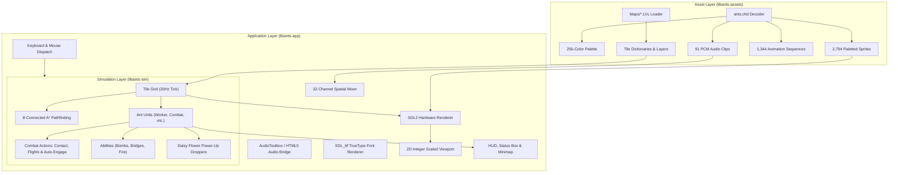

# Ants (1998) — Modern Cross-Platform Engine Remake

A faithful, high-performance, deterministic C++17 native engine remake and port of the 1998 classic real-time strategy game **Ants**.

The engine directly loads raw original binary assets (`ants.chd` and `Maps/*.LVL`) without pre-conversion, faithfully executing authentic gameplay mechanics, deterministic 20Hz simulation, 32-channel spatial audio, MIDI/MP3 score playback, TrueType font rendering, and an SDL2 hardware-accelerated 2D viewport.

---

## 🎮 Play in Browser (WebAssembly)

Play the remake instantly in any modern web browser (Chrome, Firefox, Safari, Edge) without installing anything:

👉 **[Play Ants Online at beta.playants.org](https://beta.playants.org)**

- **Authentic 1998 Asset Pipeline**: Full 8.1 MB archive (`ants.chd`, maps, and audio) packed into browser virtual memory.
- **Hardware-Accelerated 2D Viewport**: Pixel-crisp 4:3 display scaling with WebGL2 rendering.
- **32-Channel Spatial Sound & Soundtrack**: Authentic ant voice clips, explosions, and spatial SFX via Web Audio, with pre-rendered soundtrack streaming (`INTRO`, `ANTS2A`, `ANTS2B`, `ANTSFUN3`).
- **Interactive Asset Catalog**: Browse all 2,794 sprites, 91 sound effects, and 1,344 animation sequences at **[beta.playants.org/asset_catalog/](https://beta.playants.org/asset_catalog/)**.

---

## Highlights & Implemented Systems

- **Direct Binary Asset Pipeline (`libants-assets`)**:
  - Runtime parser for `Original-Ants/ants.chd` (header, 256-color palette, 2,794 raw paletted sprite bitmaps, 91 PCM audio clips, and 1,344 animation sequences).
  - Runtime parser for `Original-Ants/Maps/*.LVL` (header duration, tile dictionaries, terrain layers, items, and player spawn coordinates).
  - On-the-fly 5-to-8 directional sprite mirroring for $O(1)$ directional lookups.
  - Zero external conversion tools or pre-processing needed.

- **Deterministic 20Hz Simulation Engine (`libants-sim`)**:
  - Discrete tick simulation matching authentic timing and movement rules (50 ms per tick).
  - Authentic unit types: **Worker**, **Combat**, **Fire**, **Bomber**, **Swimmer**, and **Thief** ants.
  - Authentic map duration parsing directly from `.LVL` binary headers (e.g. 6 min for `TINY`, 8 min for `SMALL`, 10 min for `MEDIUM`/`GAUNTLET`, 12 min for `ISLANDS`/`TREASURE`).
  - **8-Connected Diagonal Pathfinding**: Evaluates all 8 directions with authentic diagonal cost scaling ($\sqrt{2} \approx 1.414$), navigating intentional diagonal map chokepoints.
  - **Food Objects & Harvest**: A food pile is an object of the map (LVL Block 2: anchor, units, points per unit and a list of stage tiles whose 2 x 2 or 4 x 4 cells are solid for walkers, so paths avoid them). An ant only harvests when ordered onto the pile: it walks up to it, plays the `?gf` grab clip (action 5), and when the clip ends one unit is taken (the pile shows its next stage or disappears), the ant carries the points of one unit, "Got Food!" is posted and it heads for its hill; after the deposit it walks back to the pile. Two ants that begin on the last unit both get food, a lunchbox dropped by a dead carrier is a food object of one unit, and an ant that already carries food answers "Can't - already have food.".
  - **Power-Up Lifecycle & Droppers**:
    - An ant takes a power-up only when its walk ends on the power-up's tile (never from a distance): the type changes at once, the 770 ms `getpow` clip (action 4) plays with sounds 1 and 2, hit points stay, and an old power-up is dropped on a free neighbour tile (West twice as likely). An order given while the ant is crossing into the tile cancels the pick-up: the ant stands on the power-up and cannot be attacked (power-ups are solid obstacles for paths, attacks and knock-backs).
    - Daisy flower droppers (`flower1`, Anim 421) on maps like `SMALL.LVL` and `GAUNTLET.LVL` drop power-ups via 9-frame falling droplet animations (`FD_*`) with sound 62 (`powerdrip.wav`) based on authentic Block 4 waypoint intervals (15s on Small, 30s on Gauntlet) and weighted class probabilities.
  - **Special Abilities**:
    - **Bomber**: Plant mines (28-tick sequence); defuse friendly mines on single-click; detonate friendly mines on multi/shift-select to launch units across water gaps.
    - **Fire**: Ignite firewalls (40-tick cooldown); immune to flame; extinguish fire hazards.
    - **Swimmer**: Build and multi-stage demolish bridges; underwater immunity to melee damage; continuous bobbing/snorkeling animations.
    - **Thief**: Infiltrate enemy anthills, steal up to 50 score points, trigger alarm sirens (`underattack.wav`), and drop lunchboxes on defeat.
  - **Anthill Enter, Heal, Hatch & Raid**: An ant that reaches its hill's entrance plays the original enter clip (`?h0` / `h?h0`); its food scores and its health is restored when the clip ends, wounded ants take `(10 - hp) * 200` ms longer, and ants wait on a ring in front of the hill until the waiting-queue task (ANTHILLQ, every 200 ms) admits them one by one. An egg hatches 8 s after the click into a worker that plays `aghatch` with sound 43 (`exithill.wav`); a thief raid plays `atcr501` for 3.5 s and moves up to 50 points when it ends.
  - **Status Line & Messages**: The one-line status box under the unit card is a single slot (Ants.exe `PostStatus`): a new message replaces the old one, lives 5 s, and the six flashing ones (already carrying food, 1 minute / 30 seconds / 10 seconds left, a ThiefAnt at your anthill, a team made) flicker for 500 ms first. Selecting ants posts "Ready!", "BomberAnt selected.", "Where to?", "Thief here", "Yessir!" or "SwimmerAnt selected." (string 12 for a group), orders answer with the ant's voice and "On my way." / "Movin' out." / "Here I go..." / "Attack!" / "My pleasure..." / "Burn...", Stop posts "Stopping.", and nothing is shown while idle. The match clock is checked every 200 ms like the original's CHECKGO task: warnings at 1:00, 0:30 and eleven countdown steps from 0:10, and the match ends within 200 ms after 0:00.
  - **Alliance Texts & Chat Log**: Teaming up follows the original's protocol: the invitee gets the question and the allypro cue, the proposer reads "%s accepted teaming up" / "%s rejected teaming up" (or the invitee "%s withdrew offer to team up"), a team that is made flashes "A team has been made." and writes the News Flash "%s (%s) and %s (%s) are a team now!" into the chat log (breaking it writes "... are no longer a team!"), and a drop-out writes "%s dropped out of the game!". The chat log keeps the original's entries: a header in the sender's team colour ("Name:" or "Name (To Teammate):", "[m:ss] News Flash:" for news) and a body of up to 100 characters wrapped and indented; chat needs the "Participate In Chat" option, F9 - F12 chat the quick-chat texts to everybody, and a team message reaches only the sender and the sender's allies.
  - **Edge Scrolling & Minimap**: The view scrolls like the original's input task (every 50 ms): the eight 12 px edge strips show the scroll arrows, only the 5 px inner strips scroll, the step is `scroll rate + 10` px around the target point of the pointer (about 55 - 60 px per tick at the default rate, 120 - 200 px/s at the slowest and 2100 px/s at the fastest setting), a strip that cannot move shows no arrow, and dialogs or a captured button stop it. Holding the left button on the minimap centres the view on the point under the pointer; nothing scrolls with the keyboard or the wheel.
  - **Pointer & Commands**: The cursor mode decides what a click does, exactly as in the original: over an ant the ant is picked with the original's sprite boxes (a 3 x 3 tile scan, the last box wins, no filters), other players' ants - allies too - give the attack cursor, food the food cursor, your own hill and the fog the move cursor, and a valid special target (a bomb for a bomber, an enemy hill for a thief, or with the ability pedestal latched: plantable ground, a fire wall, water or a bridge) the target cursor. A left drag of at most 4 px is a click at the release point, a bigger one is the red 1 px rubber band that selects your ants by positive-area overlap (Shift adds to a selection of your ants); the right button gives its order at the release, at the tile of the press point. The Move and ability pedestals only latch (a visual state that removes the band or turns valid tiles into targets and pops up after an accepted order), Stop stops the ants, locks the mouse for 250 ms and then deselects, the hatch pedestal exists only while eggs remain and the ally pedestal only with more than two players.
  - **Keyboard, Buttons & Chat**: The keyboard is the original's: F1, F9 - F12, Enter, Esc = deselect, Ctrl+A / H / L / N / O / P / Q / S and nothing else (no Space, arrow or letter hotkeys); the chat box is always active and Enter / All / Team send its text; the top bar and chat buttons behave like the original's button class (a press captures, the click sound plays at the press, the action runs when the button is released while the pointer is still on it, leaving cancels it).
  - **Enemy Ant Inspection**: Clicking enemy units when no friendly unit is selected shows selection brackets (`*ears`, coloured by health) without allowing friendly command dispatch.
  - **Match Audio Cues**: 1-minute alert (`onemin.wav`), 30-second warning (`thirtysec.wav`), 10-second countdown clicks (`countdown.wav`), defeat fanfare (`losers.wav`), and player drop-out (`playerout.wav`).

- **Modern Audio & Presentation (`libants-app`)**:
  - Hardware-accelerated SDL2 renderer with integer scaling, crisp pixel filtering, and authentic 4:3 viewport preservation.
  - Embedded TrueType font rendering (`Original-Ants/Arial.ttf`) for smooth ant names, news alerts, and chat messages.
  - 32-channel spatial sound mixer for positional sound effects (stereo panning and logarithmic distance attenuation).
  - Native AudioToolbox MIDI playback on macOS and HTML5 audio streaming on WebAssembly.
  - Interactive HUD with minimap, selection cards, egg count, health-coloured selection ears, and recessed news status box (`wstatus.bmp`).

- **Interactive Asset Catalog & Inspector**:
  - Standalone web inspector (`asset_catalog/index.html`) with responsive design, searching, filtering, and instant asset downloads (⬇ WAV audio, ⬇ PNG sprites, ⬇ composite canvas frames).

- **Automated Verification & Zero-Warning Standard**:
  - 100% pass rate across **188 integration tests (6,516 assertions)**, the hill-action, combat-action and ability-action golden tests and **506 opaque-box End-to-End (E2E) verification tests**.
  - Strict compilation under `-Wall -Wextra -Werror -Wsign-conversion`.

---

## Current Status & Roadmap

The remake provides a complete, playable, standalone experience with authentic assets, deterministic simulation, and cross-platform builds. Active work continues to refine 1:1 behavioral parity against the original 1998 binary:

| System / Area | Status | Notes & Active Focus |
|---|---|---|
| **Asset Decoding (`.chd`, `.lvl`)** | ✅ Complete | Full palette, sprite, animation, sound, and map parsing. |
| **Audio Engine (SFX & Music)** | ✅ Complete | 32-channel spatial mixer, MIDI on macOS, HTML5 audio bridge on Web. |
| **Renderer & Viewport** | ✅ Complete | SDL2 hardware renderer, 4:3 integer scaling, TrueType font rendering. |
| **HUD & Interface** | ✅ Complete | Recessed status news box, chat overlay, minimap, team switching. |
| **WebAssembly & Cloud Beta** | ✅ Complete | Docker containerized deployment at `beta.playants.org`. |
| **Unit Movement & Locomotion** | 🟡 Active Calibration | 8-directional pathfinding, corner traversal, and base queuing are implemented; ongoing tuning for crowded group steering, ant collision nudging, and diagonal slip feel. |
| **Abilities: Bombs, Fire & Bridges** | 🟢 Original Action Model | Plant, defuse, ignite, extinguish, bridge build and demolish as the original's action clips: invisible solid placeholder, effects at the end of the clip, cancel by melee or stun, sounds from the clip frames. |
| **Combat, Knockback & Collisions** | 🟢 Original Action Model | Ported from the 1998 binary: contact when a step crosses into the target tile, hit points lost at contact, strike frame, `gh` / `gb` flights with the original landing rules, pile-up dispersal (with the dust cloud of other teams' pile-ups), fire and water landings, bomb victims and duds, stun, deferred death and removal effects, and the combat ant auto-engage; flights are drawn at the frame the original's real-time player shows. |
| **Multiplayer Networking** | 📋 Planned | Deterministic lockstep protocol over WebSockets / UDP. |

---

## Directory Structure

```text
Ants-Mac/
├── asset_catalog/          # Interactive web-based asset catalog and sprite/audio inspector
│   ├── index.html          # Browser application for asset inspection
│   ├── catalog_data.js     # Indexed metadata for sprites, audio clips, and animations
│   ├── sounds/             # Decoded 91 authentic WAV sound effects (IDs 0..90)
│   └── sprites/            # Decoded 2,794 paletted PNG sprites (IDs 0..2793)
├── docker/                 # Container deployment configuration
│   └── nginx.conf          # Nginx server config with caching, CORS, and WASM headers
├── docs/                   # Reverse-engineering documentation and specifications
│   ├── GAME_REVERSE_ENGINEERING.md  # Comprehensive technical mechanics reference
│   └── BUILD_AND_RUN.md             # Native and Docker build/run instructions
├── include/                # Public C++ headers
│   ├── ants_assets/        # Archive decoders, map loaders, sprite/sound structs
│   ├── ants_sim/           # Simulation engine, grid topology, ant units, action system (hill, combat)
│   └── ants_app/           # SDL2 application, renderer, HUD, audio mixer, MIDI
├── Original-Ants/          # Authentic 1998 game data
│   ├── ants.chd            # Packed binary sprites, audio, palettes, animations
│   ├── Arial.ttf           # Authentic TrueType font
│   ├── *.mp3 / *.MID       # Soundtrack audio files
│   └── Maps/               # Binary .LVL maps (Treasure, Small, Rivers, Islands, etc.)
├── src/                    # Implementation source code
│   ├── ants_assets/        # Asset decompression, palette mapping, mirroring
│   ├── ants_sim/           # Tick loop, pathfinding (A*), locomotion + action clips, combat system
│   └── ants_app/           # Windowing, input handling, viewport camera, rendering
├── tests/                  # Automated verification test suites
│   ├── e2e/                # Standalone 506-test opaque-box E2E test runner
│   ├── test_assets/        # Binary asset parsing unit tests
│   ├── test_sim/           # Simulation rule validation and challenger tests
│   └── test_app/           # Application integration tests (125 tests across 12 suites)
├── web/                    # WebAssembly shell, splash overlay, and web styles
├── CMakeLists.txt          # Root CMake build configuration
├── docker-compose.yml      # Service definition for beta.playants.org
├── Dockerfile              # Multi-stage Emscripten + Nginx build
├── run_tests.sh            # Master test suite runner script
└── start_game.sh           # One-click build and launch script
```

---

## Prerequisites & Dependencies

### macOS
Install the required tools and libraries via [Homebrew](https://brew.sh/):

```bash
brew install cmake sdl2 sdl2_ttf
```

- **Compiler**: Clang supporting C++17 (Xcode Command Line Tools: `xcode-select --install`).
- **Audio**: Built-in macOS AudioToolbox framework is used for MIDI playback (zero extra soundfont packages required).

### Linux
```bash
sudo apt-get update && sudo apt-get install -y cmake g++ libsdl2-dev libsdl2-ttf-dev
```

---

## Building and Running Locally

### Quick Launch (Desktop)
To automatically build and launch the native desktop game in one step:

```bash
./start_game.sh
```

### Manual CMake Build

1. Configure CMake in release mode:
   ```bash
   cmake -B build -DCMAKE_BUILD_TYPE=Release
   ```

2. Compile the project with all CPU cores:
   ```bash
   cmake --build build -j"$(sysctl -n hw.ncpu || nproc)"
   ```

3. Launch the game executable:
   ```bash
   ./build/src/ants_app/ants
   ```

### Running with AddressSanitizer (ASan)
```bash
cmake -B build_asan -DCMAKE_BUILD_TYPE=Debug -DENABLE_ASAN=ON
cmake --build build_asan -j8
./build_asan/src/ants_app/ants
```

---

## Self-Hosting with Docker (`beta.playants.org`)

To build and run the high-performance container on your Docker server:

```bash
# Build and launch with Docker Compose
docker compose up -d --build

# Or build and launch with Docker directly
docker build -t ants-beta .
docker run -d -p 19980:80 --name ants-beta ants-beta
```

### Building the Web Port Locally
```bash
./build_web.sh
python3 -m http.server 8080 -d dist
# Open http://localhost:8080
```

---

## Controls & Hotkeys

### Battlefield Selection Screen
- **Up / Down / Number Keys `1`–`6`**: Highlight map (Treasure, Small, Rivers, Islands, Large, Great Divide).
- **Double Click / Enter / `START GAME` Button**: Launch match.
- **Soundtrack**: Loops during map selection and stops or transitions when the match begins.

### Mouse Controls
| Action | Trigger | Description |
|---|---|---|
| **Select Friendly Ant** | Left Click on Friendly Ant | Selects a single ant unit (Shift adds it to / removes it from a selection of your ants). |
| **Inspect Enemy Ant** | Left Click on Enemy Ant | When no friendly unit is selected (or a hill or another ant is inspected), selects the ant to view its selection brackets. |
| **Move Order** | Left Click on Terrain | Issues move order to selected ant(s). Intermediate food tiles are avoided. |
| **Harvest Order** | Left Click on Food Morsel | Instructs ant to harvest food item and return it to base. |
| **Attack Order** | Left Click on Another Player's Ant | With your ants selected: orders them to engage the ant (the original's group order: ants that already attack that ant are skipped, the nearest one answers; the clickable area is the original's sprite box; allies show the attack cursor too). |
| **Marquee Selection** | Left Click & Drag ($>4\text{px}$ in either direction) | Selects your ants whose sprite box overlaps the red band (a shorter drag is a click at the release point; dragging over nothing deselects). |
| **Minimap Navigation** | Hold Left Button on Minimap | The view follows the point under the pointer while the button is held (every 50 ms); a right click on the minimap orders the selected ants there. |
| **Special Ability** | Right Click on Field (at the release) | A move for several ants, workers, combat ants and mixed groups, otherwise the ability of the single ant's type; or latch the ability pedestal and left-click a valid target: |
| | | • **Bomber**: Plant mine / defuse existing friendly mine. |
| | | • **Fire Ant**: Ignite firewall / extinguish blaze. |
| | | • **Swimmer**: Dig bridge on water / demolish existing bridge. |
| | | • **Thief**: Infiltrate enemy anthill. |
| **Bomb Hit (Jump)** | Click on a Friendly Bomb with Several Ants Selected | The move click sends the first ant onto the bomb, which sets it off (a single bomber defuses it instead). |

### Team Switching & Testing Shortcuts
| Key | Function |
|---|---|
| **`Ctrl + 1` / `⌘1`** | Switch to Team 0 (Green Ants). |
| **`Ctrl + 2` / `⌘2`** | Switch to Team 1 (Red Ants). |
| **`Ctrl + 3` / `⌘3`** | Switch to Team 2 (Blue Ants). |
| **`Ctrl + 4` / `⌘4`** | Switch to Team 3 (Black Ants). |
| **`Ctrl + Tab` / `Ctrl + C`** | Cycle control to the next available team. |

### Camera & Hotkeys (the original's keyboard, Ants.exe `FUN_0102609a`)
| Key | Function |
|---|---|
| **Edge Scrolling** | Move the cursor to the edge: the arrow shows within 12 px, the view scrolls within the 5 px inner strip (every 50 ms; nothing scrolls with the keyboard or the wheel). |
| **Typing** | The chat box is always active (while "Participate In Chat" is on): printable keys and Backspace go into it, **`Enter`** sends the text (to your team when you have an ally, else to everybody); the **[All]** / **[Team]** buttons send it to everybody / your team. |
| **`F9` – `F12`** | Send the four quick chat texts (fresh key presses only, chat on). |
| **`F1`** | Quick help (`C`, `X`, `Enter` or `Esc` close it). |
| **`Esc`** | Deselect everything (there is no quit dialog on Esc). |
| **`Ctrl + A`** | Select all your ants (panel 3 for one, 4 for several, the voice of the first). |
| **`Ctrl + H`** | Select your home anthill (no hatching, no scrolling). |
| **`Ctrl + N` / `Ctrl + P`** | Select the next / previous ant (from the lowest selected one) and scroll just far enough to show it. |
| **`Ctrl + S`** | Stop the selected ants (no flash, no lock, no deselect). |
| **`Ctrl + O` / `Ctrl + Q`** | Options / quit dialog (quit dialog: `Y` yes, `N` or `Esc` no). |
| **`Ctrl + L`** | Show every ant's hit points as white numbers. |
| *Developer shortcuts (not in the original)* | `Ctrl + T` / `F3` tile grid, `Ctrl + M` music mute, `Ctrl + 1..4` / `Ctrl + Tab` switch the controlled team, `Shift + F12` screenshot. |

---

## Testing & Verification

The project enforces strict regression guarantees with automated test suites spanning decoders, simulation rules, application integration, and opaque-box end-to-end scenarios.

### Master Test Suite
To run all test suites in sequence:

```bash
./run_tests.sh
```

### Running Specific Suites
```bash
./run_tests.sh --assets   # Raw asset decoder unit tests (test_assets)
./run_tests.sh --sim      # Simulation rules & challenger tests (test_sim_rules)
./run_tests.sh --app      # Application integration tests (125 tests across 12 suites)
./run_tests.sh --e2e      # Opaque-box E2E test runner (506 tests across 4 tiers)
./run_tests.sh --asan     # Rebuild and run with AddressSanitizer
```

### Standalone E2E Test Runner
The E2E test suite validates all 49 game features across 4 tiers:
```bash
# Build standalone E2E runner
cmake -S tests/e2e -B build_e2e
cmake --build build_e2e

# Run all 506 tests
./build_e2e/e2e_runner --all

# Run specific tiers
./build_e2e/e2e_runner --tier 1   # Tier 1: Feature Coverage (245 tests)
./build_e2e/e2e_runner --tier 2   # Tier 2: Boundary & Corner Cases (245 tests)
./build_e2e/e2e_runner --tier 3   # Tier 3: Cross-Feature Pairwise (10 tests)
./build_e2e/e2e_runner --tier 4   # Tier 4: Real-World Workloads (6 full matches)
```

---

## Asset Catalog & Inspector

The repository includes a web-based inspector to inspect and preview all authentic assets extracted from `ants.chd`:

- **Sprites**: 2,794 paletted PNGs with zoom levels (1x, 2x, 3x, 4x), bounding boxes, registration origins, background styles, and one-click PNG downloads.
- **Audio Clips**: 91 WAV sound effects with wave previews, instant audio playback, and WAV downloads.
- **Animations**: 1,344 animation sequences with frame-accurate multi-subitem compositing, timing, frame sound triggers, and composite PNG frame export.

### Launching the Inspector
Simply open the HTML file in your browser:

```bash
open asset_catalog/index.html
```

Or visit the online version at **[beta.playants.org/asset_catalog/](https://beta.playants.org/asset_catalog/)**.

---

## Architecture Overview


```mermaid
flowchart TD
    subgraph Assets ["Asset Layer (libants-assets)"]
        CHD["ants.chd Decoder"] --> Palette["256-Color Palette"]
        CHD --> Sprites["2,794 Paletted Sprites"]
        CHD --> Sounds["91 PCM Audio Clips"]
        CHD --> Anims["1,344 Animation Sequences"]
        LVL["Maps/*.LVL Loader"] --> MapData["Tile Dictionaries & Layers"]
    end

    subgraph Sim ["Simulation Layer (libants-sim)"]
        MapData --> Grid["Tile Grid (20Hz Tick)"]
        Grid --> Path["8-Connected A* Pathfinding"]
        Grid --> Units["Ant Units (Worker, Combat, etc.)"]
        Units --> CombatAI["Combat Actions: Contact, Flights & Auto-Engage"]
        Units --> Abilities["Abilities (Bombs, Bridges, Fire)"]
        Units --> Droppers["Daisy Flower Power-Up Droppers"]
    end

    subgraph App ["Application Layer (libants-app)"]
        Sprites --> Renderer["SDL2 Hardware Renderer"]
        Grid --> Renderer
        Sounds --> AudioMixer["32-Channel Spatial Mixer"]
        MIDI["AudioToolbox / HTML5 Audio Bridge"]
        TTF["SDL_ttf TrueType Font Renderer"]
        Renderer --> Viewport["2D Integer Scaled Viewport"]
        Units --> HUD["HUD, Status Box & Minimap"]
        Input["Keyboard & Mouse Dispatch"] --> Sim
    end
```

---

## Reverse Engineering & Historical Preservation

This project is a clean-room educational remake and historical preservation effort. All mechanics, timings, and constants are reverse-engineered directly from the original 1998 binary executable (`Ants.exe`) using Capstone disassembly to achieve authentic 1:1 fidelity.

Comprehensive disassembly addresses, opcode traces, and formulas are actively documented in **[`docs/GAME_REVERSE_ENGINEERING.md`](docs/GAME_REVERSE_ENGINEERING.md)**. All original game assets belong to their respective copyright holders.
