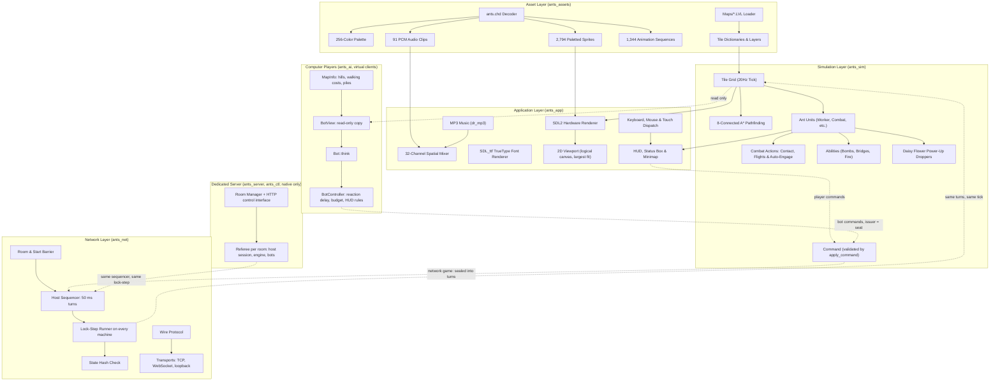

# Architecture and source tree

Where everything is in the repository, and how the code fits together. The game is a set of C++17 libraries (assets, simulation, network, computer players, control interface, dedicated server, application); the tree says what each folder holds, and the diagram shows how a command travels through the layers.

## Directory Structure

The root folder is `ants-cross-platform/`. A comment says what a folder or file is for; the file's own header comment says the rest. Counts of files and tests are not kept here, because they go stale; `./run_tests.sh` prints the tests' own.

```text
ants-cross-platform/
├── asset_catalog/                      # Interactive web-based asset catalog and sprite / sound inspector
│                                       # (ASSET_CATALOG.md)
│   ├── index.html                      # Browser application for asset inspection
│   ├── catalog_data.js                 # Indexed metadata for sprites, audio clips, and animations
│   ├── sounds/                         # Decoded 91 WAV sound effects (IDs 0..90)
│   └── sprites/                        # Decoded 2,794 RGBA PNG sprites (IDs 0..2793)
├── cmake/                              # CMake helper scripts
│   ├── ants_stamp_build_id.cmake       # Writes the build id (the short git commit, or a given id) into
│   │                                   # ants::BUILD_ID at every build
│   └── ants_test_paths.cpp.in          # Template of the generated file that tells the tests where the checkout is
├── docker/                             # Container deployment configuration
│   ├── nginx.conf                      # nginx of the web image: game files revalidated (ETag, 304), cross-origin and
│   │                                   # WASM headers, routes to the game server
│   └── resolve_build_id.sh             # The build id of a Docker image build (a build argument, else the clone's git
│                                       # files, else the build time)
├── docs/                               # Guides, specifications and design notes
│   ├── PLAY_IN_BROWSER.md              # The web build as a player sees it: the front page, playing online and
│   │                                   # rejoining, sound, hidden tabs, the 16:9 picture
│   ├── GAMEPLAY.md                     # How the game plays: the data, the ants, movement, food, power-ups,
│   │                                   # abilities, combat, hills, end of match, fog
│   ├── CONTROLS.md                     # Start menu, setup screen, options, settings, mouse, touch, keyboard
│   ├── VIEW_AND_HUD.md                 # The picture, the view, zoom, the HUD, messages, results screen, audio
│   ├── TOUCH.md                        # Touch controls: what a finger does and how the model turns it into mouse
│   │                                   # events
│   ├── COMMAND_LINE.md                 # Every option of ants and the environment variables
│   ├── BUILD_AND_RUN.md                # Prerequisites, building (desktop and web), running, AddressSanitizer, the
│   │                                   # build id, Docker
│   ├── MULTIPLAYER.md                  # Network play and bots: a LAN, the game server and the browser, how a match
│   │                                   # runs, limits, the bots
│   ├── SERVER.md                       # The dedicated server: starting it, rooms, the control interface, public
│   │                                   # status, restart records, the Docker stack
│   ├── ASSET_CATALOG.md                # The asset catalog and inspector
│   ├── TESTING.md                      # Testing and CI
│   ├── ARCHITECTURE.md                 # This page: the source tree and the layers
│   ├── NETWORK_PORT.md                 # The network design in full: the original's network, the lock-step core,
│   │                                   # transports, the protocol by version, host migration, reconnect,
│   │                                   # measurements, milestones
│   ├── BOTS.md                         # Bots (computer players): the rule, fairness, architecture, difficulty
│   │                                   # levels, the standard bot, measurements, known limits
│   ├── WORKFLOW.md                     # How work flows: the three test tiers, branches and releases, the deploy, the
│   │                                   # version policy, the changelog template
│   ├── GAME_REVERSE_ENGINEERING.md     # The mechanics reference (ground truth per system)
│   ├── ORIGINAL_PROGRAM.md             # How the remake is tied to the original: what comes from it, where your own
│   │                                   # copy of the program goes, the tools and tests that read it
│   ├── CHANGELOG_ARCHIVE.md            # The detailed history of every release up to v0.1.0 (frozen; the short
│   │                                   # changelog is CHANGELOG.md)
│   ├── AUDIT_ONE_TO_ONE.md             # Audit of the whole game against the original, with the ranked list of
│   │                                   # differences
│   ├── audit/                          # One ledger per area of the audit, and the notes of the later work (bots, the
│   │                                   # view, restart records, rollback, site statistics, the front page)
│   ├── replays/                        # The design of replays and of watching bots (design only: not built)
│   ├── ORIGINAL_BINARY_MAP.md          # Function map of Ants.exe (generated by tools/analyze_binary.py)
│   ├── binary_analysis.json            # The same map as JSON (generated by tools/analyze_binary.py)
│   ├── TABLE4_ANIMATION_REFERENCE.md   # Animation table reference (generated by tools/dump_table4.py)
│   ├── chd_table4_animations.json      # Table 4 animations of ants.chd (generated by tools/dump_table4.py)
│   └── reverse_engineering/            # Verified reports on the original's ant movement (movement/)
├── include/                            # Public C++ headers
│   ├── ants_assets/                    # Archive and map readers, sprite and sound structs, mirroring, object
│   │                                   # footprints
│   ├── ants_sim/                       # Simulation engine, grid, ant units, command layer, state hash, the
│   │                                   # original's texts and movement tables
│   ├── ants_net/                       # Lock-step protocol, sequencer, runner, sessions, room, prediction, jitter
│   │                                   # buffer, the reconnect rules (turn log, attendance), TCP / WebSocket /
│   │                                   # loopback transports, LAN discovery
│   ├── ants_ai/                        # Computer players: Bot interface, view, map analysis, controller (budget,
│   │                                   # timing, HUD rules), idle bot, task model, worker bot, the standard bot
│   │                                   # (tasks, tactics, styles, teams), match runner, baselines
│   ├── ants_ctl/                       # Strict JSON and the authenticated HTTP server of the game server's control
│   │                                   # interface
│   ├── ants_server/                    # The dedicated server: map store, rooms, the door, control calls, restart
│   │                                   # records, site statistics
│   └── ants_app/                       # SDL2 application, renderer, HUD, audio mixer, MIDI, FPS overlay (and its
│                                       # ping / delay readout), start menu, touch controls, zoom, the MP3 decoder
│                                       # (dr_mp3.h), the version template (version.hpp.in: the build generates
│                                       # version.hpp from the file VERSION)
├── Original-Ants/                      # The data files that the game reads: the original's archive, maps and MIDI
│                                       # music, MP3 renders of that music, and a font (no program: see
│                                       # ORIGINAL_PROGRAM.md)
│   ├── ants.chd                        # The original's archive: sprites, sounds, palette, animations
│   ├── LibreFranklin-Medium.ttf        # Bundled text font, not from the original (Libre Franklin, SIL Open Font
│   │                                   # License)
│   ├── LibreFranklin-OFL.txt           # The licence of that font
│   ├── *.MID                           # The four pieces of music, as MIDI files
│   ├── *.mp3                           # MP3 renders of the four pieces: the game plays these
│   └── Maps/                           # Binary .LVL maps: the six of the original; every .lvl in this folder is
│                                       # listed on the setup screen
├── src/                                # Implementation source code
│   ├── ants_assets/                    # Reading ants.chd (header, palette, sprite, sound and animation tables) and
│   │                                   # the .LVL maps, palette mapping, mirroring
│   ├── ants_sim/                       # Tick loop, PATHMGR A*, locomotion and action clips, combat, abilities,
│   │                                   # commands, state hash
│   ├── ants_net/                       # Network core (no threads, non-blocking sockets; the one call that can
│   │                                   # block is the name lookup in tcp.cpp, which the start menu runs on a worker thread
│   │                                   # and `ants --join NAME` on the game's own thread), TCP and LAN discovery, the
│   │                                   # WebSocket server (native) and the browser's WebSocket client (web)
│   ├── ants_ai/                        # Computer players (virtual clients; no SDL, no sockets, no threads)
│   ├── ants_ctl/                       # JSON library and HTTP server with a bearer secret
│   ├── ants_server/                    # ants_server: the dedicated game server program (main.cpp; the rest is the
│   │                                   # library ants_server_core)
│   └── ants_app/                       # The program ants: windowing, input (mouse, keyboard, touch), the map view,
│                                       # rendering, HUD, audio, the start menu, setup, options and results screens
├── tests/                              # Automated verification test suites
│   ├── common/                         # Shared test code: where the checkout is (ants_test_paths.hpp) and the pinned
│   │                                   # SHA-256 digests of the bytes of Ants.exe that suites 1.1 and 2.15 read
│   │                                   # (original_program_bytes.hpp)
│   ├── e2e/                            # Standalone opaque-box E2E test runner
│   ├── test_assets/                    # Binary asset parsing and movement-table parity tests
│   ├── test_sim/                       # Simulation rules, golden action suites, movement and pathfinding, command
│   │                                   # layer / state hash
│   ├── test_net/                       # Lock-step core, room, jitter buffer, prediction, TCP, WebSocket, LAN
│   │                                   # discovery and NetGame suites
│   ├── test_ai/                        # Computer players: the controller, the idle bot, bot seats in rooms, the
│   │                                   # view, the map analysis, the match runner; the worker bot and its pinned
│   │                                   # baselines; the standard bot (power-ups, walls, fights, raids, the gate,
│   │                                   # styles, teams, the contest play, the island play, the order of the
│   │                                   # tasks)
│   ├── test_ctl/                       # JSON library and control HTTP server suites
│   ├── test_server/                    # Dedicated server suite (map store, rooms, the door, control calls, site
│   │                                   # statistics) and the way back of the game's NetGame (test_rejoin)
│   ├── test_app/                       # Application integration, render parity, HUD, status line, input, pointer,
│   │                                   # options, start menu, touch, zoom and widescreen suites
│   ├── scripts/                        # Shell and python suites; the test_web_*.sh scripts are opt-in browser checks
│   │                                   # of the web build (not part of run_tests.sh)
│   │   ├── test_start_game.sh          # The start script's dry run
│   │   ├── test_ants_server.sh         # The dedicated server end to end, with real programs
│   │   ├── flaky_proxy.py              # A TCP proxy that can be cut (for the server's reconnect checks)
│   │   ├── test_*.py                   # The python tests of the repository's tools and tiers (changelog pages,
│   │   │                               # version tools, run_tests.sh --fast, CI workflow, nginx, deploy, release,
│   │   │                               # mutation, staging, the web pages)
│   │   ├── run_python_tests.py         # Runs those python tests side by side
│   │   ├── process_state.py            # Helper: whether a process still runs
│   │   ├── stack_command.py            # Helper: the server's command in docker-compose.stack.yml
│   │   ├── test_web_aspect.sh          # The picture's shape (16:9, 4:3), the selector, fullscreen, the pointer
│   │   ├── test_web_edge.sh            # The pointer of a fullscreen page (the bars, the pointer lock), the margin of
│   │   │                               # a windowed one
│   │   ├── test_web_hidden.sh          # The game in a hidden browser tab
│   │   ├── test_web_home.sh            # The front page: Play, the Menu, the old addresses
│   │   ├── test_web_prediction.sh      # The prediction of one's own orders, on and off, in two windows of a real
│   │   │                               # browser
│   │   ├── test_web_rejoin.sh          # The way back to a running match in two browsers: a reload, a server restart,
│   │   │                               # the front page's Rejoin button
│   │   ├── test_web_touch.sh           # The touch controls (tap, hold, drag, two-finger pan and pinch) with a
│   │   │                               # phone-like and an iPhone-like browser
│   │   └── web_*_check.*               # Helpers of the web checks: the pages' own code run under node, and the
│   │                                   # browser drivers
│   ├── data/                           # Golden sample data (edge scrolling)
│   ├── TEST_INFRA.md                   # Design of the E2E suite (a model of the rules, see its status note)
│   └── TEST_READY.md                   # Status report of the E2E suite
├── tools/                              # Reverse-engineering, generator and release tools, and the headless programs
│                                       # that are built on request
│   ├── analyze_binary.py               # Capstone function map of Ants.exe (needs your own copy of the program)
│   ├── extract_movement_tables.py      # Movement tables from Ants.exe and ants.chd (needs your own copy of the
│   │                                   # program)
│   ├── movement_reference_model.py     # The golden movement timings (needs the same two files)
│   ├── dump_table4.py                  # Table 4 animations of ants.chd as JSON
│   ├── gen_food_footprints.cpp         # Writes src/ants_sim/food_footprints_data.inc from ants.chd
│   ├── map_sweep.cpp                   # The map sweep: plays every map of a folder headless (built on request:
│   │                                   # --target map_sweep)
│   ├── bot_arena.cpp                   # The bot arena: headless matches of computer players (built on request:
│   │                                   # --target bot_arena)
│   ├── bench_aggressor.hpp             # Scripted aggressor bots to measure the standard bot against (arena and tests
│   │                                   # only)
│   ├── changelog_to_html.py            # Turns CHANGELOG.md and docs/CHANGELOG_ARCHIVE.md into the site's
│   │                                   # /changelog.html and /changelog_archive.html
│   ├── check_version_consistency.py    # Checks that VERSION, CHANGELOG.md, STATUS.md and README.md name the same
│   │                                   # release
│   ├── release.py                      # A release in one command: VERSION, the changelog's "## Next" heading, the
│   │                                   # README and STATUS.md (--dry-run, --open-pr)
│   ├── mutate.py                       # The mutation runner of the deep tier: one change at a time, always restored,
│   │                                   # baselines of the unmutated tree
│   ├── deploy_filter.py                # Does a push change what the images contain or the stack file? (the deploy
│   │                                   # job's file filter)
│   ├── deploy_wait.py                  # Waits until the game server is idle (GET /busy) before the deploy job
│   │                                   # restarts the site
│   ├── web_without_docker.py           # The web image without Docker (Linux): the Dockerfile's commands on
│   │                                   # this machine, the pages served with nginx, for the browser checks
│   ├── deploy_webhook.sh               # Calls the Portainer deploy webhook without ever printing its address
│   └── front_page_art/                 # Makes the front page's pictures in web/front/ from the game's own assets
│                                       # (needs Pillow; a developer's tool, in no build or test)
├── web/                                # The web build's page files
│   ├── shell.html                      # The game page in the front page's look (WebAssembly shell: loading screen,
│   │                                   # hidden-tab timer, sound unlock, the picture's box, touch guards)
│   ├── lobby.html                      # The front page: one card (the seats, the invitations and START), a code
│   │                                   # to join, rejoin a running match
│   ├── front/                          # The front page's pictures (made by tools/front_page_art), its font Libre
│   │                                   # Franklin (SIL Open Font License, licence beside it) and classic.css, the
│   │                                   # look that the other pages link
│   ├── favicon.ico                     # Site icon
│   └── favicon.png                     # Site icon (PNG)
├── .github/
│   └── workflows/ci.yml                # Continuous integration (see TESTING.md)
├── .dockerignore                       # What stays out of the Docker build context
├── .editorconfig                       # Editor settings (UTF-8, LF, four spaces, no trailing blanks)
├── .gitattributes                      # Line endings of scripts, binary files, the original's data kept byte for
│                                       # byte
├── .gitignore                          # What stays out of the repository (build folders, local copies of the
│                                       # original program, per-user files)
├── README.md                           # The short front page; the details are in docs/
├── CHANGELOG.md                        # What changed in each release, a few lines each (also served at
│                                       # /changelog.html)
├── CMakeLists.txt                      # Root CMake build configuration
├── docker-compose.yml                  # The web game alone (service ants-beta); the whole site is
│                                       # docker-compose.stack.yml
├── docker-compose.server.yml           # Example service of the dedicated game server
├── docker-compose.stack.yml            # The web game and the game server together as one stack (Portainer,
│                                       # auto-deploy)
├── docker-compose.staging.yml          # The same two services as a second stack with its own names, ports, volumes
│                                       # and network, for trying finished work
├── Dockerfile                          # Multi-stage Emscripten + Nginx build
├── Dockerfile.server                   # The dedicated game server alone (no SDL, no sprites or sounds; it carries
│                                       # the six maps)
├── build_web.sh                        # Local WebAssembly build into dist/
├── run_tests.sh                        # Master test suite runner script
├── run_tests.bat                       # Windows runner (part of the suites only, see docs/BUILD_AND_RUN.md)
├── start_game.sh                       # One-click build and launch script (macOS / Linux)
├── start_game.bat                      # The same for Windows
├── LICENSE                             # MIT licence of the source code and the documents (the original's data is not
│                                       # covered)
├── STATUS.md                           # The project's status at a glance: the release schedule, the work under way,
│                                       # what is on hold, what was done recently
├── THIRD_PARTY_NOTICES.md              # Third-party code and fonts in the repository or linked by the build, with
│                                       # their licences
├── VERSION                             # The one place the version is written (one line, MAJOR.MINOR.PATCH); the
│                                       # build generates the C++ header from it
└── AGENTS.md                           # Project rules for contributors and coding agents
```

- The six maps in `Original-Ants/Maps/` are the original's ([`GAME_REVERSE_ENGINEERING.md`](GAME_REVERSE_ENGINEERING.md) section 4: TREASURE, GAUNTLET, ISLANDS, MEDIUM, SMALL and TINY).
- The original program (`Ants.exe`) and its decompilation are not in the repository: [`ORIGINAL_PROGRAM.md`](ORIGINAL_PROGRAM.md) says where a local copy goes and which tools and tests use it.

## Architecture Overview

The code is split into seven layers: `ants_assets`, `ants_sim`, `ants_net`, `ants_ai`, `ants_ctl`, `ants_server` and `ants_app`. Each has its own folder in `include/` and `src/` and is built as a static library (`libants_<name>.a`, or `ants_<name>.lib` with MSVC; the server's is `libants_server_core.a`). A layer uses only the layers listed before it. Two programs sit on top: the game (`ants`, from `ants_app`) and the dedicated server (`ants_server`). `ants_ctl` and `ants_server` are native only; the web build compiles the other five layers with Emscripten.

A command is how a player or a bot changes the simulation. A local game applies it at once; in a network game the host's sequencer seals the commands of every 50 ms into a numbered turn, and every machine runs the same turns on the same tick. The state hash, reported every 20th turn (once a second), shows when a copy of the match goes its own way.



The big boxes are the layers. Solid arrows show what feeds what; dotted arrows are the links of a running match: commands going in, the same turns on every machine, a bot reading the world.

| Layer | What it holds | Where it runs |
|---|---|---|
| `ants_assets` | Readers for the archive `ants.chd` (palette, sprites, sounds, animations) and the `.LVL` maps, sprite mirroring | Everywhere |
| `ants_sim` | The simulation: the tile grid, ants, movement and pathfinding, combat, abilities, food, power-ups, the 20 Hz tick, the command layer (`Command`, `apply_command`) and the state hash | Everywhere |
| `ants_net` | Lock-step play: the protocol, the host's sequencer, the runner, sessions, the room before a match, prediction of one's own orders, the jitter buffer, the reconnect rules, LAN discovery; transports for TCP, WebSocket and in-memory tests | Everywhere. TCP, LAN discovery and the WebSocket server are native only; the browser's WebSocket client is web only |
| `ants_ai` | Computer players as virtual clients: view, map analysis, controller (reaction delay, command budget), task model, worker bot, standard bot, match runner. No SDL, no sockets, no threads | Everywhere: in the game and in the server's rooms |
| `ants_ctl` | Strict JSON and a small HTTP server with a bearer secret: the control interface of the game server | Native only |
| `ants_server` | The dedicated game server: map store, rooms (a referee per room that also runs the room's bots), the door, control calls, restart records, site statistics. The program `ants_server` is `main.cpp` plus the library `ants_server_core` | Native only |
| `ants_app` | The game: SDL2 window and main loop, renderer, HUD, audio mixer, start menu and the other screens, touch controls, zoom | Native and web |

Two small libraries sit beside them: `ants_version` (the generated `ants_app/version.hpp` and `ants::BUILD_ID`, linked by the game and the server) and `ants_test_paths` (where the checkout is, for tests and tools).

Where to read more:

- The turns, the sequencer, the runner and the sessions: [`NETWORK_PORT.md`](NETWORK_PORT.md#the-lock-step-core-srcants_net-v0044) ("The lock-step core"); network play for players: [`MULTIPLAYER.md`](MULTIPLAYER.md).
- The bots: [`BOTS.md`](BOTS.md#architecture) ("Architecture").
- The rules that `ants_sim` implements: [`GAMEPLAY.md`](GAMEPLAY.md); the original's mechanics, system by system: [`GAME_REVERSE_ENGINEERING.md`](GAME_REVERSE_ENGINEERING.md).
- The picture, the view and the HUD: [`VIEW_AND_HUD.md`](VIEW_AND_HUD.md).
- The dedicated server and its control interface: [`SERVER.md`](SERVER.md).
- The tests: `tests/` has one folder for each layer (see the tree above); [`TESTING.md`](TESTING.md) describes the suites by number, the three tiers and CI.
