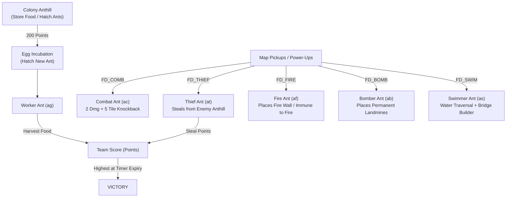

# Ants (1995/1998) - Complete Reverse Engineering Specification

> **Document Classification:** Engineering Specification & Reverse Engineering Ground Truth  
> **Target Deliverable:** Deterministic Cross-Platform C++17/SDL3 Native Engine Remake  
> **Source Artifacts:** `Original-Ants/Ants.exe` (PE32 x86), `Original-Ants/ants.chd`, `Original-Ants/Maps/*.LVL`  
> **Date:** September 2026

---

## 1. Executive Summary & Engine Architecture

**Ants** is an RTS / arcade-strategy game developed for Windows 95 and the MSN Gaming Zone (~1995-1998).
Players control colonies of ants in a top-down tile-based grid environment (typically 60×60 isometric/orthogonal cells). The objective is to command ants manually to collect food items scattered across the map, store them in the colony anthill, harass opponents, hatch new ants, and achieve the highest score before the match timer runs out.

### Key Gameplay Mechanics
- **Direct Manual Command:** Ants do not perform tasks automatically; the player selects ants and issues move, attack, harvest, and special ability orders.
- **Teams & Colors:** 4 player teams supported:
  - `0`: Black
  - `1`: Blue
  - `2`: Red
  - `3`: Green
- **Anthills & Hatching:**
  - Ants hatch from eggs at the colony anthill.
  - Hatching costs **200 points** from the team's current score.
  - Ants can die from combat damage, bomb blasts, and drowning.
  - If a team runs out of eggs or points, hatching is prohibited.
  - There is **no queen ant**; production is handled by the colony anthill.
- **Ant Classes & Power-Ups:**
  - **6 Ant Unit Types:**
  1. **Worker Ant (General Ant - `ag`):** Basic ant, gathers food pieces, attacks for 1 HP damage per hit.
  2. **Thief Ant (`at`):** Fast scout. Infiltrates enemy anthills and steals 50 points of food at a time; attacks for 1 HP damage per hit.
  3. **Fire Ant (`af`):** Immune to fire, creates fire walls with a magnifying glass (`wallup04`), extinguishes fires; attacks for 1 HP damage per hit.
  4. **Bomber Ant (`ab`):** Plants mines/bombs on the ground in team colors (bombs deal 2 HP explosive damage); direct melee strike attacks for 1 HP damage per hit. Can defuse enemy bombs.
  5. **Swimmer Ant (`as`):** Immune to drowning in water, swims, builds dirt bridges across water tiles with a shovel; attacks for 1 HP damage per hit.
  6. **Combat Ant (`ac`):** Buff warrior ant. The **only** ant type that deals 2 HP damage per strike (all other 5 ant types deal 1 HP per hit) and sends opponents flying backwards 4–5 tiles. Also the **only** ant type with autonomous AI guard behavior.

---

## 2. Reverse Engineering Findings (via Capstone & PE Analysis)

### 2.1 Binary Characteristics
- **Binary:** PE32 GUI Intel 80386 executable compiled with Visual C++ 4.x/5.0.
- **Base Address:** `0x01000000`
- **Sections:**
  - `.text`: `0x1001000` - `0x1046C00` (Code, constants, RTTI, vtables)
  - `.data`: `0x1047000` - `0x104B000` (Global states, player tables, strings)
  - `.rsrc`: `0x104D000` - `0x1050400` (Windows string tables, icons, dialogs)
- **Subsystems Used in 1995 Original:** DirectDraw (256-color paletted surfaces), DirectSound (8-bit/11-22kHz PCM), WinMM sequencer (`mciSendStringA`, `midiOutSetVolume`, `midiOutOpen`, `midiOutClose` for `INTRO.MID` playback and volume attenuation), WinSock 1.1 (multiplayer sessions).

### 2.2 Core Object Virtual Method Tables (VTables)
Through Capstone disassembly of object constructors, the following key class vtables were identified:
- `0x1004fe0`: CHD Archive & Stream IO Reader
- `0x1001fe0`: CHD Graphics / Sprite Resource Manager
- `0x1001ff0`: Sprite & Animation Sequence Object
- `0x1005028`: Animation Frame / Sub-Sequence Element
- `0x1002508`: Map & Level Manager (`MapManager`)
- `0x1004be0`: Core Ant Entity Class (`CAntUnit`)
- `0x1004b08`, `0x1004b50`, `0x1004b98`: Ant Special Ability & Sub-Handlers

### 2.3 Ant Entity State Layout (`CAntUnit` at `0x1004be0`)
- `+0x00`: VTable pointer (`0x1004be0`)
- `+0x08..+0x38`: Spatial bounding box and rendering coordinates
- `+0x44`: Active flag (byte)
- `+0x56`: Team ID (`uint16`: 0 = Black, 1 = Blue, 2 = Red, 3 = Green)
- `+0x58`: Ant Class Type (`uint16`):
  - `0`: General / Worker Ant
  - `1`: Bomber Ant
  - `2`: Combat Ant
  - `3`: Fire Ant
  - `4`: Swimmer Ant
  - `5`: Thief Ant
- `+0x5A`: Spawn position / home anthill vector
- `+0x74`: Current Health (`uint16`, max 10 HP; standard worker ant starts with 10 HP or proportional tier)
- `+0x76`: Current Animation State (`uint16`: Idle=7, Walking=2, Attacking=3, Ability=4)
- `+0x80`: Current target unit / interactive object pointer
- `+0x9C`: Action timer timestamp (`timeGetTime`)
- `+0xA8`: State machine state index
- `+0xE4`: Death status (`0xF` = drowned in water, other = died in combat)
- `+0xE8`: Held item pointer (null if carrying nothing; points to Food/Item object if harvested)

---

## 3. The `.CHD` Asset Container Specification

`ants.chd` (8,411,866 bytes) is the complete game data archive containing palettes, all 2,794 sprite frames, 91 sound effects, and 1,344 animation definitions.

### 3.1 Header (28 Bytes)
Located at offset `0x00000000`:
```c
struct CHDHeader {
    uint32_t version;          // 9 (0x00000009)
    uint32_t timestamp;        // 0x378d661c
    uint32_t table1_offset;    // 1052 (0x0000041c) -> Sprite Bitmaps Table
    uint32_t table2_offset;    // 6,835,937 (0x00684ee1) -> Sound Effects Table
    uint32_t table3_offset;    // 7,903,773 (0x00789a1d) -> Event Tag Descriptors
    uint32_t table4_offset;    // 7,903,835 (0x00789a5b) -> Animation Sequences Table
    uint32_t palette_bytes;    // 1024 (0x00000400)
};
```

### 3.2 Master 256-Color Palette (`0x0000001C` - `0x0000041C`)
- 256 entries × 4 bytes (`PALETTEENTRY` format: `byte 0 = Red`, `byte 1 = Green`, `byte 2 = Blue`, `byte 3 = Flags`).
  > [!NOTE]
  > **Color Channel Order:** The file stores `[R, G, B, Flags]`. Swapping byte 0 and 2 causes red/blue channel reversal (e.g. turning red bombs into blue bombs and terracotta clay into cyan).
- **Transparency Color Key:** Index `254` (`0xFE`, `RGB(255, 0, 255)` Magenta) is the DirectDraw color key (`DDCOLORKEY`) and must be rendered as transparent (`Alpha = 0`).
- **Team Color Palette Ranges:**
  - **Blue (Team 1):** Indices `34..39` (`RGB(119, 175, 239)` down to `RGB(59, 31, 131)`)
  - **Green (Team 3):** Indices `49..52` (`RGB(83, 147, 43)` down to `RGB(7, 63, 51)`)
  - **Red (Team 2):** Indices `178..181` (`RGB(251, 51, 91)` to pure `RGB(255, 0, 0)` down to `RGB(119, 0, 0)`)
  - **Black (Team 0):** Indices `237..239` (`RGB(79, 87, 111)` down to `RGB(19, 35, 39)`)

### 3.3 Table 1: Sprite Bitmaps (Offset 1052 / `0x0000041C`)
- Starts with `uint32_t count` = 2,794 entries.
- Followed by `uint32_t offsets[2794]`.
- Each sprite entry at its file offset consists of:
```c
struct CHDSprite {
    uint32_t pitch;            // Row stride in bytes (e.g. 48)
    uint32_t width;            // Visible width in pixels (e.g. 45)
    uint32_t height;           // Visible height in pixels (e.g. 47)
    uint32_t filename_len;     // Length of original ASCII asset name
    char     filename[filename_len]; // e.g. "dclay48.bmp\0"
    uint8_t  pixels[pitch * height]; // 8-bit paletted index data
};
```

### 3.4 Table 2: Digital Audio Sounds (Offset 6,835,937 / `0x00684EE1`)
- Starts with `uint32_t count` = 91 entries.
- Followed by `uint32_t offsets[91]`.
- Each sound entry at its file offset consists of:
```c
struct CHDSound {
    uint32_t format_len;       // Typically 18 (0x12)
    WAVEFORMATEX wave_format;  // wFormatTag=1 (PCM), nChannels=1, nSamplesPerSec=11025 or 22050, wBitsPerSample=8
    uint32_t pcm_data_len;     // Size of raw audio buffer
    uint8_t  pcm_data[pcm_data_len]; // Raw 8-bit unsigned PCM audio
    uint32_t filename_len;     // Length of original filename
    char     filename[filename_len]; // e.g. "bombexp.wav\0"
};
```
*Note:* Standard RIFF headers (`RIFF` + size + `WAVEfmt ` + format + `data` + size + pcm) convert these entries into 100% standard WAV files with zero quality loss.

### 3.5 Table 4: Animation Sequences (Offset 7,903,835 / `0x00789A5B`)
- Starts with `uint32_t count` = 1,344 entries.
- Followed by `uint32_t offsets[1344]`.
- Each animation entry structure:
```c
struct CHDAnimation {
    uint32_t name_len;
    char     name[name_len];    // e.g. "redbomb", "pu_comb", "agwg201"
    uint32_t flag1, flag2, flag3;
    uint32_t subitem_count;    // Usually 1
    struct SubItem {
        uint32_t val1, val2, val3;
        uint32_t box_left, box_top, box_right, box_bottom;
        uint32_t v8;
        uint32_t default_sprite_id;
        uint32_t frame_count;
        struct Frame {
            int32_t  dx;            // Horizontal render offset
            int32_t  dy;            // Vertical render offset
            uint32_t sprite_index;  // Index into Table 1
        } frames[frame_count];
    } subitems[subitem_count];
};
```

---

## 4. The `.LVL` Map File Specification

All original maps (`TREASURE.LVL`, `GAUNTLET.LVL`, `ISLANDS.LVL`, `MEDIUM.LVL`, `SMALL.LVL`, `TINY.LVL`) follow this binary format:

### 4.1 Header
```c
struct LVLHeader {
    uint32_t version;          // 8
    uint32_t game_mode;        // 1 (Standard Food Gathering)
    uint16_t default_minutes;  // Match duration (e.g. 12 min for Treasure, 6 min for Tiny)
    char     description[30];  // Null-terminated description (e.g. "One person's trash...")
    uint16_t tile_type_count;  // Number of tile asset references (e.g. 1334)
    char     tile_names[tile_type_count + 1][11]; // 11-byte asset name strings matching CHD animations
    uint32_t width;            // Map grid width (e.g. 60, 40, 31)
    uint32_t height;           // Map grid height (e.g. 60, 40, 31)
};
```

### 4.2 Layers (Width × Height × 6 Bytes Each)
Each map contains two full grid layers:
- **Layer 1: Terrain Base Grid:**
  - 6 bytes per tile (`uint16_t terrain_id`, `uint16_t variation`, `uint16_t flags`).
  - Terrain categories:
    - `0`: Walkable Ground (Grass, Dirt, Clay)
    - `1`: Wall / Obstacle (Boulders, Rocks, Trees)
    - `2`: Deep Water (Instantly drowns non-swimmer ants)
- **Layer 2: Interactive Overlay Grid:**
  - Contains bridges (`bridge1`..`bridge4`), fire walls (`wallup04`), dropped bombs (`redbomb`..`bluebomb`), food items (`FOOD`, `fdburgr`, `fdsuckr`), and power-up icons (`FD_COMB`, `FD_SWIM`, `FD_FIRE`, `FD_THIEF`, `FD_BOMB`).

### 4.3 Trailing Spawn & Player Configuration
- Anthill coordinates `(x, y)` for Team 0, 1, 2, 3.
- Food item spawn points and respawn schedules.

---

## 5. Game Mechanics & Simulation Rules



### 5.0 Ant Type ID & Power-Up Mapping Table (Disasm `0x1021087`, `0x10210c1`)
The engine internal dispatch maps each ant class to an integer ID and corresponding Layer 2 powerup pickup tile:

| Ant Type ID | Class Name | Sprite Prefix | Power-Up Tile | Tile Name | Core Special Attributes |
|---|---|---|---|---|---|
| **0** | Worker Ant | `ag` | None | N/A | Standard gatherer (no special power). 10 HP. |
| **1** | Bomber Ant | `ab` | Tile 64 | `pu_bomb` | Places permanent team landmines (`redbomb`..`bluebomb`); defuses enemy bombs. |
| **2** | Fire Ant (Mason) | `af` | Tile 66 | `pu_mason` | Places impassable firewalls (`wallup04`); walks freely on fire tiles. |
| **3** | Thief Ant | `at` | Tile 63 | `pu_thief` | Infiltrates enemy anthills; steals `min(50, enemy_score)`. |
| **4** | Combat Ant | `ac` | Tile 62 | `pu_comb` | 2 HP damage per strike + 4-5 tile ballistic knockback. Enlarged collision box `[-32..26, -46..16]`. |
| **5** | Swimmer Ant | `as` | Tile 65 | `pu_swim` | Traverses deep water without drowning; constructs multi-stage bridges across water. |

---

### 5.0.1 Power-Up Transformation Lifecycle & Animation State Machine (Disasm `0x1020d26`, `0x101b212`, `0x101ace3`)

- **State 4 Dispatch (`0x1020d26`, `0x101b212`):**
  - When an ant steps onto an eligible powerup tile, the engine executes `0x1020d26`:
    ```x86
    0x1020d26: push 4
    0x1020d28: mov ecx, edi
    0x1020d2a: call 0x101ace3
    ```
  - State 4 is dispatched via the animation jump table at `0x101b4db[4]` -> `0x101b212`:
    ```x86
    0x101b212: movzx eax, word ptr [esi + 0xd4]
    0x101b219: mov ecx, dword ptr [0x104b350]
    0x101b21f: push edi
    0x101b220: push edi
    0x101b221: push esi
    0x101b222: mov ecx, dword ptr [ecx + eax*4 + 0x47e0] ; Loads getpow (Anim ID 55)
    0x101b229: jmp 0x101b417                           ; call 0x102c0db (Play Animation)
    ```
  - `0x47e0` holds the team-mapped animation sequence pointer for `getpow` (Anim ID 55, 11 subitems: `pucov1..5.bmp` -> `empty.bmp` -> `pucov5..1.bmp`).
- **Post-Transformation State Invariant:**
  - Upon pickup, the ant's movement waypoints are cleared. The unit state is reset from `Walking` to `Idle` (or `GuardIdle` for Combat Ants).
  - When the 11-tick `getpow` transformation timer elapses, the unit completes transformation and emerges into `Idle` / `GuardIdle` mode.
  - In `Idle` / `GuardIdle` mode, `anim_tick` continuously advances (`anim_subitem = anim_tick / 4`), ensuring the unit actively plays its directional standing animation cycle (`*st*`, including South `*st301`) rather than being left in a static frozen frame 0 of an empty `Walking` state.
- **Power-Up Standing & Locomotion Departure Semantics (`0x1020cdb`, `0x1020d26`):**
  - Ants positioned on a power-up tile (whether an already transformed class like Bomber Ant or an ant whose transformation was previously halted) are free to navigate off the tile. The engine treats the unit's current tile as traversable for departures (`c != unit->pos`).
  - Transformation interruption (`SoundID::AntStop`, Anim 56 `pucov`) is strictly reserved for active transformation states (State 4 `getpow`) receiving impossible move commands (e.g. into deep water or obstruction barriers) or explicit Stop/Cancel actions.
  - Issuing a valid move order to any passable destination allows the ant to depart immediately, clearing `on_powerup` without triggering stop sound effects or trapping the unit.

---

### 5.1 Unit Damage Matrix & Combat Knockback Physics

Every ant type in *Ants* possesses a melee attack (`*at*`), triggered either manually or automatically when engaging enemy ants. Melee attack damage is strictly split into two tiers:

| Ant Class | Class Code | Direct Melee Strike Damage | Special Ability Attack Damage | Knockback Distance | Autonomous AI Guard? |
|---|---|---|---|---|---|
| **Worker Ant** | `ag` | **1 HP** | N/A | None (0 tiles) | No (Manual only) |
| **Thief Ant** | `at` | **1 HP** | N/A (50-pt base steal) | None (0 tiles) | No (Manual only) |
| **Fire Ant** | `af` | **1 HP** | N/A (Firewall placement) | None (0 tiles) | No (Manual only) |
| **Bomber Ant** | `ab` | **1 HP** | **2 HP** (Detonated Bomb Mine) | 2–3 tiles (Bomb blast) | No (Manual only) |
| **Swimmer Ant** | `as` | **1 HP** | N/A (Bridge building) | None (0 tiles) | No (Manual only) |
| **Combat Ant** | `ac` | **2 HP** | N/A | **4–5 tiles** (Heavy punch) | **Yes** (3-tile aggro guard) |

- **Universal 1 HP Melee Standard:** Thief Ants, Fire Ants, Bomber Ants, Swimmer Ants, and Worker Ants all deal exactly **1 HP damage per hit** when attacking in melee.
- **Combat Ant 2 HP Exception:** The Combat Ant is the **only** ant unit whose standard melee attack deals **2 HP damage** per hit. It also triggers a severe ballistic impulse displacing the target 4–5 tiles backwards (`flythumpa.wav` / `flythumpb.wav`) into a stunned recovery state (`stun.wav`).
- **Bomber Ant Mines:** Bomber Ant mines deal **2 HP damage** upon detonation, knock back nearby units, and leave the bomb cleared. Direct melee strikes by the Bomber Ant itself deal the standard 1 HP. Bomber ants can also crush and squash active enemy bombs under their weight (`bombmuffle.wav`).
- **Swimmer Ants:** Swimmer Ants attack for 1 HP in melee and build bridges (`bridge1`..`bridge4`) across water cells (`shovelwater.wav`), allowing regular ants to cross.
- **Fire Ants:** Fire Ants attack for 1 HP in melee and lay fire barriers (`wallup04`, `firestarta.wav`) that burn out after 180 seconds (`fireburnout.wav`, `sputter`) or can be extinguished. Fire Ants are immune to fire damage.

### 5.2 Fire & Bomb Placement Tile Restrictions & Fire Interaction
- **Strict Cardinal Adjacency Rule (No Diagonal Placement):**
  - Fire Ants and Bomber Ants can **ONLY** place firewalls and bombs on tiles that are strictly **cardinally adjacent** (North, East, South, West) to the ant's current coordinate:
    - **North:** `(x, y - 1)`
    - **East:** `(x + 1, y)`
    - **South:** `(x, y + 1)`
    - **West:** `(x - 1, y)`
  - **Diagonal Placement is Prohibited:**
    ```
    (dx != 0 and dy != 0) => DISALLOWED
    ```
    Ants **cannot** place bombs or fire diagonally (North-East, South-East, South-West, North-West). If a player issues a placement command on a diagonal or distant tile, the ant cannot execute placement from its current position; it must first walk into an orthogonal adjacent tile where `|dx| + |dy| = 1`.
- **Tile Placement Validity (Disasm `0x1007202` & `0x10071dd`):**
  - Bombs and fire cannot be placed everywhere; they are restricted by terrain flags in the tile properties table:
    - **Bomb Placement:** Requires flag bit `0x02` (`CAN_PLACE_BOMB`). Only valid non-mud walkable terrain (grass, slate, gravel/dirt) has this flag.
    - **Mud Bomb Prohibition:** Mud cells (`SurfaceType::Mud` / `is_mud`) strictly prohibit bomb placement (`CAN_PLACE_BOMB` bit `0x02` is never set on mud, and `can_place_bomb()` rejects mud). Attempting to plant a bomb on mud is strictly disallowed.
    - **Fire Placement:** Requires flag bit `0x04` (`CAN_PLACE_FIRE`).
    - Water, deep water, stone walls, and rocks strictly reject both fire and bomb placement.
- **Voluntary Pathfinding Inaccessibility:**
  - Fire tiles (`wallup04`, index 134) are treated as solid blocking obstacles by the A* pathfinder (`0x1008bb7`).
  - Standard ants **cannot voluntarily walk or path onto fire**.
  - Friendly or enemy Fire Ants (`af`) possess the fire-walking exception and can traverse fire freely.
- **Involuntary Knockback onto Fire & Bounce-Off Physics (`0x0101e9cf`, `0x0101c221`):**
  - The only way a non-fire ant enters a fire tile is via external ballistic displacement:
    1. Being knocked into fire by a standard attack from a **Worker or Thief Ant** (1 HP damage).
    2. Being struck and knocked back 4–5 tiles by a **Combat Ant** (2 HP damage).
    3. Being thrown by a nearby **Bomb explosion** (2 HP damage).
  - **Cumulative Damage Rule (+1 Fire Damage):**
    - When the ant collides with the fire tile, it immediately takes **1 additional point of fire damage** (`0x01021627` with damage source `7`).
    - *Example 1:* An ant struck by a regular/thief ant takes 1 initial damage + 1 fire damage = **2 total damage**.
    - *Example 2:* An ant struck by a Combat Ant takes 2 initial damage + 1 fire damage = **3 total damage**.
  - **Non-Occupancy Bounce-Off & Chaotic Pinball Ricochets (`0x0101c221`, `0x010229b7`):**
    - Non-fire ants **cannot occupy a fire tile**. Upon contact, the ant bounces off the fire.
    - **Base Reflection Vector & Random Deflection:**
      The engine calculates the reflected trajectory angle:
      ```
      bounce_dir = (incoming_dir + 4 + random_offset) % 8
      ```
      Candidate landing tiles are chosen from adjacent valid tiles.
    - **Multi-Fire Ricochet (Fire-to-Fire Bouncing):**
      - If the bounce sends the ant onto **another fire tile**, the ant lands on fire again, immediately takes **another 1 point of fire damage**, and bounces off that fire tile as well!
      - An ant can bounce across consecutive fire tiles in a rapid ricochet chain reaction, taking **1 additional damage per fire contact** until it either lands on clear ground or perishes.
    - **Ant-to-Ant Collision Bouncing:**
      - If the bouncing ant lands on a tile occupied by another ant (friendly or enemy), spatial occupancy rejection triggers: the moving ant bounces off the occupied ant, deflecting in another direction.
      - If this deflection bounces the ant back onto a fire tile, it takes **another point of fire damage** and rebounds again!
    - **Chaotic Emergent Pinball Physics:**
      - Clustered firewalls, map corners, and nearby ants create wildly unpredictable, slapstick pinball bouncing sequences.
      - Each impact retriggers the bounce tumble animation (action `0x0e`, `flythumpa.wav` / `flythumpb.wav`), applies damage, and resets the stun recovery timer (`0x0c` / State 12, `stun.wav`).
  - **Fire Persistence (Ants Do NOT Extinguish Fire):**
    - An ant landing on or bouncing off fire **does NOT cause the fire to burn out or disappear**. The fire remains fully active on Layer 2 regardless of how many times units bounce off it.
    - The **ONLY TWO WAYS** a fire is removed from the map:
      1. **Natural Timeout (180 Seconds):** The 180-second countdown timer expires, burning out automatically (`fireburnout.wav`).
      2. **Fire Ant Extinguish Action (`State 7`, `0x0102077f` -> `0x0101e97b`):** A Fire Ant (`af`) can actively target and extinguish a fire wall (friendly or enemy). Upon reaching the fire tile, the Fire Ant clears the tile (`0x7ffe`), plays the smoke sputtering animation (`sputter`, Anim 135) and sound effect `fireextinguish.wav` (`0x0101eaac`), and deallocates the 180s timer (`0x0101edfe`). No other ant class can extinguish fire.

### 5.3 Bridge & Fire Wall Expiration Lifetimes & Collapse Drowning (`0x101e8d5`, `0x101ebd3`, `0x1024d85`, `0x100f8bf`)
Both temporary field structures created by specialized ants have strictly reverse-engineered lifespans and unique destruction behaviors:

1. **Firewall Lifetime (Exact: 180 seconds / 3 minutes):**
   - When placed (`0x0101e864`), `wallup04` (index 134) is written to Layer 2.
   - A match timer entity (`0x1024d85` with vtable `0x1004c28`) is registered at `0x101e8e0` with expiration threshold `0x2bf20` ms (**180,000 ms = 180 seconds**):
     ```
     expire_time = match_time_remaining - 180000 ms
     ```
   - When the timer fires (`0x01024de7`), if Layer 2 is still tile 134, it clears the tile with `0x7ffe` (empty), triggering fire burnout sound (`fireburnout.wav`).
   - If the match has less than 180 seconds remaining, the firewall persists until the end of the match.

2. **Bridge Construction & Lifetime (Exact: 180 seconds / 3 minutes):**
   - Swimmer Ant shovels water (`0x10212bb`, action 16) through progressive stages:
     - `bridge1` (index 34) -> `bridge2` (index 35) -> `bridge3` (index 36) -> `bridge4` (index 37).
   - Once fully constructed (`bridge4` at `0x0101ebd3`), a match timer entity (`0x1024d85` with vtable `0x1004c40`) is registered with the same `0x2bf20` ms (**180,000 ms = 180 seconds**) lifespan.
   - **Universal Traversal (Allied & Enemy Ants):**
     - Once constructed, a bridge converts that water tile into passable ground for **any ant in the game**.
     - Traversal is **not restricted to friendly ants**; hostile enemy ants and allied ants alike can freely path and walk across it.
   - **180-Second Collapse & Instant Drowning:**
     - When 180 seconds elapse (`0x01024e66` -> `0x0100f8bf`), the bridge tile collapses and is erased from Layer 2 (`0x7ffe`).
     - **Catastrophic Collapse & Drowning:** The engine scans all units currently occupying the collapsing bridge tile (`0x0100f8fc`). Any non-swimmer ant (`ant_type != 5`, including enemy and friendly ants) standing on top of the bridge at the exact moment of collapse **falls into deep water and drowns instantly** (`0x0100f948`, playing drowning audio).
     - Swimmer ants (`ant_type == 5`) are immune to drowning, plunge into swimming mode, and survive unaffected.


### 5.4 Thief Ant Infiltration & 50-Point Steal Mechanics (Disasm `0x0101d57c`)
- **Target Infiltration:** A Thief Ant commands an infiltration order towards an opposing team's anthill.
- **The 33-Frame Diving & Stealing Animation (`atcr501` / Anim 1095):**
  - **Phase 1: Stealth Approach (Frames 0–18):**
    - The thief ant (wearing its yellow burglar bandana/mask) creeps forward in a low, stealthy crawl (`atcr501..510.bmp`), looking left and right to avoid sentry detection.
  - **Phase 2: Leaping & Diving into the Base (Frames 19–25):**
    - **Frame 19:** The enemy anthill hole cutout appears (`9hillh2.bmp` / Sprite 2503). The thief ant leaps into the air above the hole (`atcr511.bmp`), triggering **Sound 84 (`steala.wav`)**.
    - **Frames 20–25:** The thief ant plunges headfirst down into the hole (`atcr512..516.bmp`), with its abdomen and hind legs disappearing into the dark tunnel entrance.
  - **Phase 3: Rummaging Underground (Frames 26–29):**
    - The thief ant rummages inside the enemy storehouse (`atcr517..519.bmp`).
    - At Frame 26, **Sound 85 (`stealb.wav`)** fires as the thief snatches the enemy's food supplies.
    - At Frame 29, the thief is completely submerged inside the enemy anthill (`empty.bmp`).
  - **Phase 4: Emerging with Loot (Frames 30–32):**
    - **Frames 30–32:** The thief ant climbs back up out of the hole (`atcr520..522.bmp`). At Frame 31, **Sound 86 (`stealc.wav`)** fires as its head and torso pop back out of the hole onto the surface.
    - **Frame 32 (`atcr522.bmp`):** The thief ant emerges victorious on the surface carrying the stolen loot.
- **50-Point Steal Rule & Victim Base Alarm (Disasm `0x0101d57c`, `0x0101b757`):**
  - **Victim Base Alarm Siren (`underattack.wav` / Sound 58):**
    - The instant an enemy Thief Ant dives into an opponent's anthill hole (`0x0101b757`), a high-priority base alert is transmitted to the victim player's game client.
    - **Sound 58 (`underattack.wav`)** (a loud, high-frequency 2,566 Hz alarm siren) blares through the victim's speakers to immediately warn them that their colony is actively being invaded and robbed!
    - A News Flash banner flashes on the victim's screen: `[mm:ss] A ThiefAnt is at your anthill!` (String ID 53).
  - **Loot Calculation & Score Drain Sound (`scoredn.wav` / Sound 88):**
    - The theft logic deducts up to 50 points from the victim's storehouse:
      ```c
      points_stolen = min(50, victim_team.score);
      victim_team.score -= points_stolen;
      thief_ant.carried_points = points_stolen;
      thief_ant.holding = 1; // Switches to ht* holding suite
      ```
    - As points drain from the victim's score counter, **Sound 88 (`scoredn.wav`)** plays on the victim's client (a descending tone indicating score loss), and the HUD status reads `"Food stolen..."` (String ID 62).
- **Return Journey & Score Delivery:** The thief ant switches to the holding animation set (`hten301` / `htwg*`), visibly carrying the lunchbox in front, and must manually travel all the way back across the map to its home anthill. When entering its home anthill, points are added to the team's score (`0x0101e2b3`), playing **Sound 87 (`scoreup.wav`)**.

### 5.5 Food Harvesting, Lunchpail Visuals & Dropping on Death (`0x0100ce53`, `0x0101aefe`, `0x0101b688`)
- **Food Harvesting Adjacency Requirement:**
  - Ants can only harvest food pieces or retrieve dropped lunchboxes when they are in an **adjacent tile** (`chebyshev_dist == 1`) or standing directly on the food tile itself (`pos == food_pos`).
  - Distant or mid-path pickup is strictly prohibited; the ant must navigate to an adjacent tile before initiating the harvest.
  - **Harvesting Sequence & Audio Trigger (`0x0101b688`):** Upon reaching the adjacent tile, the ant performs a harvest action, triggering **Sound 66 (`harvest.wav`)** and advancing the multi-stage food bite/schedule on Layer 2 before setting the holding flag.
- **Visual Carrying Animation Switch (`h*` Sets, Disasm `0x0101aefe`):**
  - When an ant picks up food or stolen points, its holding flag is set: `[esi + 0xe8] = 1`.
  - The animation dispatcher (`0x0101ad02`) dynamically switches the ant's entire animation suite from the empty-handed `a*` tables (offset `+0x3d0`) to the dedicated **holding food** `h*` tables (offset `+0x868`):
    - `ag` (Worker) -> **`hg`** (`hgwg...`, `hgws...`, `hgst...`)
    - `af` (Fire Ant) -> **`hf`** (`hfwg...`, `hfws...`, `hfst...`)
    - `ab` (Bomber Ant) -> **`hb`** (`hbwg...`, `hbws...`, `hbst...`)
    - `ac` (Combat Ant) -> **`hc`** (`hcwg...`, `hcws...`, `hcst...`)
    - `as` (Swimmer Ant) -> **`hs`** (`hswg...`, `hsws...`, `hsst...`)
    - `at` (Thief Ant) -> **`ht`** (`htwg...`, `htws...`, `htst...`)
  - **Bomb Placement While Carrying Food (`absb` Fallback):**
    - The archive `ants.chd` does NOT contain an `hbsb` sequence (only `hbwg`, `hbst`, `hben`, `hbh0`, `hbcg`, `hbsd`, `hbws`, `hbwd`, `hbwm`).
    - When a Bomber ant plants a bomb while holding food, the renderer falls back to the authentic `absb` sequence (`absb301`, `absb701`, `absb901`) with proper layering so the ant never disappears.
  - **Directional Lunchpail Sprites (`*lb*.bmp`):** The `ants.chd` archive contains 78 directional lunchpail sprites (`0lb0000` through `7lb0007`) composited into the ant's mouth/forelegs between the head and body across all 8 movement angles and ground terrain types (grass, sand, dirt, mud). The lunchbox is layered **on top / in front** of the ant body.
- **Death Drop Mechanism (`Anim 356: lunchbox`, `0x0100ceb6` -> `0x0100fe20`):**
  - If a carrier ant dies for any reason (combat damage, bomb explosion, or drowning in water):
    ```c
    if (ant.carried_food != 0 || ant.carried_points > 0) {
        // Spawns Anim 356 ("lunchbox", Sprite 513: "3lb0001.bmp")
        SetLayer2Tile(ant.tile_x, ant.tile_y, LUNCHBOX_ANIM_ID /* 356 / 0x164 */);
    }
    ```
  - The dropped item materializes on **Layer 2** of the map grid as a physical **lunchbox** sprite (`3lb0001.bmp`, Sprite 513).
  - **Universal Pickup:** Any friendly teammate or enemy ant can walk over the dropped lunchbox to pick it up, immediately switching to their own `h*` holding animation set and carrying it back to their own anthill for points.

### 5.6 Anthill Queuing System, Base Deposit & Full Base Healing (`0x01019900`, `0x0101e27f`, `0x0101ac8c`)
- **Concentric Chebyshev Queue System:**
  - Ants returning to the anthill to deposit food or heal cannot all occupy the entrance simultaneously.
  - The original engine calculates queue slots using Chebyshev distance rings:
    ```
    ring = max(|x - base_x|, |y - base_y|)
    ```
  - Cells surrounding the anthill entrance are prioritized by radius rings (R=1, R=2, R=3...). Returning ants reserve a queue cell in the lowest available ring, queueing in FIFO order, and step forward as the entrance clears.
- **The 17-Frame Base Entry, Food Deposit & Emergence Animation (`hgen301` / `*en301`):**
  - When an ant steps into the anthill entrance, it plays its dedicated 17-frame entry animation (`hgen301`, `hfen301`, `hben301`, `hcen301`, `hsen301`, `hten301`):
    - **Frames 0–3 (Descent with Food):** The ant approaches the hole holding the lunchbox in front (`3lb0000..0003` over `agen302..304`).
    - **Frame 4 (Food Deposit):** The lunchbox is deposited into the anthill and disappears from the ant's hands. The team score is incremented (`scoreup.wav`), and inventory is cleared (`carried_food = 0`, `carried_points = 0`).
    - **Frames 5–7 (Diving Underground):** The empty-handed ant dives deeper down the entrance shaft (`agen305..308`).
    - **Frame 8 (Underground Chamber & 100% Full Heal):** The ant is completely submerged underground (`empty.bmp` / Sprite 155). At this exact frame, **full healing to 10 HP** occurs (`powerupc.wav`), resetting all wounds regardless of whether the ant arrived with or without food.
    - **Frames 9–15 (Climbing Out):** The ant climbs back up out of the tunnel shaft (`agen308` back up to `agen302`), ascending head-first onto the rim.
    - **Frame 16 (Surfacing Ready):** The ant emerges onto the surface in upright stance (`agst301.bmp`), empty-handed, fully healed, and immediately receptive to player commands.

### 5.7 Complete Special Ability & Combat Hit Reaction Animation Suite

Every special ability and combat interaction in *Ants* is governed by dedicated multi-stage animation sequences in `ants.chd` and synchronized with sound effects via subitem audio triggers (`default_sp`).

#### 1. Fire Ant (`af`): Magnifying Glass Ignition & Extinguishing
- **Set Fire (`afsf301`, `afsf701`, `afsf901` - 22 Subitems / 35 Simulation Ticks / 1,760ms):**
  - **Full Authentic Duration (1,760ms / 35 Ticks @ 20Hz):**
    - Subitems 0–6 run at 100ms each (700ms -> ticks 0..13): Fire Ant pulls out a handheld magnifying glass (`afsf301..304.bmp`) and positions it downward toward the ground. At tick 10 (subitem 5), sound trigger **67 (`firestarta.wav`)** fires as the focused sunbeam appears (`9botsf1..4.bmp`).
    - Subitems 7–17 run at 60ms each (660ms -> ticks 14..26): Smoke and spark billow from the focal point (`9smoke1..9.bmp` + `9botsf5..6.bmp`).
    - At tick 27 (1,360ms), flame erupts (`9smoke10.bmp` + `9sf01.bmp`), triggering sound **68 (`firestartb.wav`)** and placing the persistent firewall on the grid.
    - Subitems 18–21 run at 100ms each (400ms -> ticks 27..34): Fire Ant puts away the magnifying glass and returns upright.
  - **Ability Cooldown:**
    - Verified from `Ants.exe` VA `0x101ba24` (`push 0x7d0; call 0x101c184`): Exactly **2,000ms (40 simulation ticks / 2.0s)** cooldown before the ability can be activated again.
- **Extinguish Fire (`afxf301`, `afxf701`, `afxf901` - 12 Subitems / 12 Frames):**
  - Fire Ant advances to the flame tile (`afxf301..304.bmp`).
  - At Subitem 4, fires sound **69 (`fireextinguish.wav`)** as the ant smothers the flame (`afxf305.bmp`).
  - Flame is erased (`0x7ffe`), sputtering smoke plays (`sputter`, Anim 135), and the 180s timer is deallocated.

#### 2. Bomber Ant (`ab`): Bomb Planting & Body Crush Neutralization
- **Set Bomb (`absb301`, `absb701`, `absb901` - 17 Subitems / 28 Simulation Ticks):**
  - **Full Authentic Duration (1,360ms – 1,400ms / 28 Ticks @ 20Hz):**
    - The CHD animation consists of 17 subitems with cumulative duration ~1,360ms (27–28 ticks at 50ms/tick). The animation runs across 28 simulation ticks without being rushed.
    - **Phase 1 (Subitems 0–8 / Ticks 0–13):** Bomber Ant crouches down low to the ground (`absb301..309.bmp`).
    - **Phase 2 (Subitem 9 / Tick 14):** Reaches into equipment pack and pulls out the bomb, firing sound **90 (`bombpick.wav`)**.
    - **Phase 3 (Subitems 10–14 / Ticks 15–23):** Plants the bomb (`2bomb.bmp` / `blackbomb`..`bluebomb`) on the ground tile (appearing at subitem 11 / tick 18) and arms the fuse.
    - **Phase 4 (Subitems 15–16 / Ticks 24–27):** Steps backwards away from the live mine and returns to upright stance.
  - **Ability Cooldown:**
    - Verified from `Ants.exe` VA `0x101bdd1` (`push 0xbb8; call 0x101c184`): Exactly **3,000ms (60 simulation ticks / 3.0s)** cooldown before the ability can be activated again.
- **Crush / Neutralize Bomb (`abdb301`, `abdb701`, `abdb901` - 12 Subitems / 15 Frames):**
  - **Phase 1 (Subitems 0–2):** Approaches and leans forward over the active mine (`abdb301..303.bmp`).
  - **Phase 2 (Subitem 3):** Grabs and pins down the bomb casing, firing sound **73 (`bombdrop.wav`)**.
  - **Phase 3 (Subitems 4–5):** Rears up over the bomb (`abdb304..305.bmp`).
  - **Phase 4 (Subitems 6–8):** Slams down with full body weight directly onto the bomb, crushing it flat into the dirt! Triggers sound **74 (`bombmuffle.wav`)** as the squashed bomb pops in a muffled puff of smoke and flattened fragments (`9difuse1..3.bmp`).
  - **Phase 5 (Subitems 9–11):** Rises back upright (`abdb310..312.bmp`); the crushed bomb is safely removed from Layer 2.

#### 3. Combat Ant (`ac`): Wind-Up Punch & Ballistic Displacement
- **Heavy Punch Strike (`acat301`, `acat201`, `acat701`, `acat801`, `acat901` - 6 Subitems / 6 Frames):**
  - **Subitem 0 (`acat301.bmp`):** Combat Ant rears back with enlarged collision envelope `[-32..26, -46..16]`.
  - **Subitem 1 (`acat302.bmp`):** Winds up an oversized, muscular two-handed punch.
  - **Subitem 2 (`acat303.bmp`):** Maximum forward punch extension! Fires sound **78 (`attack2.wav`)**, deals **2 HP damage**, and launches the victim into ballistic flight.
  - **Subitems 3–5 (`acat304..306.bmp`):** Kinetic follow-through and recovery back to ready stance.

#### 4. Swimmer Ant (`as`): Shoveling & Aquatic Maneuvers
- **Build Bridge on Water (`asbbw301` - 8 Subitems / 11 Frames):**
  - Swimmer Ant readies shovel (`9asdw701..703.bmp`).
  - Shovels into water, triggering sound **82 (`shovelwater.wav`)** and water splashes (`9sp301..304.bmp`).
  - Advances bridge through 4 construction stages (`bridge1` -> `bridge4`).
- **Build Bridge on Land (`asbbl301` - 8 Subitems / 11 Frames):**
  - Shovels gravel and dirt (`asdm301..308.bmp` + `9md301..304.bmp`), triggering sound **81 (`shovelgravel.wav`)**.
- **Dismantle Bridge (`asdbw301`, `asdbl301` - 8 Subitems):** Shovels away existing bridge structure.
- **Bridge Demolition & Collapse Instant Drowning Invariant:** When a bridge is dismantled or regresses below full completion (`has_completed_bridge() == false`), or collapses upon expiration, all non-swimming ants on that water tile immediately plunge into the deep water and drown (`start_drowning()`, playing sounds 71 `splash.wav` and 72 `drown.wav`). Their carried food/inventory is lost and friendly casualty statistics increment immediately. Swimmer ants transition safely into the swimming state (`UnitState::Swimming`).
- **Water Traversal Suite:**
  - **Dive In (`asdi*`):** Plunges into deep water, triggering sound **71 (`splash.wav`)**.
  - **Swimming (`assw*`):** 5-directional swimming stroke cycles with surface ripples.
  - **Tread Water (`astw*`):** Idle aquatic bobbing.
  - **Emerge onto Land (`asgo*`):** Climbs out of water back onto ground terrain.

#### 5. Thief Ant (`at`): Infiltration & Stealth Steal
- **Anthill Infiltration (`atcr501` - 1 Subitem / 1 Frame):**
  - Crawls into the enemy anthill entry tunnel.
  - **Internal / Thief Audio:** Plays crawling/stealing audio (**83 `theifwhip.wav`** and **84 `steala.wav`**).
  - **Victim Audio Alert:** The opponent being robbed receives the high-frequency alarm siren **Sound 58 (`underattack.wav`)** along with the HUD warning `[mm:ss] A ThiefAnt is at your anthill!` (String ID 53), followed by **Sound 88 (`scoredn.wav`)** as points are deducted (`"Food stolen..."`, String ID 62).
  - Deducts `min(50, enemy_score)` points and emerges carrying the lunchbox suite (`ht*`).

#### 6. Combat Strike, "Hit Back", & Ballistic Reaction Suite
All ant classes share a unified, symmetrical combat and ballistic physical reaction pipeline:

- **Single Attack Execution Per Order:**
  - In `Original-Ants/Ants.exe`, issuing an attack command causes the ant to approach the enemy and execute **one single attack strike**.
  - Upon connecting, the attacker clears its target ID (`attack_target_id = 0`), completes its attack recovery frames, and transitions to `UnitState::Idle` (or `GuardIdle` for Combat Ant), standing still rather than automatically pursuing or continuously looping strikes.
  - **Attack Cooldown Invariant:** The ant enforces its attack cooldown (10 ticks for standard ants, 12 ticks for Combat Ant) before any subsequent strike can be executed.
- **Combat Facing & Cardinal Pushback Mechanics:**
  - **Victim Facing Orientation:** When an ant is attacked by an enemy ant, it is immediately forced to orient its facing direction toward the attacking ant (`target->facing = vector_to_direction(attacker->pos - target->pos)`).
  - **Cardinal Pushback Priority:** Standard melee attacks push the victim 1 tile strictly in a cardinal direction (North, South, East, West) away from the attacker. Diagonal pushes do not occur unless cardinal paths are obstructed.
  - **Obstacle Sideways Deflection:** If the primary cardinal push destination is blocked by an obstacle (solid rock or map boundary), the victim is deflected sideways (along the perpendicular cardinal axis) rather than being pinned.
  - **Diagonal Attack Resolution:** When an attack occurs from a diagonal adjacency, the engine resolves pushback along an available cardinal axis away from the attacker rather than a diagonal vector. If both cardinal paths are blocked by an obstacle corner, the ant deflects along the diagonal.

- **Food Harvesting & Base Return Invariants:**
  - **Adjacent Movement Isolation:** Walking on or resting on tiles adjacent to food morsels does NOT trigger food harvesting. Ants only harvest food when explicitly commanded to target/eat that food, or when positioned directly on the food cell.
  - **Carrying Food Deposit Reroute:** If an ant that is already carrying food is instructed to eat food again, it paths all the way across the map to the target food first. Upon arriving at the food, it detects that it already carries food (without taking a second bite or modifying food tile state) and automatically paths back to its anthill base to deposit.

| Reaction State | Action Code | Key CHD Anims | Frame Characteristics | Sound Triggers | Physical Effect |
|---|---|---|---|---|---|
| **Attack / "Hit Back"** | `*at*` (Action 1) | `agat`, `abat`, `afat`, `acat`, `asat`, `atat` | Directional forward strike (5 directions: 2, 3, 7, 8, 9). | Sound 57 (`attack.wav`) / Sound 78 (`attack2.wav`) | Deals 1 HP damage (Worker, Thief, Bomber, Fire, Swimmer) or 2 HP damage (Combat Ant). Single attack per order. |
| **Get Hit (Flinch)** | `*gh*` (Action 10) | `aggh`, `abgh`, `afgh`, `acgh`, `asgh`, `atgh` | Staggered flinch reaction (Subitems 0–8). | Sound 64 (`flythumpa.wav`) @ frame 0, Sound 65 (`flythumpb.wav`) @ frame 3 | Brief stagger interrupt (stun for 4 ticks). Triggered on standard 1-tile melee hit pushback. |
| **Burn / Scorch Stagger** | `*bu*` (Table `0x1004518`) | `agbu`, `abbu`, `afbu`, `acbu`, `asbu`, `atbu` | 11 subitems with smoke explosion puff (`*bu301..303`) and ground tumble (`aggh306..311`). | Sound 64 (`flythumpa.wav`) @ subitem 0, Sound 65 (`flythumpb.wav`) @ subitem 5 | Bomb dud / burn stagger for 11 ticks; unit remains in place. |
| **Get Fling (Airborne Knockback)** | `*gf*` (Action 14) | `aggf`, `abgf`, `afgf`, `acgf`, `asgf`, `atgf` | Ant spins and tumbles head-over-heels airborne (`1652..1658.bmp`). | Sound 64/65 on launch | Displaced 4–5 tiles along impact vector at high velocity (Combat Ant punch). |
| **Get Bounce (Landing Skid & Stun)** | `*gb*` (Action 19) | `aggb`, `abgb`, `afgb`, `acgb`, `asgb`, `atgb` | Hard ground landing rebound (`1612..1619.bmp`), skids forward, rolls to a stop (12 subitems). | Sound 64 @ impact, Sound 65 @ stop, Sound 70 (`stun.wav`) | Enters stunned recovery state (Action 12) for 12 ticks before resuming orders. Maintains pre-knockback facing. |

#### 7. Animation Audio Trigger Architecture (`default_sp`)
In `ants.chd` Table 4, each animation subitem includes a `default_sp` field:
- When `default_sp == 0xFFFFFFFF`, no sound is triggered on that frame.
- When `default_sp < 91`, the engine automatically dispatches sound index `default_sp` from Table 2 at that exact subitem playback instant.
- This provides sub-frame synchronization between visuals (e.g. magnifying glass ignition beam, bomb fuse snipping, shovel splash, fist impact) and digital audio without manual timing scripts.

### 5.8 Directional Symmetry & 5-to-8 Way Horizontal Mirroring Mapping

To optimize RAM and archive size in 1995, `ants.chd` does not store independent animation sets for all 8 compass directions. Instead, it stores exactly **5 base directions** facing South, North, and the Eastern hemisphere:

| Direction ID in CHD | Primary Heading | Visual Facing | Mirror Source for Opposite Direction |
| :---: | :--- | :--- | :--- |
| **`7`** | North (0°) | Facing straight Up (back of head to viewer) | Unmirrored (Vertical Axis) |
| **`8`** | North-East (45°) | Angled Up-Right | Mirror source for **North-West** (315°) |
| **`9`** | East (90°) | Facing pure Right | Mirror source for **West** (270°) |
| **`2`** | South-East (135°) | Angled Down-Right | Mirror source for **South-West** (225°) |
| **`3`** | South (180°) | Facing straight Down (towards viewer) | Unmirrored (Vertical Axis) |

#### 8-Way Heading Resolution Table

| Compass Direction | Abbreviation | Angle | Base CHD Direction | Mirroring Transformation |
| :--- | :---: | :---: | :---: | :--- |
| North | N | 0° | Dir 7 | Unflipped (Native Sprite) |
| North-East | NE | 45° | Dir 8 | Unflipped (Native Sprite) |
| East | E | 90° | Dir 9 | Unflipped (Native Sprite) |
| South-East | SE | 135° | Dir 2 | Unflipped (Native Sprite) |
| South | S | 180° | Dir 3 | Unflipped (Native Sprite) |
| South-West | SW | 225° | Dir 2 | Horizontally Mirrored (X-Flip) |
| West | W | 270° | Dir 9 | Horizontally Mirrored (X-Flip) |
| North-West | NW | 315° | Dir 8 | Horizontally Mirrored (X-Flip) |

#### Modern Engine Optimization:
In `libants-assets`, while loading `ants.chd` at initialization, the engine can pre-generate the horizontally flipped versions of directions `8`, `9`, and `2` into the unified GPU sprite atlas. This provides instant O(1) direct array lookup for all 8 directions at runtime with zero per-frame blit or shader flip overhead.

---

### 5.9 Game End Sequence & Authentic Scorecard Specification (`re_screen` / Animation 25)

When the match timer reaches `0:00` (or round end condition is met), *Ants* immediately freezes unit simulation and transitions to the authentic full-screen **Game Results Scorecard** (`re_screen`, Animation 25 in `ants.chd` Table 4).

```text
┌─────────────────────────────────────────────────────────────────────────┐
│                               [Game Results] (140, 0)                   │
│                                                                         │
│    [YOUR SCORE] (41, 55)                  New Ants Hatched ----->       │
│                                            Enemy Ants Killed ---->      │
│                                             Friendly Ants Lost -->      │
│   Winner! (40, 195)                           Score ------------->      │
│  ┌────────────────────────────────────────────────────────────────────┐ │
│  │ Red Team (Winner)                            350     4   12  18    │ │
│  └────────────────────────────────────────────────────────────────────┘ │
│   other players... (40, 280)                                            │
│  ┌────────────────────────────────────────────────────────────────────┐ │
│  │ Blue Team                                    220     8    7  14    │ │
│  │ Green Team                                   140    11    5  16    │ │
│  │ Black Team                                    80    15    2  12    │ │
│  └────────────────────────────────────────────────────────────────────┘ │
└─────────────────────────────────────────────────────────────────────────┘
```

#### 1. Lifecycle & Audio Transition
1. **Simulation Freeze:** Ant movement, task execution queues, weapon cooldowns, and player click commands immediately halt.
2. **End-Screen Audio Split (Winner vs. Loser):**
   - **Winner / Winning Team:** The game triggers **`winner.wav`** (Sound 56 in `ants.chd`, 22,050 Hz 8-bit mono, 4.67 seconds duration, triumphant fanfare).
   - **Losing Players / Defeated Teams:** Defeated players do **NOT** hear `winner.wav`; their game client triggers **`playerout.wav`** (Sound 41 in `ants.chd`, 22,050 Hz 8-bit mono, 0.94 seconds duration, descending defeat sting).
3. **Screen Composition:** Composites the 640×480 `re_screen` asset layout over the frame buffer.

#### 2. Visual Layout & Sprite Coordinates (`re_screen`, 149 frames)

| Element | CHD Sprite Index | File Name | Size (W × H) | Screen Position (X, Y) | Description |
| :--- | :--- | :--- | :--- | :--- | :--- |
| **Top Banner** | `99` | `resbanr.bmp` | 340 × 34 | (140, 0) | Emblazoned green header with red serif lettering: *"Game Results"* |
| **Title Art** | `98` | `yoscore.bmp` | 302 × 127 | (41, 55) | Stylized curved dark green/clay lettering: *"YOUR SCORE"* |
| **Stats Header** | `97` | `newstats.bmp` | 259 × 133 | (342, 84) | Column headers with pointing green indicator arrows |
| **Winner Header** | `96` | `winnr.bmp` | 117 × 19 | (40, 195) | Label *"Winner!"* directly above top display pane |
| **Winner Box** | `92, 90, 87, 91, 93` | `bg50x100.bmp`, borders | 558 × 50 | (40, 222) | Beveled frame containing winner's row (center Y ≈ 245) |
| **Other Players Header** | `95` | `otherp.bmp` | 203 × 25 | (40, 280) | Label *"other players..."* above lower display pane |
| **Other Players Box** | `92, 90, 87, 91, 94` | `efrbg100.bmp`, borders | 558 × 150 | (40, 310) | Beveled frame containing remaining player rows (slots Y ≈ 335, 375, 415) |
| **Border / Backdrop** | `0..14` | `dclay96.bmp`, `dfram*.bmp` | 640 × 480 | (0, 0) | Authentic clay background texture and beveled border trim |

#### 3. Tracked End-Game Player Statistics (4 Columns)
Every player row displays 4 exact statistics aligned directly under the `newstats.bmp` arrow tips:
1. **Score (X ≈ 496):** Total accumulated score (food deposited + food stolen from enemy anthills - food stolen by enemies).
2. **Friendly Ants Lost (X ≈ 536):** Total friendly worker and specialist ants killed (by combat damage, bombs, or drowning).
3. **Enemy Ants Killed (X ≈ 557):** Total enemy ants eliminated by this player's ants or bombs.
4. **New Ants Hatched (X ≈ 578):** Total ants spawned from the player's anthill over the course of the match.

---

### 5.10 Combat Ant Autonomous AI Guard Mechanic

Combat Ants (`ac`) are the **sole unit type in *Ants* equipped with autonomous AI behavior**. All other units remain idle until explicitly issued commands by the player.

#### State Machine & Guard Rule:
1. **Guard Origin Anchor (`guard_tile`):** When a Combat Ant is ordered to a tile and enters Idle state, its current coordinates `(x_g, y_g)` are saved as its `guard_tile`.
2. **Aggro Detection Scan:** On every simulation tick, idle Combat Ants evaluate a proximity radius of 3 tiles (`max(|x_e - x_g|, |y_e - y_g|) <= 3`) for enemy ant units.
3. **Autonomous Intercept:**
   - When an enemy ant enters the aggro perimeter, the Combat Ant breaks idle and autonomously paths toward the enemy.
   - Upon reaching melee adjacency, it delivers its heavy attack punch (`acat301`, 2 HP damage + 4–5 tile ballistic knockback).
4. **Automatic Return to Post:** Immediately following the attack (or if the enemy escapes/dies), the Combat Ant automatically paths back to `guard_tile` `(x_g, y_g)` and resumes its idle guard stance.

---

### 5.11 Teaming Up & In-Game Alliances (`0x01023f9f`, `0x01028f04`)

Matches in *Ants* commence in a default **Free-For-All (FFA)** configuration, where every player operates as an independent faction (`ally_id = 4`). During active gameplay, players can negotiate and establish in-game alliances dynamically through an interactive invite/response protocol.

#### 1. Alliance Invitation Protocol & Audio Routing
1. **Initiation via Anthill Click:**
   - A player initiates an alliance proposal by clicking directly on an opponent's anthill.
   - The proposer's client dispatches an alliance request packet to the target player.
2. **Victim / Target Notification:**
   - The target player immediately hears **Sound 51 (`allypro.wav`)** ("Alliance proposed").
   - A modal prompt displays on the target's screen with String ID 1:
     `"%s (%s) invites you to form a team. Do you want to join forces?"`
   - The prompt provides explicit interactive **Accept** and **Deny** buttons.
3. **Acceptance Flow:**
   - If the target clicks **Accept**:
     - Both players hear **Sound 53 (`allyyes.wav`)** followed by **Sound 50 (`allyon.wav`)** confirming alliance formation.
     - A global broadcast message is issued using String ID 39: `"%s and %s have formed an alliance!"`
     - The alliance state is updated: their alliance IDs are coupled (`ally_id` pointing to the shared alliance slot `0..3`).
4. **Denial Flow:**
   - If the target clicks **Deny**:
     - The proposer hears **Sound 52 (`allynot.wav`)** (denial chord).
     - A notification is sent to the proposer with String ID 80: `"%s declined the alliance invitation."`
     - Neither faction's status changes; both remain independent FFA enemies.
5. **Dissolving / Breaking an Alliance:**
   - An alliance can be dissolved at any time by clicking the allied anthill or selecting the break alliance option.
   - Both former allies hear **Sound 49 (`allyoff.wav`)** (alliance broken).
   - A global broadcast notification is issued with String ID 40: `"%s broke their alliance with %s!"`
   - Both teams revert to independent FFA status (`ally_id = 4`).

#### 2. Allied Scoring & Memory Architecture
- **HUD & Victory Aggregation:** While allied, the HUD scoreboard, rankings, and end-game victory conditions evaluate the **combined team score**:
  ```
  Allied Score = Score(Player A) + Score(Player B)
  ```
- **Individual Stat Preservation in Memory:** Crucially, the engine does **NOT** merge or overwrite individual player structs:
  - Each player's individual score, food deposited, food stolen, friendly ants lost, enemy ants killed, and new ants hatched are continuously tracked separately in memory (`[esi + 0xf2a]`, `[esi + 0x54f0]`).
  - If the alliance dissolves, individual scores immediately decouple back to their true personal totals without corruption.
  - On the end-of-game scorecard (`re_screen`), individual player contributions can be displayed accurately alongside the shared team victory banner.
- **Rules of Engagement for Allies:**
  - Friendly fire is disabled: allied ants do not attack each other.
  - Combat Ants will ignore allied ants entering their guard perimeter.
  - Thief Ants cannot steal food from an allied anthill.
  - Allied ants can traverse each other's bridges and pass freely through shared territory.

---

### 5.12 Water Splashing & Ant Drowning Animation Architecture

When an ant is launched into deep water (by a Combat Ant heavy punch, bomb explosion impulse, or collapsing bridge), *Ants* triggers specialized aquatic visual effects and sound sequences in `ants.chd`:

#### 1. Standalone Water Splash (`dsplash` / Animation 40)
- **Visuals:** 5-frame plume sequence (`9splas04.bmp` through `9splas09.bmp`, Table 1 Sprites 121..125).
- **Trigger:** Plays whenever any unit or dynamic projectile impacts deep water.
- **Audio:** Dispatches Sound 71 (`splash.wav`, 22,050 Hz 8-bit mono).

#### 2. The 22-Subitem Drowning Sequence (`*dr301`)
Every non-swimmer ant class has a dedicated 22-subitem drowning and sinking death animation:
- **Worker Ant (`ag`):** `agdr301` (Animation 1134)
- **Fire Ant (`af`):** `afdr301` (Animation 755)
- **Bomber Ant (`ab`):** `abdr301` (Animation 804)
- **Combat Ant (`ac`):** `acdr301` (Animation 941)
- **Thief Ant (`at`):** `atdr301` (Animation 1130)

| Phase | Subitems | Visual Sprites | Audio Trigger | Event Description |
| :--- | :--- | :--- | :--- | :--- |
| **Stage 1: Impact & Splash** | 0 | `*gh*` flinch + `9splas04.bmp` (Sprite 121) | Sound 71 (`splash.wav`) | Ant plunges into water, initial water plume erupts. |
| **Stage 2: Drowning Scream** | 1 | `*gh*` flinch + `9splas05.bmp` (Sprite 122) | Sound 72 (`antdrown.wav`) | Ant flails desperately in wide splash ring, emits drowning scream. |
| **Stage 3: Submersion** | 2–5 | `9splas06.bmp`..`9splas09.bmp` (Sprites 123..125, 1222) | None | Water spray peaks, collapses, and pulls ant body underwater. |
| **Stage 4: Rising Bubbles** | 6–21 | `9bub1.bmp`..`9bub3b.bmp` (Sprites 1223..1227) | None | Ant is completely submerged; two successive clusters of air bubbles surface and pop before calm returns. |

- **Unit Deallocation:** At the conclusion of Subitem 21, the entity status is set to dead (`status = 0x0F`), carried items/lunchboxes are dropped, and the ant is removed from the active simulation roster.

#### 3. Swimmer Ant (`as`) Aquatic Immunity
- Swimmer Ants possess complete immunity to drowning and have **no drowning animation** (`asdr*` does not exist in `ants.chd`).
- When entering deep water or falling from an expired bridge, the Swimmer Ant plays its dive-in animation (`asdi*`, Sound 71 `splash.wav`), transitions to swimming strokes (`assw*`), and treads water (`astw*`) indefinitely without taking damage.

---

### 5.13 Skull & Crossbones Death Animation Suite (`death1`, `death2`, `death3`)

When an ant perishes due to HP depletion (melee combat damage, bomb blast shockwave, or fire contact) — as opposed to water drowning — *Ants* plays an authentic animated ant skeleton / skull & crossbones effect centered at the unit's death location:

| Animation Sequence | Anim ID | Subitems / Frames | Visual Description | Key Sprites |
| :--- | :---: | :---: | :--- | :--- |
| **`death1`** | 102 | 11 Subitems | Initial smoke burst, followed by an ant skull/skeleton (`9death04.bmp`) with a fiery glow, disintegrating into outward-scattering bone fragments and ashes. | `9death01.bmp`..`04.bmp`, `9death06.bmp`..`12.bmp` |
| **`death2`** | 103 | 12 Subitems | Smoke burst, glowing ant skeleton, followed by the skeleton ascending and floating up into the air as a spirit before fading. | `9death01.bmp`..`04.bmp`, `9death205.bmp`..`212.bmp` |
| **`death3`** | 104 | 10 Subitems | Smoke burst, glowing skull & crossbones ant (`9death302.bmp`), collapsing and crumbling down into bone dust on the ground. | `9death01.bmp`..`03.bmp`, `9death302.bmp`..`307.bmp` |

- **Exclusion on Drowning:** Ants drowning in water (`DeathStatus::Drowned`) never trigger `death1`..`death3`; they exclusively play the aquatic drowning sequence (`*dr301` and `dsplash`).
- **Trigger Mechanic (`0x01015f81`):** When unit HP reaches zero on land, one of the three authentic death sequences is spawned as a visual effect at `(pixel_x, pixel_y)`.

---

### 5.14 In-Game Typography & Font Rasterization Architecture (`CreateFontIndirectA`, `DrawTextA`)

Reverse engineering of `Original-Ants/Ants.exe` revealed that all in-game text (HUD chat, colony status labels, unit selection badges, score tallies, and dialog prompts) was originally rasterized via Windows GDI rather than hardcoded 1-bit dot-matrix bitmaps:

#### 1. Disassembly Traces & GDI Font Architecture
- **Font Creation Routine (`0x0102b05f`):**
  - Configures `LOGFONTA` structure on the stack (`[ebp - 0x3c]`).
  - Font Height: read dynamically from `[ecx + 0x50]`.
  - Font Weight: `0x190` (400 = `FW_NORMAL`).
  - Precision / Quality: `OUT_STROKE_PRECIS` (3), `CLIP_STROKE_PRECIS` (2), `DEFAULT_QUALITY` (1).
  - Pitch & Family: `VARIABLE_PITCH | FF_SWISS` (`0x22`).
  - Font Face Name: Loaded directly from VA `0x0104756c` (`.data` section offset `0x4676c`): **`"Franklin Gothic Medium"`**.
  - Invokes GDI `CreateFontIndirectA` at IAT VA `0x0100102c`.
- **Text Rendering & Drawing Routine (`0x0102b5e0`):**
  - Measures text string lengths via internal `strlen` (`0x01034a30`).
  - Executes text bounding box layouts with GDI `DrawTextA` at IAT VA `0x01001254`.
- **Text Widget / Label Constructor (`0x010116cb`):**
  - Receives coordinates `(X, Y, W, H)` and font height parameter `[ebp + 0x18]`:
    - Status widget at `(481, 254)`: Font Height = **12px** (`0xc`).
    - Standard HUD labels: Font Height = **14px** (`0xe`).
    - Scorecard & screen titles: Font Height = **18px** (`0x12`).
  - Chat subsystem initializes scrollable text widgets `CHATSCRL` (`0x01011f2a`, vtable `0x01002690`) and `CHATAPPD` (`0x01011f5c`, vtable `0x01002680`).

#### 2. Native Modern Remake Architecture (`Renderer::draw_text`)
- **TrueType Engine with Linear Antialiasing:**
  - Integrated high-performance TrueType rasterization with 2x supersampling into the virtual 640×480 canvas.
  - Multi-tier candidate search locates authentic fonts across host environments:
    1. Local directory: `Original-Ants/Franklin Gothic Medium.ttf` or `framd.ttf`
    2. macOS: `/System/Library/Fonts/Supplemental/Arial.ttf`, `Trebuchet MS.ttf`, `Geneva.ttf`
    3. Windows: `C:\Windows\Fonts\framd.ttf`, `arial.ttf`
    4. Linux: `/usr/share/fonts/truetype/liberation/LiberationSans-Regular.ttf`, `DejaVuSans.ttf`
  - LRU texture caching ensures zero texture allocations during active gameplay while preserving 60+ FPS lockstep.
  - Precise proportional text metrics via `IRenderer::get_text_width(text, size)` for exact scorecard column centering.
  - Built-in fallback to 5×7 ASCII bitmap font if operating in minimal headless environments without system fonts.

---

### 5.15 Authentic Anthill Selection HUD & Diplomacy Pedestal Architecture (`butalyu`, `butalyd`)

Reverse engineering of `ants.chd` animation tables (Table 4) and HUD state handling in `Ants.exe` revealed the authentic layout of the right sidebar when clicking an enemy colony anthill:

#### 1. Asset Catalog Animation Definitions
- **`butalyu` (Anim ID 1179) — TeamUp Button Up:**
  - `labdib.bmp` (Sprite ID 2575, 47×10): Embossed serif "TeamUp" label positioned directly above Pedestal 1.
  - `butdipu.bmp` (Sprite ID 2576, 33×26): Handshake icon depicting cyan and golden ants shaking hands.
  - `butup.bmp` (Sprite ID 2574, 53×71): Raised green stepped pedestal base.
- **`butalyd` (Anim ID 1185) — TeamUp Button Pressed:**
  - `labdib.bmp` (Sprite ID 2575, 47×10): "TeamUp" label.
  - `butdipd.bmp` (Sprite ID 2587, 33×26): Pressed handshake icon.
  - `butdown.bmp` (Sprite ID 2586, 55×75): Depressed green stepped pedestal base.
- **`butaly2d` (Anim ID 1193) — TeamUp Click Feedback:**
  - 2-frame animated depression sequence accompanied by `navbuttonclick.wav` (`sound_id` 89).

#### 2. Layout & Behavioral Invariants for Enemy Anthill Selection
- **Clean Sidebar Layout:**
  - Unlike ant unit selection which shows Move + Class Ability + Stop buttons, enemy anthill selection displays **only** Pedestal 1 with the `TeamUp` button (`labdib.bmp` + `butup.bmp` + `butdipu.bmp`).
  - **No Stop Button:** The Stop button (`labcan.bmp`, `butcanu.bmp`) is omitted entirely because enemy structures cannot receive cancellation commands.
  - **No Unit Selection Header:** The white `wtype.bmp` header box and anthill name text are omitted; the upper sidebar displays a clean textured background with the TeamUp pedestal.
  - **Recessed Status Box (`wstatus.bmp` at `(480, 253)`):** The recessed status bar is rendered but left completely blank/empty when the selected enemy colony is not allied. When an alliance is active, it indicates `"Allied Colony"`.
- **Interaction Logic:**
  - Clicking Pedestal 1 (`team_up_button_` at `(488, 140, 53, 86)`) sends an alliance proposal to the enemy team (`SoundID::AlliancePro`).
  - Once allied, clicking Pedestal 1 dissolves the alliance (`SoundID::AllianceBreak`).

### 5.16 Authentic Team HUD Palettes, Frame Remapping & Score Background Geometry

Reverse engineering of `Original-Ants/Ants.exe` revealed the authentic 1:1 mechanics for team-specific HUD chrome tinting, score box backgrounds, and player name label placement:

#### 1. HUD Palette Remap Function (`0x100EA70`..`0x100EAF0`)
When a match begins or player team is switched, `Ants.exe` updates the primary 8-bit palette via DirectDraw `SetEntries(dwFlags=0, dwBase=1, dwNumEntries=31, lpEntries)`:
- Original binary team mapping:
  - Team 0 (Black, Remake Team 3): Table at `0x1002260`
  - Team 1 (Blue, Remake Team 2):  Table at `0x10022E0`
  - Team 2 (Red, Remake Team 1):   Table at `0x1002360`
  - Team 3 (Green, Remake Team 0): Table at `0x10023E0`
- The function loops `cx` from 1 to 31 (`0x1F`), writing 31 4-byte `PALETTEENTRY` values (`peRed`, `peGreen`, `peBlue`, `peFlags=0`) into palette indices 1..31.
- All HUD chrome frame sprites (`x0y0`, `x0y22`, `x458y35`, `x17y461`, `x480y126`, `x480y266`, `x480y400`, `x480y466`, `wstatus`, `wchat`, `wtype`, buttons) index into palette range 1..31 for their metallic bevels and borders.
- The right sidebar backing fill uses table index 10 (1-based index 11):
  - Green: `{ 43, 104,  95 }`
  - Red:   `{ 143,  35,  99 }`
  - Blue:  `{  51,  87, 163 }`
  - Black: `{  87,  87,  91 }`

#### 2. Team Score Box Background Colors (`0x100DA90`..`0x100DAD0`)
Score boxes are NOT filled with bright ant unit colors; instead, `Ants.exe` specifies dedicated team score background `COLORREF` values:
```assembly
0x100daa7: sub edx, edi
0x100daa9: je  0x100dacb ; Team 0 (Black): COLORREF 0x003B2727 -> RGB { 39,  39,  59 }
0x100daab: dec edx
0x100daac: je  0x100dac4 ; Team 1 (Blue):  COLORREF 0x006B272B -> RGB { 43,  39, 107 }
0x100daae: dec edx
0x100daaf: je  0x100dabf ; Team 2 (Red):   COLORREF 0x00000077 -> RGB { 119,  0,   0 }
0x100dab1: dec edx
0x100dab2: je  0x100dab8 ; Team 3 (Green): COLORREF 0x002F4307 -> RGB {  7,  67,  47 }
```

#### 3. Score Box & Player Label Geometry (`0x10021B8`..`0x1002230`, `0x100E1F0`..`0x100E2C0`)
`Ants.exe` stores 32-byte descriptor blocks containing two `RECT` structures for each player's score presentation:
- **Local Player (Top Bar)** at `0x1002218`:
  - Label Rect: `[left=312, right=399, top=4, bottom=17]`
  - Score Rect: `[left=402, right=455, top=4, bottom=17]` (54x14 box)
- **Other Players (Bottom News Banner)** at `0x10021B8 + i*32`:
  - Slot 0: Label `[5..101, 464..477]`, Score `[105..158, 464..477]` (54x14 box)
  - Slot 1: Label `[163..251, 464..477]`, Score `[254..307, 464..477]` (54x14 box)
  - Slot 2: Label `[312..399, 464..477]`, Score `[402..455, 464..477]` (54x14 box)
- **Label Text Rendering (`0x100E231`..`0x100E2AE`):**
  - Truncates player name to 15 characters (`push 0xF; call strncpy`).
  - Appends `":"` (`push 0x1047210; call strcat`).
  - Renders right-aligned within label bounds in solid white (`0xFFFFFF`, font height 14px).
  - Score values are rendered right-justified inside the score boxes.

#### 4. Game Setup Screen Geometry & Player Status Animation (`st_screen`, `agst201`)
The host/client game setup screen (`st_screen`) presents map selection and player readiness:
- **"Pick a Map" Box Geometry (`w_map.bmp` at `x=27, y=302, w=195, h=39`):**
  - Inner Cavity Bounds: `[left=31, right=218, top=307, bottom=339]` (`height = 33px`).
  - Text Vertical Centering: Rendered using `FontSize::Medium` (22pt) positioned at `name_y = 309` to account for font ascent and glyph bounding box within the `y=307..335` cavity (6px top, 7px bottom margin).
- **"Map Info" Description Box Geometry (`efram` bezel at `x=27, y=373, w=308, h=38`):**
  - Inner Cavity Bounds: `[left=31, right=331, top=377, bottom=405]` (`height = 29px`).
  - Text Vertical Centering Formula: `info_y = 377 + (29 - font_height) / 2`.
  - For standard 14px small font: `info_y = 381` (accounting for 4px font ascent baseline offset).
- **Player Status Standing Ant Direction & Animation (`agst301`):**
  - In the 1998 CHD sprite encoding, Heading 3 (`agst301`, Animation ID 811) is the authentic symmetric front-facing **South** animation, whereas Heading 2 (`agst201`, Animation ID 815) is diagonal **South-East**:
    - Frames 0..7: 150ms per frame (`agst301.bmp` .. `agst306.bmp`)
    - Frames 8..9: 75ms per frame (`agst307.bmp`, `agst303.bmp`)
    - Frames 10..11: 150ms per frame (`agst304.bmp`, `agst306.bmp`)
    - Total cycle duration: 1800ms.
  - Team Color Swap: Ant body accents and team indicators use palette indices 80..99, dynamically tinted to match the player's team slot.
  - Base Anchor: Positioned at `(396, 124)` with frame-relative `dx, dy` offsets applied.

---

### 5.17 Bridge Collapse, Movement Cancellation & CantGo Logic

When a bridge tile collapses or is demolished while an ant is traversing towards an island or destination that now has no valid path:
- **Instant Path Obstruction Detection:** When an ant arrives at tile center and the next waypoint is impassable water (`!is_passable`), the ant immediately stops traversal.
- **Single CantGo Event & Movement Cancellation:**
  - `find_path` returns empty because no path across water exists.
  - The ant triggers `UnitState::CantGo` and Sound ID 63 (`cantgo.wav`) **exactly once**.
  - Movement is cancelled cleanly: `final_dest` is reset to `unit->pos`, waypoints are cleared, and `blocked_ticks` is reset.
  - Autonomous attack targets (`attack_target_id`), pending abilities, and harvest origins are cleared to prevent infinite repathing spam loops.
  - Collision repathing is guarded against units in `UnitState::CantGo` or non-walking units.
  - When `CantGo` animation (6 ticks) completes, the ant cleanly transitions to `Idle` (or `GuardIdle`) on the shore.

---

### 5.18 Swimmer Ant Aquatic Carrying Animation Fallback

In `ants.chd`, standard terrestrial ant classes have dual animation sets: normal (`ag*`, `ab*`, `af*`, `ac*`, `at*`) and food-carrying (`hg*`, `hb*`, `hf*`, `hc*`, `ht*`). However, the Swimmer ant (`as`) does NOT possess dedicated food-carrying aquatic animations (`hssw*` or `hstw*`) in the 1998 archive.
- When swimming in water (`is_swimming == true`), Swimmer ants default back to the normal swimming animation (`assw*` for swimming locomotion, `astw*` for stationary treading water/snorkeling) even when `is_holding == true`.
- This prevents missing sprite fallbacks or invalid animation lookups while ensuring authentic fluid swimming visuals during water transit.

---

### 5.19 HUD Status Text Typography & High-Contrast Styling

- The status label `wstatus.bmp` (160×13) features a pale seafoam / mint green recessed cavity `(115, 191, 155)`.
- To ensure optimal legibility and contrast against this pale background, status text is rendered in deep dark green-black `{16, 40, 24, 255}`, completely eliminating washed-out low-contrast text.

---

### 5.20 Mouse Cursors, Click Markers & Selection Brackets ("Ears")

Through Capstone disassembly of `Original-Ants/Ants.exe` and inspection of `Original-Ants/ants.chd`, the complete software cursor and selection bracket rendering pipeline was recovered:

#### 1. Software Cursor Architecture & System Cursor Hiding
- **Window Initialization (`ShowCursor(FALSE)` at `0x10315b3`):** The authentic 1998 executable hides the OS hardware cursor and renders custom animated CHD sprites directly to the software surface every frame.
- **Master Cursor Evaluation Routine (`0x1026c5c` – `0x1026f3a`):** Evaluates cursor state every frame based on screen coordinates, selected unit types, and hovered targets.
- **Edge Panning Margins (`0x1026b09` – `0x1026d11`):**
  - Left edge: $X \le 12$
  - Right edge: $X \ge 628$
  - Top edge: $Y \le 12$
  - Bottom edge: $Y \ge 468$
  - If the camera can pan in the hovered direction, the corresponding edge panning cursor (`CUR_DIR`) is returned.
- **Cursor Dispatch Table (`0x1027e65`):** Maps logical modes 1..7 to Table 4 animation sequences in `ants.chd`:
  - **Mode 1 — `c_normal` (Anim 41, sprite 126, 13×23, hotspot `dx=0, dy=0`):** Default pointer cursor over UI elements (HUD sidebar $X \ge 480$, top chrome, bottom news banner) and unselected map terrain.
  - **Mode 2 — `c_select` (Anim 42, sprite 127, 17×21, hotspot `dx=-6, dy=1`):** Displayed when hovering over friendly ants, enemy ants when no friendly ants are selected, or bases.
  - **Mode 3 — `c_mov1` (Anim 44, 3 frames @ 150ms, hotspot `dx=-12, dy=5`):** Move order cursor displayed over passable ground or friendly bases when friendly units are selected.
  - **Mode 4 — `c_targ1` (Anim 43, 3 frames @ 150ms, hotspot `dx=-12, dy=-12`):** Infiltrate target reticle displayed when hovering over an enemy base with a friendly Thief ant selected.
  - **Mode 5 — `c_attack` (Anim 33, 8 frames @ 100ms, hotspot `dx=-13, dy=-14`):** Sword attack cursor displayed when hovering over an enemy unit with friendly ants selected.
  - **Mode 6 — Viewport Edge Panning (Anims 45..52, hotspot `dx=-15, dy=-15`):**
    - `CUR_N` (Anim 51), `CUR_NE` (Anim 46), `CUR_E` (Anim 45), `CUR_SE` (Anim 49)
    - `CUR_S` (Anim 48), `CUR_SW` (Anim 52), `CUR_W` (Anim 50), `CUR_NW` (Anim 47)
  - **Mode 7 — `c_food` (Anim 54, 8 frames @ 80–150ms, hotspot `dx=-15, dy=-16`):** Hand grab cursor displayed when hovering over harvestable food tiles with friendly ants selected.
  - **Action Prohibited — `c_cant` (Anim 39, 7 frames @ 60–200ms, hotspot `dx=-11, dy=-11`):** Red circle-slash displayed when attempting to order units into impassable terrain (e.g. water for non-swimmers, rock obstacles).

#### 2. Ground Click Confirmation Markers (`xmarks`)
- **`xmarks` (Anim 32, 7 frames @ 60ms, sprites 100..106):** Plays an animated ground marker at the clicked world coordinate when issuing movement, attack, or ability orders. Handled as a transient visual effect rendered underneath foliage layer 3 canopy.

#### 3. Selection Brackets ("Ears")
- **Timing & Frame-Rate Decoupling:**
  Selection brackets are animated using real-time wall-clock milliseconds (`SDL_GetTicks()`) rather than frame-render tick counts. Each subitem in Table 4 stores its authentic duration in `sub.val3` (milliseconds). Active frame index is calculated as:
  $$t = \text{now\_ms} \pmod{\sum \text{val3}_i}, \quad \text{subitem} = \arg \min_k \left( \sum_{i=0}^k \text{val3}_i > t \right)$$
- **Regular Ants:**
  - `dogears` (Anim 58, 4 frames @ 250ms each, 1000ms cycle, sprites 150..165): Bright green corner brackets framing the unit when at full/high health ($> 6$ HP).
  - `yelears` (Anim 60, 4 frames: 60ms, 125ms, 125ms, 125ms, 435ms cycle, sprites 170..185): Yellow corner brackets framing the unit when wounded (4–6 HP).
  - `redears` (Anim 61, 4 frames @ 60ms each, 240ms cycle, sprites 186..201): Red corner brackets framing the unit when critically wounded ($\le 3$ HP).
- **Combat Ants:**
  - `c_dogears` (Anim 149, 4 frames @ 250ms each, 1000ms cycle, sprites 444..459): Heavy-duty green brackets.
  - `c_yelears` (Anim 150, 4 frames: 60ms, 125ms, 125ms, 125ms, 435ms cycle, sprites 460..475): Heavy-duty yellow brackets.
  - `c_redears` (Anim 151, 4 frames @ 60ms each, 240ms cycle, sprites 476..491): Heavy-duty red brackets.
- **Anthill Base:**
  - `hillears` (Anim 59, 4 frames @ 200ms each, 800ms cycle, sprites 166..169): 4-corner brackets framing the 4×4 base at offsets $(-70, -70)$, $(48, -70)$, $(-70, 49)$, and $(48, 49)$ relative to the anthill center.

---

### 5.21 Closest Passable Water Shoreline Fallback & Pathfinding Heuristics

In the authentic 1998 executable, issuing a move order for a terrestrial (non-swimmer) unit onto water or an impassable obstacle does not immediately abort with `CantGo` (Sound 63).
- **Shoreline Edge Fallback:** A* pathfinding tracks the explored node with the minimum heuristic distance to the requested goal (`best_node`). When the target is impassable or unreachable (e.g. deep water, isolated terrain across lakes, rock barriers), the engine reconstructs the path to `best_node`. The unit marches to the water's edge / shoreline and halts cleanly.
- **Immediate Rejection Invariant:** If the unit is already positioned at `best_node` (i.e. `final_target == start`), no closer step is possible; the engine immediately transitions to `UnitState::CantGo` and plays Sound 63.
- **Dynamic Obstacle Distinction:** When paths are blocked by dynamic unit obstacles (such as ants queuing at an anthill base entrance), the engine falls back to retrying without dynamic obstacles before reverting to shoreline truncation.

---

### 5.22 Allied Unit Walk-Over Movement & Interaction Semantics

- **Cursor Evaluation:** When friendly units are selected, hovering over an allied teammate ant displays `CursorType::Move` (`c_mov1`), distinguishing allies from enemies which display `CursorType::Attack` (`c_attack`). Hovering in explicit force-attack mode displays `CursorType::Cant`.
- **Walk-Over Movement:** Left-clicking or right-clicking on an allied ant does not trigger `AntStop` or attack logic. Instead, the engine spawns a ground confirmation marker (`xmarks`) and dispatches movement to the closest accessible Chebyshev neighbor tile ($\max(|dx|, |dy|) = 1$) surrounding the ally, stopping cleanly upon arrival.

---

### 5.23 Game Setup Map Selection Box Geometry & Centering

- **Cavity Geometry:** The map name box `w_map.bmp` (195×39, rendered at $X=27, Y=302$) contains an inner black recessed cavity bounded vertically between $Y=307$ and $Y=335$ (height = 29px).
- **Typography & Centering:** Authentic setup screen typography renders the map title with `FontSize::Large` dynamically centered within the 29px cavity:
  $$\text{name\_y} = 307 + \frac{29 - \text{th}_{\text{map}}}{2}$$
  With text height 15px, this yields $\text{name\_y} = 314$, producing symmetric 7px top and bottom padding.

---

### 5.24 Authentic GameSound Dispatch Table (`0x1002c28`)

Disassembly of `Ants.exe` at `0x1018214` reveals a 57-entry lookup table mapping high-level game sound triggers to Table 4 animation indices (`0x1002c28`), which in turn fire specific Sound IDs:
- **GameSound 30** $\rightarrow$ Anim 214 (`playerout`): Sound ID 41 (`playerout.wav`) — Player drops out of match.
- **GameSound 31** $\rightarrow$ Anim 215 (`losers`): Sound ID 42 (`losers.wav`) — Defeat sting for losing teams.
- **GameSound 32** $\rightarrow$ Anim 216 (`exithill`): Sound ID 43 (`exithill.wav`) — Hatched ant emerges from anthill hole.
- **GameSound 33** $\rightarrow$ Anim 217 (`countdwn`): Sound ID 44 (`countdwn.wav`) — 10-second countdown tick.
- **GameSound 36** $\rightarrow$ Anim 220 (`bump`): Sound ID 47 (`bump.wav`) — Ants bump into each other when colliding on a tile.
- **GameSound 42** $\rightarrow$ Anim 227 (`30sec`): Sound ID 54 (`30sec.wav`) — 30 seconds remaining warning.
- **GameSound 43** $\rightarrow$ Anim 228 (`1min`): Sound ID 55 (`1min.wav`) — 1 minute remaining warning.
- **GameSound 44** $\rightarrow$ Anim 229 (`winner`): Sound ID 56 (`winner.wav`) — Victory fanfare for winning team.

---

### 5.25 Match Timer Warnings & Countdown Sequencing (`0x1024839`)

The authentic match clock routine at `0x1024839` evaluates remaining match milliseconds against three sequential milestones:
1. **1 Minute Remaining (60,000 ms):** Triggers GameSound 43 (`1min.wav` / Sound 55) and broadcasts String 49: `"1 minute left in the game."`. Sets next milestone to 31,000 ms.
2. **30 Seconds Remaining (30,000 ms):** Triggers GameSound 42 (`30sec.wav` / Sound 54) and broadcasts String 50: `"30 seconds left in the game."`. Sets next milestone to 11,000 ms.
3. **10-Second Countdown (10,000 ms down to 1,000 ms):** On the first tick (10s), broadcasts String 59: `"10 seconds and counting..."`. Every second thereafter (10s, 9s, 8s, 7s, 6s, 5s, 4s, 3s, 2s, 1s), decrements by 1000ms (`0xfffffc18`) and triggers GameSound 33 (`countdwn.wav` / Sound 44).

---

### 5.26 Defeat SFX (`losers.wav`), Drop-Out (`playerout.wav`), Emergence (`exithill.wav`) & Bumping (`bump.wav`)

- **Match Defeat (`0x1015a37`):** When the match concludes, losing teams hear `losers.wav` (Sound 42 / GameSound 31), not `playerout.wav`. Winning teams hear `winner.wav` (Sound 56 / GameSound 44).
- **Player Drop-Out (`0x100d072`):** When a connected player leaves or disconnects during an active game, the engine triggers `playerout.wav` (Sound 41 / GameSound 30) along with String 46: `"%s dropped out of the game!"`.
- **Hatched Ant Emergence (`exithill.wav`):** Once incubation completes and a newly hatched ant surfaces from the anthill hole into the open playfield, the engine triggers Sound 43 (`exithill.wav`).
- **Ant Collision & Bumping (`bump.wav`):** In the 1998 RTS simulation, two ants cannot occupy the same discrete tile. When ants attempt to move into an already-occupied tile or collide head-on, the moving ant bounces back to its originating tile, plays `bump.wav` (Sound 47), and transitions to `UnitState::Bounce` for 4 ticks (*gb* animation).

---

### 5.27 Authentic Map Duration & LVL Binary Header Duration

- **LVL Header Duration Field:** Disassembly of the map loader reveals that level files store their authentic default match duration in minutes directly in the binary header at offset `0x10` (`level.default_minutes`).
- **Standard Map Durations:**
  - `TINY.LVL`: 6 minutes
  - `SMALL.LVL`: 8 minutes
  - `MEDIUM.LVL`: 10 minutes
  - `GAUNTLET.LVL`: 10 minutes
  - `ISLANDS.LVL`: 12 minutes
  - `TREASURE.LVL`: 12 minutes
- **Engine Initialization:** `SimulationEngine::init` and `MapSelectScreen::init` dynamically initialize remaining match time from `level.default_minutes * 60 * 1000` ms, avoiding a hardcoded 12-minute default.

---

### 5.28 8-Connected Pathfinding, Diagonal Corner Traversability & Intermediate Food Obstacles

- **8-Connected Grid (`0x1019c31`, `0x1020951`):** In `Ants.exe`, neighbor generation evaluates all 8 directions without artificial orthogonal corner-cutting blocking. Diagonal steps scale cost by $\sqrt{2} \approx 1.414$ (`fmul qword ptr [0x10049e0]`). This allows units to navigate intentional diagonal chokepoints placed by level designers (such as the 4 corner gaps accessing the central food collection on `TINY.LVL`).
- **Intermediate Food Obstacle Rule (`0x101f955`):** During normal movement orders, cells containing food Layer 2 items (`[esi + 0x18] & 4`) are impassable obstacles (`jne 0x101fc16`) unless the unit order is Harvesting (`[ebx + 0xa8] == 5`) targeted directly at that item (`[ebx + 0xb0] == [esi + 0x38]`). This prevents units from trampling over food.
- **Harvest Command Dispatcher (`0x1020818`, `0x10217f8`):** Food harvesting is only triggered when explicitly ordered (left/right click on food morsels) or when an idle unit is assigned a food task. Moving units traversing adjacent or crossing ground tiles do not cancel their move order or auto-harvest intermediate food.

---

### 5.29 Daisy Flower Power-Up Droppers & Falling Droplet Anims (Block 4 Waypoints)

- **Flower Canopy Layering & Sprite Rendering:**
  - On maps such as `SMALL.LVL` (at `(2, 19)` and `(37, 19)`), `GAUNTLET.LVL` (at `(3, 5)`), `ISLANDS.LVL` (at `(30, 55)` and `(30, 4)`), and `MEDIUM.LVL` (at `(29, 28)`), daisy flowers (`flower1`, Anim ID 421) are placed in Block 1 (`anthill_spawns`) with `team_id == 255`.
  - In CHD Table 4, multi-sprite composite sequences (`flower1`, Anim ID 421) order their frames from front to back:
    - Frame 0: Flower head (`flowerhead5.bmp`, 120x117 at `dx=-54, dy=-170`)
    - Frame 1: Top stem (`topstem1.bmp`, 16x10 at `dx=-4, dy=-66`)
    - Frame 2: Leaves (`leaves.bmp`, 80x76 at `dx=-28, dy=-48`)
    - Frame 3: Bottom stem (`bottomstem2.bmp`, 16x11 at `dx=-6, dy=-23`)
    - Frame 4: Ground shadow (`shadow.bmp`, 32x32 at `dx=-5, dy=-33`)
  - To render correctly under the 2D painter's algorithm, canopy animation frames must be iterated in reverse order (`frames.size() - 1` down to 0) so background layers (shadow, base stem, leaves, top stem) render beneath foreground layers (flower head).
- **Decor Object & Waypoint Binding (`Ants.exe 0x100fc00..0x100fdc4`):**
  - In the original engine, power-up droppers are instantiated by correlating Block 1 decor objects with Block 4 waypoints:
    1. The level loader iterates over Block 1 decor objects (`anthill_spawns` with `team_id == 255`) where the tile property bit `0x10` is set (foliage/plants).
    2. It queries Block 4 waypoints matching the root coordinates `(wp.x == sp.x && wp.y == sp.y)`.
    3. If a waypoint exists at those exact coordinates and has `wp.flag == 1`, a dropper is instantiated.
  - This authentic correlation explains map differences:
    - On `TREASURE.LVL`, the center plant decor objects have matching waypoints, but their `flag == 0` (disabled/inert). Stray waypoints elsewhere have no plant object. Hence, `TREASURE.LVL` instantiates **0 droppers**, leaving the center corridor fully open.
    - On `GAUNTLET.LVL`, only 1 plant at `(3, 5)` matches a waypoint with `flag == 1`, resulting in exactly **1 dropper**.
- **Continuous Periodic Dropping & Layer 2 Replacement (Disasm `0x101e3d7`, `0x101e342`, `0x101ac8c`):**
  - In `Ants.exe`, flower droppers run continuously on an interval cooldown (`wp.param * 20` simulation ticks):
    - `SMALL.LVL`: 15s interval (300 ticks).
    - `GAUNTLET.LVL`: 30s interval (600 ticks).
    - `ISLANDS.LVL`: 30s / 60s interval (600 / 1,200 ticks).
    - `MEDIUM.LVL`: 8s / 30s interval (160 / 600 ticks).
  - **Landing Target Coordinates `(wp.x, wp.y + 1)`:** The flower canopy decor base roots at `(wp.x, wp.y)`, with its mouth overhanging forward. The droplet descends directly onto the open ground tile immediately in front of the plant base: `(wp.x, wp.y + 1)`. (Placing the item at `(wp.x, wp.y)` would incorrectly place the powerup behind the stem sprite `bottomstem2.bmp` and shadow, obscuring it).
  - The dropper does not pause if an uncollected power-up already sits on the target tile; upon drop completion, the incoming power-up replaces whatever item is underneath and immediately resets `timer_ticks = interval_ticks`.
- **Power-Up Probability Distribution & Map Filtering (`wp.probabilities[5]`):**
  - Each active waypoint stores 5 IEEE-754 64-bit doubles summing to 1.0, representing the drop probabilities for each power-up class:
    - Index 0: Bomber (`PU_BOMBER`, Tile 64, `FD_BOMB`, Anim 426)
    - Index 1: Combat (`PU_COMBAT`, Tile 62, `FD_COMB`, Anim 422)
    - Index 2: Thief (`PU_THIEF`, Tile 63, `FD_THIEF`, Anim 424)
    - Index 3: Swimmer (`PU_SWIMMER`, Tile 65, `FD_SWIM`, Anim 423)
    - Index 4: Fire (`PU_FIRE`, Tile 66, `FD_FIRE`, Anim 425)
  - Zero-probability classes (`probabilities[i] <= 0.0001`) are strictly skipped during sampling.
  - For example, `SMALL.LVL` (`[0.45, 0.0, 0.0, 0.1, 0.45]`) exclusively spawns Bomber (45%), Swimmer (10%), and Fire (45%), with Combat and Thief disabled. `GAUNTLET.LVL` (`[0.1, 0.4, 0.0, 0.1, 0.4]`) disables Thief, while `ISLANDS.LVL` concentrates 70% of drops on Swimmer.
- **Falling Droplet Animation, Audio Cue & Pixel-Perfect Landing:**
  - When triggered, a 9-frame falling droplet animation begins playing directly above the target ground tile `(wp.x, wp.y + 1)` (`FD_COMB`, `FD_SWIM`, `FD_THIEF`, `FD_FIRE`, or `FD_BOMB`).
  - Offsets in Table 4 are defined relative to the top-left origin of tile `(wp.x, wp.y + 1)`. The droplet starts at `dy = -109` (directly below the flower head) and descends straight down to `dy = 0` / splash at `dy = 17` (ground level).
  - At tick 2 (frame 1), sound 62 (`powerdrip.wav`) triggers at the drop coordinates.
  - At tick 16 (~820ms, drop completion), the target ground tile receives the Layer 2 powerup item (`is_powerup = true`), making it collectible by approaching ants.
  - **Seamless Visual Continuity:** Static Layer 2 ground power-up sprites use the exact CHD Table 4 `pu_*` animation frame offsets (`pu_swim` at `(0, 0)`, `pu_comb` at `(0, 1)`, `pu_mason` at `(2, 3)`, `pu_bomb` at `(1, -2)`), resulting in a 100% pixel-perfect seamless transition with 0px shift from Frame 8 of `FD_*` to the placed power-up.

---

### 5.30 Anthill Hatch Emergence (`*hatch`) & Enemy Ant Inspection Selection

- **Anthill Emergence (`*hatch` & `exithill.wav`):**
  - Newborn ants and ants returning to the surface after healing dwelling at the base play the authentic 9-frame `*hatch` emergence animation (frames 0..8, where frame 8 is the fully emerged standing ant).
  - Emergence triggers sound 43 (`exithill.wav`) at the anthill coordinates.
  - The ant remains underground and invulnerable during healing until emergence commences.
- **Enemy Ant Inspection Selection:**
  - When no friendly ant is currently selected, clicking an enemy ant selects it in an "inspect" mode.
  - The selection ears brackets (`*ears`) and the overhead health bar are rendered over the selected enemy ant, even when its health is otherwise full.
  - Friendly commands (move, attack, ability) cannot be issued to enemy units, and ground clicks do not move them.
  - Clicking any friendly unit or empty ground immediately clears the enemy inspection selection.

---

### 5.31 Same-Tile Collision Scuffle Visual Effect (`battle`), `combatnetfairy.wav` & Bounce SFX (`flythumpb.wav`)

- **Collision State & Visual Scuffle Ball (`0x10215cb`, `0x102151a`):**
  - When two ants collide into the same tile (e.g., from an attack pushback, bomb blast, or simultaneous navigation collision), the engine resolves the conflict by playing a fighting "dust cloud / scuffle ball" effect before bouncing the displaced ant onto an adjacent passable tile.
  - In CHD Table 4, this visual effect is sequence ID 56 (`battle`), consisting of 4 sequential subitems:
    - Step 0 (70ms): `batt001.bmp` (Sprite 156, 69×59 px, offset `dx: -29, dy: -28`)
    - Step 1 (60ms): `batt002.bmp` (Sprite 157, 63×62 px, offset `dx: -32, dy: -28`)
    - Step 2 (80ms): `batt003.bmp` (Sprite 158, 73×54 px, offset `dx: -41, dy: -28`)
    - Step 3 (60ms): `batt004.bmp` (Sprite 159, 65×65 px, offset `dx: -29, dy: -33`)
  - Total duration is 270 ms (~5 simulation ticks at 20 Hz). The negative offsets center the 70×60 dust animation over the 32×32 ground tile center.
- **Audio Cue Dispatch (`combatnetfairy.wav` & `flythumpb.wav`):**
  - Frame 0 of sequence 56 specifies `sound_id = 3`, triggering `combatnetfairy.wav` (11,025 Hz, 6,860 bytes, 622 ms duration) upon scuffle contact.
  - When the displaced ant bounces and lands on the adjacent tile, the collision bounce sound triggers `flythumpb.wav` (Sound ID 65) alongside `bump.wav` (Sound ID 47).

### 5.25 Authentic Navigation Button Audio Feedback (`navbuttonclick.wav`, Sound ID 89)

Reverse engineering of `Original-Ants/ants.chd` Table 4 animations and binary event loop handlers revealed the authentic UI click audio feedback system:
- **Audio Asset Specification:**
  - Asset name: `navbuttonclick.wav` (`sound_id` = 89).
  - Format: 11,025 Hz, 8-bit mono PCM, 1,448 bytes, duration 131 ms.
- **Animation Table Bindings (Table 4):**
  - All interactive action pedestal and navigation button depression animations in Table 4 embed `sound_id: 89` in their initial keyframe:
    - `butatt2d` (Anim 1191): Attack pedestal depression click.
    - `butfir2d` (Anim 1192): Fire Wall pedestal depression click.
    - `butaly2d` (Anim 1193): TeamUp pedestal depression click.
    - `butbom2d` (Anim 1194): Bomb pedestal depression click.
    - `butthf2d` (Anim 1195): Thief pedestal depression click.
    - `butmov2d` (Anim 1196): Move pedestal depression click.
    - `butswm2d` (Anim 1225): Swimmer Bridge pedestal depression click.
    - `butegg2d` (Anim 1247): Base Incubate/Hatch button depression click.
- **Universal Interactive Button Coverage:**
  - All interactive button click events trigger `SoundID::NavButtonClick`:
    - **In-Game HUD**: Top header buttons (`Help`, `Options`, `Quit`), Action Pedestals (`Move`, class abilities), Base Pedestals (`Hatch`, `TeamUp`), `Stop` button, Chat recipient buttons (`[All]`, `[Team]`), Quit Confirmation dialog buttons (`Yes`, `No`), and Quick Help / Options dialog buttons (`Return`, `Chat ON/OFF`, `Quick Help ON/OFF`).
    - **Map Selection Setup Screen**: Arrow buttons (`Up`, `Down`), Map Box and Info Box click advance, Fog of War toggles (`On`, `Off`), Drop button, Player Ready slot toggles, `Start Game`, and `Quit / Leave Game`.
    - **Scorecard Modal**: Top-right `Leave Game` button.

---

## 6. Target Multi-Platform Architecture

To achieve clean, modern, high-performance execution across macOS, Linux, Windows, and the Web (WebAssembly):

```
Ants-Mac/
├── assets/                  # Original raw assets (read at runtime directly from ants.chd and Maps/)
│   ├── ants.chd
│   └── Maps/*.LVL
├── crates/ (or src/)
│   ├── ants-assets/         # Pure Rust/C++ reader for .chd and .lvl files (zero external deps)
│   ├── ants-sim/            # Deterministic simulation & game rules (grid, combat, pathfinding)
│   ├── ants-audio/          # Audio playback engine (WAV synthesis + MIDI playback)
│   └── ants-app/            # High-performance 2D renderer, input handling, UI, camera
```

### Key Architectural Strengths:
1. **Direct Binary Asset Compatibility:** Loads `ants.chd` and `Maps/*.LVL` directly into memory without requiring pre-conversion or asset destruction.
2. **Deterministic Simulation:** Allows perfect multiplayer synchronization (lockstep / client-side prediction) and instant replay saves.
3. **Hardware Acceleration:** Modern GPU vertex/fragment shaders for authentic 256-color palette swaps, crisp integer pixel scaling, and optional CRT/LCD filter shaders.

---

### 6.1 WebAssembly Browser Architecture & Virtual Filesystem Bundling

To deliver authentic 1:1 gameplay inside standard web browsers with zero installation:
- **Non-Blocking Main Loop**: WebAssembly applications cannot execute blocking `while` loops without hanging the browser UI thread. In `Application::run()`, compiling under Emscripten (`__EMSCRIPTEN__`) registers `emscripten_set_main_loop_arg` (0 fps, infinite simulated loop), binding every tick to browser `requestAnimationFrame` vsync callbacks.
- **Delta-Time Spiral Protection**: When browser tabs lose focus or are backgrounded, delta-time accumulates rapidly. The simulation engine clamps per-frame `dt` to 0.100s, preventing simulation spiral of death.
- **Asset Virtualization (`--preload-file`)**: The authentic binary package (`Original-Ants/ants.chd`, `Maps/*.LVL`, and `.MID` files) is bundled at compile time into an 8.1 MB `ants.data` virtual filesystem blob. The C++ file access calls (`load_from_file("Original-Ants/ants.chd")`) remain 100% unmodified and read from virtual memory.
- **Web Audio Context Unlocking**: Modern browser autoplay policies suspend Web Audio until a user interaction occurs. The web shell provides an interactive splash overlay that simultaneously resumes `AudioContext` and focuses the WebGL canvas.
- **WebAssembly BGM Architecture (HTML5 Audio Bridge)**: Web browsers lack native General MIDI synthesizers. The 4 authentic soundtrack tracks (`INTRO.MID`, `ANTS2A.MID`, `ANTS2B.MID`, `ANTSFUN3.MID`) are pre-rendered into high-fidelity MP3 streams bundled into the virtual filesystem (`--preload-file`). `MidiPlayer` uses an Emscripten JS bridge (`EM_JS`) reading directly from the in-memory virtual filesystem (`FS.readFile`) via `Blob` object URLs, providing hardware-accelerated looping, smooth volume fading, and deferred autoplay queueing upon user interaction.
- **Embedded TrueType Font Support in WebAssembly**: Bundles `Original-Ants/Arial.ttf` directly within the `--preload-file` virtual filesystem. Emscripten compiles with `-sUSE_SDL_TTF=2` and `ANTS_ENABLE_SDL_TTF=1`, ensuring crisp, smooth, high-fidelity ant names, status strings, and chat text across web and desktop without falling back to the 8x8 blocky retro bitmap font.
- **Containerized Web Deployment via Docker**: The project includes a multi-stage `Dockerfile` and `docker-compose.yml` leveraging `emscripten/emsdk` to compile the WebAssembly target and `nginx:alpine` to serve static assets with gzip compression, caching, and modern WebAssembly security headers at `beta.playants.org`.

---

### 6.2 Authentic Fog of War, SFX Protocol, Special Abilities, Plant Stem Collision & In-Engine Audio Streaming

#### 1. Authentic Fog of War System (`Ants.exe` `0x1006af4`, `0x1008607`, `0x100a11c`, Table `0x1001a78`)
- **Map Selection Toggle (`0x100bcc9`, `0x100bfed`)**: Setup screen Fog of War setting writes `1` or `0` into `[0x104b350] + 0x4b08`, which initializes `[world + 0xc8]`.
- **Permanent Exploration (`0x1006af4`, `0x1006be9`, `0x101a9e4`)**: Friendly units reveal tiles within an authentic **radius of 6 tiles** (`push 6; call 0x1006af4`). Bits in the bitgrid (`[world + 0xcc]`) are set to 1 and never cleared; explored terrain stays revealed permanently.
- **Authentic 4-Neighbor Dither Autotiling (`0x1008750`..`0x10087da`, Table `0x1001a78`)**:
  - Unrevealed tiles on screen query their 4 cardinal neighbors:
    - `c0 = is_fog(x, y - 1)` (North)
    - `c1 = is_fog(x + 1, y)` (East)
    - `c2 = is_fog(x, y + 1)` (South)
    - `c3 = is_fog(x - 1, y)` (West)
    - Polarity: `1` if neighbor is Fog (unrevealed or out-of-bounds), `0` if neighbor is Revealed (`Ants.exe 0x1008760..0x10087da: call 0x100a1aa; neg eax; sbb eax, eax; inc eax` converts revealed boolean into fog boolean).
  - The exact 1998 formula `((c0 * 2 + c1) * 2 + 2 + c2) * 2 + c3` maps all 16 permutations to `dither0.bmp` through `dither15.bmp` (Animation IDs 162..177 / Sprite IDs 352..367).
    - Interior deep fog (`1, 1, 1, 1`) evaluates to `idx = 19` -> `dither0.bmp` (Anim 162 / Sprite 352), providing a uniform 50% checkerboard stipple veil without blotches or gaps.
    - An isolated 1-tile island surrounded by light (`0, 0, 0, 0`) evaluates to `idx = 4` -> `dither13.bmp` (Anim 175 / Sprite 365, rounded circular island dot).
- **Hidden Entities (`0x100823b`, `0x1008914`)**: Enemy units, enemy bases, food morsels, powerups, and bombs on unrevealed tiles are hidden. Base terrain is visible under the stipple dither overlay.
- **Minimap Radar**: Unrevealed tiles are drawn dark/shrouded `{15, 12, 10, 255}`; enemy dots, food, and enemy anthill markers are omitted.

#### 2. `exithill.wav` Incubation Emergence (`Ants.exe` `0x1015a37`, GameSound 32)
- Sound ID 43 (`exithill.wav`) represents an egg hatching and emerging into the colony.
- Triggers **only** when a newly hatched ant (costing 200 food points) finishes its incubation delay and surfaces from the anthill hole into the playfield.
- Units returning to base to deposit food or dwelling in the base hole to heal do **not** trigger `exithill.wav` upon entry or exit.

#### 3. Fire Ant & Bomber Ability Cooldown Timings (`Ants.exe` `0x101ba24`, `0x101bdd1`)
- In `Ants.exe`:
  - Fire Ant cooldown is 2000ms (40 ticks, `push 0x7d0` at `0x101ba24`).
  - Bomber Ant cooldown is 3000ms (60 ticks, `push 0xbb8` at `0x101bdd1`).
- Cooldown timer starts at the **moment the order is initiated** (`0x101ba1f` / `0x101bdcc`), rather than accumulating after the placement animation ends.

#### 4. Minimap Radar Firewall Exclusion
- In the original 1998 radar, firewalls are excluded from the radar rasterizer, displaying only terrain, food, anthills, and ants.

#### 5. Diplomacy SFX Protocol (`Ants.exe` `0x1023f9f`, `0x1028f04`, GameSounds 38..41)
- `allypro.wav` (Sound ID 51): Targeted exclusively to the recipient of an alliance proposal (`to_player`).
- `allyon.wav` (Sound ID 50): Broadcast to all players when an alliance is accepted.
- `allynot.wav` (Sound ID 52): Targeted exclusively to the proposing player when their invite is declined.
- `allyoff.wav` (Sound ID 49): Broadcast when an alliance dissolves.

#### 6. Plant Stem Obstacle Collisions & Flower Dropper Z-Order (`Ants.exe` `0x100e3b0`, `0x1020951`)
- **Flower Plant World Object Instantiation (`0x100e380`..`0x100e436`)**: Block 1 decor entries with `team_id == 255` matching Table `0x1001af8` (`flower1`, Anim ID 421) instantiate interactive world objects registered at the root tile `(wp.x, wp.y)`.
- **Pathfinding & Tile Collision Check (`0x1020951` / `0x100f4ab`)**: `get_tile_info` queries the tile's object pointer. When an object exists on the tile and is not an ant or interactable, execution branches to `0x1020bb7` (`mov eax, 0x1f40`), assigning an impassable traversal cost of 8000.
- **Authentic Root Obstacle vs. Landing Walkability**: On `SMALL.LVL`, the plant root stems at `(2, 19)` and `(37, 19)` are solid obstacles (`is_obstacle_overlay = true`), preventing ants from walking through the stems. The drop target `(wp.x, wp.y + 1)` (`(2, 20)` and `(37, 20)`) remains open and passable.
- **Canopy Z-Ordering**: Falling droplets render in front of the plant canopy (`render_flower_droppers` placed after `render_terrain_layer3_canopy`).

#### 7. Uninterruptible Special Abilities & "Can't Go" Order Rejection
- When executing `PlacingFire`, `PlantingBomb`, `DefusingBomb`, `ExtinguishingFire`, `BuildingBridge`, or `DemolishingBridge`:
  - New orders are rejected, preserving the active action and emitting `SoundID::CantGo` (`cantgo.wav`).
  - Taking non-lethal damage applies HP reduction without triggering flinch or displacement, allowing placement to finish cleanly.

#### 8. Native In-Engine Audio Streaming (`dr_mp3.h`)
- Single-header, zero-dependency MP3 decoder integrated directly into `AudioMixer`.
- Replaces DOM `<audio>` bridges with direct PCM decoding and buffer mixing, enabling unified volume control, looping, and cross-platform streaming across macOS and WebAssembly.

#### 9. Authentic Combat Mechanics, 8-Directional Diagonal Attack & Hit Reaction Parity (`Ants.exe` `0x101c4f2`, `0x101cb0c`, `0x101de7e`, `0x1022c57`)
- **8-Directional Diagonal Adjacency & Approach**:
  - In `Ants.exe`, melee combat natively supports full 8-directional engagement (`chebyshev_dist <= 1`, including all 4 diagonal neighbors: North-East, North-West, South-East, South-West).
  - When an ant is already adjacent to an enemy, it faces the enemy directly and attacks immediately on issuance without any detour.
  - When an ant is ordered to attack from a distance, all 8 neighboring tiles are evaluated; the ant moves along the optimal path to the nearest passable neighbor (cardinal or diagonal).
  - The ant completes its walk to the neighbor tile center (`at_tile_center || waypoints.empty()`) before swinging, preventing premature strikes one tile early while allowing instant strikes when adjacent.
  - Diagonal melee strikes push the victim along the diagonal strike vector `(target->pos.x + p_dx, target->pos.y + p_dy)`, deflecting to cardinal flanks only if obstructed by walls or rock obstacles.
- **Attack Animation Playback (`*at*`)**:
  - `agat301` subitem sequence in `ants.chd` consists of 6 subitems with durations `(60, 60, 60, 90, 60, 90)` ms totaling 420ms (8.4 ticks @ 20Hz).
  - `acat301` (Combat Ant) consists of 6 subitems with durations `(80, 100, 60, 80, 100, 120)` ms totaling 540ms (11 ticks @ 20Hz).
  - Animation ticks (`anim_tick`, `anim_subitem`) reset to 0 upon executing an attack, allowing all 6 subitems (wind-up, strike, hit connect, recovery) to play completely across the full attack cycle.
- **Pushback Slide & Flinch Reaction (`*gh*`)**:
  - `aggh301..aggh901` in `ants.chd` consist of 9 subitems with durations totaling 800ms (16 ticks @ 20Hz) and subitem pixel displacement offsets `vals[1]`: `-24px` at tick 0..1, `-8px` at tick 2..3, `0px` at tick 4.
  - Standard melee attack applies 1 HP damage and sets `target->state = UnitState::Flinch` with duration of 14 ticks (~700ms).
  - During the first 4 ticks (200ms), the victim smoothly slides 32 pixels from origin to destination (8px per tick), completely eliminating abrupt 32px single-tick teleportation.
  - During the remaining ticks (4..14), the victim stays on the destination tile, playing all stagger and recovery subitems of `aggh*`.
  - The victim is forced to orient its facing direction toward the attacking ant at the moment of impact.

#### 10. Authentic 10-Tick Collision Scuffle Ball & Layer 2 Floor Debris Walkability (`Ants.exe` `0x101a86a`, `0x1020951`, `0x10215cb`, `0x102162a`)
- **10-Tick Scuffle Ball & 2-Cycle Spin**:
  - In `Ants.exe`, collision scuffle (State 3) initializes timer `[esi + 0x74] = 0xa` (10 ticks / 500ms @ 20Hz).
  - Visual effect `battle` (Anim 56, `batt001..batt004`) loops for **2 complete cycles** across the 10 ticks, matching the 622ms duration of Sound 3 `combatnetfairy.wav`.
  - `UnitState::Bounce` lasts 10 ticks (500ms), allowing all 12 subitems of `*gb*` (`aggb301`) to render smoothly from airborne recoil to ground impact (`SoundID::FlingThumpB`) and standing recovery.
- **Layer 2 Floor Debris Passability (`TINY.LVL` Tile 18, 17)**:
  - In `Ants.exe` (`0x1020951`, `0x1008af7`), terrain passability queries tile descriptors in table `0x10049c8`.
  - Layer 2 tiles consisting of flat floor debris such as `broken1`, `broken2` (`cerbol3.bmp`, `cerbol4.bmp`), and `broken3` (`spoon.bmp`) are non-obstacle ground decor (`is_obstacle_overlay = false`).
  - This preserves walkability on pathways such as slate tile `(18, 17)` on `TINY.LVL`.

#### 11. Authentic Collision Scuffle Model Concealment, Chaotic Domino Cascade & Hazard Landings (`Ants.exe` `0x10215cb`, `0x1020f60`, `0x1020de7`)
- **Scuffle Entity Model Concealment (`0x10215cb`, State 3 / `0x100823b`)**:
  - During the 10-tick same-tile collision scuffle, the rendering pipeline suppresses drawing both ant entity sprites, their health bars, and selection brackets (`is_in_scuffle == true`).
  - Radar and hover selection also suppress scuffling units, ensuring that the destination landing location is never leaked to the player during the clash.
  - The only visible element is the fighting ball dust cloud (`battle` effect / Anim 56) playing at the collision point.
- **Post-Scuffle Airborne Recoil (`0x1020f60`)**:
  - Once the 10-tick scuffle completes (`scuffle_ticks == 0`), `is_in_scuffle` is cleared and the displaced ant transitions into `UnitState::Bounce` with animation `*gb*` (`aggb301..aggb901`).
  - Over a 4-tick interpolation window (80ms), the ant smoothly flies out from the collision clash center (`push_start_px, push_start_py`) to its destination tile center (`push_dest_px, push_dest_py`).
- **Terrain-Only Passability Candidate Selection (`0x1020de7`)**:
  - When evaluating candidate bounce destination tiles around the collision point, the engine strictly checks whether tiles are within bounds and non-solid terrain (`terrain_type != TERRAIN_OBSTACLE && !cell.is_obstacle_overlay`).
  - Water, fire walls, bombs, and tiles occupied by other ants **do not** block candidate selection.
- **Chaotic Domino Cascades**:
  - When an ant bounces onto a tile occupied by another ant, the collision immediately cascades into a secondary scuffle clash, displacing the resident ant and enabling multi-ant chain bounces across dense clusters.
- **Hazard Landings**:
  - **Water Drowning vs. Swimming**: Non-swimmer ants bouncing into open water instantly enter `UnitState::Drowning` with `hp = 0`, queuing Sound 72 `ant_drown.wav` and Sound 71 `watersplash.wav`, and playing the 22-subitem drowning sequence (`*dr301`). Swimmer ants landing in water safely transition into `UnitState::Swimming` (`in_water = true`).
  - **Fire Wall Contact**: Ants bouncing onto a burning tile take +1 HP fire damage and trigger fire contact audio/visual feedback.
  - **Bomb Detonation**: Ants bouncing onto a planted bomb instantly trigger detonation (`bombex` animation, Sound 24 `bombdetonate.wav`, 2 HP explosive blast damage, and clearing the bomb tile).

#### 12. Authentic Attack Audio Sequencing, Sound 57 vs. 75 Differentiation & Flinch FlyThump Events (`ants.chd` Table 4 & `Ants.exe` `0x101dc7f`, `0x101e0ad`, `0x1020756`, `0x1021532`)
- **Sound 57 (`attack.wav`) vs. Sound 75 (`attack_alt.wav`) Differentiation**:
  - Both audio assets in `ants.chd` Table 2 share an identical file size (4,032 bytes), sampling rate (11,025 Hz), and bit depth (8-bit mono PCM, 365.7 ms duration).
  - Comparing the raw sample buffers reveals 2,606 differing sample bytes between the two files.
  - Sound 57 features a sharp high-frequency transient attack with high-pitch mandible snapping acoustics. Sound 75 is an alternate recording take featuring a lower acoustic resonance and crunchier bite snap.
  - In `ants.chd` Table 4 (Animation Sequence Table):
    - **Worker Ant** (`agat301..agat901`): Subitem 1 explicitly triggers **Sound 75 (`attack_alt.wav`)**.
    - **Bomber Ant** (`abat201..abat901`): Subitem 3 explicitly triggers **Sound 57 (`attack.wav`)**.
    - **Fire Ant** (`afat201..afat901`): Subitem 4 explicitly triggers **Sound 57 (`attack.wav`)**.
    - **Combat Ant** (`acat201..acat901`): Subitem 2 explicitly triggers **Sound 78 (`attack2.wav` / Heavy Punch)**.
    - **Swimmer Ant** (`asat201..asat901`): Subitem 5 explicitly triggers **Sound 79 (`waterattack.wav` / Water Splash Strike)**.
    - **Thief Ant** (`atat201..atat901`): Subitem 4 explicitly triggers **Sound 83 (`theifwhip.wav` / Whip Crack Strike)**.
- **Flinch Pushback Audio Sequencing (`flythumpa.wav` & `flythumpb.wav`)**:
  - In `ants.chd` Table 4, all flinch animations across all 6 ant classes (`aggh*`, `abgh*`, `afgh*`, `acgh*`, `asgh*`, `atgh*`) define two critical audio event markers:
    - **Subitem 0 (Tick 0 - Strike Impact & Slide Launch)**: Triggers **Sound 64 (`flythumpa.wav` / `SoundID::FlingThumpA`)**.
    - **Subitem 3 (Tick 4 - Arrival & Destination Tile Landing)**: Triggers **Sound 65 (`flythumpb.wav` / `SoundID::FlingThumpB`)**.
  - Binary Disassembly in `Ants.exe`:
    - `0x101dc7f`: `push 0x39; call 0x100def5` -> plays Sound 57 (`attack.wav`) on melee strike connect.
    - `0x101e0ad`: `push 0x40; call 0x100def5` -> plays Sound 64 (`flythumpa.wav`) when pushback / flinch begins.
    - `0x1020756`: `push 0x41; call 0x100def5` -> plays Sound 65 (`flythumpb.wav`) when the ant completes its push slide and lands on the destination tile.
- **Combat Ant Punch & Bomb Knockback Stun Audio**:
  - When struck by a Combat Ant punch or caught in a Bomb blast, the victim is launched into ballistic flight:
    - At launch: Sound 78 (`attack2.wav`) / Sound 24 (`bombdetonate.wav`) + Sound 64 (`flythumpa.wav`).
    - At ground landing: Sound 65 (`flythumpb.wav`) + Sound 70 (`stun.wav` / `SoundID::StunRecover`), placing the victim into `UnitState::Stunned`.

#### 13. Multi-Directional Attack Registration, Victim Facing Dynamics, Bounce Animation (`gh` vs. `gb`), and Re-Collision Loop Breaking (`Ants.exe` `0x101a86a`, `0x1020de7`, `0x10215cb`)
- **Multi-Directional Attack Registration (All Headings)**:
  - Attacks connect and apply damage reliably regardless of relative orientation (approaching from front, flanks, or rear).
  - Melee attack engagement does not require units to align precisely within sub-tile center tolerances (`off_x <= 6 && off_y <= 6`), eliminating false rejections when striking while walking or from diagonal angles.
  - Hostile units on adjacent tiles do not execute elastic separation pushback (`dist_sq < 22 * 22`), preventing attacker repulsion cycles that previously interrupted strike execution.
- **Victim Facing Dynamics**:
  - In `Ants.exe` (`0x101dc7f`), whenever an ant connects with a melee strike, the victim immediately turns to face directly toward the attacker (`target->facing = vector_to_direction(attacker - target)`).
  - When an ant is displaced by a collision bounce, its facing direction is aligned along its bounce displacement vector away from the collision center (`vector_to_direction(chosen - collision_point)`), authentically allowing bounced units to face away from the collision point while attacked units always face their assailant.
- **Bounce Animation Fidelity (`gh` vs. `gb`)**:
  - In `ants.chd` Table 4, `*gb*` (`aggb301..aggb901`) represents the 4-tile high-altitude airborne fling resulting from Combat Ant punches or explosive blasts, featuring subitem 0 with displacement `val2 = -128` (128 pixels) and vertical apex height `dy = 59px`.
  - In contrast, standard 1-tile collision bounce slide uses `*gh*` (`aggh301..aggh901`), remaining grounded with `val2 = -24px` and zero vertical loft.
  - Renderer maps `UnitState::Bounce` to action `"gh"` instead of `"gb"`, matching authentic 1998 grounded slide aesthetics.
- **Re-Collision Loop Breaking**:
  - Upon collision bounce resolution, both the displaced unit and the anchor unit clear their paths (`clear_path()`), reset their attack targets (`attack_target_id = 0`), and anchor their final destinations to their current tile (`final_dest = pos`).
  - This completely prevents the infinite bounce loop where units repeatedly walk back into the same collision tile after bouncing.

