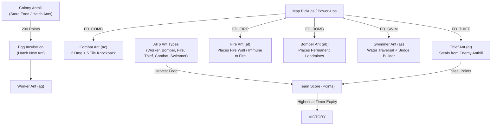

# Ants (1995/1998) - Complete Reverse Engineering Specification

> **Document Classification:** Engineering Specification & Reverse Engineering Ground Truth  
> **Target Deliverable:** Deterministic Cross-Platform C++17/SDL3 Native Engine Remake  
> **Source Artifacts:** `Original-Ants/Ants.exe` (PE32 x86), `docs/legacy/Ants.exe.c` (`ans.exe.c` Ghidra C decompilation), `Original-Ants/ants.chd`, `Original-Ants/Maps/*.LVL`  
> **Date:** September 2026

---

## 1. Executive Summary & Engine Architecture

**Ants** is an RTS / arcade-strategy game developed for Windows 95 and the MSN Gaming Zone (~1995-1998).
Players control colonies of ants in a top-down tile-based grid environment (typically 60×60 isometric/orthogonal cells). The objective is to command ants manually to collect food items scattered across the map, store them in the colony anthill, harass opponents, hatch new ants, and achieve the highest score before the match timer runs out.

### Key Gameplay Mechanics
- **Direct Manual Command:** Ants do not perform tasks automatically; the player selects ants and issues move, attack, harvest, and special ability orders.
- **Teams & Colors:** 4 player teams supported:
  - `0`: Black
  - `1`: Blue
  - `2`: Red
  - `3`: Green
- **Anthills & Hatching:**
  - Ants hatch from eggs at the colony anthill.
  - Hatching costs **200 points** from the team's current score.
  - Ants can die from combat damage, bomb blasts, fire damage, and drowning.
  - If a team runs out of eggs or points, hatching is prohibited.
  - There is **no queen ant**; production is handled by the colony anthill.
- **Ant Classes & Power-Ups:**
  - **6 Ant Unit Types:**
  1. **Worker Ant (General Ant - `ag`):** Basic ant produced from incubation, attacks for 1 HP damage per hit. (Note: ALL 6 ant species can harvest and deliver food pieces; the Worker Ant is simply the default basic form with no specialized combat or terrain power-up).
  2. **Thief Ant (`at`):** Scout (walks at the same pace as every other ant; see §5.32). Infiltrates enemy anthills and steals 50 points of food at a time; attacks for 1 HP damage per hit.
  3. **Fire Ant (`af`):** Immune to fire, creates fire walls with a magnifying glass (`wallup04`), extinguishes fires; attacks for 1 HP damage per hit.
  4. **Bomber Ant (`ab`):** Plants mines/bombs on the ground in team colors (bombs deal 2 HP explosive damage); direct melee strike attacks for 1 HP damage per hit. Can defuse enemy bombs.
  5. **Swimmer Ant (`as`):** Immune to drowning in water, swims, builds dirt bridges across water tiles with a shovel; attacks for 1 HP damage per hit.
  6. **Combat Ant (`ac`):** Buff warrior ant. The **only** ant type that deals 2 HP damage per strike (all other 5 ant types deal 1 HP per hit) and sends opponents flying backwards 4–5 tiles. Also the **only** ant type with autonomous AI guard behavior.

---

## 2. Reverse Engineering Findings (via Capstone & Ants.exe.c Analysis)

### 2.0 Dual Primary Reference Methodology
To guarantee authentic 1:1 behavioral parity with the 1998 original game, all systems and mechanics are verified using a two-pronged reverse engineering methodology:
1. **Capstone Disassembly (`Original-Ants/Ants.exe` via `tools/analyze_binary.py`)**:
   - Inspects exact machine instructions, registers, calling conventions, jump tables, and execution order directly from the compiled 1998 binary.
2. **C Decompilation (`docs/legacy/Ants.exe.c`, also referenced as `ans.exe.c`)**:
   - Complete 59,000+ line Ghidra C decompilation of `Ants.exe`.
   - Provides readable C pseudocode, loop bounds, math formulas, sound table lookups, switch-case dispatchers, and state machine transitions.
   - Always cross-referenced with Capstone to verify exact opcode behavior and eliminate decompilation ambiguity.

### 2.1 Binary Characteristics
- **Binary:** PE32 GUI Intel 80386 executable compiled with Visual C++ 4.x/5.0.
- **Base Address:** `0x01000000`
- **Sections:**
  - `.text`: `0x1001000` - `0x1046C00` (Code, constants, RTTI, vtables)
  - `.data`: `0x1047000` - `0x104B000` (Global states, player tables, strings)
  - `.rsrc`: `0x104D000` - `0x1050400` (Windows string tables, icons, dialogs)
- **Subsystems Used in 1995 Original:** DirectDraw (256-color paletted surfaces), DirectSound (8-bit/11-22kHz PCM), WinMM sequencer (`mciSendStringA`, `midiOutSetVolume`, `midiOutOpen`, `midiOutClose` for `INTRO.MID` playback and volume attenuation), WinSock 1.1 (multiplayer sessions).

### 2.2 Core Object Virtual Method Tables (VTables)
Through Capstone disassembly of object constructors, the following key class vtables were identified:
- `0x1004fe0`: CHD Archive & Stream IO Reader
- `0x1001fe0`: CHD Graphics / Sprite Resource Manager
- `0x1001ff0`: Sprite & Animation Sequence Object
- `0x1005028`: Animation Frame / Sub-Sequence Element
- `0x1002508`: Map & Level Manager (`MapManager`)
- `0x1004be0`: Core Ant Entity Class (`CAntUnit`)
- `0x1004b08`, `0x1004b50`, `0x1004b98`: Ant Special Ability & Sub-Handlers

### 2.3 Ant Entity State Layout (`CAntUnit` at `0x1004be0`)
- `+0x00`: VTable pointer (`0x1004be0`)
- `+0x08..+0x38`: Spatial bounding box and rendering coordinates
- `+0x44`: Active flag (byte)
- `+0x56`: Team ID (`uint16`: 0 = Black, 1 = Blue, 2 = Red, 3 = Green)
- `+0x58`: Ant Class Type (`uint16`):
  - `0`: General / Worker Ant
  - `1`: Bomber Ant
  - `2`: Combat Ant
  - `3`: Fire Ant
  - `4`: Swimmer Ant
  - `5`: Thief Ant
- `+0x5A`: Spawn position / home anthill vector
- `+0x74`: Current Health (`uint16`, max 10 HP; standard worker ant starts with 10 HP or proportional tier)
- `+0x76`: Current Animation State (`uint16`: Idle=7, Walking=2, Attacking=3, Ability=4)
- `+0x80`: Current target unit / interactive object pointer
- `+0x9C`: Action timer timestamp (`timeGetTime`)
- `+0xA8`: State machine state index
- `+0xE4`: Death status (`0xF` = drowned in water, other = died in combat)
- `+0xE8`: Held item pointer (null if carrying nothing; points to Food/Item object if harvested)

---

## 3. The `.CHD` Asset Container Specification

`ants.chd` (8,411,866 bytes) is the complete game data archive containing palettes, all 2,794 sprite frames, 91 sound effects, and 1,344 animation definitions.

### 3.1 Header (28 Bytes)
Located at offset `0x00000000`:
```c
struct CHDHeader {
    uint32_t version;          // 9 (0x00000009)
    uint32_t timestamp;        // 0x378d661c
    uint32_t table1_offset;    // 1052 (0x0000041c) -> Sprite Bitmaps Table
    uint32_t table2_offset;    // 6,835,937 (0x00684ee1) -> Sound Effects Table
    uint32_t table3_offset;    // 7,903,773 (0x00789a1d) -> Event Tag Descriptors
    uint32_t table4_offset;    // 7,903,835 (0x00789a5b) -> Animation Sequences Table
    uint32_t palette_bytes;    // 1024 (0x00000400)
};
```

### 3.2 Master 256-Color Palette (`0x0000001C` - `0x0000041C`)
- 256 entries × 4 bytes (`PALETTEENTRY` format: `byte 0 = Red`, `byte 1 = Green`, `byte 2 = Blue`, `byte 3 = Flags`).
  > [!NOTE]
  > **Color Channel Order:** The file stores `[R, G, B, Flags]`. Swapping byte 0 and 2 causes red/blue channel reversal (e.g. turning red bombs into blue bombs and terracotta clay into cyan).
- **Transparency Color Key:** Index `254` (`0xFE`, `RGB(255, 0, 255)` Magenta) is the DirectDraw color key (`DDCOLORKEY`) and must be rendered as transparent (`Alpha = 0`).
- **Team Color Palette Ranges:**
  - **Blue (Team 1):** Indices `34..39` (`RGB(119, 175, 239)` down to `RGB(59, 31, 131)`)
  - **Green (Team 3):** Indices `49..52` (`RGB(83, 147, 43)` down to `RGB(7, 63, 51)`)
  - **Red (Team 2):** Indices `178..181` (`RGB(251, 51, 91)` to pure `RGB(255, 0, 0)` down to `RGB(119, 0, 0)`)
  - **Black (Team 0):** Indices `237..239` (`RGB(79, 87, 111)` down to `RGB(19, 35, 39)`)

### 3.3 Table 1: Sprite Bitmaps (Offset 1052 / `0x0000041C`)
- Starts with `uint32_t count` = 2,794 entries.
- Followed by `uint32_t offsets[2794]`.
- Each sprite entry at its file offset consists of:
```c
struct CHDSprite {
    uint32_t pitch;            // Row stride in bytes (e.g. 48)
    uint32_t width;            // Visible width in pixels (e.g. 45)
    uint32_t height;           // Visible height in pixels (e.g. 47)
    uint32_t filename_len;     // Length of original ASCII asset name
    char     filename[filename_len]; // e.g. "dclay48.bmp\0"
    uint8_t  pixels[pitch * height]; // 8-bit paletted index data
};
```

### 3.4 Table 2: Digital Audio Sounds (Offset 6,835,937 / `0x00684EE1`)
- Starts with `uint32_t count` = 91 entries.
- Followed by `uint32_t offsets[91]`.
- Each sound entry at its file offset consists of:
```c
struct CHDSound {
    uint32_t format_len;       // Typically 18 (0x12)
    WAVEFORMATEX wave_format;  // wFormatTag=1 (PCM), nChannels=1, nSamplesPerSec=11025 or 22050, wBitsPerSample=8
    uint32_t pcm_data_len;     // Size of raw audio buffer
    uint8_t  pcm_data[pcm_data_len]; // Raw 8-bit unsigned PCM audio
    uint32_t filename_len;     // Length of original filename
    char     filename[filename_len]; // e.g. "bombexp.wav\0"
};
```
*Note:* Standard RIFF headers (`RIFF` + size + `WAVEfmt ` + format + `data` + size + pcm) convert these entries into 100% standard WAV files with zero quality loss.

### 3.5 Table 4: Animation Sequences (Offset 7,903,835 / `0x00789A5B`)
- Starts with `uint32_t count` = 1,344 entries.
- Followed by `uint32_t offsets[1344]`.
- Each animation entry structure:
```c
struct CHDAnimation {
    uint32_t name_len;
    char     name[name_len];    // e.g. "redbomb", "pu_comb", "agwg201"
    uint32_t flag1, flag2, flag3;
    uint32_t subitem_count;    // Usually 1
    struct SubItem {
        uint32_t val1, val2, val3;
        uint32_t box_left, box_top, box_right, box_bottom;
        uint32_t v8;
        uint32_t default_sprite_id;
        uint32_t frame_count;
        struct Frame {
            int32_t  dx;            // Horizontal render offset
            int32_t  dy;            // Vertical render offset
            uint32_t sprite_index;  // Index into Table 1
        } frames[frame_count];
    } subitems[subitem_count];
};
```

---

## 4. The `.LVL` Map File Specification

All original maps (`TREASURE.LVL`, `GAUNTLET.LVL`, `ISLANDS.LVL`, `MEDIUM.LVL`, `SMALL.LVL`, `TINY.LVL`) follow this binary format:

### 4.1 Header
```c
struct LVLHeader {
    uint32_t version;          // 8
    uint32_t game_mode;        // 1 (Standard Food Gathering)
    uint16_t default_minutes;  // Match duration (e.g. 12 min for Treasure, 6 min for Tiny)
    char     description[30];  // Null-terminated description (e.g. "One person's trash...")
    uint16_t tile_type_count;  // Number of tile asset references (e.g. 1334)
    char     tile_names[tile_type_count + 1][11]; // 11-byte asset name strings matching CHD animations
    uint32_t width;            // Map grid width (e.g. 60, 40, 31)
    uint32_t height;           // Map grid height (e.g. 60, 40, 31)
};
```

### 4.2 Layers (Width × Height × 6 Bytes Each)
Each map contains two full grid layers:
- **Layer 1: Terrain Base Grid:**
  - 6 bytes per tile (`uint16_t terrain_id`, `uint16_t variation`, `uint16_t flags`).
  - Terrain categories:
    - `0`: Walkable Ground (Grass, Dirt, Clay)
    - `1`: Wall / Obstacle (Boulders, Rocks, Trees)
    - `2`: Deep Water (Instantly drowns non-swimmer ants)
- **Layer 2: Interactive Overlay Grid:**
  - Contains bridges (`bridge1`..`bridge4`), fire walls (`wallup04`), dropped bombs (`redbomb`..`bluebomb`), food items (`FOOD`, `fdburgr`, `fdsuckr`), and power-up icons (`FD_COMB`, `FD_SWIM`, `FD_FIRE`, `FD_THIEF`, `FD_BOMB`).

### 4.3 Trailing Spawn & Player Configuration
- Anthill coordinates `(x, y)` for Team 0, 1, 2, 3.
- Food item spawn points and respawn schedules.

---

## 5. Game Mechanics & Simulation Rules


```mermaid
graph TD
    Anthill["Colony Anthill<br/>(Store Food / Hatch Ants)"] -->|200 Points| Egg["Egg Incubation<br/>(Hatch New Ant)"]
    Egg --> Worker["Worker Ant (ag)"]
    
    MapPickup["Map Pickups / Power-Ups"] -->|FD_COMB| Combat["Combat Ant (ac)<br/>2 Dmg + 5 Tile Knockback"]
    MapPickup -->|FD_THIEF| Thief["Thief Ant (at)<br/>Steals from Enemy Anthill"]
    MapPickup -->|FD_FIRE| Fire["Fire Ant (af)<br/>Places Fire Wall / Immune to Fire"]
    MapPickup -->|FD_BOMB| Bomber["Bomber Ant (ab)<br/>Places Permanent Landmines"]
    MapPickup -->|FD_SWIM| Swimmer["Swimmer Ant (as)<br/>Water Traversal + Bridge Builder"]
    
    AllAnts["All 6 Ant Types<br/>(Worker, Bomber, Fire, Thief, Combat, Swimmer)"] -->|Harvest Food| Score["Team Score (Points)"]
    Thief -->|Steal Points| Score
    Score -->|Highest at Timer Expiry| Victory["VICTORY"]
```

> [!NOTE]
> **Universal Food Harvesting Mechanics**: In the authentic 1998 simulation engine, ALL 6 ant species (Worker, Bomber, Fire Ant, Thief, Combat Ant, and Swimmer) are fully capable of harvesting, picking up, carrying, and delivering food pieces back to their colony anthill. While Worker ants are the default produced unit with no special ability, transformed specialist ants retain full harvesting functionality.

### 5.0 Ant Type ID & Power-Up Mapping Table (Disasm `0x1021087`, `0x10210c1`)
The engine internal dispatch maps each ant class to an integer ID and corresponding Layer 2 powerup pickup tile:

| Ant Type ID | Class Name | Sprite Prefix | Power-Up Tile | Tile Name | Core Special Attributes |
|---|---|---|---|---|---|
| **0** | Worker Ant | `ag` | None | N/A | Standard basic ant (no special power). 10 HP. Like all ants, can harvest and carry food. |
| **1** | Bomber Ant | `ab` | Tile 64 | `pu_bomb` | Places permanent team landmines (`redbomb`..`bluebomb`); defuses enemy bombs. Can harvest food. |
| **2** | Fire Ant (Mason) | `af` | Tile 66 | `pu_mason` | Places impassable firewalls (`wallup04`); walks freely on fire tiles. Can harvest food. |
| **3** | Thief Ant | `at` | Tile 63 | `pu_thief` | Infiltrates enemy anthills; steals `min(50, enemy_score)`. Can harvest food. |
| **4** | Combat Ant | `ac` | Tile 62 | `pu_comb` | 2 HP damage per strike + 4-5 tile ballistic knockback. Enlarged collision box `[-32..26, -46..16]`. Can harvest food. |
| **5** | Swimmer Ant | `as` | Tile 65 | `pu_swim` | Traverses deep water without drowning; constructs multi-stage bridges across water. Can harvest food. |

---

### 5.0.1 Power-Up Transformation Lifecycle & Animation State Machine (Disasm `0x1020d26`, `0x101b212`, `0x101ace3`)

- **State 4 Dispatch (`0x1020d26`, `0x101b212`):**
  - When an ant steps onto an eligible powerup tile, the engine executes `0x1020d26`:
    ```x86
    0x1020d26: push 4
    0x1020d28: mov ecx, edi
    0x1020d2a: call 0x101ace3
    ```
  - State 4 is dispatched via the animation jump table at `0x101b4db[4]` -> `0x101b212`:
    ```x86
    0x101b212: movzx eax, word ptr [esi + 0xd4]
    0x101b219: mov ecx, dword ptr [0x104b350]
    0x101b21f: push edi
    0x101b220: push edi
    0x101b221: push esi
    0x101b222: mov ecx, dword ptr [ecx + eax*4 + 0x47e0] ; Loads getpow (Anim ID 55)
    0x101b229: jmp 0x101b417                           ; call 0x102c0db (Play Animation)
    ```
  - `0x47e0` holds the team-mapped animation sequence pointer for `getpow` (Anim ID 55, 11 subitems: `pucov1..5.bmp` -> `empty.bmp` -> `pucov5..1.bmp`).
- **Post-Transformation State Invariant:**
  - Upon pickup, the ant's movement waypoints are cleared. The unit state is reset from `Walking` to `Idle` (or `GuardIdle` for Combat Ants).
  - When the 11-tick `getpow` transformation timer elapses, the unit completes transformation and emerges into `Idle` / `GuardIdle` mode.
  - In `Idle` / `GuardIdle` mode, `anim_tick` continuously advances (`anim_subitem = anim_tick / 4`), ensuring the unit actively plays its directional standing animation cycle (`*st*`, including South `*st301`) rather than being left in a static frozen frame 0 of an empty `Walking` state.
- **Power-Up Standing & Locomotion Departure Semantics (`0x1020cdb`, `0x1020d26`):**
  - Ants positioned on a power-up tile (whether an already transformed class like Bomber Ant or an ant whose transformation was previously halted) are free to navigate off the tile. The engine treats the unit's current tile as traversable for departures (`c != unit->pos`).
  - Transformation interruption (`SoundID::AntStop`, Anim 56 `pucov`) is strictly reserved for active transformation states (State 4 `getpow`) receiving impossible move commands (e.g. into deep water or obstruction barriers) or explicit Stop/Cancel actions.
  - Issuing a valid move order to any passable destination allows the ant to depart immediately, clearing `on_powerup` without triggering stop sound effects or trapping the unit.

---

### 5.1 Unit Damage Matrix & Combat Knockback Physics

Every ant type in *Ants* possesses a melee attack (`*at*`), triggered either manually or automatically when engaging enemy ants. Melee attack damage is strictly split into two tiers:

| Ant Class | Class Code | Direct Melee Strike Damage | Special Ability Attack Damage | Knockback Distance | Autonomous AI Guard? |
|---|---|---|---|---|---|
| **Worker Ant** | `ag` | **1 HP** | N/A | None (0 tiles) | No (Manual only) |
| **Thief Ant** | `at` | **1 HP** | N/A (50-pt base steal) | None (0 tiles) | No (Manual only) |
| **Fire Ant** | `af` | **1 HP** | N/A (Firewall placement) | None (0 tiles) | No (Manual only) |
| **Bomber Ant** | `ab` | **1 HP** | **2 HP** (Detonated Bomb Mine) | 2–3 tiles (Bomb blast) | No (Manual only) |
| **Swimmer Ant** | `as` | **1 HP** | N/A (Bridge building) | None (0 tiles) | No (Manual only) |
| **Combat Ant** | `ac` | **2 HP** | N/A | **4–5 tiles** (Heavy punch) | **Yes** (3-tile aggro guard) |

- **Universal 1 HP Melee Standard:** Thief Ants, Fire Ants, Bomber Ants, Swimmer Ants, and Worker Ants all deal exactly **1 HP damage per hit** when attacking in melee.
- **Combat Ant 2 HP Exception:** The Combat Ant is the **only** ant unit whose standard melee attack deals **2 HP damage** per hit. It also triggers a severe ballistic impulse displacing the target 4–5 tiles backwards (`flythumpa.wav` / `flythumpb.wav`) into a stunned recovery state (`stun.wav`).
- **Bomber Ant Mines:** Bomber Ant mines deal **2 HP damage** upon detonation, knock back nearby units, and leave the bomb cleared. Direct melee strikes by the Bomber Ant itself deal the standard 1 HP. Bomber ants can also crush and squash active enemy bombs under their weight (`bombmuffle.wav`).
- **Swimmer Ants:** Swimmer Ants attack for 1 HP in melee and build bridges (`bridge1`..`bridge4`) across water cells (`shovelwater.wav`), allowing regular ants to cross.
- **Fire Ants:** Fire Ants attack for 1 HP in melee and lay fire barriers (`wallup04`, `firestarta.wav`) that burn out after 180 seconds (`fireburnout.wav`, `sputter`) or can be extinguished. Fire Ants are immune to fire damage.

### 5.2 Fire & Bomb Placement Tile Restrictions & Fire Interaction
- **Strict Cardinal Adjacency Rule (No Diagonal Placement):**
  - Fire Ants and Bomber Ants can **ONLY** place firewalls and bombs on tiles that are strictly **cardinally adjacent** (North, East, South, West) to the ant's current coordinate:
    - **North:** `(x, y - 1)`
    - **East:** `(x + 1, y)`
    - **South:** `(x, y + 1)`
    - **West:** `(x - 1, y)`
  - **Diagonal Placement is Prohibited:**
    ```
    (dx != 0 and dy != 0) => DISALLOWED
    ```
    Ants **cannot** place bombs or fire diagonally (North-East, South-East, South-West, North-West). If a player issues a placement command on a diagonal or distant tile, the ant cannot execute placement from its current position; it must first walk into an orthogonal adjacent tile where `|dx| + |dy| = 1`.
- **Tile Placement Validity (Disasm `0x1007202` & `0x10071dd`):**
  - Bombs and fire cannot be placed everywhere; they are restricted by terrain flags in the tile properties table:
    - **Bomb Placement:** Requires flag bit `0x02` (`CAN_PLACE_BOMB`). Only valid non-mud walkable terrain (grass, slate, gravel/dirt) has this flag.
    - **Mud Bomb Prohibition:** Mud cells (`SurfaceType::Mud` / `is_mud`) strictly prohibit bomb placement (`CAN_PLACE_BOMB` bit `0x02` is never set on mud, and `can_place_bomb()` rejects mud). Attempting to plant a bomb on mud is strictly disallowed.
    - **Fire Placement:** Requires flag bit `0x04` (`CAN_PLACE_FIRE`).
    - Water, deep water, stone walls, and rocks strictly reject both fire and bomb placement.
- **Voluntary Pathfinding Inaccessibility:**
  - Fire tiles (`wallup04`, index 134) are treated as solid blocking obstacles by the A* pathfinder (`0x1008bb7`).
  - Standard ants **cannot voluntarily walk or path onto fire**.
  - Friendly or enemy Fire Ants (`af`) possess the fire-walking exception and can traverse fire freely.
- **Involuntary Knockback onto Fire & Bounce-Off Physics (`0x0101e9cf`, `0x0101c221`):**
  - The only way a non-fire ant enters a fire tile is via external ballistic displacement:
    1. Being knocked into fire by a standard attack from a **Worker or Thief Ant** (1 HP damage).
    2. Being struck and knocked back 4–5 tiles by a **Combat Ant** (2 HP damage).
    3. Being thrown by a nearby **Bomb explosion** (2 HP damage).
  - **Cumulative Damage Rule (+1 Fire Damage):**
    - When the ant collides with the fire tile, it immediately takes **1 additional point of fire damage** (`0x01021627` with damage source `7`).
    - *Example 1:* An ant struck by a regular/thief ant takes 1 initial damage + 1 fire damage = **2 total damage**.
    - *Example 2:* An ant struck by a Combat Ant takes 2 initial damage + 1 fire damage = **3 total damage**.
  - **Non-Occupancy Bounce-Off & Chaotic Pinball Ricochets (`0x0101c221`, `0x010229b7`):**
    - Non-fire ants **cannot occupy a fire tile**. Upon contact, the ant bounces off the fire.
    - **Base Reflection Vector & Random Deflection:**
      The engine calculates the reflected trajectory angle:
      ```
      bounce_dir = (incoming_dir + 4 + random_offset) % 8
      ```
      Candidate landing tiles are chosen from adjacent valid tiles.
    - **Multi-Fire Ricochet (Fire-to-Fire Bouncing):**
      - If the bounce sends the ant onto **another fire tile**, the ant lands on fire again, immediately takes **another 1 point of fire damage**, and bounces off that fire tile as well!
      - An ant can bounce across consecutive fire tiles in a rapid ricochet chain reaction, taking **1 additional damage per fire contact** until it either lands on clear ground or perishes.
    - **Ant-to-Ant Collision Bouncing:**
      - If the bouncing ant lands on a tile occupied by another ant (friendly or enemy), spatial occupancy rejection triggers: the moving ant bounces off the occupied ant, deflecting in another direction.
      - If this deflection bounces the ant back onto a fire tile, it takes **another point of fire damage** and rebounds again!
    - **Chaotic Emergent Pinball Physics:**
      - Clustered firewalls, map corners, and nearby ants create wildly unpredictable, slapstick pinball bouncing sequences.
      - Each impact retriggers the bounce tumble animation (action `0x0e`, `flythumpa.wav` / `flythumpb.wav`), applies damage, and resets the stun recovery timer (`0x0c` / State 12, `stun.wav`).
  - **Fire Persistence (Ants Do NOT Extinguish Fire):**
    - An ant landing on or bouncing off fire **does NOT cause the fire to burn out or disappear**. The fire remains fully active on Layer 2 regardless of how many times units bounce off it.
    - The **ONLY TWO WAYS** a fire is removed from the map:
      1. **Natural Timeout (180 Seconds):** The 180-second countdown timer expires, burning out automatically (`fireburnout.wav`).
      2. **Fire Ant Extinguish Action (`State 7`, `0x0102077f` -> `0x0101e97b`):** A Fire Ant (`af`) can actively target and extinguish a fire wall (friendly or enemy). Upon reaching the fire tile, the Fire Ant clears the tile (`0x7ffe`), plays the smoke sputtering animation (`sputter`, Anim 135) and sound effect `fireextinguish.wav` (`0x0101eaac`), and deallocates the 180s timer (`0x0101edfe`). No other ant class can extinguish fire.

### 5.3 Bridge & Fire Wall Expiration Lifetimes & Collapse Drowning (`0x101e8d5`, `0x101ebd3`, `0x1024d85`, `0x100f8bf`)
Both temporary field structures created by specialized ants have strictly reverse-engineered lifespans and unique destruction behaviors:

1. **Firewall Lifetime (Exact: 180 seconds / 3 minutes):**
   - When placed (`0x0101e864`), `wallup04` (index 134) is written to Layer 2.
   - A match timer entity (`0x1024d85` with vtable `0x1004c28`) is registered at `0x101e8e0` with expiration threshold `0x2bf20` ms (**180,000 ms = 180 seconds**):
     ```
     expire_time = match_time_remaining - 180000 ms
     ```
   - When the timer fires (`0x01024de7`), if Layer 2 is still tile 134, it clears the tile with `0x7ffe` (empty), triggering fire burnout sound (`fireburnout.wav`).
   - If the match has less than 180 seconds remaining, the firewall persists until the end of the match.

2. **Bridge Construction & Lifetime (Exact: 180 seconds / 3 minutes):**
   - Swimmer Ant shovels water (`0x10212bb`, action 16) through progressive stages:
     - `bridge1` (index 34) -> `bridge2` (index 35) -> `bridge3` (index 36) -> `bridge4` (index 37).
   - Once fully constructed (`bridge4` at `0x0101ebd3`), a match timer entity (`0x1024d85` with vtable `0x1004c40`) is registered with the same `0x2bf20` ms (**180,000 ms = 180 seconds**) lifespan.
   - **Universal Traversal (Allied & Enemy Ants):**
     - Once constructed, a bridge converts that water tile into passable ground for **any ant in the game**.
     - Traversal is **not restricted to friendly ants**; hostile enemy ants and allied ants alike can freely path and walk across it.
   - **180-Second Collapse & Instant Drowning:**
     - When 180 seconds elapse (`0x01024e66` -> `0x0100f8bf`), the bridge tile collapses and is erased from Layer 2 (`0x7ffe`).
     - **Catastrophic Collapse & Drowning:** The engine scans all units currently occupying the collapsing bridge tile (`0x0100f8fc`). Any non-swimmer ant (`ant_type != 5`, including enemy and friendly ants) standing on top of the bridge at the exact moment of collapse **falls into deep water and drowns instantly** (`0x0100f948`, playing drowning audio).
     - Swimmer ants (`ant_type == 5`) are immune to drowning, plunge into swimming mode, and survive unaffected.


### 5.4 Thief Ant Infiltration & 50-Point Steal Mechanics (Disasm `0x0101d57c`)
- **Target Infiltration:** A Thief Ant commands an infiltration order towards an opposing team's anthill.
- **The 33-Frame Diving & Stealing Animation (`atcr501` / Anim 1095):**
  - **Phase 1: Stealth Approach (Frames 0–18):**
    - The thief ant (wearing its yellow burglar bandana/mask) creeps forward in a low, stealthy crawl (`atcr501..510.bmp`), looking left and right to avoid sentry detection.
  - **Phase 2: Leaping & Diving into the Base (Frames 19–25):**
    - **Frame 19:** The enemy anthill hole cutout appears (`9hillh2.bmp` / Sprite 2503). The thief ant leaps into the air above the hole (`atcr511.bmp`), triggering **Sound 84 (`steala.wav`)**.
    - **Frames 20–25:** The thief ant plunges headfirst down into the hole (`atcr512..516.bmp`), with its abdomen and hind legs disappearing into the dark tunnel entrance.
  - **Phase 3: Rummaging Underground (Frames 26–29):**
    - The thief ant rummages inside the enemy storehouse (`atcr517..519.bmp`).
    - At Frame 26, **Sound 85 (`stealb.wav`)** fires as the thief snatches the enemy's food supplies.
    - At Frame 29, the thief is completely submerged inside the enemy anthill (`empty.bmp`).
  - **Phase 4: Emerging with Loot (Frames 30–32):**
    - **Frames 30–32:** The thief ant climbs back up out of the hole (`atcr520..522.bmp`). At Frame 31, **Sound 86 (`stealc.wav`)** fires as its head and torso pop back out of the hole onto the surface.
    - **Frame 32 (`atcr522.bmp`):** The thief ant emerges victorious on the surface carrying the stolen loot.
- **50-Point Steal Rule & Victim Base Alarm (Disasm `0x0101d57c`, `0x0101b757`):**
  - **Victim Base Alarm Siren (`underattack.wav` / Sound 58):**
    - The instant an enemy Thief Ant dives into an opponent's anthill hole (`0x0101b757`), a high-priority base alert is transmitted to the victim player's game client.
    - **Sound 58 (`underattack.wav`)** (a loud, high-frequency 2,566 Hz alarm siren) blares through the victim's speakers to immediately warn them that their colony is actively being invaded and robbed!
    - A News Flash banner flashes on the victim's screen: `[mm:ss] A ThiefAnt is at your anthill!` (String ID 53).
  - **Loot Calculation & Score Drain Sound (`scoredn.wav` / Sound 88):**
    - The theft logic deducts up to 50 points from the victim's storehouse:
      ```c
      points_stolen = min(50, victim_team.score);
      victim_team.score -= points_stolen;
      thief_ant.carried_points = points_stolen;
      thief_ant.holding = 1; // Switches to ht* holding suite
      ```
    - As points drain from the victim's score counter, **Sound 88 (`scoredn.wav`)** plays on the victim's client (a descending tone indicating score loss), and the HUD status reads `"Food stolen..."` (String ID 62).
- **Return Journey & Score Delivery:** The thief ant switches to the holding animation set (`hten301` / `htwg*`), visibly carrying the lunchbox in front, and must manually travel all the way back across the map to its home anthill. When entering its home anthill, points are added to the team's score (`0x0101e2b3`), playing **Sound 87 (`scoreup.wav`)**.

### 5.5 Food Harvesting, Lunchpail Visuals & Dropping on Death (`0x0100ce53`, `0x0101aefe`, `0x0101b688`)
> **Superseded by 5.40 for the harvest, the pile stages and the lunchbox pick-up** (a food pile is an object with units and stages, the grab is action 5 and is ordered like any move; there is no adjacency rule and no pick-up by walking over a lunchbox).
- **Food Harvesting Adjacency Requirement:**
  - Ants can only harvest food pieces or retrieve dropped lunchboxes when they are in an **adjacent tile** (`chebyshev_dist == 1`) or standing directly on the food tile itself (`pos == food_pos`).
  - Distant or mid-path pickup is strictly prohibited; the ant must navigate to an adjacent tile before initiating the harvest.
  - **Harvesting Sequence & Audio Trigger (`0x0101b688`):** Upon reaching the adjacent tile, the ant performs a harvest action, triggering **Sound 66 (`harvest.wav`)** and advancing the multi-stage food bite/schedule on Layer 2 before setting the holding flag.
- **Visual Carrying Animation Switch (`h*` Sets, Disasm `0x0101aefe`):**
  - When an ant picks up food or stolen points, its holding flag is set: `[esi + 0xe8] = 1`.
  - The animation dispatcher (`0x0101ad02`) dynamically switches the ant's entire animation suite from the empty-handed `a*` tables (offset `+0x3d0`) to the dedicated **holding food** `h*` tables (offset `+0x868`):
    - `ag` (Worker) -> **`hg`** (`hgwg...`, `hgws...`, `hgst...`)
    - `af` (Fire Ant) -> **`hf`** (`hfwg...`, `hfws...`, `hfst...`)
    - `ab` (Bomber Ant) -> **`hb`** (`hbwg...`, `hbws...`, `hbst...`)
    - `ac` (Combat Ant) -> **`hc`** (`hcwg...`, `hcws...`, `hcst...`)
    - `as` (Swimmer Ant) -> **`hs`** (`hswg...`, `hsws...`, `hsst...`)
    - `at` (Thief Ant) -> **`ht`** (`htwg...`, `htws...`, `htst...`)
  - **Bomb Placement While Carrying Food (`absb` Fallback):**
    - The archive `ants.chd` does NOT contain an `hbsb` sequence (only `hbwg`, `hbst`, `hben`, `hbh0`, `hbcg`, `hbsd`, `hbws`, `hbwd`, `hbwm`).
    - When a Bomber ant plants a bomb while holding food, the renderer falls back to the authentic `absb` sequence (`absb301`, `absb701`, `absb901`) with proper layering so the ant never disappears.
  - **Directional Lunchpail Sprites (`*lb*.bmp`):** The `ants.chd` archive contains 78 directional lunchpail sprites (`0lb0000` through `7lb0007`) composited into the ant's mouth/forelegs between the head and body across all 8 movement angles and ground terrain types (grass, sand, dirt, mud). The lunchbox is layered **on top / in front** of the ant body.
- **Death Drop Mechanism (`Anim 356: lunchbox`, `0x0100ceb6` -> `0x0100fe20`):**
  - If a carrier ant dies for any reason (combat damage, bomb explosion, or drowning in water):
    ```c
    if (ant.carried_food != 0 || ant.carried_points > 0) {
        // Spawns Anim 356 ("lunchbox", Sprite 513: "3lb0001.bmp")
        SetLayer2Tile(ant.tile_x, ant.tile_y, LUNCHBOX_ANIM_ID /* 356 / 0x164 */);
    }
    ```
  - The dropped item materializes on **Layer 2** of the map grid as a physical **lunchbox** sprite (`3lb0001.bmp`, Sprite 513).
  - **Universal Pickup:** Any friendly teammate or enemy ant can walk over the dropped lunchbox to pick it up, immediately switching to their own `h*` holding animation set and carrying it back to their own anthill for points.

### 5.6 Anthill Queuing System, Base Deposit & Full Base Healing (`0x01019900`, `0x0101e27f`, `0x0101ac8c`)
- **Concentric Chebyshev Queue System:**
  - Ants returning to the anthill to deposit food or heal cannot all occupy the entrance simultaneously.
  - The original engine calculates queue slots using Chebyshev distance rings:
    ```
    ring = max(|x - base_x|, |y - base_y|)
    ```
  - Cells surrounding the anthill entrance are prioritized by radius rings (R=1, R=2, R=3...). Returning ants reserve a queue cell in the lowest available ring, queueing in FIFO order, and step forward as the entrance clears.
- **The 17-Frame Base Entry, Food Deposit & Emergence Animation (`hgen301` / `*en301`):**
  - When an ant steps into the anthill entrance, it plays its dedicated 17-frame entry animation (`hgen301`, `hfen301`, `hben301`, `hcen301`, `hsen301`, `hten301`):
    - **Frames 0–3 (Descent with Food):** The ant approaches the hole holding the lunchbox in front (`3lb0000..0003` over `agen302..304`).
    - **Frame 4 (Food Deposit):** The lunchbox is deposited into the anthill and disappears from the ant's hands. The team score is incremented (`scoreup.wav`), and inventory is cleared (`carried_food = 0`, `carried_points = 0`).
    - **Frames 5–7 (Diving Underground):** The empty-handed ant dives deeper down the entrance shaft (`agen305..308`).
    - **Frame 8 (Underground Chamber & 100% Full Heal):** The ant is completely submerged underground (`empty.bmp` / Sprite 155). At this exact frame, **full healing to 10 HP** occurs (`powerupc.wav`), resetting all wounds regardless of whether the ant arrived with or without food.
    - **Frames 9–15 (Climbing Out):** The ant climbs back up out of the tunnel shaft (`agen308` back up to `agen302`), ascending head-first onto the rim.
    - **Frame 16 (Surfacing Ready):** The ant emerges onto the surface in upright stance (`agst301.bmp`), empty-handed, fully healed, and immediately receptive to player commands.

### 5.7 Complete Special Ability & Combat Hit Reaction Animation Suite

Every special ability and combat interaction in *Ants* is governed by dedicated multi-stage animation sequences in `ants.chd` and synchronized with sound effects via subitem audio triggers (`default_sp`).

#### 1. Fire Ant (`af`): Magnifying Glass Ignition & Extinguishing
- **Set Fire (`afsf301`, `afsf701`, `afsf901` - 22 Subitems / 35 Simulation Ticks / 1,760ms):**
  - **Full Authentic Duration (1,760ms / 35 Ticks @ 20Hz):**
    - Subitems 0–6 run at 100ms each (700ms -> ticks 0..13): Fire Ant pulls out a handheld magnifying glass (`afsf301..304.bmp`) and positions it downward toward the ground. At tick 10 (subitem 5), sound trigger **67 (`firestarta.wav`)** fires as the focused sunbeam appears (`9botsf1..4.bmp`).
    - Subitems 7–17 run at 60ms each (660ms -> ticks 14..26): Smoke and spark billow from the focal point (`9smoke1..9.bmp` + `9botsf5..6.bmp`).
    - At tick 27 (1,360ms), flame erupts (`9smoke10.bmp` + `9sf01.bmp`), triggering sound **68 (`firestartb.wav`)** and placing the persistent firewall on the grid.
    - Subitems 18–21 run at 100ms each (400ms -> ticks 27..34): Fire Ant puts away the magnifying glass and returns upright.
  - **Ability Cooldown:**
    - Verified from `Ants.exe` VA `0x101ba24` (`push 0x7d0; call 0x101c184`): Exactly **2,000ms (40 simulation ticks / 2.0s)** cooldown before the ability can be activated again.
- **Extinguish Fire (`afxf301`, `afxf701`, `afxf901` - 12 Subitems / 12 Frames):**
  - Fire Ant advances to the flame tile (`afxf301..304.bmp`).
  - At Subitem 4, fires sound **69 (`fireextinguish.wav`)** as the ant smothers the flame (`afxf305.bmp`).
  - Flame is erased (`0x7ffe`), sputtering smoke plays (`sputter`, Anim 135), and the 180s timer is deallocated.

#### 2. Bomber Ant (`ab`): Bomb Planting & Body Crush Neutralization
- **Set Bomb (`absb301`, `absb701`, `absb901` - 17 Subitems / 28 Simulation Ticks):**
  - **Full Authentic Duration (1,360ms – 1,400ms / 28 Ticks @ 20Hz):**
    - The CHD animation consists of 17 subitems with cumulative duration ~1,360ms (27–28 ticks at 50ms/tick). The animation runs across 28 simulation ticks without being rushed.
    - **Phase 1 (Subitems 0–8 / Ticks 0–13):** Bomber Ant crouches down low to the ground (`absb301..309.bmp`).
    - **Phase 2 (Subitem 9 / Tick 14):** Reaches into equipment pack and pulls out the bomb, firing sound **90 (`bombpick.wav`)**.
    - **Phase 3 (Subitems 10–14 / Ticks 15–23):** Plants the bomb (`2bomb.bmp` / `blackbomb`..`bluebomb`) on the ground tile (appearing at subitem 11 / tick 18) and arms the fuse.
    - **Phase 4 (Subitems 15–16 / Ticks 24–27):** Steps backwards away from the live mine and returns to upright stance.
  - **Ability Cooldown:**
    - Verified from `Ants.exe` VA `0x101bdd1` (`push 0xbb8; call 0x101c184`): Exactly **3,000ms (60 simulation ticks / 3.0s)** cooldown before the ability can be activated again.
- **Crush / Neutralize Bomb (`abdb301`, `abdb701`, `abdb901` - 12 Subitems / 15 Frames):**
  - **Phase 1 (Subitems 0–2):** Approaches and leans forward over the active mine (`abdb301..303.bmp`).
  - **Phase 2 (Subitem 3):** Grabs and pins down the bomb casing, firing sound **73 (`bombdrop.wav`)**.
  - **Phase 3 (Subitems 4–5):** Rears up over the bomb (`abdb304..305.bmp`).
  - **Phase 4 (Subitems 6–8):** Slams down with full body weight directly onto the bomb, crushing it flat into the dirt! Triggers sound **74 (`bombmuffle.wav`)** as the squashed bomb pops in a muffled puff of smoke and flattened fragments (`9difuse1..3.bmp`).
  - **Phase 5 (Subitems 9–11):** Rises back upright (`abdb310..312.bmp`); the crushed bomb is safely removed from Layer 2.

#### 3. Combat Ant (`ac`): Wind-Up Punch & Ballistic Displacement
- **Heavy Punch Strike (`acat301`, `acat201`, `acat701`, `acat801`, `acat901` - 6 Subitems / 6 Frames):**
  - **Subitem 0 (`acat301.bmp`):** Combat Ant rears back with enlarged collision envelope `[-32..26, -46..16]`.
  - **Subitem 1 (`acat302.bmp`):** Winds up an oversized, muscular two-handed punch.
  - **Subitem 2 (`acat303.bmp`):** Maximum forward punch extension! Fires sound **78 (`attack2.wav`)**, deals **2 HP damage**, and launches the victim into ballistic flight.
  - **Subitems 3–5 (`acat304..306.bmp`):** Kinetic follow-through and recovery back to ready stance.

#### 4. Swimmer Ant (`as`): Shoveling & Aquatic Maneuvers
- **Build Bridge on Water (`asbbw301` - 8 Subitems / 11 Frames):**
  - Swimmer Ant readies shovel (`9asdw701..703.bmp`).
  - Shovels into water, triggering sound **82 (`shovelwater.wav`)** and water splashes (`9sp301..304.bmp`).
  - Advances bridge through 4 construction stages (`bridge1` -> `bridge4`).
- **Build Bridge on Land (`asbbl301` - 8 Subitems / 11 Frames):**
  - Shovels gravel and dirt (`asdm301..308.bmp` + `9md301..304.bmp`), triggering sound **81 (`shovelgravel.wav`)**.
- **Dismantle Bridge (`asdbw301`, `asdbl301` - 8 Subitems):** Shovels away existing bridge structure.
- **Bridge Demolition & Collapse Instant Drowning Invariant:** When a bridge is dismantled or regresses below full completion (`has_completed_bridge() == false`), or collapses upon expiration, all non-swimming ants on that water tile immediately plunge into the deep water and drown (`start_drowning()`, playing sounds 71 `splash.wav` and 72 `drown.wav`). Their carried food/inventory is lost and friendly casualty statistics increment immediately. Swimmer ants transition safely into the swimming state (`UnitState::Swimming`).
- **Water Traversal Suite:**
  - **Dive In (`asdi*`):** Plunges into deep water, triggering sound **71 (`splash.wav`)**.
  - **Swimming (`assw*`):** 5-directional swimming stroke cycles with surface ripples.
  - **Tread Water (`astw*`):** Idle aquatic bobbing.
  - **Emerge onto Land (`asgo*`):** Climbs out of water back onto ground terrain.

#### 5. Thief Ant (`at`): Infiltration & Stealth Steal
- **Anthill Infiltration (`atcr501` - 1 Subitem / 1 Frame):**
  - Crawls into the enemy anthill entry tunnel.
  - **Internal / Thief Audio:** Plays crawling/stealing audio (**83 `theifwhip.wav`** and **84 `steala.wav`**).
  - **Victim Audio Alert:** The opponent being robbed receives the high-frequency alarm siren **Sound 58 (`underattack.wav`)** along with the HUD warning `[mm:ss] A ThiefAnt is at your anthill!` (String ID 53), followed by **Sound 88 (`scoredn.wav`)** as points are deducted (`"Food stolen..."`, String ID 62).
  - Deducts `min(50, enemy_score)` points and emerges carrying the lunchbox suite (`ht*`).

#### 6. Combat Strike, "Hit Back", & Ballistic Reaction Suite
All ant classes share a unified, symmetrical combat and ballistic physical reaction pipeline:

- **Single Attack Execution Per Order:**
  - In `Original-Ants/Ants.exe`, issuing an attack command causes the ant to approach the enemy and execute **one single attack strike**.
  - Upon connecting, the attacker clears its target ID (`attack_target_id = 0`), completes its attack recovery frames, and transitions to `UnitState::Idle` (or `GuardIdle` for Combat Ant), standing still rather than automatically pursuing or continuously looping strikes.
  - **Attack Cooldown Invariant:** The ant enforces its attack cooldown (10 ticks for standard ants, 12 ticks for Combat Ant) before any subsequent strike can be executed.
- **Combat Facing & Cardinal Pushback Mechanics:**
  - **Victim Facing Orientation:** When an ant is attacked by an enemy ant, it is immediately forced to orient its facing direction toward the attacking ant (`target->facing = vector_to_direction(attacker->pos - target->pos)`).
  - **Cardinal Pushback Priority:** Standard melee attacks push the victim 1 tile strictly in a cardinal direction (North, South, East, West) away from the attacker. Diagonal pushes do not occur unless cardinal paths are obstructed.
  - **Obstacle Sideways Deflection:** If the primary cardinal push destination is blocked by an obstacle (solid rock or map boundary), the victim is deflected sideways (along the perpendicular cardinal axis) rather than being pinned.
  - **Diagonal Attack Resolution:** When an attack occurs from a diagonal adjacency, the engine resolves pushback along an available cardinal axis away from the attacker rather than a diagonal vector. If both cardinal paths are blocked by an obstacle corner, the ant deflects along the diagonal.

- **Food Harvesting & Base Return Invariants:** *(superseded by 5.40)*
  - **Adjacent Movement Isolation:** Walking on or resting on tiles adjacent to food morsels does NOT trigger food harvesting. Ants only harvest food when explicitly commanded to target/eat that food, or when positioned directly on the food cell.
  - **Carrying Food Deposit Reroute:** If an ant that is already carrying food is instructed to eat food again, it paths all the way across the map to the target food first. Upon arriving at the food, it detects that it already carries food (without taking a second bite or modifying food tile state) and automatically paths back to its anthill base to deposit.

| Reaction State | Action Code | Key CHD Anims | Frame Characteristics | Sound Triggers | Physical Effect |
|---|---|---|---|---|---|
| **Attack / "Hit Back"** | `*at*` (Action 1) | `agat`, `abat`, `afat`, `acat`, `asat`, `atat` | Directional forward strike (5 directions: 2, 3, 7, 8, 9). | Sound 57 (`attack.wav`) / Sound 78 (`attack2.wav`) | Deals 1 HP damage (Worker, Thief, Bomber, Fire, Swimmer) or 2 HP damage (Combat Ant). Single attack per order. |
| **Get Hit (Flinch)** | `*gh*` (Action 10) | `aggh`, `abgh`, `afgh`, `acgh`, `asgh`, `atgh` | Staggered flinch reaction (Subitems 0–8). | Sound 64 (`flythumpa.wav`) @ frame 0, Sound 65 (`flythumpb.wav`) @ frame 3 | Brief stagger interrupt (stun for 4 ticks). Triggered on standard 1-tile melee hit pushback. |
| **Burn / Scorch Stagger** | `*bu*` (Table `0x1004518`) | `agbu`, `abbu`, `afbu`, `acbu`, `asbu`, `atbu` | 11 subitems with smoke explosion puff (`*bu301..303`) and ground tumble (`aggh306..311`). | Sound 64 (`flythumpa.wav`) @ subitem 0, Sound 65 (`flythumpb.wav`) @ subitem 5 | Bomb dud / burn stagger for 11 ticks; unit remains in place. |
| **Grab Food (Harvesting Bite)** | `*gf*` (Order 5) | `aggf`, `abgf`, `afgf`, `acgf`, `asgf`, `atgf` | Ant bites, chomps and harvests food morsel into carryable item (5–6 subitems, 300–440ms). | Sound 87 (`harvest.wav`) | Food harvested into inventory; unit switches to carrying `*h*` walk animations. |
| **Ground Bounce (Ballistic Knockback & Bounce)** | `*gb*` (Action 14/19) | `aggb`, `abgb`, `afgb`, `acgb`, `asgb`, `atgb` | Hard ground landing rebound (`1612..1619.bmp`), skids forward, rolls to a stop (12 subitems, 128 px displacement). | Sound 64 @ impact, Sound 65 @ stop, Sound 70 (`stun.wav`) | Displaced 4–5 tiles along impact vector at high velocity (Combat Ant punch) or 1-tile collision bounce. Stunned for 10–12 ticks. |

#### 7. Animation Audio Trigger Architecture (`default_sp`)
In `ants.chd` Table 4, each animation subitem includes a `default_sp` field:
- When `default_sp == 0xFFFFFFFF`, no sound is triggered on that frame.
- When `default_sp < 91`, the engine automatically dispatches sound index `default_sp` from Table 2 at that exact subitem playback instant.
- This provides sub-frame synchronization between visuals (e.g. magnifying glass ignition beam, bomb fuse snipping, shovel splash, fist impact) and digital audio without manual timing scripts.

### 5.8 Directional Symmetry & 5-to-8 Way Horizontal Mirroring Mapping

To optimize RAM and archive size in 1995, `ants.chd` does not store independent animation sets for all 8 compass directions. Instead, it stores exactly **5 base directions** facing South, North, and the Eastern hemisphere:

| Direction ID in CHD | Primary Heading | Visual Facing | Mirror Source for Opposite Direction |
| :---: | :--- | :--- | :--- |
| **`7`** | North (0°) | Facing straight Up (back of head to viewer) | Unmirrored (Vertical Axis) |
| **`8`** | North-East (45°) | Angled Up-Right | Mirror source for **North-West** (315°) |
| **`9`** | East (90°) | Facing pure Right | Mirror source for **West** (270°) |
| **`2`** | South-East (135°) | Angled Down-Right | Mirror source for **South-West** (225°) |
| **`3`** | South (180°) | Facing straight Down (towards viewer) | Unmirrored (Vertical Axis) |

#### 8-Way Heading Resolution Table

| Compass Direction | Abbreviation | Angle | Base CHD Direction | Mirroring Transformation |
| :--- | :---: | :---: | :---: | :--- |
| North | N | 0° | Dir 7 | Unflipped (Native Sprite) |
| North-East | NE | 45° | Dir 8 | Unflipped (Native Sprite) |
| East | E | 90° | Dir 9 | Unflipped (Native Sprite) |
| South-East | SE | 135° | Dir 2 | Unflipped (Native Sprite) |
| South | S | 180° | Dir 3 | Unflipped (Native Sprite) |
| South-West | SW | 225° | Dir 2 | Horizontally Mirrored (X-Flip) |
| West | W | 270° | Dir 9 | Horizontally Mirrored (X-Flip) |
| North-West | NW | 315° | Dir 8 | Horizontally Mirrored (X-Flip) |

#### Modern Engine Optimization:
In `libants-assets`, while loading `ants.chd` at initialization, the engine can pre-generate the horizontally flipped versions of directions `8`, `9`, and `2` into the unified GPU sprite atlas. This provides instant O(1) direct array lookup for all 8 directions at runtime with zero per-frame blit or shader flip overhead.

---

### 5.9 Game End Sequence & Authentic Scorecard Specification (`re_screen` / Animation 25)

When the match timer reaches `0:00` (or round end condition is met), *Ants* immediately freezes unit simulation and transitions to the authentic full-screen **Game Results Scorecard** (`re_screen`, Animation 25 in `ants.chd` Table 4).

```text
┌─────────────────────────────────────────────────────────────────────────┐
│                               [Game Results] (140, 0)                   │
│                                                                         │
│    [YOUR SCORE] (41, 55)                  New Ants Hatched ----->       │
│                                            Enemy Ants Killed ---->      │
│                                             Friendly Ants Lost -->      │
│   Winner! (40, 195)                           Score ------------->      │
│  ┌────────────────────────────────────────────────────────────────────┐ │
│  │ Red Team (Winner)                            350     4   12  18    │ │
│  └────────────────────────────────────────────────────────────────────┘ │
│   other players... (40, 280)                                            │
│  ┌────────────────────────────────────────────────────────────────────┐ │
│  │ Blue Team                                    220     8    7  14    │ │
│  │ Green Team                                   140    11    5  16    │ │
│  │ Black Team                                    80    15    2  12    │ │
│  └────────────────────────────────────────────────────────────────────┘ │
└─────────────────────────────────────────────────────────────────────────┘
```

#### 1. Lifecycle & Audio Transition
1. **Simulation Freeze:** Ant movement, task execution queues, weapon cooldowns, and player click commands immediately halt.
2. **End-Screen Audio Split (Winner vs. Loser):**
   - **Winner / Winning Team:** The game triggers **`winner.wav`** (Sound 56 in `ants.chd`, 22,050 Hz 8-bit mono, 4.67 seconds duration, triumphant fanfare).
   - **Losing Players / Defeated Teams:** Defeated players do **NOT** hear `winner.wav`; their game client triggers **`playerout.wav`** (Sound 41 in `ants.chd`, 22,050 Hz 8-bit mono, 0.94 seconds duration, descending defeat sting).
3. **Screen Composition:** Composites the 640×480 `re_screen` asset layout over the frame buffer.

#### 2. Visual Layout & Sprite Coordinates (`re_screen`, 149 frames)

| Element | CHD Sprite Index | File Name | Size (W × H) | Screen Position (X, Y) | Description |
| :--- | :--- | :--- | :--- | :--- | :--- |
| **Top Banner** | `99` | `resbanr.bmp` | 340 × 34 | (140, 0) | Emblazoned green header with red serif lettering: *"Game Results"* |
| **Title Art** | `98` | `yoscore.bmp` | 302 × 127 | (41, 55) | Stylized curved dark green/clay lettering: *"YOUR SCORE"* |
| **Stats Header** | `97` | `newstats.bmp` | 259 × 133 | (342, 84) | Column headers with pointing green indicator arrows |
| **Winner Header** | `96` | `winnr.bmp` | 117 × 19 | (40, 195) | Label *"Winner!"* directly above top display pane |
| **Winner Box** | `92, 90, 87, 91, 93` | `bg50x100.bmp`, borders | 558 × 50 | (40, 222) | Beveled frame containing winner's row (center Y ≈ 245) |
| **Other Players Header** | `95` | `otherp.bmp` | 203 × 25 | (40, 280) | Label *"other players..."* above lower display pane |
| **Other Players Box** | `92, 90, 87, 91, 94` | `efrbg100.bmp`, borders | 558 × 150 | (40, 310) | Beveled frame containing remaining player rows (slots Y ≈ 335, 375, 415) |
| **Border / Backdrop** | `0..14` | `dclay96.bmp`, `dfram*.bmp` | 640 × 480 | (0, 0) | Authentic clay background texture and beveled border trim |

#### 3. Tracked End-Game Player Statistics (4 Columns)
Every player row displays 4 exact statistics aligned directly under the `newstats.bmp` arrow tips:
1. **Score (X ≈ 496):** Total accumulated score (food deposited + food stolen from enemy anthills - food stolen by enemies).
2. **Friendly Ants Lost (X ≈ 536):** Total friendly worker and specialist ants killed (by combat damage, bombs, or drowning).
3. **Enemy Ants Killed (X ≈ 557):** Total enemy ants eliminated by this player's ants or bombs.
4. **New Ants Hatched (X ≈ 578):** Total ants spawned from the player's anthill over the course of the match.

---

### 5.10 Combat Ant Autonomous AI Guard Mechanic

Combat Ants (`ac`) are the **sole unit type in *Ants* equipped with autonomous AI behavior**. All other units remain idle until explicitly issued commands by the player.

#### State Machine & Guard Rule:
1. **Guard Origin Anchor (`guard_tile`):** When a Combat Ant is ordered to a tile and enters Idle state, its current coordinates `(x_g, y_g)` are saved as its `guard_tile`.
2. **Aggro Detection Scan:** On every simulation tick, idle Combat Ants evaluate a proximity radius of 3 tiles (`max(|x_e - x_g|, |y_e - y_g|) <= 3`) for enemy ant units.
3. **Autonomous Intercept:**
   - When an enemy ant enters the aggro perimeter, the Combat Ant breaks idle and autonomously paths toward the enemy.
   - Upon reaching melee adjacency, it delivers its heavy attack punch (`acat301`, 2 HP damage + 4–5 tile ballistic knockback).
4. **Automatic Return to Post:** Immediately following the attack (or if the enemy escapes/dies), the Combat Ant automatically paths back to `guard_tile` `(x_g, y_g)` and resumes its idle guard stance.

---

### 5.11 Teaming Up & In-Game Alliances (`0x01023f9f`, `0x01028f04`)

> **Corrected in v0.0.50** (the text below is the early, paraphrased version): the verified texts, dialogs, cues and keys are in 5.42 and 5.44. The real strings are 1 "%s (%s) invites you to form a team.  Would you like to
> accept?", 39 "%s (%s) and %s (%s) are a team now!", 40 "%s (%s) and %s (%s) are no longer a team!", 80 "%s rejected teaming up" (there is no "declined" text); a team is proposed with the ally pedestal of the other team's
> hill (not by clicking the hill), and a player who is already in a team is asked to confirm first (string 4).

Matches in *Ants* commence in a default **Free-For-All (FFA)** configuration, where every player operates as an independent faction (`ally_id = 4`). During active gameplay, players can negotiate and establish in-game alliances dynamically through an interactive invite/response protocol.

#### 1. Alliance Invitation Protocol & Audio Routing
1. **Initiation via Anthill Click:**
   - A player initiates an alliance proposal by clicking directly on an opponent's anthill.
   - The proposer's client dispatches an alliance request packet to the target player.
2. **Victim / Target Notification:**
   - The target player immediately hears **Sound 51 (`allypro.wav`)** ("Alliance proposed").
   - A modal prompt displays on the target's screen with String ID 1:
     `"%s (%s) invites you to form a team. Do you want to join forces?"`
   - The prompt provides explicit interactive **Accept** and **Deny** buttons.
3. **Acceptance Flow:**
   - If the target clicks **Accept**:
     - Both players hear **Sound 53 (`allyyes.wav`)** followed by **Sound 50 (`allyon.wav`)** confirming alliance formation.
     - A global broadcast message is issued using String ID 39: `"%s and %s have formed an alliance!"`
     - The alliance state is updated: their alliance IDs are coupled (`ally_id` pointing to the shared alliance slot `0..3`).
4. **Denial Flow:**
   - If the target clicks **Deny**:
     - The proposer hears **Sound 52 (`allynot.wav`)** (denial chord).
     - A notification is sent to the proposer with String ID 80: `"%s declined the alliance invitation."`
     - Neither faction's status changes; both remain independent FFA enemies.
5. **Dissolving / Breaking an Alliance:**
   - An alliance can be dissolved at any time by clicking the allied anthill or selecting the break alliance option.
   - Both former allies hear **Sound 49 (`allyoff.wav`)** (alliance broken).
   - A global broadcast notification is issued with String ID 40: `"%s broke their alliance with %s!"`
   - Both teams revert to independent FFA status (`ally_id = 4`).

#### 2. Allied Scoring & Memory Architecture
- **HUD & Victory Aggregation:** While allied, the HUD scoreboard, rankings, and end-game victory conditions evaluate the **combined team score**:
  ```
  Allied Score = Score(Player A) + Score(Player B)
  ```
- **Individual Stat Preservation in Memory:** Crucially, the engine does **NOT** merge or overwrite individual player structs:
  - Each player's individual score, food deposited, food stolen, friendly ants lost, enemy ants killed, and new ants hatched are continuously tracked separately in memory (`[esi + 0xf2a]`, `[esi + 0x54f0]`).
  - If the alliance dissolves, individual scores immediately decouple back to their true personal totals without corruption.
  - On the end-of-game scorecard (`re_screen`), individual player contributions can be displayed accurately alongside the shared team victory banner.
- **Rules of Engagement for Allies:**
  - Friendly fire is disabled: allied ants do not attack each other.
  - Combat Ants will ignore allied ants entering their guard perimeter.
  - Thief Ants cannot steal food from an allied anthill.
  - Allied ants can traverse each other's bridges and pass freely through shared territory.

---

### 5.12 Water Splashing & Ant Drowning Animation Architecture

When an ant is launched into deep water (by a Combat Ant heavy punch, bomb explosion impulse, or collapsing bridge), *Ants* triggers specialized aquatic visual effects and sound sequences in `ants.chd`:

#### 1. Standalone Water Splash (`dsplash` / Animation 40)
- **Visuals:** 5-frame plume sequence (`9splas04.bmp` through `9splas09.bmp`, Table 1 Sprites 121..125).
- **Trigger:** Plays whenever any unit or dynamic projectile impacts deep water.
- **Audio:** Dispatches Sound 71 (`splash.wav`, 22,050 Hz 8-bit mono).

#### 2. The 22-Subitem Drowning Sequence (`*dr301`)
Every non-swimmer ant class has a dedicated 22-subitem drowning and sinking death animation:
- **Worker Ant (`ag`):** `agdr301` (Animation 1134)
- **Fire Ant (`af`):** `afdr301` (Animation 755)
- **Bomber Ant (`ab`):** `abdr301` (Animation 804)
- **Combat Ant (`ac`):** `acdr301` (Animation 941)
- **Thief Ant (`at`):** `atdr301` (Animation 1130)

| Phase | Subitems | Visual Sprites | Audio Trigger | Event Description |
| :--- | :--- | :--- | :--- | :--- |
| **Stage 1: Impact & Splash** | 0 | `*gh*` flinch + `9splas04.bmp` (Sprite 121) | Sound 71 (`splash.wav`) | Ant plunges into water, initial water plume erupts. |
| **Stage 2: Drowning Scream** | 1 | `*gh*` flinch + `9splas05.bmp` (Sprite 122) | Sound 72 (`antdrown.wav`) | Ant flails desperately in wide splash ring, emits drowning scream. |
| **Stage 3: Submersion** | 2–5 | `9splas06.bmp`..`9splas09.bmp` (Sprites 123..125, 1222) | None | Water spray peaks, collapses, and pulls ant body underwater. |
| **Stage 4: Rising Bubbles** | 6–21 | `9bub1.bmp`..`9bub3b.bmp` (Sprites 1223..1227) | None | Ant is completely submerged; two successive clusters of air bubbles surface and pop before calm returns. |

- **Unit Deallocation:** At the conclusion of Subitem 21, the entity status is set to dead (`status = 0x0F`), carried items/lunchboxes are dropped, and the ant is removed from the active simulation roster.

#### 3. Swimmer Ant (`as`) Aquatic Immunity
- Swimmer Ants possess complete immunity to drowning and have **no drowning animation** (`asdr*` does not exist in `ants.chd`).
- When entering deep water or falling from an expired bridge, the Swimmer Ant plays its dive-in animation (`asdi*`, Sound 71 `splash.wav`), transitions to swimming strokes (`assw*`), and treads water (`astw*`) indefinitely without taking damage.

---

### 5.13 Skull & Crossbones Death Animation Suite (`death1`, `death2`, `death3`)

When an ant perishes due to HP depletion (melee combat damage, bomb blast shockwave, or fire contact) — as opposed to water drowning — *Ants* plays an authentic animated ant skeleton / skull & crossbones effect centered at the unit's death location:

| Animation Sequence | Anim ID | Subitems / Frames | Visual Description | Key Sprites |
| :--- | :---: | :---: | :--- | :--- |
| **`death1`** | 102 | 11 Subitems | Initial smoke burst, followed by an ant skull/skeleton (`9death04.bmp`) with a fiery glow, disintegrating into outward-scattering bone fragments and ashes. | `9death01.bmp`..`04.bmp`, `9death06.bmp`..`12.bmp` |
| **`death2`** | 103 | 12 Subitems | Smoke burst, glowing ant skeleton, followed by the skeleton ascending and floating up into the air as a spirit before fading. | `9death01.bmp`..`04.bmp`, `9death205.bmp`..`212.bmp` |
| **`death3`** | 104 | 10 Subitems | Smoke burst, glowing skull & crossbones ant (`9death302.bmp`), collapsing and crumbling down into bone dust on the ground. | `9death01.bmp`..`03.bmp`, `9death302.bmp`..`307.bmp` |

- **Exclusion on Drowning:** Ants drowning in water (`DeathStatus::Drowned`) never trigger `death1`..`death3`; they exclusively play the aquatic drowning sequence (`*dr301` and `dsplash`).
- **Trigger Mechanic (`0x01015f81`):** When unit HP reaches zero on land, one of the three authentic death sequences is spawned as a visual effect at `(pixel_x, pixel_y)`.

---

### 5.14 In-Game Typography: Label Fonts, the Wrap Algorithm and the Health Number (Capstone-Verified; Supersedes the Earlier 12 / 14 / 18 Notes)

Addresses are virtual addresses in `Original-Ants/Ants.exe`. Implemented in `include/ants_app/renderer.hpp` (`FontSize`, `font_cell_height`), `src/ants_app/renderer.cpp` (font loading,
`Renderer::ttf_point_size`, `draw_text`, `draw_fixed_text`), `include/ants_app/text_layout.hpp` / `src/ants_app/text_layout.cpp` (`wrap_label_text`, `draw_label`, `fit_text`) and the text sites of
`hud.cpp`, `map_select.cpp`, `scorecard.cpp`. Checked by `tests/test_app/test_hud_layout.cpp` (`test_text_sizes`, `test_label_wrap`) and `tests/test_app/test_render_parity.cpp` (`test_text_sizes`,
`test_fixed_digits`). (The first version of this section listed three heights, 12 / 14 / 18, and the renderer did not even honour those: its three tiers were 9 / 11 / 13 px em, cell heights 11 / 13 / 15,
for every text of the game, which is why the start dialog's text was a third of the original's size.)

* **The text object** (vtable 0x1005050, constructor `FUN_0102ad16`, 0x102ad16): its properties are set by small setters: `FUN_0102af4b` border thickness (+0x38), **`FUN_0102af5c` font height (+0x50)**,
  `FUN_0102af6d` (+0x18), `FUN_0102af7e` word wrap (+0x1c), `FUN_0102af8f` **centre** (+0x20), `FUN_0102afa0` right aligned (+0x24), `FUN_0102afb1` transparent background (+0x28), `FUN_0102afc2` colours (text +0x2c,
  background +0x30, border +0x34). The constructor leaves the font height at **12**, no wrap, left aligned, opaque, text colour green; nothing else writes +0x50 (`FUN_0102af5c` has two call sites, the two label
  constructors below).
* **The font** (`FUN_0102b05f`, 0x102b05f): `CreateFontIndirectA` with `lfHeight = [text object + 0x50]`, weight 400, `lfQuality` DRAFT, `FF_SWISS | VARIABLE_PITCH` and the face name "Franklin Gothic Medium"
  (string at 0x104756c). A positive `lfHeight` is the **cell height** (ascent + descent) in pixels; the distance between the lines of a multi-line label is that height (`FUN_0102b21e` adds the `cy` that
  `GetTextExtentPoint32A` reports, which is the cell height), and the label grows to hold them.
* **Label constructors**: `FUN_010116cb` (single line) and `FUN_01011856` (word wrap): stack arguments x, y, width, height, **font height**, border, transparent, text, ... Every call site, decoded with Capstone
  from the pushes before each call (function, box (x, y, w, h), font height):

  | Function | What | Box | Font height |
  |---|---|---|---|
  | `FUN_0100dbe2` @0x100e10d | HUD status line | 481, 254, 139 x 12 | 12 |
  | same @0x100e28e | score bar labels of the players that exist (one per team, rects from the table at 0x10021b8, the local player's from 0x1002218) | [5..101], [163..251], [312..399], y 4 / 464 | 14 |
  | `FUN_01012ce0` @0x1012f08 / 0x1012f70 | setup screen: map name, map description | 36, 312, 179 x 26 / 36, 380, 293 x 26 | 18 |
  | same @0x1012fea | setup screen: player names (x 415, y 95 + 50 per seat) | 415, y, 120 x 20 | 18 |
  | same @0x101307c | setup screen: status prompt | 36, 447, 293 x 35 | 14 |
  | `FUN_010155ac` | results screen: name and four number columns (x 100 / 485 / 534 / 555 / 576) | per row, 50 high | 18 |
  | `FUN_010153a1` | "Waiting for scores..." (string 111) | 100, 350, 385 x 50 | 20 |
  | `FUN_01017127` | start dialog: "Get ready to play!  You are the %s Ants." (string 105), wrapped and centred | 30, 10, 240 x 160 | **35** |
  | same | "Waiting for others..." (string 104), centred | 30, 190, 240 x 20 | 24 |
  | `FUN_010142cb` | quit dialog: "Do you really want to quit?" (string 99), wrapped and centred | 30, 80, 260 x 160 | 24 |
  | `FUN_01015b65` / `FUN_010160e2` / `FUN_01016438` | alliance dialogs: invitation (strings 1 / 2), waiting (3), break confirmation (4); wrapped and centred | 30, 10, 270 / 240 x 160 | 24 |
  | `FUN_01016dfc` | single player notice (string 76) | 30, 150, 580 x 160 | 24 |
  | `FUN_01016aa2` | home page dialog (string 95) | 20, 30, 290 x 100 | 18 |
  | `FUN_0101681b` | one line message | 10, 200, 600 x 20 | 18 |

  The dialog labels call the centre setter (`FUN_0102af8f`) after construction (call sites 0x1014439, 0x1015eb0, 0x10162f5, 0x1016676, 0x1016c1d, 0x1016f4a, 0x1017318, 0x10173ca), the others do not: the
  status line, the score labels (they are right aligned, `FUN_01011847`), the setup screen's labels and the results rows are left aligned. The chat log's text objects (`FUN_010119a8`) keep the default 12.
* **Word wrap** (`FUN_0102b0b5`, 0x102b0b5; ported as `wrap_label_text`): from the start of a line (leading spaces skipped) the text is scanned character by character and `GetTextExtentPoint32A` measures the text so
  far; the scan stops when the width reaches the box's width, and the line ends at the last word end seen before (a non-space followed by a space or the end); with no word end seen the line is cut one character
  before the width was reached. Drawing (`FUN_0102b36a`, 0x102b36a): every line is one `DrawTextA` into the label's rect with `DT_NOPREFIX` and `DT_CENTER` when the centre flag is set (`DT_RIGHT` when the
  right-aligned flag is set or a clipped single line is too wide), top aligned, the next line one cell height lower; the label surface is as wide as the box, so nothing is seen beyond it.
* **The health number** (`FUN_0101b802`, 0x101b802; Ctrl+L = `[world+0x4b14]`): after an ant is drawn, `sprintf("%d", hp)` (format string at 0x1047304, hp = the word at ant+0x74) is drawn through `FUN_0102feda`
  (the only call site of it and of `FUN_0102d193`) with `TextOutA`, colour white (0xFFFFFF), transparent background, at the ant's position (ant+0x38, ant+0x3a) through the view's conversion, and with
  **`GetStockObject(0x10)` = `SYSTEM_FIXED_FONT`**, the raster "Fixedsys": a cell of 8 x 15 pixels per character (ascent 12), glyphs without antialiasing. It is the only text drawn with that font.

#### Native remake

* `FontSize` is the original's cell height (12, 14, 18, 20, 24, 35). `Renderer` opens one TrueType font per size at the point size whose cell height is exactly that (`ttf_point_size`: twice the cell over the
  font's ascent + descent in em, measured from the font itself; the glyphs are rendered at 2x and halved into the 640 x 480 canvas, textures cached per string and size), so `get_text_height` is the original's
  line distance and the letters have the original's size whichever face is loaded. Without a TrueType font the 5 x 7 bitmap font is scaled by `cell / 10`.
* **The face**: the original's "Franklin Gothic Medium" is a commercial font that the game never shipped (it came with the operating system), so it cannot be part of this public repository or of the web
  build. The renderer uses it when a copy is found (`Original-Ants/Franklin Gothic Medium.ttf`, `Original-Ants/framd.ttf`, the Windows fonts folder; both local names are in `.gitignore` and `.dockerignore`).
  Otherwise it uses the bundled **Libre Franklin Medium** (`Original-Ants/LibreFranklin-Medium.ttf`, version 3.000, weight 500, SIL Open Font License 1.1, licence text `Original-Ants/LibreFranklin-OFL.txt`; a free
  interpretation of Morris Fuller Benton's Franklin Gothic, the design that "Franklin Gothic Medium" also follows), and system fonts (Arial, ...) only when that file is missing. The size of the text does not depend on
  the face (the cell height is measured from the face itself), the widths do: with Libre Franklin the setup screen's prompt fits its 293 px box like the original's text does.
* **The health number** is drawn by `Renderer::draw_fixed_text` with built-in glyphs for `0` - `9` and `-` in an 8 x 15 cell (7 x 10 pixel digits with one pixel strokes, top at row 2, drawn by hand in the style
  of Fixedsys because the Windows raster font is not available), white, not antialiased, top left at the ant's position; a character without a glyph takes its cell and draws nothing.
* **Not ported here** *(recorded)*: the left margins and exact glyph shapes of the original's face, the right-aligned clipping of a too wide single line (names are cut at the box instead), and the exact
  positions of the results rows (stage R).

---

### 5.15 Authentic Anthill Selection HUD & Diplomacy Pedestal Architecture (`butalyu`, `butalyd`)

Reverse engineering of `ants.chd` animation tables (Table 4) and HUD state handling in `Ants.exe` revealed the authentic layout of the right sidebar when clicking an enemy colony anthill:

#### 1. Asset Catalog Animation Definitions
- **`butalyu` (Anim ID 1179) — TeamUp Button Up:**
  - `labdib.bmp` (Sprite ID 2575, 47×10): Embossed serif "TeamUp" label positioned directly above Pedestal 1.
  - `butdipu.bmp` (Sprite ID 2576, 33×26): Handshake icon depicting cyan and golden ants shaking hands.
  - `butup.bmp` (Sprite ID 2574, 53×71): Raised green stepped pedestal base.
- **`butalyd` (Anim ID 1185) — TeamUp Button Pressed:**
  - `labdib.bmp` (Sprite ID 2575, 47×10): "TeamUp" label.
  - `butdipd.bmp` (Sprite ID 2587, 33×26): Pressed handshake icon.
  - `butdown.bmp` (Sprite ID 2586, 55×75): Depressed green stepped pedestal base.
- **`butaly2d` (Anim ID 1193) — TeamUp Click Feedback:**
  - 2-frame animated depression sequence accompanied by `navbuttonclick.wav` (`sound_id` 89).

#### 2. Layout & Behavioral Invariants for Enemy Anthill Selection
- **Clean Sidebar Layout:**
  - Unlike ant unit selection which shows Move + Class Ability + Stop buttons, enemy anthill selection displays **only** Pedestal 1 with the `TeamUp` button (`labdib.bmp` + `butup.bmp` + `butdipu.bmp`).
  - **No Stop Button:** The Stop button (`labcan.bmp`, `butcanu.bmp`) is omitted entirely because enemy structures cannot receive cancellation commands.
  - **No Unit Selection Header:** The white `wtype.bmp` header box and anthill name text are omitted; the upper sidebar displays a clean textured background with the TeamUp pedestal.
  - **Recessed Status Box (`wstatus.bmp` at `(480, 253)`):** The recessed status bar is rendered but left completely blank/empty when the selected enemy colony is not allied. When an alliance is active, it indicates `"Allied Colony"`.
- **Interaction Logic:**
  - Clicking Pedestal 1 (`team_up_button_` at `(488, 140, 53, 86)`) sends an alliance proposal to the enemy team (`SoundID::AlliancePro`).
  - Once allied with that team the pedestal is not offered (5.44: slot 1 only while not allied, with more than two players); a player who already has another ally is asked to confirm first (string 4, 5.42).

### 5.16 Authentic Team HUD Palettes, Frame Remapping & Score Background Geometry

Reverse engineering of `Original-Ants/Ants.exe` revealed the authentic 1:1 mechanics for team-specific HUD chrome tinting, score box backgrounds, and player name label placement:

#### 1. HUD Palette Remap Function (`0x100EA70`..`0x100EAF0`)
When a match begins or player team is switched, `Ants.exe` updates the primary 8-bit palette via DirectDraw `SetEntries(dwFlags=0, dwBase=1, dwNumEntries=31, lpEntries)`:
- Original binary team mapping:
  - Team 0 (Black, Remake Team 3): Table at `0x1002260`
  - Team 1 (Blue, Remake Team 2):  Table at `0x10022E0`
  - Team 2 (Red, Remake Team 1):   Table at `0x1002360`
  - Team 3 (Green, Remake Team 0): Table at `0x10023E0`
- The function loops `cx` from 1 to 31 (`0x1F`), writing 31 4-byte `PALETTEENTRY` values (`peRed`, `peGreen`, `peBlue`, `peFlags=0`) into palette indices 1..31.
- All HUD chrome frame sprites (`x0y0`, `x0y22`, `x458y35`, `x17y461`, `x480y126`, `x480y266`, `x480y400`, `x480y466`, `wstatus`, `wchat`, `wtype`, buttons) index into palette range 1..31 for their metallic bevels and borders.
- The right sidebar backing fill uses table index 10 (1-based index 11):
  - Green: `{ 43, 104,  95 }`
  - Red:   `{ 143,  35,  99 }`
  - Blue:  `{  51,  87, 163 }`
  - Black: `{  87,  87,  91 }`

#### 2. Team Score Box Background Colors (`0x100DA90`..`0x100DAD0`)
Score boxes are NOT filled with bright ant unit colors; instead, `Ants.exe` specifies dedicated team score background `COLORREF` values:
```assembly
0x100daa7: sub edx, edi
0x100daa9: je  0x100dacb ; Team 0 (Black): COLORREF 0x003B2727 -> RGB { 39,  39,  59 }
0x100daab: dec edx
0x100daac: je  0x100dac4 ; Team 1 (Blue):  COLORREF 0x006B272B -> RGB { 43,  39, 107 }
0x100daae: dec edx
0x100daaf: je  0x100dabf ; Team 2 (Red):   COLORREF 0x00000077 -> RGB { 119,  0,   0 }
0x100dab1: dec edx
0x100dab2: je  0x100dab8 ; Team 3 (Green): COLORREF 0x002F4307 -> RGB {  7,  67,  47 }
```

#### 3. Score Box & Player Label Geometry (`0x10021B8`..`0x1002230`, `0x100E1F0`..`0x100E2C0`)
`Ants.exe` stores 32-byte descriptor blocks containing two `RECT` structures for each player's score presentation:
- **Local Player (Top Bar)** at `0x1002218`:
  - Label Rect: `[left=312, right=399, top=4, bottom=17]`
  - Score Rect: `[left=402, right=455, top=4, bottom=17]` (54x14 box)
- **Other Players (Bottom News Banner)** at `0x10021B8 + i*32`:
  - Slot 0: Label `[5..101, 464..477]`, Score `[105..158, 464..477]` (54x14 box)
  - Slot 1: Label `[163..251, 464..477]`, Score `[254..307, 464..477]` (54x14 box)
  - Slot 2: Label `[312..399, 464..477]`, Score `[402..455, 464..477]` (54x14 box)
- **Label Text Rendering (`0x100E231`..`0x100E2AE`):**
  - Truncates player name to 15 characters (`push 0xF; call strncpy`).
  - Appends `":"` (`push 0x1047210; call strcat`).
  - Renders right-aligned within label bounds in solid white (`0xFFFFFF`, font height 14px).
  - Score values are rendered right-justified inside the score boxes.

#### 4. Game Setup Screen Geometry & Player Status Animation (`st_screen`, `agst201`)
The host/client game setup screen (`st_screen`) presents map selection and player readiness:
- **"Pick a Map" Box Geometry (`w_map.bmp` at `x=27, y=302, w=195, h=39`):**
  - Inner Cavity Bounds: `[left=31, right=218, top=307, bottom=339]` (`height = 33px`).
  - Text Vertical Centering: Rendered using `FontSize::Medium` (22pt) positioned at `name_y = 309` to account for font ascent and glyph bounding box within the `y=307..335` cavity (6px top, 7px bottom margin).
- **"Map Info" Description Box Geometry (`efram` bezel at `x=27, y=373, w=308, h=38`):**
  - Inner Cavity Bounds: `[left=31, right=331, top=377, bottom=405]` (`height = 29px`).
  - Text Vertical Centering Formula: `info_y = 377 + (29 - font_height) / 2`.
  - For standard 14px small font: `info_y = 381` (accounting for 4px font ascent baseline offset).
- **Player Status Standing Ant Direction & Animation (`agst301`):**
  - In the 1998 CHD sprite encoding, Heading 3 (`agst301`, Animation ID 811) is the authentic symmetric front-facing **South** animation, whereas Heading 2 (`agst201`, Animation ID 815) is diagonal **South-East**:
    - Frames 0..7: 150ms per frame (`agst301.bmp` .. `agst306.bmp`)
    - Frames 8..9: 75ms per frame (`agst307.bmp`, `agst303.bmp`)
    - Frames 10..11: 150ms per frame (`agst304.bmp`, `agst306.bmp`)
    - Total cycle duration: 1800ms.
  - Team Color Swap: Ant body accents and team indicators use palette indices 80..99, dynamically tinted to match the player's team slot.
  - Base Anchor: Positioned at `(396, 124)` with frame-relative `dx, dy` offsets applied.

---

### 5.17 Bridge Collapse, Movement Cancellation & CantGo Logic

When a bridge tile collapses or is demolished while an ant is traversing towards an island or destination that now has no valid path:
- **Instant Path Obstruction Detection:** When an ant arrives at tile center and the next waypoint is impassable water (`!is_passable`), the ant immediately stops traversal.
- **Single CantGo Event & Movement Cancellation:**
  - `find_path` returns empty because no path across water exists.
  - The ant triggers `UnitState::CantGo` and Sound ID 63 (`cantgo.wav`) **exactly once**.
  - Movement is cancelled cleanly: `final_dest` is reset to `unit->pos`, waypoints are cleared, and `blocked_ticks` is reset.
  - Autonomous attack targets (`attack_target_id`), pending abilities, and harvest origins are cleared to prevent infinite repathing spam loops.
  - Collision repathing is guarded against units in `UnitState::CantGo` or non-walking units.
  - When `CantGo` animation (6 ticks) completes, the ant cleanly transitions to `Idle` (or `GuardIdle`) on the shore.

---

### 5.18 Swimmer Ant Aquatic Carrying Animation Fallback

In `ants.chd`, standard terrestrial ant classes have dual animation sets: normal (`ag*`, `ab*`, `af*`, `ac*`, `at*`) and food-carrying (`hg*`, `hb*`, `hf*`, `hc*`, `ht*`). However, the Swimmer ant (`as`) does NOT possess dedicated food-carrying aquatic animations (`hssw*` or `hstw*`) in the 1998 archive.
- When swimming in water (`is_swimming == true`), Swimmer ants default back to the normal swimming animation (`assw*` for swimming locomotion, `astw*` for stationary treading water/snorkeling) even when `is_holding == true`.
- This prevents missing sprite fallbacks or invalid animation lookups while ensuring authentic fluid swimming visuals during water transit.

---

### 5.19 HUD Status Text Typography & High-Contrast Styling

- The status label `wstatus.bmp` (160×13) features a pale seafoam / mint green recessed cavity `(115, 191, 155)`.
- To ensure optimal legibility and contrast against this pale background, status text is rendered in deep dark green-black `{16, 40, 24, 255}`, completely eliminating washed-out low-contrast text.

---

### 5.20 Mouse Cursors, Click Markers & Selection Brackets ("Ears")

Through Capstone disassembly of `Original-Ants/Ants.exe` and inspection of `Original-Ants/ants.chd`, the complete software cursor and selection bracket rendering pipeline was recovered:

#### 1. Software Cursor Architecture & System Cursor Hiding
- **Window Initialization (`ShowCursor(FALSE)` at `0x10315b3`):** The authentic 1998 executable hides the OS hardware cursor and renders custom animated CHD sprites directly to the software surface every frame.
- **Master Cursor Evaluation Routine (`0x1026c5c` – `0x1026f3a`):** Evaluates cursor state every frame based on screen coordinates, selected unit types, and hovered targets.
- **Edge Panning Margins (`0x1026b09` – `0x1026d11`):**
  - Left edge: $X \le 12$
  - Right edge: $X \ge 628$
  - Top edge: $Y \le 12$
  - Bottom edge: $Y \ge 468$
  - If the camera can pan in the hovered direction, the corresponding edge panning cursor (`CUR_DIR`) is returned.
- **Cursor Dispatch Table (`0x1027e65`):** Maps logical modes 1..7 to Table 4 animation sequences in `ants.chd`:
  - **Mode 1 — `c_normal` (Anim 41, sprite 126, 13×23, hotspot `dx=0, dy=0`):** Default pointer cursor over UI elements (HUD sidebar $X \ge 480$, top chrome, bottom news banner) and unselected map terrain.
  - **Mode 2 — `c_select` (Anim 42, sprite 127, 17×21, hotspot `dx=-6, dy=1`):** Displayed when hovering over friendly ants, enemy ants when no friendly ants are selected, or bases.
  - **Mode 3 — `c_mov1` (Anim 44, 3 frames @ 150ms, hotspot `dx=-12, dy=5`):** Move order cursor displayed over passable ground or friendly bases when friendly units are selected.
  - **Mode 4 — `c_targ1` (Anim 43, 3 frames @ 150ms, hotspot `dx=-12, dy=-12`):** Infiltrate target reticle displayed when hovering over an enemy base with a friendly Thief ant selected.
  - **Mode 5 — `c_attack` (Anim 33, 8 frames @ 100ms, hotspot `dx=-13, dy=-14`):** Sword attack cursor displayed when hovering over an enemy unit with friendly ants selected.
  - **Mode 6 — Viewport Edge Panning (Anims 45..52, hotspot `dx=-15, dy=-15`):**
    - `CUR_N` (Anim 51), `CUR_NE` (Anim 46), `CUR_E` (Anim 45), `CUR_SE` (Anim 49)
    - `CUR_S` (Anim 48), `CUR_SW` (Anim 52), `CUR_W` (Anim 50), `CUR_NW` (Anim 47)
  - **Mode 7 — `c_food` (Anim 54, 8 frames @ 80–150ms, hotspot `dx=-15, dy=-16`):** Hand grab cursor displayed when hovering over harvestable food tiles with friendly ants selected.
  - **Unused CHD Asset — `c_cant` (Anim 39, 7 frames @ 60–200ms, sprites 117..120 `c_cant1.bmp`..`c_cant4.bmp`):** A red circle-with-slash animation present in `ants.chd`. Reverse engineering of `Ants.exe` (`FUN_01026aa3` and `FUN_01027e65`) confirms this cursor was **never loaded or referenced anywhere in the original game executable**. In the 1998 game, hovering over impassable terrain or invalid targets retains `c_mov1` (Mode 3); prohibition is conveyed strictly through audio feedback (`cantgo.wav` / Sound 45 and unit voice refusal lines) upon clicking, not through dynamic cursor changes.

#### 1.1 Fog of War Cursor Concealment & Targeting Invariant (`Ants.exe.c` `FUN_01026aa3` & `FUN_01009825`)
- **Concealment Inspection**: In `Ants.exe.c` lines 28356 & 28373, cursor evaluation executes `FUN_01009825` to test whether the tile coordinate `(tx, ty)` is revealed by Fog of War.
- **Information Leak Prevention**: If the tile is shrouded in Fog of War (`!is_tile_revealed`):
  - The cursor NEVER inspects enemy units, enemy bases, or food items.
  - If friendly units are selected: the cursor evaluates to `c_mov1` (Mode 3, `CursorType::Move`).
  - If no friendly units are selected: the cursor evaluates to `c_normal` (Mode 1, `CursorType::Normal`).
- **Targeting Protection**: Left-click selection and right-click context targeting reject shrouded enemy units and structures, treating clicks as ground move orders to prevent blind targeting through fog.

#### 2. Ground Click Confirmation Markers (`xmarks`)
- **`xmarks` (Anim 32, 7 frames @ 60ms, sprites 100..106):** Plays an animated ground marker at the clicked world coordinate when issuing movement, attack, or ability orders. Handled as a transient visual effect rendered underneath foliage layer 3 canopy.

#### 3. Selection Brackets ("Ears")
- **Timing & Frame-Rate Decoupling:**
  Selection brackets are animated using real-time wall-clock milliseconds (`SDL_GetTicks()`) rather than frame-render tick counts. Each subitem in Table 4 stores its authentic duration in `sub.val3` (milliseconds). Active frame index is calculated as:
  $$t = \text{now\_ms} \pmod{\sum \text{val3}_i}, \quad \text{subitem} = \arg \min_k \left( \sum_{i=0}^k \text{val3}_i > t \right)$$
- **Regular Ants:**
  - `dogears` (Anim 58, 4 frames @ 250ms each, 1000ms cycle, sprites 150..165): Bright green corner brackets framing the unit when at full/high health ($> 6$ HP).
  - `yelears` (Anim 60, 4 frames: 60ms, 125ms, 125ms, 125ms, 435ms cycle, sprites 170..185): Yellow corner brackets framing the unit when wounded (4–6 HP).
  - `redears` (Anim 61, 4 frames @ 60ms each, 240ms cycle, sprites 186..201): Red corner brackets framing the unit when critically wounded ($\le 3$ HP).
- **Combat Ants:**
  - `c_dogears` (Anim 149, 4 frames @ 250ms each, 1000ms cycle, sprites 444..459): Heavy-duty green brackets.
  - `c_yelears` (Anim 150, 4 frames: 60ms, 125ms, 125ms, 125ms, 435ms cycle, sprites 460..475): Heavy-duty yellow brackets.
  - `c_redears` (Anim 151, 4 frames @ 60ms each, 240ms cycle, sprites 476..491): Heavy-duty red brackets.
- **Anthill Base:**
  - `hillears` (Anim 59, 4 frames @ 200ms each, 800ms cycle, sprites 166..169): 4-corner brackets framing the 4×4 base at offsets $(-70, -70)$, $(48, -70)$, $(-70, 49)$, and $(48, 49)$ relative to the anthill center.

---

### 5.21 Closest Passable Water Shoreline Fallback & Pathfinding Heuristics

In the authentic 1998 executable, issuing a move order for a terrestrial (non-swimmer) unit onto water or an impassable obstacle does not immediately abort with `CantGo` (Sound 63).
- **Shoreline Edge Fallback:** A* pathfinding tracks the explored node with the minimum heuristic distance to the requested goal (`best_node`). When the target is impassable or unreachable (e.g. deep water, isolated terrain across lakes, rock barriers), the engine reconstructs the path to `best_node`. The unit marches to the water's edge / shoreline and halts cleanly.
- **Immediate Rejection Invariant:** If the unit is already positioned at `best_node` (i.e. `final_target == start`), no closer step is possible; the engine immediately transitions to `UnitState::CantGo` and plays Sound 63.
- **Dynamic Obstacle Distinction:** When paths are blocked by dynamic unit obstacles (such as ants queuing at an anthill base entrance), the engine falls back to retrying without dynamic obstacles before reverting to shoreline truncation.

---

### 5.22 Allied Unit Walk-Over Movement & Interaction Semantics

- **Cursor Evaluation:** When friendly units are selected, hovering over an allied teammate ant displays `CursorType::Move` (`c_mov1`), distinguishing allies from enemies which display `CursorType::Attack` (`c_attack`). Hovering in explicit force-attack mode over non-enemies displays `CursorType::Normal`.
- **Walk-Over Movement:** Left-clicking or right-clicking on an allied ant does not trigger `AntStop` or attack logic. Instead, the engine spawns a ground confirmation marker (`xmarks`) and dispatches movement to the closest accessible Chebyshev neighbor tile ($\max(|dx|, |dy|) = 1$) surrounding the ally, stopping cleanly upon arrival.

---

### 5.23 Game Setup Map Selection Box Geometry & Centering

- **Cavity Geometry:** The map name box `w_map.bmp` (195×39, rendered at $X=27, Y=302$) contains an inner black recessed cavity bounded vertically between $Y=307$ and $Y=335$ (height = 29px).
- **Typography & Centering:** Authentic setup screen typography renders the map title with `FontSize::Large` dynamically centered within the 29px cavity:
  $$\text{name\_y} = 307 + \frac{29 - \text{th}_{\text{map}}}{2}$$
  With text height 15px, this yields $\text{name\_y} = 314$, producing symmetric 7px top and bottom padding.

---

### 5.24 Authentic GameSound Dispatch Table (`0x1002c28`)

Disassembly of `Ants.exe` at `0x1018214` reveals a 57-entry lookup table mapping high-level game sound triggers to Table 4 animation indices (`0x1002c28`), which in turn fire specific Sound IDs:
- **GameSound 30** $\rightarrow$ Anim 214 (`playerout`): Sound ID 41 (`playerout.wav`) — Player drops out of match.
- **GameSound 31** $\rightarrow$ Anim 215 (`losers`): Sound ID 42 (`losers.wav`) — Defeat sting for losing teams.
- **GameSound 32** $\rightarrow$ Anim 216 (`exithill`): Sound ID 43 (`exithill.wav`) — Hatched ant emerges from anthill hole.
- **GameSound 33** $\rightarrow$ Anim 217 (`countdwn`): Sound ID 44 (`countdwn.wav`) — 10-second countdown tick.
- **GameSound 36** $\rightarrow$ Anim 220 (`bump`): Sound ID 47 (`bump.wav`) — Ants bump into each other when colliding on a tile.
- **GameSound 42** $\rightarrow$ Anim 227 (`30sec`): Sound ID 54 (`30sec.wav`) — 30 seconds remaining warning.
- **GameSound 43** $\rightarrow$ Anim 228 (`1min`): Sound ID 55 (`1min.wav`) — 1 minute remaining warning.
- **GameSound 44** $\rightarrow$ Anim 229 (`winner`): Sound ID 56 (`winner.wav`) — Victory fanfare for winning team.

---

### 5.25 Match Timer Warnings & Countdown Sequencing (`0x1024839`)

The authentic match clock routine at `0x1024839` evaluates remaining match milliseconds against three sequential milestones:
1. **1 Minute Remaining (60,000 ms):** Triggers GameSound 43 (`1min.wav` / Sound 55) and broadcasts String 49: `"1 minute left in the game."`. Sets next milestone to 31,000 ms.
2. **30 Seconds Remaining (30,000 ms):** Triggers GameSound 42 (`30sec.wav` / Sound 54) and broadcasts String 50: `"30 seconds left in the game."`. Sets next milestone to 11,000 ms.
3. **10-Second Countdown (10,000 ms down to 1,000 ms):** On the first tick (10s), broadcasts String 59: `"10 seconds and counting..."`. Every second thereafter (10s, 9s, 8s, 7s, 6s, 5s, 4s, 3s, 2s, 1s), decrements by 1000ms (`0xfffffc18`) and triggers GameSound 33 (`countdwn.wav` / Sound 44).

---

### 5.26 Defeat SFX (`losers.wav`), Drop-Out (`playerout.wav`), Emergence (`exithill.wav`) & Bumping (`bump.wav`)

- **Match Defeat (`0x1015a37`):** When the match concludes, losing teams hear `losers.wav` (Sound 42 / GameSound 31), not `playerout.wav`. Winning teams hear `winner.wav` (Sound 56 / GameSound 44).
- **Player Drop-Out (`0x100d072`):** When a connected player leaves or disconnects during an active game, the engine triggers `playerout.wav` (Sound 41 / GameSound 30) along with String 46: `"%s dropped out of the game!"`.
- **Hatched Ant Emergence (`exithill.wav`):** Once incubation completes and a newly hatched ant surfaces from the anthill hole into the open playfield, the engine triggers Sound 43 (`exithill.wav`).
- **Ant Collision & Bumping (`bump.wav`):** In the 1998 RTS simulation, two ants cannot occupy the same discrete tile. When ants attempt to move into an already-occupied tile or collide head-on, the moving ant bounces back to its originating tile, plays `bump.wav` (Sound 47), and transitions to `UnitState::Bounce` for 4 ticks (*gb* animation).

---

### 5.27 Authentic Map Duration & LVL Binary Header Duration

- **LVL Header Duration Field:** Disassembly of the map loader reveals that level files store their authentic default match duration in minutes directly in the binary header at offset `0x10` (`level.default_minutes`).
- **Standard Map Durations:**
  - `TINY.LVL`: 6 minutes
  - `SMALL.LVL`: 8 minutes
  - `MEDIUM.LVL`: 10 minutes
  - `GAUNTLET.LVL`: 10 minutes
  - `ISLANDS.LVL`: 12 minutes
  - `TREASURE.LVL`: 12 minutes
- **Engine Initialization:** `SimulationEngine::init` and `MapSelectScreen::init` dynamically initialize remaining match time from `level.default_minutes * 60 * 1000` ms, avoiding a hardcoded 12-minute default.

---

### 5.28 8-Connected Pathfinding, Diagonal Corner Traversability & Intermediate Food Obstacles

- **8-Connected Grid (`0x1019c31`, `0x1020951`):** In `Ants.exe`, neighbor generation evaluates all 8 directions without artificial orthogonal corner-cutting blocking. Diagonal steps scale cost by $\sqrt{2} \approx 1.414$ (`fmul qword ptr [0x10049e0]`). This allows units to navigate intentional diagonal chokepoints placed by level designers (such as the 4 corner gaps accessing the central food collection on `TINY.LVL`).
- **Intermediate Food Obstacle Rule (`0x101f955`):** During normal movement orders, cells containing food Layer 2 items (`[esi + 0x18] & 4`) are impassable obstacles (`jne 0x101fc16`) unless the unit order is Harvesting (`[ebx + 0xa8] == 5`) targeted directly at that item (`[ebx + 0xb0] == [esi + 0x38]`). This prevents units from trampling over food.
- **Harvest Command Dispatcher (`0x1020818`, `0x10217f8`):** Food harvesting is only triggered when explicitly ordered (left/right click on food morsels) or when an idle unit is assigned a food task. Moving units traversing adjacent or crossing ground tiles do not cancel their move order or auto-harvest intermediate food.

---

### 5.29 Daisy Flower Power-Up Droppers & Falling Droplet Anims (Block 4 Waypoints)

- **Flower Canopy Layering & Sprite Rendering:**
  - On maps such as `SMALL.LVL` (at `(2, 19)` and `(37, 19)`), `GAUNTLET.LVL` (at `(3, 5)`), `ISLANDS.LVL` (at `(30, 55)` and `(30, 4)`), and `MEDIUM.LVL` (at `(29, 28)`), daisy flowers (`flower1`, Anim ID 421) are placed in Block 1 (`anthill_spawns`) with `team_id == 255`.
  - In CHD Table 4, multi-sprite composite sequences (`flower1`, Anim ID 421) order their frames from front to back:
    - Frame 0: Flower head (`flowerhead5.bmp`, 120x117 at `dx=-54, dy=-170`)
    - Frame 1: Top stem (`topstem1.bmp`, 16x10 at `dx=-4, dy=-66`)
    - Frame 2: Leaves (`leaves.bmp`, 80x76 at `dx=-28, dy=-48`)
    - Frame 3: Bottom stem (`bottomstem2.bmp`, 16x11 at `dx=-6, dy=-23`)
    - Frame 4: Ground shadow (`shadow.bmp`, 32x32 at `dx=-5, dy=-33`)
  - To render correctly under the 2D painter's algorithm, canopy animation frames must be iterated in reverse order (`frames.size() - 1` down to 0) so background layers (shadow, base stem, leaves, top stem) render beneath foreground layers (flower head).
- **Decor Object & Waypoint Binding (`Ants.exe 0x100fc00..0x100fdc4`):**
  - In the original engine, power-up droppers are instantiated by correlating Block 1 decor objects with Block 4 waypoints:
    1. The level loader iterates over Block 1 decor objects (`anthill_spawns` with `team_id == 255`) where the tile property bit `0x10` is set (foliage/plants).
    2. It queries Block 4 waypoints matching the root coordinates `(wp.x == sp.x && wp.y == sp.y)`.
    3. If a waypoint exists at those exact coordinates and has `wp.flag == 1`, a dropper is instantiated.
  - This authentic correlation explains map differences:
    - On `TREASURE.LVL`, the center plant decor objects have matching waypoints, but their `flag == 0` (disabled/inert). Stray waypoints elsewhere have no plant object. Hence, `TREASURE.LVL` instantiates **0 droppers**, leaving the center corridor fully open.
    - On `GAUNTLET.LVL`, only 1 plant at `(3, 5)` matches a waypoint with `flag == 1`, resulting in exactly **1 dropper**.
- **Continuous Periodic Dropping & Layer 2 Replacement (Disasm `0x101e3d7`, `0x101e342`, `0x101ac8c`):**
  - In `Ants.exe`, flower droppers run continuously on an interval cooldown (`wp.param * 20` simulation ticks):
    - `SMALL.LVL`: 15s interval (300 ticks).
    - `GAUNTLET.LVL`: 30s interval (600 ticks).
    - `ISLANDS.LVL`: 30s / 60s interval (600 / 1,200 ticks).
    - `MEDIUM.LVL`: 8s / 30s interval (160 / 600 ticks).
  - **Landing Target Coordinates `(wp.x, wp.y + 1)`:** The flower canopy decor base roots at `(wp.x, wp.y)`, with its mouth overhanging forward. The droplet descends directly onto the open ground tile immediately in front of the plant base: `(wp.x, wp.y + 1)`. (Placing the item at `(wp.x, wp.y)` would incorrectly place the powerup behind the stem sprite `bottomstem2.bmp` and shadow, obscuring it).
  - The dropper does not pause if an uncollected power-up already sits on the target tile; upon drop completion, the incoming power-up replaces whatever item is underneath and immediately resets `timer_ticks = interval_ticks`.
- **Power-Up Probability Distribution & Map Filtering (`wp.probabilities[5]`):**
  - Each active waypoint stores 5 IEEE-754 64-bit doubles summing to 1.0, representing the drop probabilities for each power-up class:
    - Index 0: Bomber (`PU_BOMBER`, Tile 64, `FD_BOMB`, Anim 426)
    - Index 1: Combat (`PU_COMBAT`, Tile 62, `FD_COMB`, Anim 422)
    - Index 2: Thief (`PU_THIEF`, Tile 63, `FD_THIEF`, Anim 424)
    - Index 3: Swimmer (`PU_SWIMMER`, Tile 65, `FD_SWIM`, Anim 423)
    - Index 4: Fire (`PU_FIRE`, Tile 66, `FD_FIRE`, Anim 425)
  - Zero-probability classes (`probabilities[i] <= 0.0001`) are strictly skipped during sampling.
  - For example, `SMALL.LVL` (`[0.45, 0.0, 0.0, 0.1, 0.45]`) exclusively spawns Bomber (45%), Swimmer (10%), and Fire (45%), with Combat and Thief disabled. `GAUNTLET.LVL` (`[0.1, 0.4, 0.0, 0.1, 0.4]`) disables Thief, while `ISLANDS.LVL` concentrates 70% of drops on Swimmer.
- **Falling Droplet Animation, Audio Cue & Pixel-Perfect Landing:**
  - When triggered, a 9-frame falling droplet animation begins playing directly above the target ground tile `(wp.x, wp.y + 1)` (`FD_COMB`, `FD_SWIM`, `FD_THIEF`, `FD_FIRE`, or `FD_BOMB`).
  - Offsets in Table 4 are defined relative to the top-left origin of tile `(wp.x, wp.y + 1)`. The droplet starts at `dy = -109` (directly below the flower head) and descends straight down to `dy = 0` / splash at `dy = 17` (ground level).
  - At tick 2 (frame 1), sound 62 (`powerdrip.wav`) triggers at the drop coordinates.
  - At tick 16 (~820ms, drop completion), the target ground tile receives the Layer 2 powerup item (`is_powerup = true`), making it collectible by approaching ants.
  - **Seamless Visual Continuity:** Static Layer 2 ground power-up sprites use the exact CHD Table 4 `pu_*` animation frame offsets (`pu_swim` at `(0, 0)`, `pu_comb` at `(0, 1)`, `pu_mason` at `(2, 3)`, `pu_bomb` at `(1, -2)`), resulting in a 100% pixel-perfect seamless transition with 0px shift from Frame 8 of `FD_*` to the placed power-up.

---

### 5.30 Anthill Hatch Emergence (`*hatch`) & Enemy Ant Inspection Selection

- **Anthill Emergence (`*hatch` & `exithill.wav`):**
  - Newborn ants and ants returning to the surface after healing dwelling at the base play the authentic 9-frame `*hatch` emergence animation (frames 0..8, where frame 8 is the fully emerged standing ant).
  - Emergence triggers sound 43 (`exithill.wav`) at the anthill coordinates.
  - The ant remains underground and invulnerable during healing until emergence commences.
- **Enemy Ant Inspection Selection:**
  - When no friendly ant is currently selected, clicking an enemy ant selects it in an "inspect" mode.
  - The selection ears brackets (`*ears`) and the overhead health bar are rendered over the selected enemy ant, even when its health is otherwise full.
  - Friendly commands (move, attack, ability) cannot be issued to enemy units, and ground clicks do not move them.
  - Clicking any friendly unit or empty ground immediately clears the enemy inspection selection.

---

### 5.31 Same-Tile Collision Scuffle Visual Effect (`battle`), `combatnetfairy.wav` & Bounce SFX (`flythumpb.wav`)

> **Superseded by 5.36.** The scuffle, the bounce cascade and the ant hiding described below are not what the original does: walking ants never fight or bounce, a pile-up is a dispersal with the 1-tile `gh` clip, and the `battle` cloud only exists for ants of remote players. Kept for history.

- **Collision State & Visual Scuffle Ball (`0x10215cb`, `0x102151a`):**
  - When two ants collide into the same tile (e.g., from an attack pushback, bomb blast, or simultaneous navigation collision), the engine resolves the conflict by playing a fighting "dust cloud / scuffle ball" effect before bouncing the displaced ant onto an adjacent passable tile.
  - In CHD Table 4, this visual effect is sequence ID 56 (`battle`), consisting of 4 sequential subitems:
    - Step 0 (70ms): `batt001.bmp` (Sprite 156, 69×59 px, offset `dx: -29, dy: -28`)
    - Step 1 (60ms): `batt002.bmp` (Sprite 157, 63×62 px, offset `dx: -32, dy: -28`)
    - Step 2 (80ms): `batt003.bmp` (Sprite 158, 73×54 px, offset `dx: -41, dy: -28`)
    - Step 3 (60ms): `batt004.bmp` (Sprite 159, 65×65 px, offset `dx: -29, dy: -33`)
  - Total duration is 270 ms (~5 simulation ticks at 20 Hz). The negative offsets center the 70×60 dust animation over the 32×32 ground tile center.
- **Audio Cue Dispatch (`combatnetfairy.wav` & `flythumpb.wav`):**
  - Frame 0 of sequence 56 specifies `sound_id = 3`, triggering `combatnetfairy.wav` (11,025 Hz, 6,860 bytes, 622 ms duration) upon scuffle contact.
  - When the displaced ant bounces and lands on the adjacent tile, the collision bounce sound triggers `flythumpb.wav` (Sound ID 65) alongside `bump.wav` (Sound ID 47).

### 5.25 Authentic Navigation Button Audio Feedback (`navbuttonclick.wav`, Sound ID 89)

Reverse engineering of `Original-Ants/ants.chd` Table 4 animations and binary event loop handlers revealed the authentic UI click audio feedback system:
- **Audio Asset Specification:**
  - Asset name: `navbuttonclick.wav` (`sound_id` = 89).
  - Format: 11,025 Hz, 8-bit mono PCM, 1,448 bytes, duration 131 ms.
- **Animation Table Bindings (Table 4):**
  - All interactive action pedestal and navigation button depression animations in Table 4 embed `sound_id: 89` in their initial keyframe:
    - `butatt2d` (Anim 1191): Attack pedestal depression click.
    - `butfir2d` (Anim 1192): Fire Wall pedestal depression click.
    - `butaly2d` (Anim 1193): TeamUp pedestal depression click.
    - `butbom2d` (Anim 1194): Bomb pedestal depression click.
    - `butthf2d` (Anim 1195): Thief pedestal depression click.
    - `butmov2d` (Anim 1196): Move pedestal depression click.
    - `butswm2d` (Anim 1225): Swimmer Bridge pedestal depression click.
    - `butegg2d` (Anim 1247): Base Incubate/Hatch button depression click.
- **Universal Interactive Button Coverage:**
  - All interactive button click events trigger `SoundID::NavButtonClick`:
    - **In-Game HUD**: Top header buttons (`Help`, `Options`, `Quit`), Action Pedestals (`Move`, class abilities), Base Pedestals (`Hatch`, `TeamUp`), `Stop` button, Chat recipient buttons (`[All]`, `[Team]`), Quit Confirmation dialog buttons (`Yes`, `No`), and Quick Help / Options dialog buttons (`Return`, `Chat ON/OFF`, `Quick Help ON/OFF`).
    - **Map Selection Setup Screen**: Arrow buttons (`Up`, `Down`), Map Box and Info Box click advance, Fog of War toggles (`On`, `Off`), Drop button, Player Ready slot toggles, `Start Game`, and `Quit / Leave Game`.
    - **Scorecard Modal**: Top-right `Leave Game` button.

### 5.32 Movement Ground Truth (Capstone-Verified; Supersedes Earlier Movement Notes)

Everything in this section was re-derived from the Capstone disassembly of `Original-Ants/Ants.exe` (image base
`0x01000000`) and the `ants.chd` Table-4 frames, with `docs/legacy/Ants.exe.c` used only to find code, and then
checked by an independent adversarial pass. The full reports (instruction addresses, pseudocode, verdicts) are in
`docs/reverse_engineering/movement/`. The remake implements this section in `src/ants_sim/movement_system.cpp`,
`src/ants_sim/path_planner.cpp` and the generated tables `src/ants_sim/movement_tables_data.inc`
(`tools/extract_movement_tables.py`); `tools/movement_reference_model.py` reproduces every golden value of
`tests/test_sim/test_movement_golden.cpp` straight from the original files.

#### 1. Movement is animation-driven: there are no speed constants
- Every animation frame in Table 4 carries `(dx, dy, duration_ms)`. An ant moves by the **current** frame's
  `(dx, dy)` when that frame's duration expires (`FUN_0102b997`), on a `timeGetTime()` millisecond clock with a
  catch-up loop (`FUN_0102b95f`). The walk *animation* therefore is the speed.
- Playing a clip (`FUN_0102c0db` -> `FUN_0102c1fc`) sets the cursor to 0 and the frame deadline to "now" and runs an
  immediate start step (no movement). A clip started from inside a step callback books its first frame's duration
  twice (re-entrancy quirk), so the first walk step comes `2 x dur0` after the walk starts.
- Frames with dx/dy are signed `int32` (`FUN_0102a977`); the remake's CHD parser used to read them unsigned and did
  not negate dx in the mirrored copies (fixed).

#### 2. Animation selection (`FUN_0101ad02` SetAction(action, dir, terrA, terrB, flag))
- Directions: 0 N, 1 NE, 2 E, 3 SE, 4 S, 5 SW, 6 W, 7 NW (step direction table `0x1002b28` = `7,0,1,6,0,2,5,4,3`
  indexed by `(drow+1)*3 + (dcol+1)`). Directions 5/6/7 are the 3/2/1 animations with every frame dx negated
  (`FUN_01018b9f`). Types: 0 worker, 1 bomber, 2 fire, 3 thief, 4 combat, 5 swimmer.
- Walk: `world[0x490 + d + 8*(terrain + 5*(type + 6*colour))]` (static table `0x1002fb8`), carrying `0x928`
  (`0x1003738`); swimmer swim `0x1190` (`0x1004838`), dive `0x11b0` (`0x1004878`), climb `0x11d0` (`0x10048c0`);
  idle `0x3d0` / carrying `0x868`; idle on water `astw301` (CHD 1006); can't-go (action `0xB`) `*cg301`.
- Restart rule for the walk: restart if the action changed, or no terrain was passed, or the dive/climb flag was set,
  or (flag ? direction changed : terrA != terrB). The animation terrain is `terrA` when `flag` is set (arrival at a
  tile centre), otherwise `terrB` (crossing into a new tile). A swimmer whose next tile changes water-ness plays the
  dive or climb clip (flag `+0x88`), which moves it one full tile. Non-swimmers on water use the mud walk.

#### 3. Terrain classes and paces (tile-info pairs `0x1001360`, default class 0)

| Class | Name | Orthogonal step | Diagonal step | Frame | Per tile (orth / diag) | Path weight |
|---|---|---|---|---|---|---|
| 0 | grass | 4 px | (3,3) | 50 ms | 400 / 500 ms | 20 |
| 1 | sand | 4 px | (3,3) | 40 ms | 320 / 400 ms | 16 |
| 2 | water | swim 3 px | swim (2,2) | 40 ms | 400 / 600 ms (swimmer) | 8000 (swimmer 21) |
| 3 | mud | 2 px | (1,1),(2,2) alternating | 60 ms | 900 / 1200 ms | 48 |
| 4 | dirt | 4 px | (3,3) | 60 ms | 480 / 600 ms | 24 |

- A layer-2 bridge piece `0x22..0x25` (any build stage) makes its tile class 3 (`FUN_01008af7` / `FUN_01008b90`):
  bridges walk exactly like mud.
- **All six ant types walk at the same pace.** The thief is not faster (it only starts sooner because its idle frame
  is shorter); combat, bomber and fire ants likewise differ only in the length of their first idle frame.
- On the shipped maps the class table agrees with the tile names' first letter (w/s/d/m, else grass); the remake now
  takes the classes from the table.

#### 4. Walking (`FUN_0101b8cb`, called from `FUN_0101ee84` for actions 0/1/3)
- New-tile detection uses `idiv` truncation of `pos + frame delta`; entering a tile that is not the current waypoint
  nudges both axes by +-1. Crossing into a new tile goes through `TryEnterTile` (section 7). Within 2 px of the new
  tile's centre (16-bit unsigned compare) the step lands exactly on the centre and runs ARRIVE.
- ARRIVE: a bomb on the ant's tile turns the order into a bomb order and ends the path without the snap (the bomb
  goes off in PathComplete case `0xA`); otherwise the next waypoint is started with SetAction(1, dir, T(cur),
  T(next), flag=1), so a straight line keeps its animation cycle and a turn restarts it.
- Path end: `PathComplete` (`FUN_0101ccaf`) -> `StopSync` (`FUN_010214d9`, message `0x13` handled synchronously)
  -> `StopAt` (`FUN_01021664`): snap to the tile centre, idle animation, order 0. Orders with a handler (power-up,
  harvest, home, attack, abilities, raid) dispatch their message instead.
- Tile-boundary asymmetry: an orthogonal 4 px walk crosses into the next tile on the 4th step toward +x/+y and on the
  5th toward -x/-y; diagonal 3 px walks cross on the 6th step.

#### 5. Orders
- Accept predicate `FUN_0101ff5a`: not frozen, `+0x84 == 0`, action 0 (idle), 1 (walk) or 3 (stunned). Ants that
  attack, harvest, enter the hill, play "can't go", flinch, fly, etc. ignore player orders.
- GoTo `FUN_0101fc50`: own hill -> its entrance, enemy hill -> the raid tile for a thief, any other ant on an enemy
  hill stops (StopSync, no path). Then: idle, **snap to the centre of the tile under the ant**, cancel ANTPAUSE,
  clear path and order, classify (`FUN_01020655`), resolve the goal (`FUN_010202e7`), queue the path request.
  The snap is the authentic "mud humping" exploit: re-ordering just after an ant crossed into a new tile jumps it
  up to 16 px forward.
- Classification: hill -> home (2) / raid (0xB); ant on the tile -> move (1), or attack (3) for a player click on
  an enemy; food -> harvest (5); power-up (player only) -> 4; bomb -> 0xA; else 1.
- Goal resolution `FUN_010202e7`: the clicked tile if enterable (flags: final tile, team-mate claims, and for
  player orders own bombs / power-ups / queue count); the hill entrance falls back to entrance + (-2, +2); otherwise
  a fixed ring scan d = 1..4: west column top to bottom, east column, north row, south row - first enterable tile.
  Water clicks therefore send ants to the first shore tile of that scan, never "can't go".
- Group order `FUN_010287b5`: accepted ants not already on this very order, sorted by `16 x Chebyshev` distance with
  a strict-`>` exchange sort (not stable: `[A:32, B:32, C:16]` -> `[C, B, A]`), each given the player GoTo to the
  clicked tile; team-mate claims make the later ants take ring-scan tiles. Only the first ant acknowledges, and only
  if its GoTo queued a path. The original's stack array holds 16 entries (the remake treats larger groups as
  unbounded; 17+ selected ants are undefined behaviour in the original).

#### 6. Path manager (`PATHMGR`, one task per player machine)
- Runs every 50 ms; each run gives one queued request one slice of at most 1000 expansions; four pooled search grids;
  a new request of the same ant replaces its queued one; one path is delivered per run.
- Exact A*: 32-bit grid cells (g 14 bits, h 13 bits, parent direction, opened/closed bits), neighbour order N..NW,
  heuristic `16 x Chebyshev`, 0-rooted binary heap reading f live with **no decrease-key** (stale order, occasional
  non-optimal paths and even false "no path"), failure when a popped node has f >= 8000, path = start .. goal.
- Step cost `FUN_01020951`: `(C(a)+C(b)) >> 1` orthogonally, `trunc((double)(C(a)+C(b)) * 1.4) >> 1` diagonally;
  8000 for enemy or waiting / idle-without-order team-mates, other teams' hill tiles and queue tiles, solid objects
  (except the order's own target), own and allied bombs. Walking team-mates are passable.
- Delivery (`FUN_0100cba4` + message 6): count 0 -> stop, can't-go animation and "Can't go there." (string 0x3A);
  otherwise dropped unless the ant is idle, not waiting and still on `path[0]`; the idle animation restarts and the
  first pixel move follows `idle_dur0 + 2 x walk_dur0` later (250 ms for a grass worker).

#### 7. Occupancy and blocking
- Occupancy grid `world+0x553c`: one entry per tile (team, index, multi bit); an ant is registered on the tile that
  holds its pixel position and switches at the 32-px boundary (`FUN_0100f17f`, `FUN_0100f2cd`).
- CanEnter `FUN_0101f780` rules: R1 terrain (water only for swimmers), R2 occupant (team-mates and enemies block
  unless it is the attack target), R3 hill cells, R4 solid objects (exceptions: the power-up of a power-up order, fire
  walls for fire ants, the ordered food), R5 queue tiles of other teams and the "exactly two" rule, R6 team-mate
  claims, R7 own and allied bombs.
- Solid bit: bit 0 of the layer-1 map word = the LVL cell flag bit 0 stored verbatim by the level reader
  (`FUN_010069d8`), plus every Block-4 entry (`FUN_01006f0e`) and all of row 0; the hill set-up clears the entrance
  and the tile above it; placing / removing objects sets / clears their footprint. Example: `TINY.LVL` (18, 17)
  (part of the `broken2` footprint) is solid, contrary to earlier notes.
- TryEnterTile `FUN_0101c4f2`: contact with the attack target starts the attack; a blocked tile held by a **moving**
  ant makes the walker wait 300 ms (ANTPAUSE, `FUN_0101cc1e`) short of the boundary, then retry; a blocked final
  tile stops the ant where it is (no bump); otherwise the ant re-plans to its destination with GoTo and a "bump"
  effect (CHD 0xDC, sound 47) appears on the blocked tile. **Walking ants never bounce off each other.**

#### 8. Golden timings (path delivered at t = 0, ant idle facing south at tile (5, 5))

| Case | First move | Arrival | Steps | Final pixel |
|---|---|---|---|---|
| Worker, grass, 1 tile E | 250 | 600 | 8 | (208,176) |
| Worker, grass, 1 tile SE | 250 | 700 | 10 | (208,208) |
| Worker, grass, 3 tiles E | 250 | 1400 | 24 | (272,176) |
| Worker, sand, 3 tiles E | 230 | 1150 | 24 | (272,176) |
| Worker, dirt, 3 tiles E | 270 | 1650 | 24 | (272,176) |
| Worker, mud, 1 tile E | 270 | 1110 | 15 | (208,176) |
| Thief / bomber / fire, grass, 3 tiles E | 200 | 1350 | 24 | (272,176) |
| Combat, grass, 3 tiles E | 225 | 1375 | 24 | (272,176) |
| Swimmer, water, 1 tile E | 120 | 480 | 10 | (208,176) |
| Swimmer, grass to water (dive), 2 tiles E | 510 | 1690 | 14 | (240,176) |
| Swimmer, water to grass (climb), 2 tiles E | 160 | 970 | 14 | (240,176) |

#### 9. Remake mapping and remaining work
- The original decides only for its own team's ants on each machine ("IsLocal") and broadcasts the results; the
  remake has one authoritative simulation, so every ant follows the owner code paths, with one path manager per team.
- Animation steps of all ants inside a 50 ms tick are processed in exact millisecond order (ties by ant id). Sprites
  are drawn exactly at the frame the simulation shows (no interpolation).
- Still remake systems (follow-up work, with verified findings in the reports): hit / flight / bounce displacement
  (actions 0xA/0xE/0x13 are animation-driven too, and the original resumes the old path after landing), combat-ant
  auto-engage (`FUN_0101c0d5` / `FUN_0101dbec`), the hill queue task `ANTHILLQ` with the exact queue tiles, and the
  remaining PathComplete handlers (harvest; the power-up pick-up, the abilities and the raid are ported: 5.35, 5.37, 5.38). The remake's
  harvest trigger, hill queue and guard AI issue their moves through the original GoTo and path manager.

#### 10. Superseded statements elsewhere in this document
- "Thief Ant: fast scout", thief 1.4x speed, "slate 1.40x / gravel 1.20x / mud 0.65x" surface multipliers and a
  fixed "4 px per tick" walk: wrong - see sections 1 and 3.
- "Walk cycle Table 4 Anim 123-128": the walk animations are the per type / terrain / direction entries of the
  static tables above; their frame durations are 40-60 ms, not one simulation tick.
- "Mutual friendly bouncing" of walkers (citing `Ants.exe.c` 20280-20309): that code is the blast routine
  `FUN_0101c34c`; walkers wait and re-plan (section 7).
- "Closest passable water shoreline fallback" and "already adjacent -> stop": the goal is resolved by the fixed
  ring scan (section 5).
- "Can't go when ordered into water": only an unreachable destination (the path manager finds no path) or a failed
  special-order check shows the can't-go animation.
- "(18, 17) on TINY.LVL is walkable flat debris": it carries the solid bit (section 7).
- Punch knock-back lands `range` tiles away (1, or 4 for combat ants) in the first free direction of d, d+1, d-1,
  d+2, d-2, testing only the landing tile (`FUN_0101d8ed`); the flight passes over obstacles.

### 5.33 Sprite Drawing Ground Truth (Capstone-Verified; Supersedes Earlier Sprite and Animation Notes)

Everything below was read in `Ants.exe` (VAs) or measured in `ants.chd` and the six original maps. Pixel parity of the
rules marked *(implemented)* is enforced by `tests/test_app/test_render_parity.cpp`.

**5.33.1 Part draw order** *(implemented)*. A frame's parts are a linked list built by `FUN_0102a977` with `Add`
(`0x1029a5a`, the new node becomes the list's "first" pointer). `FUN_0102b8d7` (Sprite::DrawAt) walks it with
`First` (`0x1029924`) / `Next` (`0x1029987`), i.e. newest to oldest: **the last part stored in the CHD is drawn first and
the first stored part ends up on top**. The deep copy used for mirrored directions (`0x102c0db` -> `0x102ac4a` ->
`0x10299ed`) preserves the order. Data check: `shadow.bmp` is always the last part of a frame. Of 2,733 multi-part frames
2,478 composite differently in the opposite order (carry animations `h*`, fire/bomber/stun ants, food droppers, foods,
flowers, anthills, `sputter`, button transitions).

**5.33.2 Colour rule** *(implemented for ants and world sprites)*. `FUN_0101b802` (ant draw) enables the blit remap with the
byte `{0,20,40,60}[colour]` (colour = `{3,2,1,0}[team]`) and callback `0x101b7eb` (`!isdigit(image_name[0])`); the part
blitter `FUN_0102cfef` adds it to **every** non-transparent pixel index unless the image name starts with a digit
(`3lb..7lb` lunchboxes, `3snork`, `9death`). Terrain, map objects, effects, plants and cursors are blitted raw. Palette
layout: 80..99 base ramp, 100..119 / 120..139 / 140..159 the other team ramps (entries 94..99 are shared accents).
`FUN_0100ea6a` overwrites GLOBAL palette entries 1..31 with the local player's HUD table once per game (tables at
`0x1002260/0x10022e0/0x1002360/0x10023e0`).

**5.33.3 Map pipeline and depth sorting** *(implemented: plants, ants, effects and droppers share one stable y-sorted queue; the view-container children of 5.33.9 are drawn after the fog)*. Per frame `FUN_01009d49`
draws layer 1 (`FUN_01008089` mode 1), layer 2 (mode 2), the sprite list (`FUN_010088e7`) and the fog pass
(`FUN_01008607`). The sprite list is sorted by the sprite's y (`+0x3a`) with an incremental insertion sort
(`FUN_010089bd`; ties keep insertion order). It holds ants (cell centre + frame displacements), object-list plants
(Block 1 entries with team 255; position = cell centre, key = row*32+16, `0x100e383..0x100e448`), effects (anchor = tile
top-left, key = row*32), the scuffle cloud and the click marker.

**5.33.4 Terrain (S slate, D dirt, M mud, G gravel, W water)** *(implemented)*. The LVL tile dictionary is positional: entry `i`
is `.` or exactly the name of Table-4 animation `i`, and the cell value is the animation id (`FUN_0100674e`, mode 0).
Terrain is ids 431..669 (239 animations, all 32x32, single part at (0,0); 208 static, 31 animated). Every id has ONE template
started at map load (`FUN_0102c1fc`: `t0 = timeGetTime()`) and stepped by the Table-4 durations (`FUN_0102b997`), so all
cells of an id show the same frame at the same time. Cycles: water/`MW*` 4x150 = 600 ms; `M01b` 1400 (idle 1000), `M01c`
2400 (2000), `M01d` 2000 (1500), `m01d_a..e` 1550/2550/2800/3250/3650, `m01e` family 3400/1600/2100/4100/4700/4500 with
100/100/100/50/50 ms pop frames. Ids without a template draw nothing.

**5.33.5 Layer-2 objects** *(implemented)*. Cell word = `(tile << 1) | anchor`; anchors get `aux = (col << 8) | row`. An
object is drawn once from its anchor cell (row-major pass, +-3 cell viewport margin) at the anchor top-left plus each
part's offset, all parts, last first, from the shared template of its tile id (so foods such as `fdcola1..3`, `fdjelo1`,
`fdpmeat1` and the four anthills animate, and `fdpmeat2..4` keep the can body). Runtime items are the same templates:
bombs 129..132 (part offset (9,4)), fire wall 134 (`wallup04`), bridges 34..38, lunchbox, pick-ups. Fog decision table
(`0x10081cb..0x1008343`): pick-ups (`FUN_01007202`), bombs (`FUN_01008bc6`), food (`FUN_010071dd`) and fire walls
(`FUN_01008bb7`) are hidden while their anchor is unexplored; a multi-cell object is drawn once any of its cells is
explored; bridges, decor and hills are never hidden by fog logic (the black fog pass covers unexplored ground).

**5.33.6 Effects (creators `FUN_01010008` x8 call sites, `FUN_010100e5` x3 invisible sound cues)** *(implemented in v0.0.26:
bombex for every detonation, sputter/bsputter/dsplash, death1-4, dropper timing, ears, no health bar, single click marker,
180 s arming; still open: battle cloud rules, flight/landing model and ant-owned clips)*. Anchored at the tile
top-left (sort key row*32), one-shot, fog-gated by their anchor tile. `bombex` (680 ms) is spawned for every detonation
(`FUN_01021a6f`: duds, lethal hits, chains); `sputter` (830 ms) on fire-wall expiry (`FUN_01024de7`, armed only if more than
180 s of match time remain) and when a fire ant extinguishes; `bsputter` (1220 ms) and `dsplash` (460 ms) on bridge
destruction (`FUN_0100f8bf`) and when a swimmer lands in water; food droppers `FD_*` (820 ms). Death (`rand()%4` of
`death1..4`), `getpow`, drown, burn overlays and hatch are played by the ant sprite itself. There is no in-world health
bar: HP is shown only by the selection "ears" (`FUN_01010373`: hp >= 9 `dogears`, hp <= 2 `redears`, else `yelears`).

**5.33.7 Score bubbles** *(implemented)*. `FUN_01010cc9` (AddPoints) adds the delta to the player's score and, when it is
not 0, calls `FUN_01010560(world, x = homeCol*32, y = homeRow*32, delta)` for EVERY player (home tile = the hill exit tile
where hatched ants appear). A bubble sprite (vtable `0x1004d78`) is added to the sprite list together with a 20-step task
(`0x10253b5`: counter 0x14; `AddTask(task, 0, 20 ms, 0)`): every 20 ms the sprite moves 5 px up for a gain or 5 px down for
a loss (`0x1025479`), and the sprite ends after 400 ms. Its draw (`0x102219c`) calls `FUN_01010452`: |value| clamped to
999999 in a 6-slot field of 9 px slots (divisors 100000..1), leading zeros skipped but advancing, the sign (`plus`
sprite for value > 0, else `minus`) drawn in the slot of the first significant digit and every digit from there shifted one
slot right. Glyphs are the `plus`, `minus` and `dig0..dig9` animations (parts carry their own offsets). Sounds: `scoreup`
(87) for gains, `scoredn` (88) for losses.

**5.33.8 Mirrored parts and held bomb art** *(implemented)*. Directions SW, W and NW are the SE, E and NE animations
mirrored with every part offset `dx' = -dx - width` (`FUN_01018b9f`). The part blitter `FUN_0102cfef` writes a mirrored
row starting at `dest + width` and running backwards (`0x102d12c..0x102d159`), so the columns are `dx'+1 .. dx'+width`: an
exact reflection about the anchor column (c becomes -c); a plain flip inside `[dx', dx'+width-1]` would sit one pixel too far
left. The bomb in a bomber's hands (`absb*` frames 10..16) is the neutral maroon `2bomb.bmp` for every team: the digit name
exempts it from the colour shift. Only the planted bomb tiles have team art (`redbomb`, `greenbomb`, `blackbomb`, `bluebomb`).
A food-carrying ant that attacks plays the plain `a?at` clip: the attack table (`0x1004098`) has no carry variant.
There is no shadow under ants and no hop: a flight is the frame displacement baked into the `*gb` / `*gh` clips.

**5.33.9 View-container children** *(implemented)*. The world is one map sprite (layers 1 and 2, the y-sorted list, then
the fog pass) that is the FIRST child of the view container; the selection markers, the hill marker, the click marker
(`xmarks`), the burn overlays and the score bubbles are later children (`View.AddChild` at `0x102f977`), so they are drawn
AFTER the whole map sprite (over ants, foliage and fog), in creation order with the newest on top, not sorted by y. A selection
marker (`FUN_01010373` -> `FUN_0101b52f`) is a copy of `dogears` (hp >= 9), `yelears` (hp 3..8) or `redears` (hp <= 2) at the
ant's own position, with its own looping clock that starts at frame 0 when the marker is created and restarts every time it is
re-created (selection, every damage tick, heal); it exists for any selected ant (own or inspected enemy) and is removed only
while a thief raids a hill (action 0xd).

**5.33.10 Action clip tables** *(generated data)*. The static tables of `SetAction` (`FUN_0101ad02`, colour-0 blocks) give
the animation of every ant action; `tools/extract_movement_tables.py` reads them from `Ants.exe`, verifies every name in
`ants.chd` and emits them with the frames (dx, dy, duration, event, sound): enter `0x1003eb8` / `0x1003ee8` (carry), harvest
`0x1003f18`, attack `0x1004098`, hit `0x1004218`, blown `0x1004398`, burn `0x1004518`, hatch `0x10045a8`, stun `0x10045d8` /
`0x1004608` (carry), ignite `0x1004638`, extinguish `0x1004678`, bridge water/land build/demolish `0x10046b8..0x1004778`, plant
`0x10047b8`, defuse `0x10047f8`, infiltrate `0x1004900`, getpow `0x1004908`, drown `0x1004910`. `movement::action_clip()`
returns them; `tests/test_assets/test_movement_tables.cpp` checks every entry against the CHD and the executable.

### 5.34 HUD and Screen Ground Truth (Capstone-Verified; Supersedes Earlier HUD Notes)

Coordinates are absolute 640x480 screen pixels. Checked by `tests/test_app/test_hud_layout.cpp` (a recording renderer
receives the HUD's draw calls).

* **Digits** *(implemented)*. Clock (`FUN_01021e36`): `dig0..dig9` / colon `digc` at y = 6, x = 70 (tens of minutes, skipped
  when 0), 80, colon 90, 97, 107. Scores (`FUN_01010452`): a 6-slot field of 9 px slots at (box.left-1, box.top+2), leading
  zeros skipped but advancing (right-aligned), boxes from table `0x10021b8` (local (402..455, 4..17), others y 464..477 at
  x 105 / 254 / 402) filled with the team colour first. Glyph animations carry their own part offsets (`dig1` dx = 1).
* **Panels are animations with absolute part coordinates** *(implemented for the home panel and ally pedestal)*. Home hill
  (`FUN_01027f07` mode 2): hatch pedestal `buteggu` / `buteggd` (base (477,157), icon (490,165), label (483,140)) only while
  eggs > 0, egg tray `egg1..egg9` (N = min(eggs, 9), parts at (535..567, 158..196)), Stop `butcanu` / `butcand` (label
  (595,180), button (595,198)). Enemy hill: ally pedestal `butalyu` / `butalyd` (base (477,157)). Pedestal transitions are a chain
  of animations per (current kind, new kind) pair (`FUN_01028360` -> `FUN_01028491`): rise `trnbXu` (9 x 60 ms) then `butXXu`,
  sink `trnbXd` (the pedestal is removed afterwards), icon swap `trnaXd` + `trnaYu` + `butYYu`, press `butXX2d` (2 x 100 ms,
  sound 89) then `butXXd`, release `butXXu`. There are two slots: the left slot shows Move, Ally or Egg (hatch) with the base at
  (477,157), the right slot the ability of the selected ant (bomb, attack, fire, thief, swim) with the base at (538,157). Irregular
  names: `butswmup` (swim up) and `trnbwalu` (fire rise). *(implemented in `pedestal.cpp`; 56 rows of the original's table are
  checked by the tests; the resting animation is the last one of a chain)*.
* **Screens** *(implemented)*. Options `op_screen` (210 parts incl. its own 50 % dither) drawn over the live game with nothing
  behind it; in-game quick help `qh_screen` (32 parts) plus `qh_return1` at (529,437); quit dialog `std_dialg` at origin
  (100,100) without dimming (yes (180,260), no (292,260), prompt rect (130,180) 260x160, colour (31,23,51)); match start modal
  (`0x1017127`) `std_dialg` at (100,100), label string 105 wrapped in (130,110) 240x160, footer string 104 in (130,290),
  animated worker portrait anchored at (245,250), closes 5.0 s after it opens.
* **Static shell** *(implemented)*. The whole static HUD is one animation, `uishell` (14 parts: frame borders `x0y22`,
  `x458y35`, `x458y22`, top bar `x0y0`, banner `x17y461`, card `x480y126`, chat header `x480y266`, chat box `wchat`,
  divider `x480y400`, type box `wtype`, send-to bar `x480y466`, right strip `x521y254`, minimap bezel `x599y35`, status box
  `wstatus` at (479,253)), drawn last part first. Nothing static is drawn a second time. Chat switched off in the options
  covers the type box with `chatcovr` (three `chcovr2` tiles at (478,421), (478,436), (478,445)). The lunchbox indicator is the
  animation `UI_LBOX` (sprite at (597,131)) and shows only while every selected ant carries food.
* **Minimap** *(implemented; `FUN_01009596`)*. A 119x91 palette-index image at (480,35). Each map cell owns
  `119/width` x `91/height` pixels. Terrain pixels are a per-pixel random pick (`rand() % 5`) from the class table at `0x1001c28`
  (gravel 251/201/249/251/251, slate 235, water 37, mud 77, dirt 231/232/233/231/231); the speckle is made once when the map is
  first painted and kept. Unexplored cells use the fog colour of their class (`0x1001c48`: 244, 237, 225, 245, 236). Objects
  come from the 215-entry table at `0x1001c50` (id, colour, size flag): the object's colour replaces the cell's speckle and, when
  the size flag is 1 or 2, a square dot of flag x pixels-per-cell is drawn on the cell centre. Bombs (129..132) and fire walls
  (134) show the terrain colour, exactly as the original excludes them. Ants are one-cell dots with the colours
  {47, 158, 211, 239} for the original colours {3, 2, 1, 0}. The camera frame is drawn over the image.
* **Cursor rules** *(implemented; `0x1026d6a`, `0x1026d98`)*. The map cursor only changes inside the map view rectangle
  (16,21)-(458,461); anywhere else the pointer is the plain arrow. While a selection box wider or taller than 4 px is being
  dragged the pointer also stays the plain arrow.
* **Buttons** *(implemented)*. Every button is a set of one-frame animations whose parts carry absolute screen
  coordinates: up `...u`/`...1`, hover `...r`/`...2` (the small "r" label part drawn over the up art) and pressed `...d`/`...3`.
  Top bar: `buthlpu/r/d` (476,7), `butoptu/r/d` (525,7), `butqitu/r/d` (579,7); send-to `butallu/r/d` (532,443) and `butalsu/r/d`
  (579,443); quit dialog `yes1..3` / `no1..3` are placed with SetPos (180,260) / (292,260) and `yes3` / `no3` carry a (0,1)
  / (1,1) part offset. The click is carried by the pressed animation's frame sound: sound 0 (`buttonclick.wav`) for the top
  bar, send-to, quit dialog, setup screen (`start3`, `up3`, `down3`, `leave3`) and results screen; sound 89
  (`navbuttonclick.wav`) only for the pedestal press chains; silent: the option toggles, `breturn3`, `qh_return3`,
  `qh_start3`, the setup Fog of War toggles; the Stop button (`butcand`) carries sound 61 (`antstop.wav`) and nothing else.
* **Option screen** *(implemented)*. `breturn1/2/3` (351,425) (pressed art at (353,427)); toggle pairs `op_con*`/`op_coff*` (chat)
  and `op_hon*`/`op_hoff*` (quick help) at (103,290)/(151,290) and (356,290)/(404,290): the chosen one shows its down art
  (`op_cond` (102,289) ...), the other one up or hover, each in a normal and a hover variant. Slider thumb `slidd.bmp` on the rows
  178 / 215 / 252 at x = 188 + min(184, 185 * v / 99), v = 0..100. Defaults (constructor at `0x101487c`, values read with
  `0x100c18f`): sound 100, music 65, scroll 50, chat on, quick help on; the quick-help option decides whether the help screen is
  shown after the loading screen.
* **Setup screen** *(implemented)*. Buttons from `start1..3` (526,439) / (527,443), `up1..3` (226,299) / (224,301), `down1..3`
  (226,323) / (225,324), `leave1..3` (525,12) / (524,14), `d_on1..3` and `d_off1..3` (Fog of War, chosen one shown with the
  `3` art at (522,372) / (574,372)); player slot i: portrait `agst301` (12 frames, 1650 ms loop) with its origin at
  (395, 115 + 50 i) and thumb at (540, 95 + 50 i).
* **Not yet implemented**: press-vs-release semantics (the original fires callbacks on release), the 125 ms button flash
  (BTNPUSH task), screen text metrics (GDI Franklin Gothic, un-antialiased), the results-screen row layout, the status-line
  strings (event driven, colour (79,0,143), cleared after 5000 ms) and the time-warning cues.

### 5.35 Hill Actions Ground Truth: Enter, Deposit, Heal, Waiting Ring, Hatch, Raid (Capstone-Verified; Supersedes Earlier Hill Notes)

Addresses are virtual addresses in `Original-Ants/Ants.exe` (image base 0x01000000); every statement was read in the binary or
in `ants.chd` (the original was never run, so timings come from the clip tables). Checked by
`tests/test_sim/test_hill_actions.cpp` (golden tests) and the hill cases of `tests/test_app/test_app_integration.cpp`.

* **Geometry** *(implemented)*. With `(bx, by)` the footprint origin of the 4x4 hill (the layer-2 hill cell with flags & 1 is
  origin + (1, 1)): entrance `(bx+1, by+1)`, raid tile `(bx+3, by+2)`, tile42 `(bx+4, by+4)`, alternative waiting tile
  (player +0x46) `(bx-1, by+3)`, queue tiles A1..A3 `(bx..bx+2, by-1)`. All tiles of the footprint belong to the hill: an order
  onto any of them is the enter order (own hill, order 2) or, for a thief, the raid order (enemy hill, order 0xb); any other
  ant type gets a silent stop on an enemy hill.
* **Enter is one clip** *(implemented; message 7, `FUN_01021494`)*. Only the end of an order-2 path starts it: the ant plays
  `?h0` (empty) or `h?h0` (carrying) on the entrance tile centre (action 2). There is no hp, food or type test, no hidden or
  `underground` flag and no invulnerability afterwards: the ant keeps its tile, hit box, selection and minimap dot the whole
  time, orders are refused (action 2 is not orderable) and the only protection is that melee cannot start against an ant in
  action 2, 0x14, 0xa, 0xe, 0xf or 0xc (`FUN_0101cb0c`). The clip is 17 frames for worker and thief `[8 x 60, 40 (event 5),
  8 x 60]` = 1000 ms, bomber 13 frames 1240, fire 9 frames 1240, combat 15 frames 1160, swimmer 15 frames 880; the
  carrying clips have the same timing. The frame with event 5 (the hidden `empty.bmp` frame) lasts `(10 - hp) * 200` ms
  instead of 40 ms when the ant is wounded (`FUN_0101e20d`, `imul 0xc8`); event 5 has no other handler. The first frame's
  time is booked twice when a clip is started inside a step callback, so a clip that starts at a path end ends one first-frame
  duration later than its table length.
* **Deposit and heal happen at the END of the clip** *(implemented)*. The step callback of actions 2 and 0x14 at the last frame
  (`0x101ef5c`) gives the ant a new order (`Order(food source +0xf4)` when it carries normal food, otherwise
  `Order(tile42)`), and `SetAction` runs the cleanup of the OLD action first (table `0x101b48f`): `FUN_0101e165` scores the
  carried amount (`AddScore`: bubble at the entrance tile top-left, cue 87 `scoreup`, text 61 "Score going up..." only when the
  amount is not 0), clears the carrying state and heals `hp += 10 - hp`. Nothing changes and no sound plays before that.
  Thieves with loot (+0xec) and newborns go to tile42, not to a food source.
* **Waiting ring and ANTHILLQ** *(implemented)*. Ant flags `+0x68` (0 none, 1 heading to the ring, 2 queued), `+0x6c` priority
  (1 = ordered by a click or a retreat), `+0x70` queue time. `Order` (`FUN_0101fc50`) first runs the goal check
  (`FUN_010202e7`) with the old `+0x68` and only afterwards, at `0x101fed2`, writes `+0x68 = 1, +0x6c = player` when the entrance
  was replaced by the waiting tile, `+0x68 = 0` otherwise; an entrance that is occupied, claimed by an own ant's order 1 / 2, or
  wanted by an ant that is not queued while another own ant is queued (`+0x68 != 2` and some own ant has `+0x68 == 2`: the FIFO
  rule) is replaced by the waiting tile and, if that is taken, by the first free tile of the rings r = 1..4 around it (left
  column top to bottom, right column, top row, bottom row). Arrival at the waiting tile sets `+0x68 = 2` and `+0x70 = now`
  (0 for priority ants). The task ANTHILLQ (`0x10247f9`, every 200 ms) does nothing while an own ant stands on the entrance
  tile or has order 1 / 2 targeting it; otherwise it sends the queued ant with the smallest `+0x70` (first wins ties) with
  `Order(home)`. The dispatched ant still has `+0x68 == 2` while its goal is checked, which is why it passes the FIFO rule.
  There is no slot table, no "active depositor" and no 3x3 congestion rule; the throughput is one ant per ~2 s.
* **Retreat at 1 hp** *(implemented; `FUN_0101dded` with flag 1)*. Once, at the end of the hit recovery, a local ant with hp 1
  clears its path, writes action 0 and gets `Order(home)` with `+0x6c = 1`. It is not repeated for an idle 1 hp ant.
* **Hatch** *(implemented; `FUN_01010aca` / `FUN_01010c14` / `HATCHTSK 0x1025072`)*. The pedestal click (Ctrl+H only
  selects the hill) checks in this order: no eggs -> text 16, already hatching -> text 14, score < 200 (not forced) -> text 13
  and cue 61 `antstop`; otherwise text 15, cost `min(200, score)` (bubble "-N", cue 88 `scoredn`), eggs - 1, hatched counter + 1,
  `hatching = 1`, and the task HATCHTSK is armed for 8000 ms. No ant object exists during that time and only one egg can
  incubate. When the task runs it re-runs every scheduler slot (~8 ms, the "1000" written to the task is a dead store) while an
  own ant stands on the entrance tile; then own ants heading for the entrance (order 1 / 2 with target = entrance) are sent to
  the waiting tile (`+0x68 = 1, +0x6c = 0`) and the newborn is created at the entrance tile centre: a worker (always type 0,
  hp 10), direction `rand() % 7 + 1`, action 0x14 (`aghatch`, 9 frames `[40, 8 x 60]` = 520 ms), order 2, plus the positional cue
  `exithill` (43) and text 63 "Ready!". At the clip end it goes to tile42. When the last local ant is removed and eggs remain the
  game hatches for free (`force`, no 200 point rule, cost `min(200, score)`).
* **Thief raid** *(implemented; order 0xb, action 0xd, messages 0x12)*. The path ends on the raid tile (an occupied raid tile
  makes the last step wait). At the arrival (`0x101d51b`): an ally's hill -> stop; carrying food -> text 17 "Can't - already have
  food." and `Order(home)`; otherwise `amount = min(victim score, 50)` (also 0), fixed now. `FUN_0102184e` starts action 0xd
  (`atcr501`, 33 frames, 3510 ms, frame sounds 84 / 85 / 86 at 2050 / 2610 / 3370 ms), positions the thief at the raid tile centre
  (`bx*32+112, by*32+80`; the message handler runs inside the last walk step, so that step's snap is still added afterwards and
  the thief stands a few pixels beside the centre until the clip ends), hides its selection marker, and plays the `anthill`
  cue (48) with text 53 "A ThiefAnt is at your anthill!" for the victim. At the clip end the thief is snapped to the tile
  centre and the cleanup of action 0xd (`FUN_0101e27f`) moves the loot: the victim loses `amount` (bubble, cue 88), the thief
  carries it (loot flag +0xec is set even for 0) with text 62 "Food stolen..." for the thief's owner, and a thief that got food
  goes home; with nothing to steal it stays idle on the raid tile. A raiding thief can be attacked (action 0xd is not in the
  refusal list). Depositing the loot at its own hill scores `amount` like food (cue 87, text 61).
* **Remake mapping**. `src/ants_sim/action_system.cpp` (hill, hatch, raid), `movement_system.cpp` (SetAction cleanup, step
  callbacks, path ends, ring goal check, fairness rule), `ant_unit.hpp` (`home_state`, `home_priority`, `home_time_ms`,
  `raid_amount`, `retreat_pending`, action ids). The renderer draws the ordinary clip of the ant at its position: there are no
  anchor tables, no hidden state and no shadow. Removed as invented: the underground flag, the 40-tick emergence
  invulnerability, the queue vector with slots and an active depositor, the 3 s incubation with a unit created at once, the
  hatch key, the auto-raid of any thief standing on the raid tile, the 20-tick postponement and the deposit at frame 4.
* **Not yet ported**: the ally-raid confirmation dialog, the frame sounds of the enter clips (none exist), the ears re-creation
  colour on heal (the selection marker restarts on every health change, see 5.33.9).

---

### 5.36 Combat Ground Truth: Contact, Strike, Flights, Landings, Blast, Bomb Victim, Stun, Death, Auto-Engage (Capstone-Verified; Supersedes Earlier Combat, Knockback and Bounce Notes)

Addresses are virtual addresses in `Original-Ants/Ants.exe` (image base 0x01000000); every statement was read in the binary or in
`ants.chd` (the original was never run, so timings come from the clip tables). Implemented in `src/ants_sim/combat_system.cpp`
(with `movement_system.cpp` / `action_system.cpp`); checked by `tests/test_sim/test_combat_actions.cpp` (golden timelines) and the
combat cases of `tests/test_app/test_app_integration.cpp`. The original is a distributed simulation (only the owner's machine decides for
its own ants, `IsLocal`); the remake has one authoritative simulation, so every ant follows the owner code path and the messages
(8 melee, 0xF bomb, 0x11 drop power-up, 0x14 blast, 0x15 drown, 0x16 death, 0x25 drop food) are handled synchronously, as the local
handler of `FUN_0100d791` does before it broadcasts.

* **Contact** *(implemented)*. There is no attack range and no cooldown. The contact is `TryEnterTile` (`FUN_0101c4f2`) branch A
  (`0x101c53f`): the attacker's pixel position crosses into the tile that holds the attack target (order 3, or 0xF of the auto-engage).
  Refused with "Can't go there." (text 0x3a) when either tile is water, and with "Can't do that..." (0x30) when `CanBeAttackedFrom`
  (`FUN_0101cb0c`) says no: the victim is engaged (`+0x84`) or frozen (`+0x78`), the tiles are not adjacent (Chebyshev 1), the victim
  plays action 0x14, 2, 0xA, 0xE, 0xF or 0xC. The refusal plays the can't-go clip (action 0xB) and clears the path.
* **Immunity that follows from the step rules** *(implemented, not a flag)*. `CanBeAttackedFrom` has no test for power-ups or the hill,
  but a contact needs a path that ends on the victim's tile, and neither the path step cost (`FUN_01020951`) nor `CanEnter`
  (`FUN_0101f780`) accepts a solid tile (power-up, lunchbox, fire wall, food) or a cell of a hill for an ant whose order is not the
  matching one (power-up order 4 onto that very tile, harvest, raid, fire ant on fire). So an attack order against an ant that stands
  on a power-up fails at once with "Can't go there." and the auto-engage never gets its last step: an ant standing on a power-up
  cannot be attacked. Paths to the power-up tile itself from a distance are fine (order 4), which is how a power-up is collected. The
  owner's click on the raid tile is classified as "go home", so a thief on the raid tile cannot be reached either.
* **Damage at contact** *(implemented; msg 8 handler `FUN_01022ca1`)*. `TakeHit` (`FUN_01021627`) once, twice for a combat attacker
  (`0x1022d33`, `0x1022d45`), remembering the attacker's team for the kill credit. Then `StartMelee` (`FUN_01010245`): the attacker
  plays the attack clip facing the victim, the victim stands idle facing the attacker, engaged, path cleared (abilities are cancelled
  without any change of the world), `OnAttacked` (`FUN_01010a03`): text 0x37 "Ouch!" for the victim's team and allies at every
  contact, alarm cue 58 at most once per 10 s per team. Hit points are lost at contact; the reaction comes at the strike frame.
* **Strike frame** *(implemented)*. Event 4 of the attack clip (`0x101ef0f`) delivers the pending hit (`FUN_0101c1e2` ->
  `FUN_01010335`): the victim is put on the contact tile centre and flies: range 1, clip `gh` (32 px, action 0xE) for every attacker
  except the combat ant, range 4, clip `gb` (128 px in ONE step when frame 0 ends, action 0x13). The direction tries dir, +1, -1,
  +2, -2 (`FUN_0101d8ed`); only the landing tile is tested (in bounds, not solid unless a fire wall, not a hill special tile, not
  an anthill cell), never the tiles in between and never water, ants or bombs; none fits = cornered (direction 8, stun at once). One
  blow per order: the attacker idles and its order is cleared.
* **Landing blocks** *(implemented; `WalkStep` `FUN_0101b8cb`, in this order, at event 3)*: bomb (sets it off); pile-up (all ants on
  the tile, every team, are thrown to their own free neighbour in distinct directions with the 1-tile `gh` clip, no damage);
  fire wall (`Blast(1)`: one hit point and a 1-tile `gh`; a fire ant that is not stationary is stunned instead); water (a non-swimmer
  drowns, a swimmer splashes `dsplash` and is stunned). `BlastHit` (`FUN_0101c221`) replaces whatever the ant was doing.
* **Stun, death, removal** *(implemented)*. The end of a `gh`/`gb` runs `FUN_0102151a`: a 1 hp survivor goes home ahead of the
  queue, hp 0 starts the death clip (`death1..4`, 920/1000/980/600 ms), otherwise the ant is idle with no stun (a nested stun clip is
  installed and at once overwritten; its start step runs synchronously in `FUN_0102c1fc`, so the stun cue 70 still plays after every
  melee flight). The stun stays only after a bomb flight, the dud burn overlay, a cornered victim, a swimmer landing in water and a fire
  ant on a fire wall (`worker 3125, bomber 3835, fire 3000, thief 2610, combat 3000, swimmer 2880 ms`, orderable, an order ends it).
  Removal (`FUN_0100cd9f`) at the end of the death or drowning clip: text 0x33 "Ant dead." / 0x34 "Ant drowned." for everybody, the
  scorecard counters, carried food dropped on the tile when it is not water, a typed ant drops its power-up on a free neighbour
  tile (`FUN_01020e6e`), and the last ant of a team with eggs hatches a free egg (`min(score, 200)`). Drowning (`?dr301`, 2370 ms,
  sounds 71 at 0 and 72 at 100 ms) never changes hit points.
* **Bomb victim** *(implemented; `FUN_01021a6f`)*. The bomb is removed at once, two hits (credit: the bomb's owner), the ant is thrown
  4 tiles opposite its facing (`FUN_0101df5d`, start direction (facing + 4) % 8) with `gb`, `bombex` plays; 20 % of the bombs are
  duds: the ant stays frozen under the `?bu` overlay (worker 1150 ms) and is stunned when it ends. A landing on another bomb chains.
* **Timeline, worker hits worker (contact = 0)**: 0 hit point lost, victim idle engaged; 100 sound 75; 200 strike frame (the sim
  quantises the original's 180 ms to its 50 ms ticks), `gh` starts (sound 64); +24 px at 300, +8 px at 400; 500 landing event
  (sound 65); about 1000 idle. Combat punch: sound 78 at the strike frame, +128 px at 300, gb ends at about 1050.
* **Auto-engage, the original's only combat AI** *(implemented; replaces the remake's guard post AI)*. A combat ant that got no
  order for 2 s (`now - t98 > 2000`) and is not stunned, dying, drowning, frozen or engaged looks for an enemy: at every arrival on a
  tile within radius 3 (rings 1..2 by `FindEnemy`, `FUN_0101dbec`, first hit wins) and when idle without a path within radius 4
  (rings 1..3); it saves its order and attacks one tile at a time (`AttackTile`, `FUN_0101da6f`, a two tile path, order 0xF) with a
  2 s / 3 s COMBEVT timeout; after the fight (or the timeout) the saved order is given again (`FUN_0101dd6f`).
* **Walking ants never bounce or fight** *(implemented in 5.32)*. A blocked walker waits 300 ms while the occupant moves, otherwise it
  re-plans and shows the `bump` effect (anim 0xdc, sound 47). The `battle` cloud (anim 56) exists only as a cosmetic pile-up cloud for
  ants of non-local teams and as the repair object of a desynchronised msg 8; nothing hides an ant.
* **Bridge collapse** *(implemented; `FUN_0100f8bf`)*: every ant on a bridge tile that becomes water is checked: a non-swimmer
  drowns, a swimmer only splashes.
* **Removed as invented** (v0.0.33): the physics engine (ballistic lerp, arcs, obstacle counting, 8 candidate directions), the bounce
  and scuffle states, the attack cooldown, the pursuit AI, the guard post AI (`combat_ai.cpp`), the 12-tick stun after flights, the
  instant death and instant drowning, the flinch / stun tick timers, the melee immunity flags.
* **Not yet ported**: the "attack your ally?" confirmation dialog, the pile-up cloud for remote teams (needs the network port), the
  ability actions (plant, defuse, ignite, extinguish, bridge, harvest, power-up pick-up) as clips with effects at the clip end (stage B).

---

### 5.37 Ability Ground Truth: Plant, Defuse, Ignite, Extinguish, Bridge Build and Demolish (Capstone-Verified; Supersedes Earlier Ability, Bomb, Fire and Bridge Notes)

Addresses are virtual addresses in `Original-Ants/Ants.exe` (image base 0x01000000); every statement was read in the binary or in
`ants.chd`. Implemented in `src/ants_sim/ability_system.cpp` (starts, ends, bridge passes) with the order side in
`movement_system.cpp` (`classify_order`, `go_to`, `path_complete`, validators, approach tile); checked by
`tests/test_sim/test_ability_actions.cpp` (golden cases) and the ability cases of `tests/test_app/test_app_integration.cpp`.

* **The order** *(implemented; `FUN_010287b5` with the special flag -> `FUN_0101fc50` -> `FUN_01020655`)*. The ant's type turns the
  special click into an ability order: bomber 8 (plant), or 9 (defuse) when the tile cannot take a bomb but holds one; fire ant
  6 (ignite), or 7 (extinguish) on a fire wall; swimmer 0xd (bridge), or 0xe (demolish) on a completed bridge (layer-2 id 0x25).
  Worker, thief and combat ants keep order 0 and just walk. The tile must be valid now (`FUN_0101d762`: grass, sand or dirt,
  never mud, water or a bridge; nothing on layer 2; not solid; not a special hill tile; no stationary ant on it - `FUN_0101d6d6`
  for water, `FUN_0101d7f9` for a bomb of any team, layer 2 = 0x86 for a fire wall), and an approach tile must exist
  (`FUN_01020128`: the first of N, S, W, E the ant may enter with the smallest 16 * Chebyshev distance from its own tile);
  otherwise the ant plays the can't clip with "Can't do that..." (text 0x30). The path goes to the approach tile; `+0xb0` keeps the
  target. There is no ability cooldown and no blast radius; orders are refused while an ability clip plays (`FUN_0101ff5a`).
* **Arrival** *(implemented; `FUN_0101ccaf` cases 6..9, 0xd, 0xe)*. The target is validated again (now every ant on the tile
  blocks); a valid target starts the action (messages 0xb, 0xc, 0xd, 0xe, 0x19, 0x1a: handler runs at once), otherwise the ant
  stops. The starts put the ant on the approach tile centre (the walk step's snap delta is still added, so it stands a few pixels
  off until the clip ends) and clear the path.
* **Plant** *(implemented; `FUN_01021915` / `FUN_0101e433`)*: clip `absb` (1360 ms N / S, 1400 ms E / W, cue 90 at 880 / 920 ms),
  the target tile holds the invisible SOLID placeholder tile 0xa0 (owner = team) from the start; at the end of the clip the
  placeholder becomes the team's bomb ("Bomb dropped.", text 0x38). SetAction's cleanup flag decides the outcome: a melee hit
  or a stun cancels (the placeholder disappears), a blast, a death or the clip's end complete it at that moment.
* **Defuse** *(implemented; `FUN_010219e8` / `FUN_0101e599`)*: clip `abdb` (1140 ms N / E, 1100 ms S, cues 73 at 220 and 74 at 620 ms),
  nothing changes until the clip ends: then the bomb is gone ("Bomb defused.", text 0x39), no explosion; an interrupted defuse leaves
  it, a bomb that already went off leaves nothing to do.
* **Ignite / extinguish** *(implemented; `FUN_010210fa` / `FUN_0101e798`, `FUN_010211f2` / `FUN_0101e97b`)*: ignite shows "Starting a fire..."
  (0x41) at the start, uses the placeholder, clip `afsf` (1760 ms S, 1810 ms N / E, cues 67 at 500 and 68 at 1300 / 1350); the fire wall
  (0x86, owner = team) appears when the clip ends and burns out 180 s later (only when more than 180 s of the match remain, checked on
  a 2500 ms poll in the original: 180.0 - 182.5 s; the remake removes it after exactly 180 s). Extinguish: clip `afxf` (1200 ms S, 1300 ms
  N / E, cue 69 at 400 ms); at the end the wall is removed with the sputter puff (830 ms, cue 5) and its timer is cancelled ("Fire put
  out.", 0x40); an interrupted extinguish leaves the fire.
* **Bridges** *(implemented; `FUN_010212a3`, step callback 0x101f2b7, `FUN_0101eaec`; `FUN_0102137b`, 0x101f401, `FUN_0101ecdf`)*: build starts the dig
  clip (`bbw` 500 ms per pass when the ant's tile is water, `bbl` 480 ms on land, it loops; cue 82 in water, 81 on land in every pass) and
  writes stage 0x22 (walkable, terrain class 3) on the target at once; at the end of each pass the tile grows one stage when it is still
  the one the ant expects and belongs to its team; the third pass reaches 0x25, ends the action and arms the 180 s collapse timer
  (only with more than 180 s left). A build that did not finish (a hit, a stun, an unexpected tile) removes the bridge again. Demolish
  needs a completed bridge, gives the tile to the demolisher's team at once, removes one stage per pass (0x24, 0x23, 0x22) and destroys
  the tile at the end of the fourth pass (1920 / 2000 ms); an interrupted demolish restores the completed bridge. Destroying a bridge
  (demolish, or the timer `FUN_01024e66`) runs `FUN_0100f8bf`: every non-swimmer on the tile drowns, a swimmer only splashes (dsplash).
* **Solid tiles and pick-ups** *(implemented)*: fire walls, power-ups, lunchboxes, food and the placeholder are solid for every ant that
  does not carry the matching order (power-up order onto that very tile, harvest order onto that food, raid, a fire ant on a fire wall).
  An ant can therefore not be thrown onto a power-up (the landing tests refuse solid tiles) and cannot be attacked while it stands on
  one (5.36); a power-up is collected only by an ant that stands on its tile (the pick-up runs at the end of the walk, never from a distance).
* **Removed as invented** (v0.0.34): the tick-driven ability states with fixed 28 / 35 / 22 / 8-tick timings, the ability cooldown, the
  pending-ability approach code, the bomb detonation of an ant that stands on the target tile at the end of the plant (the tile is solid
  while the plant clip plays), fire walls on mud, bridge stages that stay when a build is interrupted, the partial bridge that can be
  continued, and the tile-flag test (`0x02`) for bombs.
* **Not yet ported**: harvest as action 5, food points from the level file and the lunchbox as a food object (stage B, remaining
  parts); the power-up pick-up as action 4 is section 5.38.

### 5.38 Power-Up Ground Truth: Pick-Up at the Landing, the Cancel Window, Standing on a Power-Up, Drop of the Old One (Capstone-Verified; Supersedes Earlier Power-Up, Dwell and Transformation Notes)

Addresses are virtual addresses in `Original-Ants/Ants.exe` (image base 0x01000000). Implemented in `ability_system.cpp` (`powerup_pickup`),
`movement_system.cpp` (`path_complete` cases 1 / 4, `set_action`, `loco_on_step`), checked by `tests/test_sim/test_powerup_actions.cpp`
(golden cases) and the power-up cases of `tests/test_sim/test_sim_rules.cpp`, `test_combat_actions.cpp` and `tests/test_app/test_app_integration.cpp`.

* **There is no dwell and no timer.** The pick-up is the arrival of a move or power-up order (`FUN_0101ccaf` cases 1 and 4, 0x101cd1d): when
  the order tile (`+0xac`, saved before the path completes) still holds a power-up (`FUN_01007202`, tile flag 4), message 9 is built
  (`FUN_01023166`) and sent with `FUN_0100d791`, whose local handler runs synchronously (0x100d965) inside the walk-step callback of the frame
  that lands on the tile centre (`|n - centre| <= 2`, 0x101c01c). The path-complete function returns "handled", so the step's snap delta
  (centre - position) stays: `FUN_0102b997` reads the sprite position after the callback and adds it (0x102ba77), which leaves the ant at
  the tile centre plus the last snap delta (+4 px east for an east walk on grass). Nothing else takes a power-up: `FUN_01007202` has seven
  callers and only one of them, the arrival, sends message 9; a power-up under an idle, placed or dropped-on ant is never taken.
* **PickUp** *(`FUN_01020cdb`)*: `SetPositionPt(TileCentre)`, `SetActionDefault(4)` (the getpow clip: CHD animation 55, 11 frames of 70 ms,
  cue 1 at the snap, cue 2 when frame 6 starts; the once flag stops the frame the nested start step and the outer step both show from playing
  twice), then, when the tile id has flag 4: a typed ant first drops its old power-up (`FUN_010210c1` type -> id, `DropOld` `FUN_01020e6e`),
  the type becomes the new one (`FUN_01021087`: 0x3e -> 4 combat, 0x3f -> 3 thief, 0x40 -> 1 bomber, 0x41 -> 5 swimmer, 0x42 -> 2 fire),
  and the tile is emptied (`SetTile(2, tile, 0x7ffe)`). Hit points are not touched: the maximum is 10 for every type (the constructor sets 10
  at 0x101a86a), there is no heal and no 12 HP for combat ants. The end of the clip (step callback case 4, 0x101f111, tail 0x101f5a8) idles the
  ant as its new type and clears its path; the clip lasts 840 ms from the snap because the first frame is booked twice (nested start).
  Orders are refused for all of it (`FUN_0101ff5a` accepts actions 0, 1 and 3 only), so the pick-up cannot be undone.
* **DropOld** *(`FUN_01020e6e`, the same routine that a dying typed ant uses, 5.36)*: `A0 = rand() % 3`, `B0 = rand() % 3`; for A from A0
  (three values, cyclic), for B from B0 (three values, cyclic, restarting for each A) the candidate is the tile shifted by (1 - A rows,
  1 - B columns), the centre skipped; the first free one gets the power-up (`FUN_01020de7`: in bounds, no ant, not solid, not water, layer 2
  empty, not a special hill tile); the West neighbour therefore has probability 2/9 and every other neighbour 1/9. Nothing free: the silent
  cue 0xd5 (sound 40) and the old power-up is lost.
* **The cancel window** *(the "stand on a power-up" trick)*: every accepted order (`FUN_0101fc50`) first snaps the ant to the centre of its
  pixel tile, idles it and clears its path (0x101fcce - 0x101fd14), before anything is classified or searched. From the walk frame that moves
  the ant's pixel position (and occupancy tile) into the power-up's tile up to the frame that lands on its centre, such an order therefore
  puts the ant on the power-up's centre and no arrival can follow; before the crossing it puts the ant back on the previous tile. The
  window on grass is 200 ms for E, S and the diagonals and 150 ms for W and N (sand 160 / 120, dirt 240 / 180, mud 420 / 360 / 540 ms;
  entering a tile of another terrain restarts the clip and lengthens it). Any accepted order cancels, including a valid order to another
  tile (the ISLANDS corners, where every tile of a one-wide tunnel is a power-up, are crossed by ordering the next power-up inside the
  window of the one before), but the usual cancel is a "can't go" order: no valid tile within four rings of the click (silent stop,
  `StopSync`), no route (the path manager answers status 58 "Can't go there.", the `?cg301` clip, cue 63), or a refused special order (48).
  The Stop button (`FUN_01028a60`) is `Order(pixel tile, player flag 0)` for accepted ants that have a target and are not on the hill
  entrance tiles; without the player flag a power-up is not a valid goal, so the ring scan moves the ant to a neighbour tile and never
  picks it up; a standing ant has no target and is skipped. Ordering an ant that stands on a power-up to its own tile (player flag) is a
  one-tile path whose arrival takes it, about 200 ms later.
* **Immunity is a consequence, not a rule**: a power-up is a solid object (tile flags 1 | 4; the placement copies flag 1 into layer 1). Melee
  needs the attacker's step into the victim's tile, and an attack order's path ends there: the path step cost accepts the power-up tile only
  for `order == 4 && +0xac == to` (0x1020ad4), every other object tile costs 8000, so the path manager fails with "Can't go there."; the
  auto-engage fails at `CanEnter`; bombs, fire walls and flight landings refuse solid tiles (5.36, 5.37). A power-up is therefore also an
  obstacle for everything that has no power-up order onto it: paths route around it, nobody is thrown onto it. The remaining ways to hurt such
  an ant are a contact already under way when a power-up appears under the victim (the melee step has no object test) and network hits.
* **Not ported here**: the status text that the original posts to the selected ant's owner after the type changed (`FUN_0100cd40`,
  `FUN_01027f07`: 6 "Ready!", 7 "BomberAnt selected.", 8 "Where to?", 9 "Thief here", 10 "Yessir!", 11 "SwimmerAnt selected.") belongs to the
  status-line stage; the flower droppers keep their approximate timing (the original: 820 ms effect, power-up placed at its end without an
  occupancy check).
* **Removed as invented** (v0.0.35): the 6-tick pick-up dwell and the pick-up under any idle ant, `cantgo_standing_on_powerup`,
  `transformation_interrupted`, `on_powerup`, `interrupt_transformation` and the HUD code that called it (Stop and move-to-blocked-tile),
  the 15-tick 750 ms transformation with its own chime tick, the heal to full HP and 12 max HP for combat ants, the uniform drop tile and the
  power-up under a spawned ant.

---

### 5.39 Attack Orders, Pick Rectangles and the Knock-Back Presentation (Capstone-Verified; Audit of Bouncing, Knock-Back Look and Attack Pathing)

Addresses are virtual addresses in `Original-Ants/Ants.exe`. The simulation side of contact, knock-back and pile-ups (5.36) was found
faithful; the differences were in the input, drawing and sound layers around it. Checked by `tests/test_app/test_app_integration.cpp` (12.142 -
12.145, 12.74, 12.103), `tests/test_app/test_render_parity.cpp` (frozen ants, edge culling, sub-tick prediction), `tests/test_sim/test_combat_actions.cpp`
(6.5) and `tests/test_sim/test_movement_golden.cpp` (3.1, 3.1b).

* **Group attack** *(implemented: `SimulationEngine::issue_group_attack_order`; `FUN_010287b5` with the attack flag)*: every selected ant that accepts
  player orders (`FUN_0101ff5a`) and does not already have order 3 with `+0xac` equal to the clicked tile (0x1028820, 0x102887e; orders 1, 4 and 5
  are not skipped by an attack click) is sorted by 16 x Chebyshev distance to the tile (exchange sort, strict `>`, 0x102893e) and gets `GoTo(tile, player
  flag 1)`; the classification (`FUN_01020655`) makes it the attack order when another team's ant stands on the tile. Only the first ant of the sorted
  list acknowledges ("Attack!" text 0x43 and its voice, `FUN_0101b711`), and only when its GoTo queued a path. A repeated click therefore changes nothing:
  before v0.0.36 every click restarted every ant (snap, idle, new path), so a click every 300 ms kept the attacker from ever arriving.
* **The clicked ant** *(implemented: `HUD::pick_ant_at`; `FUN_01026904`, `FUN_01026a39`)*: the click position gives a tile; the 3 x 3 tiles around it
  are scanned (rows outer, columns inner), the ant registered on each tile is tested against a half-open rectangle around its sprite position (a combat
  ant [x-32, x+26) x [y-46, y+16), every other type [x-20, x+20) x [y-32, y+16)), the LAST hit wins, and the order tile is the picked ant's own pixel
  tile. The old boxes (37 x 43 px) left 7-22 % of the sprite unclickable (a click on a combat ant's head was a move order). The armed attack mode
  (the combat ant's pedestal) issues the same group attack at the picked ant's tile and a plain move when no enemy is under the cursor.
* **Frames change when they end, not at ticks** *(implemented in the renderer: `predict_ant_clip`)*: the original's animation player runs on the real
  clock (`FUN_0102b95f`, every idle message-loop pass) and changes a sprite's frame and position when the frame ends (0x102ba77); the simulation state is
  only known at 50 ms ticks, so a 60 / 70 / 80 / 120 ms frame appeared as 50 or 100 ms and the 128 px jump of a blown ant at the end of `gb` frame 0
  appeared up to 50 ms late. The snapshot carries the time left of the current frame (`loco_left_ms`); the renderer shows the frames of action clips (attack,
  hit, blown, stun, pick-up, abilities, enter, raid, drown, can't) that end before the next tick and adds their displacement; the last frame stays until
  the tick that replaces the clip. Walking and idle clips are not predicted (their step callback changes the displacement at tile crossings and arrivals).
* **stun.wav after a hit is inaudible in the original** *(implemented)*: the cleanup of the old flight action starts the stun clip (sound 70 at its first
  step) inside the same `SetAction` call that then installs the new action, and every ant clip tracks its sounds (flag 3), so `SetAnimation` stops them at
  once. Only a stun that stays (bomb flight, burn overlay) is heard. Not modelled: the tail of other tracked sounds that a replaced clip cuts (an attack
  sound of 366 ms is cut after 180 ms, the landing thump loses 35-75 ms).
* **Culling** *(implemented)*: the original clips every sprite part against the target surface (`FUN_0102fb6d`), never by the ant's anchor; a blown ant's
  anchor jumps 128 px while its art trails behind it (aggb901 frame 1 is 59-102 px from the jumped anchor) and a walking ant's head is 35 px above it, so the
  renderer skips an ant only when its anchor is more than 160 px outside the playfield.
* **Frozen ants are not drawn** *(implemented)*: the display loop (0x10088e7) calls sprite slot +0x40, which for ants is `+0xfc` (frozen), and skips the
  draw; the dud bomb's `?bu` clip is a full-body overlay, so the idle ant beneath it would show as a ghost body.
* **Dust cloud of a foreign pile-up** *(implemented: `spawn_battle_cloud`; `FUN_0101c34c` at 0x101c449, class `FUN_0101a2aa`, callback 0x101a329)*: Blast
  of an ant that is not the local player's (its owner decides the dispersal in the original; the remake's single simulation disperses at once) creates a
  looping `battle` clip (Table 4 id 56: 70 / 60 / 80 / 60 ms) at the tile centre with sound 3 (combatnetfairy) at every loop start; its step callback removes
  it after 3000 ms, when no ant stands on the tile, or when the tile's crowd bit has been clear for more than 1000 ms (a returning crowd restarts that
  second). Local ants show none.
* **Bump cue** *(implemented)*: the re-path branch of `TryEnterTile` (0x101cae3) creates the invisible bump effect (anim 0xdc, sound 47) at the TOP-LEFT of
  the blocked tile and only for the local player's ants; enemy bumps are neither seen nor heard.
* **Allied ants** are always drawn, also in fog (0x101aa0d: the local player's and the allies'); other ants only on explored tiles.
* **Nothing is called "bounce" in the original.** The mechanisms are: the blocked-tile handling of `TryEnterTile` (a moving blocker: `ANTPAUSE` 300 ms freeze in
  place; a stationary blocker or any other obstacle: snap back to the tile centre, re-plan, bump cue), pile-up dispersal (`Blast`), knock and bomb flights and the
  dust cloud above.
* **Open** *(recorded, not ported)*: the acknowledgement text 0x43 "Attack!" and the other status texts (status-line stage), the tie order of equal-y sprites
  and of animation steps due in the same frame (the original walks one array sorted by sprite y, north first; the remake orders by due time then ant id, which
  only matters for simultaneous contests of one tile), tracked sounds cut when their clip is replaced.

### 5.40 Food Ground Truth: Food Objects, the Grab, the Bite, Stages and the Lunchbox (Capstone-Verified; Supersedes Earlier Food, Harvest, Schedule and Lunchbox Notes)

Addresses are virtual addresses in `Original-Ants/Ants.exe`. Implemented in `include/ants_sim/grid.hpp` and `src/ants_sim/grid.cpp` (`FoodObject`, `take_food`,
`set_food_tile`, `drop_lunchbox`), `src/ants_sim/movement_tables.cpp` with the generated `src/ants_sim/food_footprints_data.inc` (`tools/gen_food_footprints.cpp`,
`include/ants_assets/object_footprint.hpp`), `movement_system.cpp` (`classify_order`, `path_complete` case 5, `set_action`, `loco_on_step`) and `action_system.cpp`
(`set_holding`, `start_harvest`, `end_harvest`, `harvest_clip_end`). Checked by `tests/test_sim/test_food_actions.cpp` (21 golden cases), `tests/test_assets/test_movement_tables.cpp`
(7.1, 7.2) and the food cases of `tests/test_app/test_app_integration.cpp` (9.1, 12.5, 12.47, 12.61, 12.63, 12.107, 12.120, 12.121), `test_sim_rules.cpp` (10.6) and
`test_challenger_m2_2.cpp` (3.4, 3.5).

* **Food is an object table and nothing respawns.** LVL Block 2 (read at 0x1006d19, one call of `FUN_01008ca0` AddFoodObject per entry) holds, per entry, the
  anchor (row, column), the number of units (the field the parser calls `initial_delay`), the points of one unit (`respawn_interval`) and a stage list of
  (threshold, tile) pairs; the earlier reading as a respawn schedule (seconds) was wrong. The 28-byte record is: `+0x08` row, `+0x0a` column, `+0x0c` units at the
  start, `+0x0e` points per unit, `+0x10` number of stages, `+0x12` units left, `+0x14` thresholds, `+0x18` tiles. AddFoodObject appends it to the map's object table
  (count at `+0x44`; the table never shrinks, so an emptied pile keeps its record) and calls `SetTile(2, row, col, StageTile(obj))`. The stage list ends at its first
  entry without a tile (0x7ffe): that stage and every later one become (0, gone). The six maps hold 53 objects (GAUNTLET 2, ISLANDS 10, MEDIUM 4, SMALL 5, TINY 14,
  TREASURE 18); TREASURE puts three objects on (59, 2) and two on (2, 59).
* **StageTile** *(`FUN_01009ed3`)*: the tile of the LAST stage whose threshold is >= the units left, 0x7ffe when there is none. A stage list may end with a tile at
  threshold 0 (MEDIUM's corn keeps tile 365 at 0 units: an emptied pile that stays, solid and not harvestable) or with 0x7ffe (the pile is gone). **TakeFood**
  *(`FUN_01009f06`, object, n, &changed)*: `n = min(n, units left)`, `units left -= n`, `changed = StageTile before != after`, returns `points * n`. Nothing checks
  whether a unit was left: taking from an empty object gives 0 and changes nothing, but the ant that asked still gets its points (below).
* **Two lookups.** `FUN_01008c63` returns the FIRST object of the table whose anchor equals a given tile (StartHarvest uses it). The lookup through a map cell
  (`FUN_0100f4ab`, mask 0x80, used by the classification and by the walk step) needs a layer-2 tile with the food flag and returns the LAST object whose anchor is
  the one stored in the cell. A layer-2 cell is four bytes: word 0 = tile << 1 | anchor bit, byte 2 = anchor row, byte 3 = anchor column (the LVL `properties` word is
  row | column << 8). Duplicated anchors therefore behave in a quirky way (`test_food_actions` 4.1): the click on TREASURE (59, 2) classifies with the last of its three
  objects (50 points per unit), StartHarvest re-reads the first one (30 points, another unit count) and takes the bite from it, and the ant carries the points of the
  object it was classified with.
* **Tiles of a pile** *(`FUN_01007352` SetTile, `FUN_0100744f` RemoveObject, `FUN_01007a22` PlaceObject)*: SetTile returns at once when the anchor already shows the new
  tile (0x1007397: two objects with one tile on one anchor draw once, and the file's own cells stay); otherwise RemoveObject clears the cells of the old tile (layer-2
  word, anchor bytes, object bit, the solid bit except in row 0) and PlaceObject writes the cells of the new tile and its anchor; the anchor cell always gets the tile.
  The cells of a tile are the tiles under the first frame's box (`FUN_01007d59`) whose 32 x 32 area, cut with the box and with the image of the animation's first part,
  holds at least one pixel that is not the colour key (`FUN_01007710`); `tools/gen_food_footprints.cpp` computes them from `ants.chd` (87 food tiles, 545 cells;
  crackers 369..372: the 2 x 2 tiles up and left of the anchor, the burger 253/254: 4 x 4 around it, the lunchbox: 1) and test 7.1 keeps the committed table equal to
  what the archive gives. They reproduce the cells of every pile of the six map files (the fdgumw4 at (30, 0) has its top row outside the map). A food cell is a solid
  object for walkers.
* **Order and arrival.** The click classification (`FUN_01020655`) makes a food cell under the click order 5 with `+0xb0` = the object, `+0xb4` = its anchor and
  `+0xac` = the clicked tile. The walk needs no special goal: every ant gets the same path to the clicked tile. When the ant stands on a tile centre and the next
  waypoint is a cell of its own object (0x101be8e: order 5, waypoint cell -> mask-0x80 object == `+0xb0`), the frame delta is zeroed and the path ends there; the step
  cost lets an order-5 ant through cells of its object, every other object tile costs 8000. The arrival (`FUN_0101ccaf` case 5, 0x101ce07): an empty-handed ant and an
  object with units left send message 0xa (StartHarvest); an ant that already carries food sets `+0xf4` to the anchor, posts text 0x11 "Can't - already have food.",
  goes to its entrance and keeps its food; an empty object (units 0) is the ordinary stop.
* **StartHarvest** *(message 0xa, `FUN_0102178a`: approach tile, food tile, points)*: `SetAction(5, direction from the ant's registered tile to the anchor)`, order 5,
  `+0xac` = `+0xb4` = the anchor, `+0xb0` = `FUN_01008c63(anchor)`, `+0xb8` = the points, `ClearPath`, `SetPosition(centre of the approach tile)`. Action 5 plays the
  `?gf` grab clip (every type; Worker 460 ms facing north with cue 77 on its fifth frame and 420 ms in the other directions with cue 77 on cardinal and 66 on diagonal
  ones, Bomber 440 ms, Fire 400 ms, Thief 340 / 300 ms, Combat 360 ms, Swimmer 320 / 400 ms; `test_food_actions` 3.3); the first frame is booked twice, as with every
  clip started by the walk step, so the bite lands one first-frame later (480 ms for a Worker facing east).
* **EndHarvest** *(`FUN_0101e342`, the cleanup of action 5 that `SetAction` runs whenever action 5 is replaced, the flag is ignored: a hit in the middle of the clip
  still gives the food, `test_food_actions` 3.8)*: `TakeFood(+0xb0, 1)` (skipped when `+0xb0` is null), points = `+0xb8` or, when that is 0, the object's own,
  `SetHolding(points, +0xb4)` (`FUN_0101ac8c`: the ant carries `points`, the food's tile is remembered, the thief-loot flag `+0xec` is cleared), text 0x3c "Got Food!"
  for the local player (`FUN_0100cd7d`), and, when the stage tile changed, `SetTile(2, anchor, StageTile)` so the pile shows its next stage or disappears. The bite
  is decided when the clip starts and is not checked again: two ants that both begin on the last unit both get food (the 1998 duplication exploit). The step callback at
  the last frame (0x101f06f) puts the ant on its tile centre, `SetActionDefault(0)` (which runs the cleanup above), clears its path and, when it now carries food,
  orders it to its entrance. After the deposit (5.35) the ant walks back to the food it remembered (`+0xf4`); an object that is gone makes that an ordinary move to
  the empty anchor (`test_food_actions` 3.9).
* **Crowds.** There are no slots around a pile: the group order (`FUN_010287b5`, closest first, one acknowledgement) sends everybody to the clicked tile, every ant stops
  on the last tile before the first cell of the pile on its path, and a follower whose approach tile is held by an ant that is still busy waits in the re-path loop of
  `TryEnterTile` (5.32) until the holder leaves for its hill. (The HUD's per-ant slot spreading around food and power-ups was invented and is gone.)
* **Lunchbox** *(`FUN_0100fdf8` -> `FUN_01008ca0`, called when an ant that carries food is removed on land, 5.36)*: a food object of one unit worth the points the dead ant
  carried, stages {1 -> tile 356, 0 -> gone}, appended to the table. A lunchbox is picked up exactly like a pile, by any team's ant that is ordered onto it (there is no
  pick-up by walking over it or standing on it), and two ants that start on it together both get its points.
* **Removed as invented** (v0.0.37): the respawn reading of Block 2, the 8-tick bite with a per-pile bite counter and its variants list, the harvest at any adjacent or
  standing position, the bite decided by a counter at the tick, `TileCell::lunchbox_points`, the lunchbox pick-up by any ant on the tile, the `is_food_order` flag of the
  order API (the classification decides), the HUD's slots around food, and the claim that food orders ignore friendly ants in the path search (nothing in the step cost at
  0x1020ad4 or in `FUN_0101fc50` does).
* **Open** *(recorded, not ported)*: the cursor over food (the remake uses the classification's lookup; the cursor code is checked in the input stage), the status texts
  other than 0x3c and 0x11 (status-line stage), `FUN_0100cd7d` (text 0x3c is posted only for the local player; the remake posts to the owner).

### 5.41 Status Line, Messages, Voices and the Time Warnings (Capstone-Verified; Supersedes Earlier News Banner, Alert and Countdown Notes)

Addresses are virtual addresses in `Original-Ants/Ants.exe`. Implemented in `include/ants_app/status_line.hpp` (`StatusLine`), `src/ants_app/hud.cpp` (status posting, selection
texts, voices), `include/ants_sim/game_strings.hpp` with `src/ants_sim/game_strings.cpp` (the string table), `src/ants_sim/sim_engine.cpp` (`checkgo_poll`, the match clock) and
`include/ants_sim/sim_engine.hpp` (voice tables). Checked by `tests/test_app/test_status_messages.cpp` (214 checks), the CHECKGO grid test 12.67 of `test_app_integration.cpp` and
the end-of-match cases of `test_sim_rules.cpp` (1.3, 12.1, 12.2) and `test_challenger_m2_2.cpp` (5.1 - 5.3, 6.4).

* **One slot, no queue.** `PostStatus` (`FUN_0100e944`, 21 call sites; `PostStatusId` `FUN_0100e8f5` loads the string first) sets the text of the status label (`[W+0x4ac4]`, rect (481, 254) -
  (620, 266), 139 x 12, Franklin Gothic Medium 12 px, colour (79, 0, 143), left aligned, transparent), ends any running flash, returns at once for an empty text (cleared, timer NOT re-armed),
  otherwise starts a 500 ms flash when the flag is 1 and (re)starts the CLEARSTAT timer: `Schedule(0, 5000)` runs a no-op at once and `PostStatus("")` 5000 ms later. A new post replaces the
  text (no priority, no de-duplication: the same text again restarts the life and the flash). The flash is the TXTFLASH task (`Add(task, 50, 50)`, `Run` 0x102b6a1 counts 500 ms down and toggles
  the visibility every 50 ms): visible on the even 50 ms steps only, `#.#.#.#.#.##` over the first twelve. Idle is empty: there is no persistent state text ("Ready.", "Enemy ant.",
  "Waiting for orders." and the like were invented and are gone; so are the FIFO of 32 items, the red alarm colour and the remake's own toggle messages).
* **Texts by id** (`game_strings.hpp`, the original's string table; the title of string 5 is "Ants"): status ids 5 (once, when the match screen is built, 0x100e173), 6 - 12 (selection), 13 - 16
  (hatch), 17 (flash), 48, 49 / 50 / 59 (flash), 51, 52, 53 (flash), 54 - 58, 60 - 71, 75 (flash), 80 - 82. Only 17, 49, 50, 53, 59 and 75 are posted with the flash flag (test
  `world_message_flags`). The chat log gets its own lines (39, 40, 46 and the start line) as "News Flash" entries; they belong to the alliance and chat stage.
* **Selection texts** *(`SetPanelMode` `FUN_01027f07`, posts only when its quiet flag is 0)*: exactly one own ant selected posts the text of its type (0x102811e worker 6 "Ready!", 7 "BomberAnt
  selected.", 8 "Where to?" fire ant, 9 "Thief here", 10 "Yessir!" combat ant, 11 "SwimmerAnt selected."), more than one posts 12 "Ready!" (0x1027fca), and every deselect clears the line
  (`FUN_01028c44` always calls `SetPanelMode(1, 4, 0, flag, 0)`): a click on an enemy ant, on the own hill or on empty ground posts nothing but wipes the old text. Quiet callers keep it: a shift-add
  (0x1027950), the death of a selected ant, the alliance refresh. A selected own ant that takes a power-up (`FUN_01020cdb` calls `FUN_0100cd40`, which passes only for the local team's selected
  ants) rebuilds the panel: the text of the new type for a single ant, 12 for a group. The HUD decides the text at its next update from the selection it finds (`apply_selection_status`).
* **Voices and their texts** *(the four functions read the ant type through `FUN_0100f9cb` and pick a cue of the table at `[W+0x4860]`; `rand()` is the CRT's)*: ready `FUN_0101b5f9` (worker: cue
  gantorders for `rand() % 3 == 0`, gantrdy otherwise; combat ant: combrdy1 / combrdy2 on `rand() % 2`; one cue for every other type; voice only), go `FUN_0101b67b` (worker gantgo / gantcommand on
  `rand() % 2`, combat ant combgo2.wav / combgo1.wav, one cue for the others; text 66 "On my way." for worker, bomber, fire ant and swimmer, 68 "Movin' out." for the combat ant, 70 "Here I go..."
  for the thief), attack `FUN_0101b711` (text 67 "Attack!" and the type's attack cue; the combat ant's are combat1.wav / combat2.wav, sounds 59 / 60, not combdo1 / combdo2, which are never played),
  special `FUN_0101b78a` (bomber bombdo, swimmer brdgdo: voice only; thief theifdo with 69 "My pleasure...", fire ant firedo with 71 "Burn...": voice and text; worker and combat ant are silent). Only the
  closest ant of a group order answers, and only when its order queued a path; a special order is announced only when exactly one ant received it. Stop (`FUN_01028a60`, 0x1028b43) always posts 54
  "Stopping." for a selection of ants. The HUD chooses voices with its own small generator (`voice_rand`), never with the simulation's.
* **CHECKGO: time warnings and the end of the match** *(vtable 0x1004e38, `Run` 0x1024839, `Add(task, 0, 200)`: it runs at once and then every 200 ms)*: `GetClock` (`FUN_0100fa50`: the limit
  `word[map+0x6e] * 60000` minus the time played) is compared unsigned with the task's threshold (61000 at first): below it the next warning is given and the stage advances, one warning per run.
  Stage 0: cue 1min (sound 55) and text 49 with the flash flag, threshold 31000; stage 1: cue 30sec (54) and text 50, threshold 11000; from stage 2 on: cue countdwn (44) and text 59, the threshold
  falling by 1000 per step (eleven steps: clock 10800, 9800 ... 800 on the 200 ms grid). A 6 minute map therefore warns at 60800 and 30800 ms. There is no "time up" text; the same run ends the
  match when the clock is below 0 (`remaining > limit` unsigned), i.e. 0 - 200 ms after the clock shows 0:00, and the results dialog follows (5.34). The clock digits floor to seconds and show 0 for a
  negative clock. The remake keeps the clock as a signed value (`match_clock_ms_`), the shown value is `max(0, clock)`, and the warnings of a match shorter than a minute fire from the first run.
  The elimination rules of the same task (a match with nobody left with an ant, an egg or a hatch, and the win test of the local team and its allies) are part of the network stage.
* **Sim events, one string table**: every message of the simulation is posted with its original id (`post_news(player, id)`), carries the id's flash flag and the elapsed match time; "Ouch!" (55)
  reaches the victim's team and its allies, the alarm cue plays at most every 10 s per team, "Ant dead." / "Ant drowned." (51 / 52) go to everybody, 53 goes to the raided hill's owner only, the
  texts of the local player's own ants (60, 61, 62, 17, 56, 57, 64, 65, 48, 58, 63) go to their owner (the original's local player test is `FUN_0100cd7d`).
* **Removed as invented** (v0.0.38): the FIFO news queue of 32 items, the persistent state texts, the red alarm colour, the texts of the remake's own keys ("Tile Grid: ON", "Music Muted", "Home Anthill
  Selected", ...; the keys stay, silent), the status "Game started! Go get that food!" (the chat line stays until the chat stage), the 1-minute / 30-second warnings as one-shot crossings with 10
  countdown sounds at ceil(sec) and the text once, the match end at "clock <= 50 ms".
* **Open** *(recorded)*: the text clipping with the original's font (the box is clipped at 139 px; the remake truncates to that width), the alliance and chat texts and the News Flash chat lines (39,
  40, 46, 75, 80 - 82: next stage), the elimination end rules, and the exact key codes of the original.

### 5.42 Alliance Texts, News Flash Lines and the Chat Log (Capstone-Verified; Supersedes Earlier Alliance Banner and Chat Notes)

Addresses are virtual addresses in `Original-Ants/Ants.exe`. Implemented in `src/ants_sim/sim_engine.cpp` (`propose_alliance`, `accept_alliance`, `deny_alliance`, `withdraw_alliance_offer`,
`break_alliance`, `trigger_player_dropout`, player names), `include/ants_sim/game_strings.hpp` and `src/ants_app/hud.cpp` (`add_chat_entry`, `add_news_flash`, `receive_chat_message`, the log drawing).
Checked by `tests/test_app/test_status_messages.cpp` (alliance, chat log, chat rendering, gate and filter) and the alliance / drop-out cases of `test_challenger_m2_2.cpp` (4.2 - 4.5) and
`test_app_integration.cpp` (9.7, 12.9, 12.54, 12.68).

* **Where a message goes.** The status line (5.41) and the chat log are two channels: `PostStatus` for the short texts and `AddNewsFlash` (`FUN_0100e9bb`, 4 call sites) for a "News Flash" line of the chat log. The
  simulation posts every message with its channel (`NewsEvent::channel`: status, chat log, or a dialog for the invitation question), so the HUD needs no text of its own.
* **The alliance protocol** *(strings 1 - 4 and 39, 40, 46, 75, 80 - 82, `FUN_0100c36b`, `FUN_0100c5fa`, message 0x1d `FUN_01023c87`)*: the invitee gets a modal question (string 1, or string 2 when accepting would end
  its present team) and the allypro cue (51); the proposer waits (string 3). The answer reaches the proposer as a status: 81 "%s accepted teaming up" (0x100c42b) or 80 "%s rejected teaming up" (0x100c494) with the
  allynot cue (52, 0x100c4bc; the decliner hears it too, 0x1023c53); a proposer that takes the offer back tells the invitee 82 "%s withdrew offer to team up" (0x100c73a). A team that is made is announced to every client by message 0x1d kind 1: the allyon cue (50),
  the News Flash of string 39 "%s (%s) and %s (%s) are a team now!" (proposer's name and colour, then the other's, 0x1023d5c) and the flashing status 75 "A team has been made." (0x1023dbb); the allyyes cue (53) is the answering
  player's own click sound. A team that is broken is announced by kind 2: the allyoff cue (49) always, and the News Flash of string 40 "%s (%s) and %s (%s) are no longer a team!" (the breaker and its old ally, 0x1023ea5)
  only when the breaker had an ally. Names are the players' names (`W+0x5220 + team * 0x3c`), the colour words are strings 100 - 103 (black, blue, red, green by colour index); the remake's players 0 - 3 are green, red, blue
  and black, and an unnamed player is printed as his colour. A drop-out is the News Flash of string 46 "%s dropped out of the game!" (0x100d0c3) with playerout.wav (41) unless the game is over.
* **The chat log** *(object `[W+0x4acc]`, view (482, 299) - (620, 400); `AddLine` at 0x10120e9)*: an entry is two text objects of 12 px: the header (at most 50 characters, 138 px, "Name:" or "Name (To Teammate):", in the colour
  of the sender's team: black (39, 39, 59), blue (43, 39, 107), red (119, 0, 0), green (7, 67, 47); news flashes (79, 0, 143) with the header "[m:ss] News Flash:", m:ss being the time played) and the body (at most 100
  characters, wrapped into lines of 126 px indented by 12 px, colour (7, 11, 15)). The log never trims. The match starts with the News Flash line "[0:00] News Flash: Game started! Go get that food!" (0x10225da, no status).
  The input box holds 100 characters (0x100dd85); a message is sent through `FUN_010103eb(toTeam)` (message 0x23, executed locally so the sender sees his own line) only when the option "Participate In Chat" is on; F9 - F12 send
  the quick-chat texts (default strings 18 - 21) to all; the receive handler (0x102411a) drops everything when the option is off and shows a team message only to its sender and to the players whose ally the sender is. There is
  no chat sound (the cues chatsnd / chatsnda exist but nothing plays them).
* **The three answer dialogs** *(v0.0.50; `FUN_01015b65` invitation, `FUN_010160e2` waiting, `FUN_01016438` confirmation; vtables 0x1002930 / 0x1002970 and the confirmation's, kind byte 1 / 2 / 3)*: every dialog is
  modal (the window stack `W+0x4a94`: while one is open every key and mouse event goes to it), shows the art `std_dialg` at (100, 100) like the quit dialog, one label at (30, 10) of 24 px, centred, colour (31, 23, 51)
  (`0x33171f`), and buttons of the button class `FUN_01010fcb` whose animations have three frames (up, hover, pressed) with one part each at a fixed offset from the dialog's origin.
  - *Invitation* (kind 1): string 1, or string 2 ("... This will remove you from the team you have with %s (%s).  Would you like to accept?") when the invitee already has another ally (`[localteam+0x68] != 4`); the two
    names are the proposer's and the ally's name and colour word; label 270 x 160. Accept (`dad_bacc1..3`, `accpt1.bmp`, part offset (52, 160), on screen (152, 260) 80 x 24) and Decline (`dad_bdec1..3`, `decl1.bmp`,
    (184, 160), on screen (284, 260) 80 x 24). Key handler 0x1016015: **A** accepts, **D** and **Esc** decline. `FUN_01016081(answer)`: yes with string 2 first breaks the present team (`FUN_01010d26`), then the
    answer message 0x1c is built (`FUN_01023bb9(proposer, invitee, answer)`) and dispatched (`FUN_0100d791`; its handler 0x1023bde runs on both machines: the proposer's calls `FUN_0100c36b`, which shows 81 / 80, makes the
    team or plays allynot, and pops its waiting dialog off the window stack; the invitee's sets its ally, announces the team and plays allyyes, or plays allynot), and the button callback pops the dialog off the window
    stack (`FUN_01012bd7`, callbacks 0x1016045 / 0x1016063).
  - *Waiting* (kind 2), the proposer's: string 3, label 240 x 160; one button Withdraw (`dw_bwith1..3`, `withd1.bmp`, (120, 160), on screen (220, 260) 80 x 23; callback 0x10163f1 -> `FUN_0100c5fa`, the invitee reads
    string 82). Keys (0x10163d5): **W** and **Esc**. It closes when the answer arrives (`FUN_0100c36b` pops it, 0x100c4d2, but only while the top window of the stack is this waiting dialog of the answering team: otherwise
    the answer is dropped altogether) or when it is withdrawn.
  - *Confirmation* (kind 3): string 4 ("Doing this will break your team with %s (%s).  Continue?", the ally's name and colour word), label 240 x 160; Yes (`dyn_byes1..3`, `yes1.bmp`, (80, 160), on screen (180, 260)
    49 x 24; callback 0x10167d5) and No (`dyn_bno1..3`, `no1.bmp`, (192, 160), on screen (292, 260) 49 x 24; callback 0x101678f). Keys (0x1016761): **Y** = Yes, **N** and **Esc** = No. Two things open it: the
    ally pedestal of another team's hill while the local team has an ally (`FUN_0100c7ac`; Yes breaks the team and sends the offer, `FUN_0100c838(1)`), and an attack order on a tile that holds an ant of the local
    ally or the ally's hill (`FUN_0101ffab`, called from the attack order `FUN_0101fc50`; Yes breaks the team and gives the order, `FUN_01020076`; No drops the order).
  - *Remake*: `HUD::update_alliance_dialog` opens the dialogs from the simulation's state (`WorldState::pending_invite_from`: who has an offer for whom), not from an event, so that a dialog cannot be missed and is the same
    on every machine of a match; the answers are the commands `AllianceAccept / Deny / Withdraw / Break` (+ `AllianceInvite` or the attack order after the confirmation) through the lock-step layer. While an answer is on
    its way through the turns the question does not come back. A player that drops out takes its offers with it (the original closes the dialogs of a dropped team, `FUN_0100c4ed`). Checked by `test_hud_layout`
    (`test_alliance_dialog_layout`, `test_alliance_answers`), integration 12.62 and the three-machine tests N5.9 / N5.10 of `test_network_app`.
  - *Deviations* *(recorded)*: the simulation keeps one pending offer per invitee (the original stacks several invitation windows and shows the top one); the remake shows one dialog at a time and none over
    another dialog (a question that arrives while the waiting dialog is open appears when that one closes); after the attack confirmation the remake gives the order to the whole selected group (the original
    re-issues the first ant's order only).
* **Not ported here** *(recorded)*: the All / Team buttons as immediate send actions and Enter sending to the team when the local player has an ally (the remake keeps a toggle; input stage), the pixel scrolling of the log (5 px
  per 50 ms towards the bottom, drag scroll +-15 px per 100 ms; the remake follows in whole 12 px lines), the exact wrap width with the original's font (the remake wraps at 21 characters / 126 px at 6 px per character and
  clips each line to its box). The AI-diplomacy auto-accept is gone (5.46): an offer waits for its invitee's answer.
* **Removed as invented** (v0.0.39): the texts "Alliance proposed / formed! / declined / broken!", the drop-out as a status, the "(Team):" header, the 120-character input, the 50-line chat cap, the 27-character single-colour
  lines and the "System" chat entry.

### 5.43 Input Task, Edge Scrolling and the Minimap Drag (Capstone-Verified; Supersedes Earlier Scrolling and Edge Pan Notes)

Addresses are virtual addresses in `Original-Ants/Ants.exe`. Implemented in `include/ants_app/edge_scroll.hpp` (`edge_scroll_step`, `minimap_scroll_step`), `src/ants_app/hud.cpp` (`HUD::input_tick`, the cursor
strips of `evaluate_cursor`) and `src/ants_app/application.cpp` (`handle_camera_panning`, the 50 ms input task). Checked by `tests/test_app/test_input_model.cpp` (70 checks, among them the 1152 golden
samples in `tests/data/edge_scroll_samples.csv`, produced by a bit-exact emulation of the original's code) and test 7.7 of `test_app_integration.cpp`.

* **Everything runs at 20 Hz.** The INPUT task (`AddTask(delay 0, period 0x32)` at 0x100ae26, `FUN_010242c5`) runs `ProcessInput` (`FUN_0102603f`) every 50 ms; hover, cursor mode, edge scroll, minimap drag,
  the rubber band and the button hover all run in it (`FUN_0102653f`), and a click uses the pointer where the task finds it. The pointer is `GetCursorPos` into `world+0x118/0x11c`, clamped to 0..639 x 0..479.
  There is no handler for the mouse wheel, the middle button or mouse motion, and the arrow keys map to nothing: **the view scrolls only by the edge strips, the minimap and Ctrl+N / Ctrl+P**. While a dialog is open it
  gets all input and the hover and scroll logic does not run; while the left button is captured (`[5534]` != 0: a rubber band, the minimap, a pressed button) neither arrows nor scrolling happen.
* **Strips** (`FUN_01026aa3`, 0x1026b02..0x1026c53; half-open rects on the 640 x 480 screen, order N NE E SE S SW W NW): the 12 px bands are x < 12, x >= 628, y < 12, y >= 468 (N (12,0,628,12), NE (628,0,640,12), E
  (628,12,640,468), SE (628,468,640,480), S (12,468,628,480), SW (0,468,12,480), W (0,12,12,468), NW (0,0,12,12)); a pre-test skips the loop for 13 <= x < 627 and 13 <= y < 467. A strip counts only when the view can
  move that way (CanScroll 0x10270d2: N `oy > 0`, E `ox < maxX`, S `oy < maxY`, W `ox > 0`, a corner the OR of its two axes; maxX = map px - 442, maxY = map px - 440); the strips are disjoint, so a corner never falls
  back to an edge. A matching strip shows the scroll arrow cursor (mode 6, which also ignores every mouse button); only the 5 px inner strip of the same index scrolls (N (5,0,635,5), NE (635,0,640,5), E (635,5,640,475),
  SE (635,475,640,480), S (5,475,635,480), SW (0,475,5,480), W (0,5,5,475), NW (0,0,5,5)), so the pixels x = 5..11 along a top or bottom edge and y = 5..11 along a side edge, and 6 - 11 px next to a corner, show an
  arrow without scrolling.
* **The step** (`FUN_01027251` -> `FUN_01027197` -> `FUN_0102fff8` ScrollToShow, margin and step 0, immediate): the target point is the pointer scaled from the screen to the 442 x 440 view, `Tx = ox + trunc(mx * 442 / 640)`,
  `Ty = oy + trunc(my * 440 / 480)`, clamped to the map; `d = scrollRate + 10` (the option "Scroll Speed", default 50, 100 slider positions: 0..99); the square [Tx - d, Ty - d, Tx + d, Ty + d] is clipped to the map and the
  view moves just far enough to show it: `dx = R > visR ? R - visR : L < visL ? L - visL : 0`, `dy = T < visT ? T - visT : B > visB ? B - visB : 0`. The step is therefore not fixed: on the pushed axis d - 1 .. d - 4 px
  per 50 ms depending on the exact pixel (rate 50: 56 - 59 px at the east edge x = 635..639, 58 - 60 at the west edge), and the perpendicular axis also scrolls wherever the square sticks out of the view ("hot zones", rate 50:
  the top edge also scrolls left for x 12..86 and right for x 555..627). At mid-map rate 0 moves 6 - 10 px per tick (120 - 200 px/s), rate 50 55 - 60 (1100 - 1200 px/s), rate 99 104 - 109 (2100 - 2200 px/s); near a map
  edge the step shrinks to the remaining distance and at the edge the arrow disappears. The remake used a constant 480 px/s over the whole 13 px band.
* **Minimap** (`FUN_01009850`; rect (480, 35) - (599, 126), scale = map px / 119 and map px / 91 as doubles): the press only captures (the cursor over the minimap is the normal pointer); every input tick while the left
  button is held sets `W = (trunc(lx * scaleX), trunc(ly * scaleY))` with `l` the pointer relative to (480, 35), without a clamp, and scrolls to show the square W +- (221, 220) clipped to the map, i.e. the view centres on W
  and stops at the map's edges, continuously; nothing happens on release (a right release on the minimap issues an order: pointer stage).
* **Removed as invented** (v0.0.40): the continuous pan at `240 + rate * 480` px/s per frame with independent axes over a 13 px band (`<= 12`), the minimap jump on press with tile-snapped centring, edge panning while a dialog
  is open, and `ViewportCamera::pan`. **Kept as non-original conveniences** for now: the mouse wheel and PageUp / PageDown / Up / Down scroll the chat log (the original scrolls it by dragging).
* **Open** *(recorded, not ported)*: the view rect of the original is (16, 21) - (458, 461), 442 x 440; the remake still maps the world at (17, 22) with 441 x 439 (a one pixel shift in pointer-to-world and in the last
  scroll position; the step model above already uses 442 x 440), Ctrl+N / Ctrl+P (scroll to +-128 around the ant), and the 50 ms input latency of the faithful tick model for clicks.

### 5.44 Pointer Model: Hit Boxes, Cursor Table, Clicks, the Rubber Band, the Right Button and the Pedestals (Capstone-Verified; Supersedes Earlier Click, Marquee, Armed-Order-Mode and Pedestal Notes)

Addresses are virtual addresses in `Original-Ants/Ants.exe`. Implemented in `src/ants_app/hud_input.cpp` (the model) and `src/ants_app/hud.cpp` (event dispatch, drawing), with the group orders in
`src/ants_sim/sim_engine.cpp` (`issue_group_special_order`, `is_special_target_valid`). Checked by `tests/test_app/test_pointer_model.cpp` (236 checks), the rubber band drawing in
`tests/test_app/test_hud_layout.cpp`, and the click tests of `test_app_integration.cpp` (7.x, 8.7, 9.6, 10.4, 10.5, 12.15, 12.17, 12.20, 12.62, 12.68, 12.75, 12.125, 12.126, 12.144).

* **Event gates** (`FUN_0102737e`, called for input ids 0xC left / 0xD right, value 0xFFFF press / 0 release): `FUN_0102653f` (hover, cursor, band) runs first with the pointer as it is; then a dialog takes the event, else
  it is ignored unless `[4b18] == 2` (playing), the cursor mode is not 6 (a scroll arrow) and the input lock `[5518]` is 0. A press saves its point (`0x5524`, shared by both buttons) and captures the view under it
  (`FUN_01028751`: dialogs, the minimap, the map view; `[5534]`); `FUN_010274be` runs the pedestal test only when the pointer is outside the map rectangle (16, 21) - (458, 461) (half open). `FUN_010296a5` (the
  right press) is an empty stub. Opening a dialog removes a displayed band and releases the capture. The strip test of the cursor code is skipped while `[5534]` != 0.
* **Ant hit box** (`FUN_01026a39`, from the sprite position +0x38 / +0x3a and the type +0x54): every type except 4 `[x - 20, x + 20) x [y - 32, y + 16)`, the combat ant (4) `[x - 32, x + 26) x [y - 46, y + 16)`. **The
  ant under the pointer** (`FUN_01026904`, used by hover, click and attack): the pointer's world tile (`world = screen - (16, 21) + view origin`) and its 3 x 3 neighbourhood, rows outer, columns inner, one occupant per
  tile from the grid (`FUN_0100f4ab`, mask 1); the last box that contains the pointer wins; the ant's registered tile is the out parameter. **No filter**: owner, hit points, action (dying, flying, drowning, hill
  entry, scuffling) and frozen state are not looked at, and the fog is tested only on the tile under the pointer (`FUN_01009825`), so the ant scan is fog blind. Removed as invented: the 18 px / 24 px inclusive boxes,
  the tile match, the closest-centre choice, the hp / drowning / underground / fog filters.
* **Cursor decision table** (`FUN_01026aa3`; modes 1 normal, 2 select, 3 move, 4 target, 5 attack, 6 scroll arrow, 7 food; panel `[54ec]` 1 nothing, 2 a hill, 3 one own ant, 4 several own ants, 5 another player's
  ant): 1. dialog open: nothing runs, the cursor stays; 2. an edge strip (5.43): mode 6; 3. pointer outside the map rectangle: 1; 4. a rubber band of more than 4 px (R - L or B - T): 1; 5. panels 1, 2 and 5: a fogged
  pointer tile 1, an ant (any owner) or the hill flag 2, else 1; panels 3 and 4: fogged tile 3, the object flag (food, the lunchbox included; power-ups are not food) 7, an own hill 3 (beats an ant on the tile), an ant:
  own 2, another player's with the hill flag 3, otherwise **5 (allies too: there is no alliance test)**, no ant: a valid special target 4, else the hill flag 2 (another player's hill), else 3. A special target is
  `([54fc] == 2 && FUN_01026f91(tile, 0)) || (panel == 3 && FUN_01026f91(tile, 1))` for the common type T of the selection (`FUN_010282e0`): worker, mixed types and combat ant never; bomber: a bomb of any team with
  either flag, plantable ground only with the latched ability pedestal (flag 0); fire ant: flag 0 only, a fire wall or plantable ground; thief: any hill of another colour, either flag; swimmer: flag 0 only, water or a
  finished bridge. Shift, a planting bomber and the right button play no part. Removed as invented: the Target lock while a bomber plants, Target while the right button is held, the armed-order-mode block, Move over
  allies, the Shift term of the bomb rule, hover filters, the base check before the ant check.
* **Rubber band** (`FUN_0102653f` 0x1026699..0x1026883): it exists while the left button is held on the map view and all three pedestal slot modes are 1 (no latched pedestal). Each tick: p0 = the press point, p1 = the
  pointer clamped to [17, 457] x [22, 460] (the view rect inset by 1); the band is their bounding box (`UnionRect`, R = the larger x, B = the larger y, no +1) clipped to the map, and a direction without extent is
  widened by 1 px on both sides (`InflateRect`), so a stationary press is a 2 x 2 dot; drawn as a 1 px `FrameRect` in `CreateSolidBrush(0x0000FF)` = (255, 0, 0). The last update is the tick before the release
  (the release does not update it). Old: {220, 0, 0}, clamped to the playfield, hidden below a 4 / 10 px threshold.
* **Release of the left button** (`FUN_01027530`): a displayed band is removed and is the rectangle; without a band a release with the pointer inside the map rectangle is a 1 x 1 rectangle at the pointer, anywhere
  else nothing happens (this also holds for a press that started on a pedestal or the panel). **Click iff R - L <= 4 and B - T <= 4**, executed at the release position (`FUN_010277f4` with the cursor mode found
  there); otherwise a drag select: the local team's ants only (the player's own table), no state filter, an ant is picked when `IntersectRect(hit box, band)` is non-empty (`L < R and T < B`: positive area, box and band
  both half open). Additive iff Shift is down and the panel is 3 or 4: nothing is cleared, the picked ants are added (panel 4, no voice, an empty pick changes nothing); otherwise `FUN_01028c44` clears first, even when
  nothing is picked (dragging over empty ground deselects), then panel 1, 3 (one ant, plus the ready voice `FUN_0101b5f9`) or 4 (several, plus the voice of the first). Old: the click at the press point, a "small drag keeps
  the selection" exception, `hit_sprite || hit_tile` with inclusive compares, additive on Shift alone.
* **Click by cursor mode** (`FUN_010277f4`, tile = pointer / 32): mode 1: deselect all (no marker). Mode 2: an ant is hit: own (Shift in panel 3 or 4 toggles it in or out of the selection, quietly; otherwise it
  replaces the selection: panel 3 plus the ready voice), another player's: panel 5; no ant but the hill flag on the tile: select that hill (panel 2, own, enemy or allied); nothing: deselect. Modes 3 and 7:
  `FUN_010287b5(tile, special 0, attack 0)`. Mode 4: `(tile, 1, 0)`. Mode 5: `(tile of the ant found by FUN_01026904, 0, 1)`: the attack goes to the ant's registered tile, not the clicked one. Mode 6: ignored. Modes 3, 4, 5
  and 7 always spawn the `xmarks` marker at the raw pixel, even when the order is refused. After an accepted order the pedestal feedback is: move: slot 1 pops up when latched, else BTNPUSH(1); special: slot 2 pops up
  when latched, else BTNPUSH(kind of slot 2); attack: slot 1 pops up when latched, else slot 2 when latched and its kind is 3 (combat ant), a latched slot 2 of another kind stays and BTNPUSH(1) plays, unlatched:
  BTNPUSH(3) for a combat ant, else BTNPUSH(1). Attacking an ally opens the confirmation dialog `FUN_0101ffab` first (ported in v0.0.50, see 5.42: Yes breaks the team and gives the order, No drops it).
* **Right button** (`FUN_01027b51`, at the release, with the press point): capture minimap (panel 3 or 4 only): the point `W` of the minimap (`FUN_01009850`), panel 4 gives a move, panel 3 a special order when
  `FUN_01026f91(tile, 0)` (slot 2 latched) or `(tile, 1)` holds, else a move; the click code runs with that mode, the cursor mode is reset to 1. Capture map view: the cursor mode of the release pointer: 1, 2 and 6
  do nothing; 5: attack the ant under the release pointer (`FUN_01026904`); 3, 4 and 7: `FUN_010287b5(press tile, special, 0)` with `special = !(panel == 4 || T == 0 || T == 4)` (a move for several ants, mixed types,
  workers and combat ants, otherwise the ability of the type); the marker at the press point is always spawned; the feedback is the one above. No capture: nothing. The old right press executed at once through an
  autonomous "smart ability" that ignored the cursor mode, the panel and the marker rules.
* **Pedestals** (`FUN_010274be` -> `FUN_01028d30` -> `FUN_01028ee0`, on the press, half-open rects, tested only for slots whose kind is not 9 = hidden): slot 1 (482, 152) - (525, 225), slot 2 (539, 152) - (582, 225),
  slot 3 (597, 189) - (628, 227); the sound is `navbuttonclick` (89) except Stop (61, `antstop`). Panels 3 and 4: slot 1 (Move) acts only while raised: it latches and raises slot 2; slot 2 (ability of the common
  type: bomber 2, fire ant 4, thief 5, combat ant 3, swimmer 7; none for worker or mixed) likewise latches and raises slot 1; a click on a latched pedestal does nothing. **The latch is visual**: slot 1 latched only
  removes the band, slot 2 latched makes valid tiles the target cursor; an accepted order, the other pedestal, Stop or a deselect release it (pressing it again does not). **Stop** (slot 3): both pedestals up,
  BTNPUSH(0), `FUN_01028a60` (only selected accepted ants that have a target, not on the hill entrance or the tile above it, each ordered to its own tile, status 0x36 always posted), then `FUN_01028bdd` locks the mouse
  for 250 ms and `FUN_01028c44(0)` deselects everything. Own hill: slot 1 (hatch, present only while eggs > 0) BTNPUSH(8) + `FUN_01010aca` (its refusals are texts of the simulation), slot 3 Stop as above without the order.
  Another player's hill: slot 1 (ally, only with more than two players and while not allied) BTNPUSH(6) + the proposal. BTNPUSH (`FUN_01028ffe`): the pedestal shows pressed for 125 ms. Ctrl+S is `FUN_01028a60` alone
  (no flash, lock or deselect). The glow (`FUN_010285f0`) follows the cursor mode: 3 or 7 over slot 1, 4 over slot 2. Removed as invented: the armed order mode (a press armed the mode and the next left press gave the
  order), cancelling by pressing an armed pedestal, hiding the ability pedestal while Shift is held, Stop clearing a base selection at once, Ctrl+M / B / F / T / C, the wrong pedestal rectangles ((476, 156, 55, 75),
  (537, 156, 55, 75), (595, 180, 32, 50), hatch (477, 140, 53, 88), ally (477, 142, 55, 86)).
* **Open** *(recorded, not ported)*: the top-bar buttons and All / Team still act on the press (the button class fires on the release while captured), Esc still opens the quit dialog (the original deselects), the keyboard
  table (F1, Ctrl+O / Q / L, Enter sends to the team when allied, Ctrl+N / P by `ScrollToShow`) and the 50 ms latency of the polled band. (The ally attack confirmation and the dialogs of strings 1 - 4 are ported, 5.42.)

### 5.45 Keyboard, Button Class and Chat (Capstone-Verified; Supersedes Earlier Hotkey, Chat Focus and Button Notes)

Addresses are virtual addresses in `Original-Ants/Ants.exe`. Implemented in `HUD::handle_key_down`, `HUD::handle_text_input`, `HUD::send_chat`, `HUD::handle_mouse_down / up / motion` (`src/ants_app/hud.cpp`) and
`Application::handle_key_down` (`src/ants_app/application.cpp`, developer shortcuts and routing only). Checked by `tests/test_app/test_pointer_model.cpp` (`test_keyboard`, `test_buttons`) and the integration tests
7.5, 9.7, 11.3, 12.58, 12.59, 12.75.

* **Key ids** (`0x1031bbd`): Up 0xE, Down 0xF, Left 0x10, Right 0x11, F1 0x12, F9 - F12 0x13 - 0x16, Ctrl 0x17, Enter 0x18, Backspace 0x19, Esc 0x1a, Shift 0x1b, printable ASCII 0x20 - 0x7e (Ctrl is cleared before
  `ToAscii`, so Ctrl+letter arrives as the letter). Events are posted at most once per 50 ms per key and carry the old state (`old != 0` = a repeat); key-up events are never posted.
* **The key handler** (`FUN_0102609a`), in this order: (1) an open dialog takes the key (`FUN_01012c06`); (2) with chat on (`[4b0c]`), the chat edit control `[4a90]`, created active and never deactivated, takes
  printable keys and Backspace unless Ctrl is held; (3) the switch: **F1** `FUN_0102908b` (quick help, page 0); **F9 - F12** `FUN_010103ad(n)` only for a fresh press (`old == 0`) with chat on: the quick text n
  (`world+0x4b1c + 0x65 n`) is sent to everybody; **Enter** `FUN_010103eb(hasAlly)`: the text goes to the team when the player has an ally (`[player+0x68] != 4`), else to everybody, then the box is cleared;
  **Esc** `FUN_01028c44(0)`: deselect everything (there is no quit dialog on Esc); (4) with Ctrl (either case of the letter): **A** deselect, add every ant of the player's own table (no state filter), panel 3
  for one and 4 for several, the ready voice of the first; **H** deselect, select the home hill, panel 2 (no hatch, no scroll); **L** toggles `[4b14]`; **N / P** next / previous own ant: the search starts at
  the lowest selected slot (none selected: slot count - 1), steps by +1 / -1 modulo the slot count, skips empty slots (at most 16 tries), replaces the selection (panel 3, no voice) and scrolls with
  `FUN_01027197` to the +-128 px square around the ant's sprite position (ScrollToShow: it moves just far enough, it does not centre; repeats while the key is held); **O** `FUN_010290e9` options; **Q**
  `FUN_01029145` the quit flow `FUN_0102648f` (the confirm dialog while playing); **S** `FUN_01028a60` the stop order when the panel is 3 or 4. Ctrl+Space / `.` / `>` need the command-line flag `[4ae4]` (debug
  pause and step). **Everything else does nothing** (Space, arrows, Tab, digits, Home / End, PgUp / PgDn, Ctrl+B / C / F / M / T ...).
* **Ctrl+L** (`FUN_0101b802`, the ant draw): with `[4b14] != 0` every ant is followed by `sprintf("%d", hp)` (the word at +0x74) drawn with `FUN_0102feda` -> `FUN_0102d193`: GDI `TextOut` of the default GUI
  font at the ant's sprite position (+0x38, +0x3a) converted to the screen, colour 0xffffff, transparent background, top-left aligned.
* **Dialog keys**: quit dialog Y = Yes, N and Esc = No, Enter does nothing; quick help C, X, Enter and Esc close it; options Enter closes it, Esc does not; the start ("get ready") dialog takes everything.
* **Button class** (constructor `FUN_01010fcb`, vtable 0x10025a8; state `[+0x10]` 0 up, 1 hover, 2 pressed, 3 toggled, 4 hidden; captured flag `[+0x30]`; callback `[+0x2c]`): `OnMove` (`FUN_01011281`, called for
  every button by `FUN_0102653f`, i.e. every 50 ms and before every button event): the pointer inside gives 1 (hover), or 2 when captured; outside gives 0 and clears the capture. `OnButton` (`FUN_01011206`, left
  button only): a press inside captures and shows state 2 (the pressed animation carries the click sound: 0 = `buttonclick` for the top bar, the send buttons, the quit dialog and the screens); **the release runs
  the callback when the button is still captured** (there is no position test of its own: the `OnMove` that precedes every event has already cancelled a button that the pointer left) and sets state 0; leaving
  while held cancels for good (coming back only hovers). The pedestals are a different mechanism (5.44). Callbacks: Help `0x102908b`, Options `0x10290e9`, Quit `0x1029145` -> `FUN_0102648f`, **All**
  `0x1029153` -> `FUN_010103eb(0)`, **Team** `0x1029163` -> `FUN_010103eb(1)`: both send the text of the chat box at once. The Team button exists only while the player has an ally, All is hidden while chat is off.
  Button events are dispatched after the input gates of 5.44 (playing, cursor mode not 6, no input lock).
* **Removed as invented** (v0.0.42): chat focus by click or Enter (the box is always active), the persistent "send to" flag (`send_to_all_`), Esc opening the quit dialog, the quit dialog's Enter = Yes, quick help
  Space / H, options Esc / O, Ctrl+H hatching, Space centring, Ctrl+C clearing the selection, `H` / `A` / `N` / `P` and other letters acting as hotkeys, buttons that acted at the press, Ctrl+N / Ctrl+P centring
  through `center_on` in `world.ants` order. **Kept as developer shortcuts** (not in the original, each behind Ctrl / Cmd, Shift or a free function key): Ctrl+T / F3 tile grid, Ctrl+M music mute,
  Ctrl+1..4 / Ctrl+Tab / Ctrl+C team switch, Shift / Ctrl+F12 screenshot; PageUp / PageDown / the wheel still scroll the chat log (the original scrolls it with a bar).
* **Open** *(recorded, not ported)*: the slot count of Ctrl+N / Ctrl+P
  is the number of own ants (the original counts table slots including empty ones); the setup and results screens and the option toggles still act on the press.

### 5.46 The Original's Network Model (Capstone Audit N) and the Remake's Command Layer

Addresses are virtual addresses in `Original-Ants/Ants.exe`. The remake's design, wire format and milestone status are in `docs/NETWORK_PORT.md`; this section records what the original does and how milestone 1
(v0.0.43: `include/ants_sim/command.hpp`, `src/ants_sim/command_system.cpp`, `src/ants_sim/state_hash.cpp`, `tests/test_sim/test_commands.cpp`) maps it.

* **Original**: there is no host / join user interface: an external lobby starts the exe with `-spike -N<team><name> -P<team><addr> -G<n> [-H<host>]`. Transport: WinSock 1.1, blocking TCP, a full mesh on port 4001
  (two sockets per pair), one receive thread per socket, one accept thread, one send-queue thread; a peer's identity is its IPv4 address; the frame header is 16 bytes `{type, len, param, sendTime}`; 11 net types (HELLO,
  PEERLIST, COUNT, START, PULSE, PING, DROP, KICK ...) and 40 game message types. **The game is not lock-step**: every machine simulates only its own team's ants (29 `IsLocal` branches) and broadcasts the results
  (path, melee, blast, die, pick-up, take food, bomb ...); the randoms that decide something are chosen by the owner and sent; consistency is repaired by position snaps and a 5 s STOP re-broadcast; the match
  clock follows the lowest live team. Lobby: the host picks the map and presses START once every peer's "thumb" (COUNT agreement, latency tiers 1.2 / 1.8 s) has appeared; ROSTER -> LOADED barrier -> map check ->
  READY barrier -> local START, the "Get ready" modal for at least 5 s. A team drops out after 60 s of silence (PULSE every 8 s) or a TCP error and its ants die; quit, kick, alliances (invite / response / withdraw /
  break), chat (100 characters, team-only filter) and the end-of-match scores are messages; no host migration, no late join, no pause. Defects that must not be ported: an unbounded 2 KB stack receive, unchecked
  type / count / index fields, a format string built from player names, IP-only identity (no NAT), a fatal exception on an unknown name, peer-table races, blocking sockets.
* **Remake** (milestone 1): one deterministic simulation on every machine; only the players' intent crosses the wire. `Command` is the plain-data form of what the HUD used to do by calling the engine: the group
  order `FUN_010287b5` with its special and attack flags (`GroupMove / GroupSpecial / GroupAttack`), the Stop button `FUN_01028a60` (`Stop`), the hatch pedestal `FUN_01010aca` (`Hatch`) and the alliance protocol
  (`AllianceInvite / Accept / Deny / Withdraw / Break`, `FUN_0100c7ac`, `FUN_0100c5fa`). `SimulationEngine::apply_command` validates: the issuer is stamped by the transport and must be a player; a group order
  keeps only ants of its issuer (foreign, unknown, removed and repeated ids are dropped, the selection order is kept because the group order's exchange sort is not stable), the tile must be on the map, lists are
  1 .. 32 ants; an answer to an invitation needs that invitation (nobody can accept for another player or force a team); nothing changes after the end of the match. The wire form is `u8 type, u8 issuer, u8 other,
  i16 tile_x, i16 tile_y, u8 count, u32 ant id * count`; `decode` checks every field before use (fuzzed with 300000 buffers) and `canonical_order` (by issuer, stable) fixes the order in which a turn's commands
  are applied whatever order they arrived in.
* **State hash** (`SimulationEngine::state_hash`): FNV-1a 64 over the deterministic gameplay state, fed field by field in fixed width little endian (the same on every platform), in seven parts (engine, players,
  grid, food, ants, paths, droppers) so that a mismatch names the subsystem: both PRNG states (the cosmetic generator picks the death clip and so decides when an ant leaves its tile), the clocks, CHECKGO, hatching,
  every ant field, the occupancy grid, every map cell, the hills, food objects, scores and statistics, eggs, alliances, pending invitations, the path managers' queues and serials, the flower droppers. Audio and news
  queues, visual effects, the per-viewer fog and the players' names are not part of it. `tests/test_sim/test_commands.cpp` proves the coverage field by field.
* **Found and fixed on the way**: `Grid::init_from_level` resized instead of resetting the cells, so a second map inherited stale per-cell flags of the first (a fresh engine and a reused one differed in the grid);
  commands had no issuer; the alliance auto-accept in `SimulationEngine::tick` (an invitation was accepted after 30 ticks by no player at all) violated the no-bot rule and is removed (an invitation now waits for
  the invitee's `AllianceAccept` / `AllianceDeny` command).


### 5.47 The Original's Team Table, Drop-Out and Elimination Rules (Capstone Audit N2)

Addresses are virtual addresses in `Original-Ants/Ants.exe`; `W` is the world object (`[0x104b350]`). Read from the disassembly unless marked *inferred*. The remake ports the roster and the drop-out in v0.0.46 (`SimulationEngine::init(level, seed, roster_mask)`, `LevelData::for_roster`, `SimulationEngine::drop_player`, the host-only `Drop` command; checked by `test_commands` N1.16 - N1.19 and `test_lockstep` N2.18 - N2.20); the elimination rules below follow it and are not ported yet.

* **Team table**: `W + 0x4958` holds four team pointers; a team without a player is a NULL entry (CHECKGO skips it at 0x1024921). The number of players (`-G<n>`, word `W + 0x514e`, default 4, clamped 1 .. 4 by the parser `FUN_0100c8dd`) is only handed to the network layer (0x1022236 -> 0x10320d0 together with the host name `W + 0x50fc` and the own name `W + 0x511b`); the world setup never reads it. The local team is the word `W + 0xf2a` (`-pnum=<n>`). Team object fields used by the rules: dword `+0x0c` hatching (*inferred*), word `+0x24` number of entries of the ant array (`+0x18` base, `+0x1c` stride; `FUN_0100cfb1(team, k)` returns entry k or NULL), word `+0x4a` eggs left (*inferred* from `CheckNoAnts`), dword `+0x54` score, dword `+0x64` dropped flag, word `+0x68` ally team (4 = none), names at `W + 0x5220 + team * 0x3c`.
* **`CheckNoAnts` (0x100cf48)** looks at the LOCAL team only: no ant left, eggs > 0 and nothing hatching -> `FUN_01010aca(1)` (a free forced hatch). In the remake's shared simulation each team is "local" to its own player, so the forced hatch applies to any present team that has not dropped out.
* **Drop-out (`FUN_0100d03b`, team and reason)**: nothing if `+0x64` is already set; the cue (`FUN_0102bd7e`) unless `W + 0x4b18 == 3` (match over); `+0x64 = 1`; the News Flash "%s dropped out of the game!" (string 46 with the name at `W + 0x5220 + team * 0x3c`); every ant of the team gets `SetAction(0xc)` (the death clip, so the ants leave through the normal death and removal: "Ant dead." per ant, scorecard counters, food drop); when the local team's ally is the dropped team the local alliance state is reset (`FUN_01010d26`); the dropped team's ally field becomes 4 and `FUN_0100c4ed` refreshes the alliance state; for the local team with reason 1 or 2 `W + 0x4ae0` is set to 1; for a remote team the win test runs at once: when no live team other than the local team and its ally is left (teams that are NULL, dropped or the local team's ally are skipped) and the match is not over, message 0x12 is sent (`FUN_010226c5(-1)`, `FUN_0100d791`), the match-over message.
* **CHECKGO end rules (`Run` 0x1024839, after the time warnings, every 200 ms)**: `end` = the clock is below the limit (unsigned compare with the cached `W + 0x5570` = minutes * 60000). For each team i in 0 .. 3 that is not NULL: count it as present (`C`), skip it when `+0x64` is set, it is alive when eggs > 0 or hatching or any entry of its ant array is non-NULL; a live team sets `A` (somebody has something left) and, unless it is the local team or the local team's ally, clears `B` (no live enemy of the local team); the loop stops once `A` is set and `B` is clear. `A` clear -> `end`. When `B` is set and more than one team was present: over the teams j that are not NULL and not the local team's ally, the combined score is `score(j) + score(ally(j))` (when j has an ally); the best is the strictly highest score, and on equal scores the current best only changes while it is the local team, so a tie for the top never counts as a win for the local team; when the best is the local team, `end`. `end` sends message 0x12 (`FUN_010226c5(-1)`, `FUN_0100d791(msg, 0x12, 0)`). The task keeps running while `W + 0x4b18 != 3`.
* **Consequence for the remake**: each machine evaluates the test for its own local team, so the shared simulation needs one global rule: the match ends when the clock is over, or nobody has anything left, or some live team's test (`B` set and the local team, or its alliance, holds the strictly best combined score) succeeds; that is one evaluation per present, non-dropped team with the team standing for "local".


### 5.48 The Setup Screen's Connection Thumbs and Status Texts (Capstone Audit N3)

Addresses are virtual addresses in `Original-Ants/Ants.exe`; `net` is `[0x104b350] + 0x4950` (the network object, 0x64-byte peer entries), `this` the setup screen object. Implemented in v0.0.46:
`link_quality()` (`include/ants_net/protocol.hpp`), `HostLobby` (round trip measurement), `MapSelectScreen::RoomView` (the rows), `NetGame::status_text()`; checked by `test_hud_layout` (room screen),
`test_lobby` N4.9, `test_netgame` N3.9 / N3.10 and `test_network_app`.

* **Animations are addressed by id through the world**: the pointers of all animations are `[world + id * 4]`, so no immediate holds an id (a scan for the id finds nothing); the four thumbs are `netgood`
  1135 (`world + 0x11bc`), `netok` 1136 (`+0x11c0`), `netbad` 1137 (`+0x11c4`) and `netunk` 1138 (`+0x11c8`), copied into the setup screen at `this + 0xdc / 0xe0 / 0xe4 / 0xd8` by its constructor
  (0x1012db3 .. 0x1012e25). Sprites `thumb1.bmp` (green thumbs up), `thumb2.bmp` (yellow sideways hand), `thumb3.bmp` (red thumbs down), `thumb4.bmp` (orange question mark).
* **Thumb of a row (`FUN_01013289`, argument = row 0 .. 3)**: the peer entry is `net + row * 0x64` (id `+0xb8`, connected `+0xe0`, dropped `+0xc4`, latency valid `+0xbc`, latency `+0xd0` in ms). A row shows a
  thumb when the entry is the local one (`id == [net + 0x3b8]`), or its id is not -1, it is connected and it is not dropped. Without a valid measurement the thumb is `netunk`; with one the latency decides:
  `< 0x4b0` (1200 ms) `netgood`, `< 0x708` (1800 ms) `netok`, otherwise `netbad` (0x1013301 .. 0x1013335). The sprite is created from the template at `SetPos(540, 95 + 50 * row)` (0x10133b0 .. 0x10133c1)
  and only replaced when the tier changes (the tier is cached at `this + row * 4 + 0x118`).
* **Status line (`FUN_010133ef`, the screen's 500 ms task, scheduled by the constructor with 0x1f4)**: the text depends on the state bits `[net + 0x80]`: no bit `Finding game...` (86), bit 0 clear `Network
  communication initializing...` (87), bit 1 `Game started, initializing...` (85), bit 0x04 `Press START when all players' thumbs have appeared.` (88), bit 0x20 `The game has been started without you.  Press 'Q'
  to quit.` (89), bit 0x10 `Waiting for the host to start the game...` (90), bit 0x40 the dialog `Sorry, you have been dropped from the game.  Hit OK to exit the program.` (94) and bit 0x08 another dialog (string
  73, not decoded); with none of these the text follows the time since the screen opened (`GetTickCount() - this[0xa0]`): up to 30 s `Trying to connect to the host...` (91), up to 60 s `Having trouble connecting
  to host...` (107), after that `Unable to connect to host, recommend you quit...` (108). The same task calls `FUN_01013289` for the four rows.
* **Remake mapping**: the host in its room shows 88, a guest in the room 90, a guest that is still connecting 91 / 107 / 108 by the same 30 s / 60 s timers; while a map loads 98 (`Loading game...`) and
  then 104 (`Waiting for others...`); a machine without the host's map file reads 112 (`You can't join the game because the map file '%s' was not found on your computer.`) and the others 113 (`%s was
  missing the map file '%s' and had to leave the game.`) (the last four assignments are the remake's reading of the strings, not verified in the binary). The thumb data is the host's measured round trip to
  each seat, carried in the `Room` message (the original measured every peer, it was a mesh); START needs every guest measured: "when all players' thumbs have appeared".

---

## 6. Target Multi-Platform Architecture

To achieve clean, modern, high-performance execution across macOS, Linux, Windows, and the Web (WebAssembly):

```
Ants-Mac/
├── assets/                  # Original raw assets (read at runtime directly from ants.chd and Maps/)
│   ├── ants.chd
│   └── Maps/*.LVL
├── crates/ (or src/)
│   ├── ants-assets/         # Pure Rust/C++ reader for .chd and .lvl files (zero external deps)
│   ├── ants-sim/            # Deterministic simulation & game rules (grid, combat, pathfinding)
│   ├── ants-audio/          # Audio playback engine (WAV synthesis + MIDI playback)
│   └── ants-app/            # High-performance 2D renderer, input handling, UI, camera
```

### Key Architectural Strengths:
1. **Direct Binary Asset Compatibility:** Loads `ants.chd` and `Maps/*.LVL` directly into memory without requiring pre-conversion or asset destruction.
2. **Deterministic Simulation:** Allows perfect multiplayer synchronization (lockstep / client-side prediction) and instant replay saves.
3. **Hardware Acceleration:** Modern GPU vertex/fragment shaders for authentic 256-color palette swaps, crisp integer pixel scaling, and optional CRT/LCD filter shaders.

---

### 6.1 WebAssembly Browser Architecture & Virtual Filesystem Bundling

To deliver authentic 1:1 gameplay inside standard web browsers with zero installation:
- **Non-Blocking Main Loop**: WebAssembly applications cannot execute blocking `while` loops without hanging the browser UI thread. In `Application::run()`, compiling under Emscripten (`__EMSCRIPTEN__`) registers `emscripten_set_main_loop_arg` (0 fps, infinite simulated loop), binding every tick to browser `requestAnimationFrame` vsync callbacks.
- **Delta-Time Spiral Protection**: When browser tabs lose focus or are backgrounded, delta-time accumulates rapidly. The simulation engine clamps per-frame `dt` to 0.100s, preventing simulation spiral of death.
- **Asset Virtualization (`--preload-file`)**: The authentic binary package (`Original-Ants/ants.chd`, `Maps/*.LVL`, and `.MID` files) is bundled at compile time into an 8.1 MB `ants.data` virtual filesystem blob. The C++ file access calls (`load_from_file("Original-Ants/ants.chd")`) remain 100% unmodified and read from virtual memory.
- **Web Audio Context Unlocking**: Modern browser autoplay policies suspend Web Audio until a user interaction occurs. The web shell provides an interactive splash overlay that simultaneously resumes `AudioContext` and focuses the WebGL canvas.
- **WebAssembly BGM Architecture (HTML5 Audio Bridge)**: Web browsers lack native General MIDI synthesizers. The 4 authentic soundtrack tracks (`INTRO.MID`, `ANTS2A.MID`, `ANTS2B.MID`, `ANTSFUN3.MID`) are pre-rendered into high-fidelity MP3 streams bundled into the virtual filesystem (`--preload-file`). `MidiPlayer` uses an Emscripten JS bridge (`EM_JS`) reading directly from the in-memory virtual filesystem (`FS.readFile`) via `Blob` object URLs, providing hardware-accelerated looping, smooth volume fading, and deferred autoplay queueing upon user interaction.
- **Embedded TrueType Font Support in WebAssembly**: Bundles `Original-Ants/LibreFranklin-Medium.ttf` (from v0.0.49; `Arial.ttf` before) directly within the `--preload-file` virtual filesystem. Emscripten compiles with `-sUSE_SDL_TTF=2` and `ANTS_ENABLE_SDL_TTF=1`, ensuring crisp, smooth, high-fidelity ant names, status strings, and chat text across web and desktop without falling back to the 8x8 blocky retro bitmap font.
- **Containerized Web Deployment via Docker**: The project includes a multi-stage `Dockerfile` and `docker-compose.yml` leveraging `emscripten/emsdk` to compile the WebAssembly target and `nginx:alpine` to serve static assets with gzip compression, caching, and modern WebAssembly security headers at `beta.playants.org`.

---

### 6.2 Authentic Fog of War, SFX Protocol, Special Abilities, Plant Stem Collision & In-Engine Audio Streaming

#### 1. Authentic Fog of War System (`Ants.exe` `0x1006af4`, `0x1008607`, `0x100a11c`, Table `0x1001a78`)
- **Map Selection Toggle (`0x100bcc9`, `0x100bfed`)**: Setup screen Fog of War setting writes `1` or `0` into `[0x104b350] + 0x4b08`, which initializes `[world + 0xc8]`.
- **Permanent Exploration (`0x1006af4`, `0x1006be9`, `0x101a9e4`)**: Friendly units reveal tiles within an authentic **radius of 6 tiles** (`push 6; call 0x1006af4`). Bits in the bitgrid (`[world + 0xcc]`) are set to 1 and never cleared; explored terrain stays revealed permanently.
- **Authentic 4-Neighbor Dither Autotiling (`0x1008750`..`0x10087da`, Table `0x1001a78`)**:
  - Unrevealed tiles on screen query their 4 cardinal neighbors:
    - `c0 = is_fog(x, y - 1)` (North)
    - `c1 = is_fog(x + 1, y)` (East)
    - `c2 = is_fog(x, y + 1)` (South)
    - `c3 = is_fog(x - 1, y)` (West)
    - Polarity: `1` if neighbor is Fog (unrevealed or out-of-bounds), `0` if neighbor is Revealed (`Ants.exe 0x1008760..0x10087da: call 0x100a1aa; neg eax; sbb eax, eax; inc eax` converts revealed boolean into fog boolean).
  - The exact 1998 formula `((c0 * 2 + c1) * 2 + 2 + c2) * 2 + c3` maps all 16 permutations to `dither0.bmp` through `dither15.bmp` (Animation IDs 162..177 / Sprite IDs 352..367).
    - Interior deep fog (`1, 1, 1, 1`) evaluates to `idx = 19` -> `dither0.bmp` (Anim 162 / Sprite 352), providing a uniform 50% checkerboard stipple veil without blotches or gaps.
    - An isolated 1-tile island surrounded by light (`0, 0, 0, 0`) evaluates to `idx = 4` -> `dither13.bmp` (Anim 175 / Sprite 365, rounded circular island dot).
- **Hidden Entities (`0x100823b`, `0x1008914`)**: Enemy units, enemy bases, food morsels, powerups, and bombs on unrevealed tiles are hidden. Base terrain is visible under the stipple dither overlay.
- **Minimap Radar**: Unrevealed tiles are drawn dark/shrouded `{15, 12, 10, 255}`; enemy dots, food, and enemy anthill markers are omitted.

#### 2. `exithill.wav` Incubation Emergence (`Ants.exe` `0x1015a37`, GameSound 32)
- Sound ID 43 (`exithill.wav`) represents an egg hatching and emerging into the colony.
- Triggers **only** when a newly hatched ant (costing 200 food points) finishes its incubation delay and surfaces from the anthill hole into the playfield.
- Units returning to base to deposit food or dwelling in the base hole to heal do **not** trigger `exithill.wav` upon entry or exit.

#### 3. Fire Ant & Bomber Ability Cooldown Timings (`Ants.exe` `0x101ba24`, `0x101bdd1`)
- In `Ants.exe`:
  - Fire Ant cooldown is 2000ms (40 ticks, `push 0x7d0` at `0x101ba24`).
  - Bomber Ant cooldown is 3000ms (60 ticks, `push 0xbb8` at `0x101bdd1`).
- Cooldown timer starts at the **moment the order is initiated** (`0x101ba1f` / `0x101bdcc`), rather than accumulating after the placement animation ends.

#### 4. Minimap Radar Firewall Exclusion
- In the original 1998 radar, firewalls are excluded from the radar rasterizer, displaying only terrain, food, anthills, and ants.

#### 5. Diplomacy SFX Protocol (`Ants.exe` `0x1023f9f`, `0x1028f04`, GameSounds 38..41)
- `allypro.wav` (Sound ID 51): Targeted exclusively to the recipient of an alliance proposal (`to_player`).
- `allyon.wav` (Sound ID 50): Broadcast to all players when an alliance is accepted.
- `allynot.wav` (Sound ID 52): played on the machine of the proposing player when the invite is declined (`FUN_0100c36b`, 0x100c4bc) and on the machine of the player who declined (the answer message 0x1c runs there too, 0x1023c53).
- `allyoff.wav` (Sound ID 49): Broadcast when an alliance dissolves.

#### 6. Plant Stem Obstacle Collisions & Flower Dropper Z-Order (`Ants.exe` `0x100e3b0`, `0x1020951`)
- **Flower Plant World Object Instantiation (`0x100e380`..`0x100e436`)**: Block 1 decor entries with `team_id == 255` matching Table `0x1001af8` (`flower1`, Anim ID 421) instantiate interactive world objects registered at the root tile `(wp.x, wp.y)`.
- **Pathfinding & Tile Collision Check (`0x1020951` / `0x100f4ab`)**: `get_tile_info` queries the tile's object pointer. When an object exists on the tile and is not an ant or interactable, execution branches to `0x1020bb7` (`mov eax, 0x1f40`), assigning an impassable traversal cost of 8000.
- **Authentic Root Obstacle vs. Landing Walkability**: On `SMALL.LVL`, the plant root stems at `(2, 19)` and `(37, 19)` are solid obstacles (`is_obstacle_overlay = true`), preventing ants from walking through the stems. The drop target `(wp.x, wp.y + 1)` (`(2, 20)` and `(37, 20)`) remains open and passable.
- **Canopy Z-Ordering**: Falling droplets render in front of the plant canopy (`render_flower_droppers` placed after `render_terrain_layer3_canopy`).

#### 7. Uninterruptible Special Abilities & "Can't Go" Order Rejection
- When executing `PlacingFire`, `PlantingBomb`, `DefusingBomb`, `ExtinguishingFire`, `BuildingBridge`, or `DemolishingBridge`:
  - New orders are rejected, preserving the active action and emitting `SoundID::CantGo` (`cantgo.wav`).
  - Taking non-lethal damage applies HP reduction without triggering flinch or displacement, allowing placement to finish cleanly.

#### 8. Native In-Engine Audio Streaming (`dr_mp3.h`)
- Single-header, zero-dependency MP3 decoder integrated directly into `AudioMixer`.
- Replaces DOM `<audio>` bridges with direct PCM decoding and buffer mixing, enabling unified volume control, looping, and cross-platform streaming across macOS and WebAssembly.

#### 9. Authentic Combat Mechanics, 8-Directional Diagonal Attack & Hit Reaction Parity (`Ants.exe` `0x101c4f2`, `0x101cb0c`, `0x101de7e`, `0x1022c57`)
- **8-Directional Diagonal Adjacency & Approach**:
  - In `Ants.exe`, melee combat natively supports full 8-directional engagement (`chebyshev_dist <= 1`, including all 4 diagonal neighbors: North-East, North-West, South-East, South-West).
  - When an ant is already adjacent to an enemy, it faces the enemy directly and attacks immediately on issuance without any detour.
  - When an ant is ordered to attack from a distance, all 8 neighboring tiles are evaluated; the ant moves along the optimal path to the nearest passable neighbor (cardinal or diagonal).
  - The ant completes its walk to the neighbor tile center (`at_tile_center || waypoints.empty()`) before swinging, preventing premature strikes one tile early while allowing instant strikes when adjacent.
  - Diagonal melee strikes push the victim along the diagonal strike vector `(target->pos.x + p_dx, target->pos.y + p_dy)`, deflecting to cardinal flanks only if obstructed by walls or rock obstacles.
- **Attack Animation Playback (`*at*`)**:
  - `agat301` subitem sequence in `ants.chd` consists of 6 subitems with durations `(60, 60, 60, 90, 60, 90)` ms totaling 420ms (8.4 ticks @ 20Hz).
  - `acat301` (Combat Ant) consists of 6 subitems with durations `(80, 100, 60, 80, 100, 120)` ms totaling 540ms (11 ticks @ 20Hz).
  - Animation ticks (`anim_tick`, `anim_subitem`) reset to 0 upon executing an attack, allowing all 6 subitems (wind-up, strike, hit connect, recovery) to play completely across the full attack cycle.
- **Pushback Slide & Flinch Reaction (`*gh*`)**:
  - `aggh301..aggh901` in `ants.chd` consist of 9 subitems with durations totaling 800ms (16 ticks @ 20Hz) and subitem pixel displacement offsets `vals[1]`: `-24px` at tick 0..1, `-8px` at tick 2..3, `0px` at tick 4.
  - Standard melee attack applies 1 HP damage and sets `target->state = UnitState::Flinch` with duration of 14 ticks (~700ms).
  - During the first 4 ticks (200ms), the victim smoothly slides 32 pixels from origin to destination (8px per tick), completely eliminating abrupt 32px single-tick teleportation.
  - During the remaining ticks (4..14), the victim stays on the destination tile, playing all stagger and recovery subitems of `aggh*`.
  - The victim is forced to orient its facing direction toward the attacking ant at the moment of impact.

#### 10. Authentic 10-Tick Collision Scuffle Ball & Layer 2 Floor Debris Walkability (`Ants.exe` `0x101a86a`, `0x1020951`, `0x10215cb`, `0x102162a`)
- **10-Tick Scuffle Ball & 2-Cycle Spin**:
  - In `Ants.exe`, collision scuffle (State 3) initializes timer `[esi + 0x74] = 0xa` (10 ticks / 500ms @ 20Hz).
  - Visual effect `battle` (Anim 56, `batt001..batt004`) loops for **2 complete cycles** across the 10 ticks, matching the 622ms duration of Sound 3 `combatnetfairy.wav`.
  - `UnitState::Bounce` lasts 10 ticks (500ms), allowing all 12 subitems of `*gb*` (`aggb301`) to render smoothly from airborne recoil to ground impact (`SoundID::FlingThumpB`) and standing recovery.
- **Layer 2 Floor Debris Passability (`TINY.LVL` Tile 18, 17)**:
  - In `Ants.exe` (`0x1020951`, `0x1008af7`), terrain passability queries tile descriptors in table `0x10049c8`.
  - Layer 2 tiles consisting of flat floor debris such as `broken1`, `broken2` (`cerbol3.bmp`, `cerbol4.bmp`), and `broken3` (`spoon.bmp`) are non-obstacle ground decor (`is_obstacle_overlay = false`).
  - This preserves walkability on pathways such as slate tile `(18, 17)` on `TINY.LVL`. *(Superseded: in the original that tile carries the layer-1 solid bit and blocks ants; see §5.32.7.)*

#### 11. Authentic Collision Scuffle Model Concealment, Chaotic Domino Cascade & Hazard Landings (`Ants.exe` `0x10215cb`, `0x1020f60`, `0x1020de7`)
- **Collision Scuffle Anchor Ant Visibility & Displaced Unit Recoil (`0x102151a`, `0x10215cb`, State 3)**:
  - In `Ants.exe` (`0x102151a`), same-tile collision resolution operates specifically on the displaced ant (`State 3` / `Bounce`).
  - The original binary never conceals or suppresses drawing the resident anchor ant standing on the collision tile. The anchor ant was already stationed on the tile and remains completely visible on the playfield under the dust cloud (`battle` / Anim 56) with full health bar and selection brackets, preventing jarring pop-in.
  - The displaced ant resolves its collision clash by transitioning into `UnitState::Bounce` with animation `*gh*` (`aggh*` Ground Hit recoil / flinch flight with horizontal flipping for NW/W/SW directions).
  - Over a 4-tick interpolation window (80ms), the ant smoothly flies out from the collision clash center (`push_start_px, push_start_py`) to its destination tile center (`push_dest_px, push_dest_py`).
- **Terrain-Only Passability Candidate Selection (`0x1020de7`)**:
  - When evaluating candidate bounce destination tiles around the collision point, the engine strictly checks whether tiles are within bounds and non-solid terrain (`terrain_type != TERRAIN_OBSTACLE && !cell.is_obstacle_overlay`).
  - Water, fire walls, bombs, and tiles occupied by other ants **do not** block candidate selection.
- **Chaotic Domino Cascades**:
  - When an ant bounces onto a tile occupied by another ant, the collision immediately cascades into a secondary scuffle clash, displacing the resident ant and enabling multi-ant chain bounces across dense clusters.
- **Hazard Landings**:
  - **Water Drowning vs. Swimming**: Non-swimmer ants bouncing into open water instantly enter `UnitState::Drowning` with `hp = 0`, queuing Sound 72 `ant_drown.wav` and Sound 71 `watersplash.wav`, and playing the 22-subitem drowning sequence (`*dr301`). Swimmer ants landing in water safely transition into `UnitState::Swimming` (`in_water = true`).
  - **Fire Wall Contact**: Ants bouncing onto a burning tile take +1 HP fire damage and trigger fire contact audio/visual feedback.
  - **Bomb Detonation**: Ants bouncing onto a planted bomb instantly trigger detonation (`bombex` animation, Sound 24 `bombdetonate.wav`, 2 HP explosive blast damage, and clearing the bomb tile).

#### 12. Authentic Attack Audio Sequencing, Sound 57 vs. 75 Differentiation & Flinch FlyThump Events (`ants.chd` Table 4 & `Ants.exe` `0x101dc7f`, `0x101e0ad`, `0x1020756`, `0x1021532`)
- **Sound 57 (`attack.wav`) vs. Sound 75 (`attack_alt.wav`) Differentiation**:
  - Both audio assets in `ants.chd` Table 2 share an identical file size (4,032 bytes), sampling rate (11,025 Hz), and bit depth (8-bit mono PCM, 365.7 ms duration).
  - Comparing the raw sample buffers reveals 2,606 differing sample bytes between the two files.
  - Sound 57 features a sharp high-frequency transient attack with high-pitch mandible snapping acoustics. Sound 75 is an alternate recording take featuring a lower acoustic resonance and crunchier bite snap.
  - In `ants.chd` Table 4 (Animation Sequence Table):
    - **Worker Ant** (`agat301..agat901`): Subitem 1 explicitly triggers **Sound 75 (`attack_alt.wav`)**.
    - **Bomber Ant** (`abat201..abat901`): Subitem 3 explicitly triggers **Sound 57 (`attack.wav`)**.
    - **Fire Ant** (`afat201..afat901`): Subitem 4 explicitly triggers **Sound 57 (`attack.wav`)**.
    - **Combat Ant** (`acat201..acat901`): Subitem 2 explicitly triggers **Sound 78 (`attack2.wav` / Heavy Punch)**.
    - **Swimmer Ant** (`asat201..asat901`): Subitem 5 explicitly triggers **Sound 79 (`waterattack.wav` / Water Splash Strike)**.
    - **Thief Ant** (`atat201..atat901`): Subitem 4 explicitly triggers **Sound 83 (`theifwhip.wav` / Whip Crack Strike)**.
- **Flinch Pushback Audio Sequencing (`flythumpa.wav` & `flythumpb.wav`)**:
  - In `ants.chd` Table 4, all flinch animations across all 6 ant classes (`aggh*`, `abgh*`, `afgh*`, `acgh*`, `asgh*`, `atgh*`) define two critical audio event markers:
    - **Subitem 0 (Tick 0 - Strike Impact & Slide Launch)**: Triggers **Sound 64 (`flythumpa.wav` / `SoundID::FlingThumpA`)**.
    - **Subitem 3 (Tick 4 - Arrival & Destination Tile Landing)**: Triggers **Sound 65 (`flythumpb.wav` / `SoundID::FlingThumpB`)**.
  - Binary Disassembly in `Ants.exe`:
    - `0x101dc7f`: `push 0x39; call 0x100def5` -> plays Sound 57 (`attack.wav`) on melee strike connect.
    - `0x101e0ad`: `push 0x40; call 0x100def5` -> plays Sound 64 (`flythumpa.wav`) when pushback / flinch begins.
    - `0x1020756`: `push 0x41; call 0x100def5` -> plays Sound 65 (`flythumpb.wav`) when the ant completes its push slide and lands on the destination tile.
- **Combat Ant Punch & Bomb Knockback Stun Audio**:
  - When struck by a Combat Ant punch or caught in a Bomb blast, the victim is launched into ballistic flight:
    - At launch: Sound 78 (`attack2.wav`) / Sound 24 (`bombdetonate.wav`) + Sound 64 (`flythumpa.wav`).
    - At ground landing: Sound 65 (`flythumpb.wav`) + Sound 70 (`stun.wav` / `SoundID::StunRecover`), placing the victim into `UnitState::Stunned`.

#### 13. Multi-Directional Attack Registration, Victim Facing Dynamics, Bounce Animation (`gh` vs. `gb`), and Re-Collision Loop Breaking (`Ants.exe` `0x101a86a`, `0x1020de7`, `0x10215cb`)
- **Multi-Directional Attack Registration (All Headings)**:
  - Attacks connect and apply damage reliably regardless of relative orientation (approaching from front, flanks, or rear).
  - Melee attack engagement does not require units to align precisely within sub-tile center tolerances (`off_x <= 6 && off_y <= 6`), eliminating false rejections when striking while walking or from diagonal angles.
  - Hostile units on adjacent tiles do not execute elastic separation pushback (`dist_sq < 22 * 22`), preventing attacker repulsion cycles that previously interrupted strike execution.
- **Victim Facing Dynamics**:
  - In `Ants.exe` (`0x101dc7f`), whenever an ant connects with a melee strike, the victim immediately turns to face directly toward the attacker (`target->facing = vector_to_direction(attacker - target)`).
  - When an ant is displaced by a collision bounce, its facing direction is aligned along its bounce displacement vector away from the collision center (`vector_to_direction(chosen - collision_point)`), authentically allowing bounced units to face away from the collision point while attacked units always face their assailant.
- **Bounce Animation Fidelity (`gh` vs. `gb` vs. `gf`)**:
  - In `ants.chd` Table 4, the three displacement and contact action prefixes decode as:
    - `*gh*` ("Get Hit"): Combat flinch reaction. Subitems 0..2 execute the 1-tile pushback slide with Sound 64 (`flythumpa.wav`) at launch, and Sound 65 (`flythumpb.wav`) at Subitem 3 (arrival).
    - `*gb*` ("Ground Bounce"): Full tumbling collision bounce sequence (`aggb*`, `abgb*`, `afgb*`, `acgb*`, `asgb*`, `atgb*`). Subitem 0 triggers Sound 64 (`flythumpa.wav`), Subitems 0..5 represent airborne tumble flight, and Subitem 6 (tick 6, ~300ms) triggers Sound 65 (`flythumpb.wav`) upon ground impact/landing.
    - `*gf*` ("Grab Food"): Food harvesting / grabbing sequence (`aggf*`, `abgf*`, `afgf*`, `acgf*`, `asgf*`, `atgf*`), triggering Sound 66 (`grabfood.wav`) or Sound 77 (`grabfood_alt.wav`).
  - Renderer authentically maps `UnitState::Bounce` to action `"gb"`, and `UnitState::Flinch` to action `"gh"`.
- **Re-Collision Loop Breaking & Cascade Preservation**:
  - Upon collision bounce resolution, both the displaced unit and the anchor unit clear their paths (`clear_path()`), reset their attack targets (`attack_target_id = 0`), enforce a 20-tick attack cooldown, and synchronize their Combat AI guard anchors to their respective positions.
  - This completely prevents the infinite bounce loop where units repeatedly walk back into the same collision tile after bouncing, while authentically preserving domino cascade bouncing when a tumbling ant impacts an occupied neighbor.

#### 14. Walking Animation Completion Before Attack, Discrete Adjacency & Scuffle Immunity (`Ants.exe` `0x101a86a`, `0x1020de7`, `0x10215cb`)
- **Walking Locomotion Completion Before Melee Strike**:
  - In authentic 1998 engine behavior, attacking ants traversing towards an adjacent tile must completely finish their walking stride into the tile center before transitioning to `UnitState::Attacking`.
  - Melee attack execution (`execute_melee_attack`) strictly rejects attacks while `attacker->state == UnitState::Walking`.
  - Autonomous pursuit logic in `sim_engine.cpp` allows walking units to complete their waypoint step before evaluating strike eligibility.
  - Strict Chebyshev tile distance (`dist <= 1`) replaces premature sub-tile pixel bounding boxes (`px_dx <= 36 && px_dy <= 36`), preventing mid-stride interruption.
- **Elastic Separation Immunity During Bounce, Knockback & Scuffle**:
  - Units in physical flight or tumbling states (`UnitState::Bounce`, `UnitState::Knockback`, or `is_in_scuffle == true`) are strictly exempted from ground-plane mutual elastic separation.
  - Prevents premature continuous pixel repositioning from overwriting discrete tile coordinates (`set_pixel_pos`) back to the collision source tile when the fight dust cloud clears.
- **Combat AI Guard Anchor Synchronization**:
  - When displaced by a collision bounce cascade or when holding ground as an anchor ant, the unit's `guard_anchor` and associated `CombatAIController::anchor_tx_/anchor_ty_` are immediately updated via `set_guard_anchor()`.
  - Prevents combat guard AI from interpreting collision displacement as a deviation from its post and marching back into the stationary collision partner.

#### 15. Disassembly Routines: Base Healing, Food Drops, and Knockback Deflection Search (`Ants.exe` `0x0101e204`, `0x0101e20d`, `0x0101e165`, `0x0101b5cf`, `0x0101d8ed`, `0x010202e7`)
- **Proportional Base Healing Dwell (`0x0101e204` & `0x0101e20d`)**:
  - `FUN_0101e204`: Computes missing health points `sVar2 = 10 - hp` (`max_hp = 10`).
  - `FUN_0101e20d`: When `sVar2 != 0`, calculates underground dwell duration as `sVar2 * 200ms` (4 simulation ticks per missing HP healed).
  - Unwounded food depositors dwell the default 4 ticks (200ms); severely wounded ants (e.g. 1 HP remaining) dwell `9 * 4 = 36` ticks (1,800ms) while undergoing underground treatment before emerging fully restored to 10 HP.
- **Base Score Deposit and Exit Routine (`0x0101e165`)**:
  - `FUN_0101e165`: Triggered upon completing underground dwell.
  - Adds carried food points (`+0xf0`) to player score and triggers Sound 44 / Sound 87 (`scoreup.wav`).
  - Clears carried inventory (`FUN_0101ac8c(this, 0, 0)`).
  - Restores health: `hp = hp + (10 - hp) = 10`.
- **Lethal Melee Damage Item Drop (`0x0101b5cf`)**:
  - `FUN_0101b5cf`: When an ant takes lethal damage from combat strikes (`0x01022c57` / `FUN_01022c57`), any carried food item in its inventory is immediately spawned as a dropped food lunchbox on the victim's current grid cell.
- **5-Angle Knockback Deflection Search (`0x0101d8ed`)**:
  - `FUN_0101d8ed`: When an ant is pushed or flung by melee attacks or collisions, the engine tests 5 directions in strict priority order:
    1. Primary direction along strike vector: `base_dir`
    2. +45° deflection: `(base_dir + 1) % 8`
    3. -45° deflection: `(base_dir + 7) % 8`
    4. +90° deflection: `(base_dir + 2) % 8`
    5. -90° deflection: `(base_dir + 6) % 8`
  - If all 5 trajectories are obstructed by solid barriers or obstacles, it returns direction index `8` (no knockback displacement).
- **Anthill Ingress & Approach Corridor Routing (`0x010202e7`)**:
  - `FUN_010202e7`: Tries to pathfind directly to the anthill entrance hole `(bx + 1, by + 1)`. If obstructed by queued units or obstacles, falls back to the designated approach coordinate at offset `+0x46` `(bx + 2, by - 2)`, followed by concentric Chebyshev ring expansion outward to queue ants cleanly without gridlock.

#### 16. Authentic Special Abilities & Base Queuing Stationarity (`Ants.exe` `0x0101bdd1`, `0x0101ba24`, `0x010202e7`, and `ants.chd` Table 4)
- **Base Queuing Stationarity Invariant**:
  - Waiting ants queued along the anthill queue slots `(bx - 1, by + 3 - k)` remain stationary in `UnitState::QueuingBase` facing East toward the mound.
  - The waiting ant must NEVER advance toward the anthill entrance while the preceding ant is depositing or emerging.
  - The preceding ant only releases the queue lock and allows the next ant to advance when it has completely finished underground dwell, completed emergence (`anim_subitem >= 16`), and stepped off the entrance hole tile (`pos != hole`).
- **Bomber Bomb Defusal (`abdb`, 22 Ticks / 1,100ms)**:
  - Subitem 3 (Tick 5 / 250ms): Sound 73 (`bombdrop.wav` / `BombDefuseGrab`) fires as the Bomber grabs the bomb.
  - Subitem 6 (Tick 13 / 650ms): Sound 74 (`bombmuffle.wav` / `BombBodySquash`) fires, the ant squashes the bomb with its body, composited with `9difuse1..3.bmp` smoke puff frames, and the bomb object is removed from the grid.
  - Subitems 9..11 (Ticks 14..22): Bomber rises back upright; at Tick 22 returns to `Idle` with zero post-animation cooldown.
- **Fire Ant Fire Extinguishing (`afxf`, 12 Ticks / 1,200ms)**:
  - Subitem 4: Sound 69 (`fireextinguish.wav` / `FireExtinguish`) fires and the firewall object is extinguished from the grid.
  - Subitem 12: Fire Ant returns to Idle.
- **Thief Ant Base Infiltration (`atcr`, 33 Ticks / 3,510ms)**:
  - Subitem 19: Sound 58 (`siren.wav` / `BaseAlarmSiren`) + Sound 84 (`steala.wav` / `ThiefDive`) fire, dispatching the in-game alarm news flash to the victim team.
  - Subitem 26: Sound 85 (`stealb.wav` / `ThiefRummage`) fires as the Thief ransacks the subterranean storehouse.
  - Subitem 31: Sound 86 (`stealc.wav` / `ThiefEmerge`) fires as the Thief resurfaces with loot.
  - Subitem 33: Thief collects up to 50 food points into inventory and begins return march to home base.
- **Worker Ant Food Harvest (`aggf`, 6 Ticks / 420ms)**:
  - Subitem 4: Sound 77 (`foodgrab.wav` / `FoodGrab`) fires as the worker bites and lifts the food portion.

#### 17. Base Ramp Concurrency, Invulnerability Tasks, Water Melee Isolation & Terrain Passability (`Ants.exe` `0x101f780`, `0x101cb0c`, `0x1024ae4`, `0x10049b8`, `0x1020951`)
- **Base Mound / Ramp Max Concurrency Limit (`0x0101f780` / `FUN_0101f780`)**:
  - `FUN_0101f780` lines 22796–22832: When evaluating if an ant can step onto the anthill base ramp/mound tiles (`+0x36`, `+0x38`, `+0x3a`, `+0x3c`, `+0x3e`, `+0x40`), the engine counts all friendly ants currently in state `1` (Walking/Entering) across those tiles:
    ```c
    if ((uVar6 & 0xffff) + (local_18 & 0xffff) + (uVar4 & 0xffff) == 2) { return 0; }
    ```
  - The original 1998 executable strictly enforces a hard ceiling of **2 friendly ants maximum** concurrently traversing the ramp mound tiles. Any 3rd ant attempting to step onto the ramp is blocked (`return 0`) and must remain in the queuing perimeter until one ant enters the hole or exits.
- **Water Melee Combat Isolation (`0x0101cb0c` / `FUN_0101cb0c`)**:
  - `FUN_0101cb0c` lines 20599–20605: Melee attack adjacency validation inspects the underlying terrain type for both the attacker's coordinates and the target's coordinates:
    ```c
    sVar1 = FUN_01008af7(*(void **)(DAT_0104b350 + 0x494c), *param_1, param_1[1]);
    if (sVar1 != 2) {
      sVar1 = FUN_01008af7(*(void **)(DAT_0104b350 + 0x494c), (ushort)local_c, local_c._2_2_);
      if (sVar1 != 2) return 1;
    }
    ```
  - If either cell is terrain type `2` (water), melee attack registration strictly returns `0` (rejection).
  - Consequently, ants on land cannot execute melee attacks against swimming ants in water, and swimming ants in water cannot execute melee attacks against land units.
- **Hatch & Emergence Temporary Invulnerability (`0x01024ae4` / `s_Invuln_010474c4`)**:
  - Upon emergence from an anthill or completion of state transitions, ants are assigned an `Invuln` task (`s_Invuln_010474c4` at VA `0x1024ae4`) setting `+0x78 = 1`.
  - While `+0x78 == 1`, `FUN_0101cb0c` line 20595 (`*(int *)((int)this + 0x78) != 1`) immediately rejects all incoming attacks and combat damage, preventing spawn-camping at the anthill hole.
  - The invulnerability flag is cleared upon task expiry via `FUN_01024b8a` (`*(undefined4 *)(*(int *)(param_1 + 0x34) + 0x78) = 0`).
- **Terrain Passability Matrix (`WORD_ARRAY_010049b8` at VA `0x10049b8`)**:
  - Binary table at `0x10049b8` defines the 6 terrain layers: `[1, 1, 0, 1, 1, 0]`.
    - Layer 0: Normal land (passable)
    - Layer 1: Mud/sand (passable; bombs prohibited)
    - Layer 2: Water (0; passable only for `AntType::Swimmer` at `FUN_0101f780` line 22739)
    - Layer 3: Paved walkway (passable)
    - Layer 4: Dirt Bridge (passable)
    - Layer 5: Hard obstacle / rock barrier (0; impassable)
- **Pathfinding Infinite Cost Sentinel (`0x01020951` / `FUN_01020951`)**:
  - Original A* routing uses `8000` as the infinite-cost sentinel value for blocked or impassable nodes.
- **Authentic Match Announcement Strings (`0x1047468`)**:
  - Game Start: `"Game started! Go get that food!"` (binary string at VA `0x1047468`).
  - News Flash Header: `[%ld:%02ld] News Flash` (binary string at VA `0x1047258`).
  - Teammate Chat Prefix: `%s (To Teammate):` (binary string at VA `0x1047428`).

#### 18. Anthill 3 Blocked Tiles Forbidden Ability Geometry, Occupied Bumping, Mud Animation Cancel & Power-Up Immunity (`Ants.exe` `0x101d8a4`, `0x101d762`, `0x101cad6`, `0x100ee03`)
- **Anthill 3 Blocked Mound Tiles Ability Block (`0x0101d8a4` / `FUN_0101d8a4`)**:
  - In `Ants.exe.c` lines 21238–21251, `FUN_0101d8a4` explicitly checks whether a targeted grid cell matches any of the 3 blocked coordinates on the anthill mound:
    - Top blocked tile: `(bx - 2, by - 1)` (`+0x36`, `+0x38`)
    - Mid blocked tile: `(bx - 2, by)` (`+0x3a`, `+0x3c`)
    - Bottom blocked tile: `(bx - 2, by + 1)` (`+0x3e`, `+0x40`)
  - In `FUN_0101d762` lines 21160–21175, ability placement orders (Bomber planting landmines, Fire Ant placing firewall) invoke `FUN_0101d822` (calling `FUN_0101d858`), which rejects placement on these 3 blocked mound tiles, the base origin `(bx, by)`, and the entrance hole.
  - Additionally, `FUN_0101d762` line 21163 invokes `FUN_0100cf0f`, strictly rejecting bomb and fire placement on **any tile occupied by a living ant**.
- **Anthill Coordinate Struct Layout (`Ants.exe.c` lines 9670–9690 / `0x0100ee03`–`0x0100ee25`)**:
  - `+0x2e`, `+0x30`: Anthill base origin `(bx, by)`
  - `+0x32`, `+0x34`: Anthill entrance hole `(bx + 1, by + 1)`
  - `+0x36`, `+0x38`: Mound top blocked tile `(bx - 2, by - 1)`
  - `+0x3a`, `+0x3c`: Mound mid blocked tile `(bx - 2, by)`
  - `+0x3e`, `+0x40`: Mound bottom blocked tile `(bx - 2, by + 1)`
  - `+0x42`, `+0x44`: Subterranean exit / idle anchor `(bx + 3, by + 3)` (emerging ants step off 4×4 mound onto ground at `bx + 4, by + 4`)
  - `+0x46`, `+0x48`: Base queue approach anchor `(bx + 2, by - 2)`
- **Occupied Destination Bump Reaction (`0x0101cad6`–`0x0101cb05`)**:
  - When an ant navigates towards a destination that has become occupied by another ant, `0x101cae3` pushes `0xdc` (220 = Animation `bump`), calls `0x10100e5`, triggers `SoundID::Bump` (Sound 47, `bump.wav`), and clears waypoints.
  - The arriving ant stops cleanly on the adjacent available tile without displacing the occupant or becoming stuck in infinite pathing loops.
- **Mud Animation Cancel / "Mud Humping" Locomotion**:
  - Traversing mud naturally runs a struggle animation cycle at ~0.65× speed. *(Superseded: mud walks 2 px per 60 ms, i.e. 0.42x grass, and "humping" is the GoTo snap to the tile centre; see §5.32.)*
  - Rapid manual single-tile clicks across mud cancel the struggle animation cycle (`anim_tick = 0, anim_subitem = 0`) and grant an immediate 3.0 px forward micro-propulsion step (`3 << 16`) along the heading towards the destination, allowing experienced players to cross mud significantly faster.
- **Power-Up Standing Immunity**:
  - When an ant stands on top of an uncollected or dropped power-up, it is 100% immune to incoming melee attacks (all melee attack orders against it are rejected, and `take_damage` with melee sources deals 0 damage).
  - Standing ants on power-ups are strictly excluded from displacement during same-tile collision resolution and cannot be bounced by `bounce_unit_cascade`.

#### 19. Blocked Emergence Postponement, Moving-Ally A* Passability & Egg Economy Verification (`Ants.exe` `0x1010aca`, `0x1010c14`, `0x10250fe`, `0x10209cd`, `0x101b78a`)
- **Egg Economy & Hatch Requirements Ground Truth (`0x1010aca` & `0x1010c14`)**:
  - In `Ants.exe` Capstone disassembly at `0x1010aca`:
    - `0x1010ae1`: `cmp word ptr [edi + 0x4a], bx` (compares current player egg count with 0).
    - `0x1010ae5`: `jne 0x1010b11` $\rightarrow$ If egg count == 0, calls `0x100e944` ("out of eggs") and jumps to `0x1010b42`, returning immediately without hatching.
    - `0x1010b56`: `cmp dword ptr [edi + 0x54], esi` (compares food score with `0xc8` = 200).
    - `0x1010b59`: `jge 0x1010b9e` $\rightarrow$ If food score < 200, plays `cantgo.wav` (`0x102bd7e`) and returns without hatching.
    - `0x1010c28`: `call 0x1010cc9` with `-200` (deducts 200 food points).
    - `0x1010c37`: `mov word ptr [esi + 0x4a], ax` (decrements egg count by 1).
  - Ground truth: The original 1998 executable strictly requires **both** `eggs > 0` **and** `score >= 200` for every hatch, and deducts both 200 food points and 1 egg.
- **Blocked Base Emergence Postponement (`0x10250fe`–`0x1025108`)**:
  - In `HATCHTSK` emergence routine (`0x1025072`), when an incubating/hatching ant's subterranean timer completes and it is ready to surface onto the anthill hole `(bx + 1, by + 1)`:
    ```asm
    0x10250fe: push 1
    0x1025100: mov dword ptr [ebx + 0x1c], 0x3e8   ; 0x3e8 = 1000 ms (20 ticks at 20Hz)
    0x1025107: pop eax
    0x1025108: jmp 0x102522f                       ; returns 1 (delays emergence)
    ```
  - If any living ant is currently occupying the surface hole tile, emergence is postponed by exactly **1000ms (20 ticks / 1.0s)**. The ant remains cleanly underground until the surface hole clears.
- **A* Pathfinding Moving-Ally Passability (`0x10209cd`)**:
  - In `FUN_01020951` / `0x1020951` (edge traversal passability and cost function):
    ```asm
    0x10209cd: cmp dword ptr [eax + 0xd8], 0        ; check if ally has active movement vector/path
    0x10209d4: jne 0x1020a29                       ; if moving -> PASSABLE!
    ```
  - Actively walking friendly ants (`state == UnitState::Walking`) are excluded from pathfinding dynamic obstacles. Friendly ants plan direct paths knowing marching comrades will vacate intermediate tiles. Only stationary friendly ants and non-target enemies act as impassable obstacles (`cost = 8000`).
- **Ant Order Confirmation Voice Dispatches (`0x101b78a`)**:
  - Capstone disassembly of `0x101b78a` confirms Worker (0) and Combat (4) jump to `ret 4` without vocal move acknowledgments, while Bomber (28), Fire (16), Thief (13), and Swimmer (25) play move lines. All 6 types possess selection "ready" voices (`0x101b711`).

#### 20. Dropped Food Lunchbox Sprite, Walk Cycle Bytecode, Edge Panning & Minimap Geometry (`Ants.exe` `0x1005820`, `0x1026aa3`, Table 4 Anim 356 & Anim 123–128)
- **Dropped Food Lunchbox Sprite Ground Truth (Table 4 Anim 356 / Sprite 513)**:
  - In `Original-Ants/ants.chd` Table 4, entry 356 (named `lunchbox`) defines the ground-level dropped food item representation:
    - Frame 0: Sprite ID 513 (`3lb0001.bmp`), dimensions 11×16 pixels.
    - Render displacement offsets: `dx: 9, dy: 8`.
  - Previously, the HUD 34×40 icon (`lunchicon.bmp`) was mistakenly rendered on the map ground when an ant carrying food died. Rendering Sprite 513 at `sx + 9, sy + 8` restores authentic 1:1 visual fidelity with the 1998 executable.
- **Walk Cycle Bytecode & Stride Synchronization (Table 4 Anim 123–128)** *(superseded by §5.32: walk animations are the per type / terrain / direction table entries with 40–60 ms frames)*:
  - Table 4 walk animation entries for all ant species (`agwg301`, `abwg301`, `acwg301`, `afwg301`, `aswg301`, `atwg301`):
    - 12 subitems per walk cycle.
    - Each subitem specifies `duration_ms: 50` (exactly 1 simulation tick at 20Hz) and `dy: 4` (4 pixels displacement per subitem).
    - Total cycle: 12 frames × 4 pixels = 48 pixels (exactly 1 standard tile).
    - At 1 tick per frame, an ant advancing at standard speed (4 px/tick) covers exactly 48 pixels in 12 ticks (600ms), perfectly synchronizing leg locomotion 1:1 with ground displacement without artificial slide or skate.
- **Camera Edge Panning & Scroll Speed Geometry (`0x1026aa3` / `FUN_01026aa3`)**:
  - In `FUN_01026aa3`, viewport boundary proximity triggers camera edge panning when the cursor is within `0xc` (12 pixels) of the screen edges:
    ```c
    if (cursor_x < 12) { cam_x -= scroll_step; }
    ```
  - Map scroll speed slider ranges from 120 px/s to 360 px/s (10–25 px/tick at 20Hz), centered at 240 px/s.
- **Minimap Radar Geometry & Viewport Wireframe Clamping (`0x1005820`–`0x1005823`)**:
  - Radar panel rect: X in [480, 599] (width = 119), Y in [35, 126] (height = 91).
  - Authentic minimap draws solid player-colored squares for anthill bases and single-pixel ant dots without artificial white outline borders.
  - Viewport rectangle wireframe clamping enforces `fy2 = ry + rh = 126` when scrolled to the bottom limit of the map, eliminating any 1-pixel gap at the base of the radar display.
- **Mid-Stride Re-Order Forward Routing (`0x101b590` / `FUN_0101b590`)**:
  - When a moving ant receives a new move order while in mid-stride between `pos` and `next_wp`:
    - If the target destination is `next_wp`, the ant finishes its step into `dest`.
    - If `next_wp` is passable, the engine paths forward from `next_wp` and prepends `next_wp`, allowing the ant to step cleanly into `next_wp` and execute a crisp forward turn onto the new path instead of making an artificial 180° backward U-turn or oscillating between tiles.
- **Thief Anthill Infiltration Subterranean Animation & Audio Ground Truth (`0x101f3e0`, Table 4 Anim 1095 `atcr501`)**:
  - Thief infiltration animation `atcr501` (33 subitems, 3,510ms total duration):
    - Subitem 19 (1,050ms): Plays `SoundID::BaseAlarmSiren` (58) + `SoundID::ThiefDive` (`steala.wav`, Sound 84) and overlays `9hillh2.bmp` (2503) & `atcr511.bmp` (2504) as the thief dives into the mound.
    - Subitem 26 (1,950ms): Subterranean rummaging with `SoundID::ThiefRummage` (`stealb.wav`, Sound 85).
    - Subitem 31 (2,850ms): Thief emerges with `SoundID::ThiefEmerge` (`stealc.wav`, Sound 86).
    - Subitem 33 (3,510ms): Point deduction occurs. Crucially, `SoundID::BaseScoreDn` (`scoredn.wav`, Sound 88) is played ONLY if food points were actually stolen (`victim_score > 0`). If the victim base had 0 points, the thief still infiltrates and sits unattackable underground for the full duration, but emerges empty-handed without triggering `scoredn.wav`.
- **Anthill Geometry & Defensive Firewall Placement (`0x101d8a4`, `0x100ee03`)**:
  - The anthill mound sprite `9hill.bmp` spans 4×4 tiles, but the original collision map only reserves:
    - 3 mound tiles on the left flank: `(bx - 2, by - 1)`, `(bx - 2, by)`, `(bx - 2, by + 1)`.
    - Base center/origin `(bx, by)` and entrance hole `(bx + 1, by + 1)`.
  - The 3 tiles directly to the right of the hole (`(bx + 2, by - 1)`, `(bx + 2, by)`, `(bx + 2, by + 1)`) are passable. Fire Ants can strategically place up to 3 firewalls (`wallup04`) in these tiles to trap infiltrating thieves or protect the base from theft.
- **Action Pedestal Button Animations (Table 4 Anim 1215 `trnbalyd` & Anim 1216 `trnbmovu`)**:
  - Selection Pop-Up (`trnbmovu` / Table 4 Anim 1216): 9 subitems, 60ms each (540ms total), shifts pedestal up into position.
  - Deselection Retraction (`trnbalyd` / Table 4 Anim 1215): 9 subitems, 60ms each (540ms total), retracts pedestal into the base cavity.
  - Move button is hidden when 0 friendly ants are selected.

#### 21. Match Start "Get Ready!" Modal, Mutual Friendly Bouncing & Snapped Redirection Ground Truth (`Ants.exe` `0x1015b65`, `0x1021cb0`, `0x101b938`, `.rsrc` Strings 100–105)
- **Match Start Ready Modal (`0x1015b65` / `FUN_01015b65`, `0x100fe93` / `FUN_0100fe93`)**:
  - In `Original-Ants/Ants.exe`, launching a match instantiates modal object `0x1015b65` (vtable `0x1002930`):
    - **Resource Strings in `.rsrc`**:
      - String 105 (`0x69`): `"Get ready to play!  You are the %s Ants."`
      - String 104 (`0x68`): `"Waiting for others..."`
      - String 100–103: `"Black"`, `"Blue"`, `"Red"`, `"Green"`
    - **Aesthetic & Layout**:
      - Centered in playfield viewport (`x = 86, y = 120, w = 300, h = 200`).
      - Red-orange background fill (`#D84C1C` / RGB 216, 76, 28) with classic 3D beveled borders.
      - Center graphic: Standing Worker ant sprite (`agst301`) mapped to local player's team palette.
      - Top text: `Get ready to play!` / `You are the [Color] Ants.`
      - Bottom text: `Waiting for others...`
    - **Synchronization Hold & Non-Dismissability**:
      - The modal functions as a non-dismissable network synchronization barrier (`"Waiting for others..."`). Mouse clicks and key presses do NOT dismiss it early.
      - Displays for exactly **6.0 seconds** (120 simulation ticks @ 20Hz / while match timer counts from 12:00 to 11:54).
      - Ant selection and movement orders are blocked while the modal is displayed.
- **Mutual Friendly Bumping (`0x1021cb0`, `Ants.exe.c` lines 25255–25335)**:
  - When two friendly ants collide into the same tile (e.g. from an enemy punch, bomb blast recoil, or navigation collision):
    - In `Ants.exe.c` lines 25304–25335, the engine updates **both** units simultaneously:
      ```c
      FUN_0101ace3(this, 0);
      FUN_0101ab56((int)this);
      FUN_0101ace3(piVar6, 0);
      FUN_0101ab56((int)piVar6);
      FUN_0101da46((int)piVar6);
      FUN_0101da46((int)this);
      ```
    - Unit 1 (`piVar6`) deflects to adjacent tile `(iVar2 + 0x10, 0x12)`.
    - Unit 2 (`this`) deflects to opposing adjacent tile `(iVar2 + 0x14, 0x16)`.
    - Both units clear paths, enter `UnitState::Bounce` (4–6 ticks recoil), and play `SoundID::Bump` (47) and `SoundID::FlingThumpB` (65).
    - **Neither ant remains static!** Both ants bounce away from each other like billiard balls rebounding upon impact.
    - Visuals: **NO `battle` dust cloud** (Anim 56) and **NO `combatnetfairy.wav`** (Sound 3, rolling-around-in-dirt scuffle sound effect).
- **Enemy Collision Scuffle Separation (`Ants.exe.c` lines 19875–19908)**:
  - Checked via `*(short *)(DAT_0104b350 + 0xf2a) != *(short *)((int)this + 0x56)`.
  - Enemy collisions exclusively trigger sequence 56 (`battle`) and Sound 3 (`combatnetfairy.wav`).
  - Overhead health bars and green selection brackets are suppressed while an ant is covered by the `battle` dust cloud.
- **Snapped Movement Redirection & Stride Integrity (`Ants.exe.c` lines 20020–20030 & 20076–20090)**:
  - In `Ants.exe`, movement is discrete tile-to-tile strides (cardinal or 45° diagonal) between tile centers.
  - Waypoint step advances and turns occur when reaching tile center (`(ushort)iVar5 < 3 && (ushort)iVar10 < 3`).
  - Mid-walk redirections cancel the remaining step, snap to the nearest tile center, reset `anim_tick = 0`, and path directly from that tile center, completely eliminating sub-tile axis-decoupled easing curves and detours.
- **1 HP Automatic Return to Base & Hit Recoil Non-Interruptibility (`Ants.exe` `0x01021627`, `0x01021664`, `0x0101b8cb`, `0x0101ee84`, `0x0101ad02`, `0x0101dded`)**:
  - **Damage Handling Disconnection**: In `FUN_01021627`, sustaining damage strictly decrements health (`*(short *)((int)this + 0x74) += -1`) and sets the hit reaction frame. It NEVER issues movement orders or calls `join_base_queue`.
  - **Hit Recoil Non-Interruptibility**: In `FUN_01021664` line 24256 and `FUN_0101b8cb` line 19883, states 10 (`Flinch` / `*gh*`), 14 (`Knockback` / `*gf*`), and 19 (`Bounce` / `*gb*`) are non-interruptible states. All retreat transitions and move orders are strictly blocked while the ant is displaced, sliding, or tumbling.
  - **Mutual Bounce Preservation**: A 2 HP ant struck into another ant drops to 1 HP, completes its full push slide in `Flinch`/`Knockback`, collides with the other ant, triggers mutual bounce into separate tiles, and plays the bounce recovery animation. The retreat command NEVER prematurely cancels the slide or bounce.
  - **Idle Transition Trigger**: In `FUN_0101ee84` line 22579 and `FUN_0101ad02` line 19478, only when `Flinch` (14 simulation ticks / 700ms) or `Bounce` finishes and the unit transitions into `Idle` (state 0) does `FUN_0102151a` -> `FUN_0101dded` evaluate `hp == 1` and pathfind the ant back to base to heal.

### 5.21 Ground Truth Reverse Engineering: Bomb Detonation, Z-Ordering, Dud (`a*bu`), Landing Stun (`a*sd`), Food Duplication & Combat Locomotion

#### 1. Bomb Z-Ordering & Visual Hierarchy (`Ants.exe` `0x1009d49`, `0x1008089`, `0x10088e7`, `0x10089bd`, `0x1010008`)
- **Viewport Frame Rendering Pipeline (`FUN_01009d49`)**:
  ```c
  FUN_01008089(*(void **)((int)this + 0x4c), piVar1, 1); // 1. Layer 1 Terrain
  FUN_01008089(*(void **)((int)this + 0x4c), piVar1, 2); // 2. Layer 2 Structures & Ground Bombs
  FUN_010088e7(*(void **)((int)this + 0x4c), piVar1);    // 3. Dynamic Display List (Entities, Units, Effects)
  FUN_01008607(*(void **)((int)this + 0x4c), piVar1);    // 4. Layer 3 Canopy Overhang
  ```
- **Ground Bomb Sprite (Layer 2)**: Landmines placed by Bomber Ants are written into Layer 2 grid memory with tile IDs `0x81` (Red), `0x82` (Green), `0x83` (Blue), `0x84` (Black). They render on Layer 2 underneath all dynamic entities.
- **Detonation Trigger (`0x101e6b3` / `FUN_01010008`)**:
  - Stepping on a bomb clears the tile on Layer 2 (`FUN_01007352` sets tile to `0x7ffe`).
  - Spawns transient explosion effect `bombex` (Anim ID 133 in Table 4, 10 subitems: `durs=[60, 60, 80, 100, 80, 60, 60, 60, 60, 60]`, total duration 680ms) via `piVar2 = FUN_0101a169()` and registers it into the world's dynamic display list via `FUN_01008829`.
  - In the dynamic display list (`FUN_010088e7`), entities are depth-sorted by `sort_y` (`*(short *)(iVar2 + 0x3a)`).
  - An ant triggered by the blast is launched airborne (`altitude_z > 0`). In 2.5D top-down perspective, the airborne ant sprite is offset upward above the ground explosion plane.
  - Rendering `render_visual_effects(world)` directly **between Layer 2 structures and ant units** places `bombex` in authentic Z-order: `Layer 2 bomb tile` -> `bombex explosion cloud` -> `ant unit animation`.

##### 2. Bomb Dud Scorch (`a*bu301`, Table `0x1004518`) & Landing Stun (`a*sd301`, Table `0x10045d8`)
- **Exact Ground Truth Dud Logic (`Ants.exe` `0x101c208`, `0x102313f`, `0x101df09`, `Ants.exe.c` lines 20931–20961 & 24440–24472)**:
  - When an ant steps onto an active bomb tile (`case 0xa`, lines 20931–20961), the engine executes an authentic PRNG roll:
    ```c
    uVar8 = FUN_010345c0(); // rand() (MSVC LCG: seed * 0x343fd + 0x269ec3)
    if ((int)uVar8 % 100 < 0x14) { // Exactly 20% probability (0x14 == 20)
        // DUD / IN-PLACE SCORCH:
        dest_x = current_x;
        dest_y = current_y; // 0-tile displacement, remains on bomb tile
    } else {
        // FULL DETONATION (80% probability):
        FUN_0101df5d(this, &current_pos, &dest_pos, 4, 0, 0, 0); // Knockback 4 tiles away
    }
    ```
  - **Bomb Damage Invariant (`FUN_01021a6f` at `0x1021ae3` & `0x1021aeb`)**:
    - Stepping on a bomb invokes `FUN_01021a6f`. The function executes `call 0x1021627` **twice unconditionally** before the position comparison:
      ```x86
      0x1021ae0: push ebx
      0x1021ae1: mov ecx, esi
      0x1021ae3: call 0x1021627   ; Damage 1 (HP -= 1)
      0x1021ae8: push ebx
      0x1021ae9: mov ecx, esi
      0x1021aeb: call 0x1021627   ; Damage 2 (HP -= 1)
      ```
    - Therefore, **both dud and full explosion deal exactly 2 HP damage**.
  - **Dud Branch (20% Roll)**:
    - Target destination equals current position (`dest == current_pos`). Flag `this[0x2d] = 1`.
    - In `0x102313f` / `0x101df09`, flag `1` selects reaction type **4**, which transitions the unit into **Action 19 (`0x13`)**: **`a*bu` (Burn / Scorch Dud animation)**.
    - Animation `a*bu301` (`agbu301`, `abbu301`, `afbu301`, `acbu301`, `asbu301`, `atbu301` from Table `0x1004518`) plays in place for 11 ticks (~550ms) with smoke puff sprites (`*bu301..303`), firing **Sound 64 (`flythumpa.wav`)** at subitem 0 and **Sound 65 (`flythumpb.wav`)** at subitem 5.
    - The bomb tile on Layer 2 is cleared (`0x7ffe`).
    - Upon finishing the 11-tick burn sequence (line 22569: `case 0x13:`), the ant recovers into the dazed stun state (`a*sd301`).
  - **Full Detonation Branch (80% Roll)**:
    - Target destination is 4 tiles away (`dest != current_pos`). Flag `this[0x2d] = 0`.
    - Flag `0` selects reaction type **1**, transitioning the unit into **Action 14 (`0xe`)**: **`a*gb` (Ballistic Knockback & Airborne flight)**.
    - Spawns `bombex` (Anim 133) with `bombexp.wav`. Ant flies 4 tiles along parabolic altitude trajectory (`altitude_z > 0`).
    - Upon landing on the ground, the ant enters `UnitState::Stunned` and plays `a*sd301` (dazed spinning stars with Sound 70 `stun.wav`).

#### 3. Multi-Ant Food Access & 1998 Duplication Exploit (`0x102151a`, `0x101fc50`, Action 3 `aggf`, Anim 356 `lunchbox`)
- *(Superseded by 5.40: unverified and contradicted by the disassembly; the classification decides, there is no food flag and no exception for friendly ants.)* In `FUN_0102151a` and `FUN_0101fc50`, when an ant is commanded to eat food (`is_food_order`), friendly ants occupying target cells are not treated as pathfinding obstacles.
- Multiple ants can walk onto or stand around the food node (Chebyshev distance $\le 1$) and enter Action 3 (`aggf`, 7-frame bite cycle over 8 ticks / 420ms).
- When the 8-tick bite completes, each biting ant receives a morsel into its lunchbox. Because remaining bites are checked at the start of a bite rather than each frame, all concurrent biters receive their food morsels even if the food node's counter reaches 0 mid-bite (1998 Food Duplication Exploit).
- Ground dropped lunchboxes (Table 4 Anim 356) award points to all concurrent ants reaching the lunchbox on the collection tick before removal.

#### 4. Combat Ant AI Locomotion & Melee Punch Mechanics (`0x101ace3`, `0x1021494`, `0x1021627`)
- The Combat Ant never teleports. In `Ants.exe`, it paths smoothly along waypoints at standard speed with `acwk`.
- When within distance $\le 1$, it executes `acat` (Table 4 Anim IDs 901–905: `acat201`, `acat301`, `acat701`, `acat801`, `acat901` across 6 subitems: `[80, 100, 60, 80, 100, 120]ms`, total 540ms / 11 simulation ticks).
- Subitem 2 connects with `flag = 4`, dealing 2 HP damage and launching the target with ballistic parabolic trajectory.
- Enforces an authentic **12-tick attack cooldown** (`attack_cooldown_ticks = 12`) with zero aggro or pursuit during cooldown.

#### 5. Anthill Mound Anchor Offsets & Thief Infiltration Corridor (`0x100ee03`, `Ants.exe.c` lines 9656–9690)
- The base mound graphic uses Table 4 offsets from anchor tile `(min_x + 1, min_y + 1)`:
  - Red (`REDHILL`, Anim 247): `dx: -32, dy: -18` (`+14px` vertical shift relative to `min_y * 32`).
  - Green (`GRNHILL`): `dx: -32, dy: -25` (`+7px` shift).
  - Blue (`BLUHILL`): `dx: -32, dy: -20` (`+12px` shift).
  - Black (`BLKHILL`): `dx: -32, dy: -24` (`+8px` shift).
- Shifting Red down 14px aligns the bottlecap thief hole squarely onto grid row 36 (`(24, 36)`).
- Thief ant infiltration is strictly checked on the 4 right-flank tiles `X = base_min_x + 3, Y in [base_min_y, base_min_y + 3]`.
- The column to the right `X = base_min_x + 4, Y in [base_min_y, base_min_y + 3]` comprises open land tiles where Fire Ants can place up to 3 firewalls and Bomber Ants can place landmines.

#### 6. HUD Pedestal Yellow Glow Animations (`butdefl`, `butdefr`), Bomb Targeting Cursor (`c_targ1`), and Dialog Parity (`std_dialg`, `0x1026aa3`, `0x1015b65`)
- **HUD Pedestal Animated Yellow Glow (`Ants.exe.c` lines 29201, 29206, 29571–29595)**:
  - In the 1998 engine, the bottom action buttons on the right-hand sidebar feature contextual highlighting via animated pulsing yellow glow overlays:
    - **Move Pedestal (Left Pedestal at `(477, 163)`)**:
      - Trigger condition `0x5510`: Set when cursor mode is 3 (`c_mov1`, hovering over passable land) or 7 (`c_food`, hovering over food/lunchbox).
      - Graphic: Animation 1190 (`butdefl`), cycling 4 frames using sprites 2591–2599 across a 510ms duration.
      - Sprite pixels contain authentic yellow border glow (`RGB(211, 183, 0)` / `#D3B700`).
    - **Special Ability Pedestal (Right Pedestal at `(538, 163)`)**:
      - Trigger condition `0x5514`: Set when holding right-click to use a special ability, active special ability placement mode, or hovering over a bomb / ability target (`c_targ1`).
      - Graphic: Animation 1222 (`butdefr`), cycling 4 frames using sprites 2591–2599 across a 510ms duration.
- **Bomber Bomb Targeting Cursor Mode 4 (`c_targ1`, Anim 43)**:
  - When hovering over any planted bomb on the map (`grid.has_bomb_at({tx, ty})`), the cursor dynamically switches to the Mode 4 target reticle (`c_targ1`, Anim 43).
  - While a Bomber Ant is actively placing a bomb (`UnitState::PlantingBomb`, playing `absb301`), the cursor remains locked to Mode 4 target reticle across the playfield.
  - When right-clicking with a Bomber Ant selected over valid bomb placement ground, the cursor displays the Mode 4 target reticle.
- **Seamless Bomb Placement Timing (`absb301`, 28 Ticks / 1.4s)**:
  - Table 4 animation `absb301` has 9 subitems: `[100, 160, 160, 200, 180, 200, 200, 100, 100]ms` totaling 1,400ms (exactly 28 simulation ticks @ 20Hz).
  - Subitem 0–4 depicts the bomber crouching and taking the bomb out of its backpack.
  - Subitem 5 (`absb501`) sets down the bomb in the ant's sprite.
  - At tick 28 (when `PlantingBomb` completes and transitions to `Idle`), the map entity bomb is placed onto Layer 2, providing a seamless visual transition with zero double-bomb artifacts.
  - Placing a bomb triggers Sound 90 (`bombpick.wav`) at tick 14 (`flag = 4`).
- **Ability Cardinal Placement Pathing Around Intervening Units**:
  - Special ability placement candidate tiles evaluate orthogonal neighbors ($dx = 0, |dy| = 1$ or $dy = 0, |dx| = 1$).
  - If a neighbor tile is occupied by an ant (`has_living_ant_at`), the placement algorithm filters it out and routes the unit smoothly around the obstacle to an unblocked cardinal tile.
- **Water Bomb Order Rejection**:
  - Right-clicking or issuing a bomb order onto water immediately rejects the order with `SoundID::CantGo` audio feedback and ant refusal.
- **Knockback Ballistic Orientation Parity (`Ants.exe` `0x1002b40` / `Ants.exe.c` lines 16785–16824, 24010–24070)**:
  - In `Ants.exe`, an ant struck by a melee attack or blast wave faces toward the attacker/epicenter prior to impact.
  - Ballistic flight does not reverse the ant's orientation 180°; the ant remains facing the blast origin throughout flight until landing and entering `a*sd301` dizzy stun.
- **Authentic Match Start Modal & Selection Marquee**:
  - Ready modal: Authentic composite `std_dialg` (Animation 67, 320×224) background with dark purple/charcoal text `#1F1733` (`ColorRGBA{31, 23, 51, 255}`).
  - Unit selection drag marquee tool: Authentic bright red border `RGB(220, 0, 0)` (`ColorRGBA{220, 0, 0, 255}`).
- **Loading & Quick Help Screen Flow**:
  - **Loading Screen Composite & Layer Ordering**:
    - Canvas background filled with solid orange `#DB4B13` (`RGB(219, 75, 19)` / `ColorRGBA{219, 75, 19, 255}`).
    - Outer green window frame tiles rendered along 640×480 screen edges (`dfram*` border sprites from Anim 57).
    - `logo.bmp` (Sprite 162) rendered at `(25, 23)`.
    - `credits.bmp` (Sprite 161) rendered at `(32, 299)`.
    - `strip.bmp` (Sprite 160, 478×31 orange masking plate) rendered at `(40, 315)` directly over `credits.bmp`, cleanly masking the subtitle line and leaving only "An Internet Multi Player Game." centered underneath the main title logo.
    - Dialog clay tiles (`dclay48`, `dclay96`) are strictly excluded so neither the title logo nor credit text is occluded.
    - Progress bar rendered inside the designated indicator slot at `x = 229, y = 448, w = 234, h = 8` with authentic dark purple/charcoal `#1F1733` (`ColorRGBA{31, 23, 51, 255}`).
  - **Quick Help Screen & START! Navigation**:
    - Main help plate rendered from `qh_screen` (Anim 101: `qh1.bmp` 232, `qh2.bmp` 231, and perimeter border frames).
    - Top-right corner contains no button (empty border).
    - Bottom-right corner renders the authentic green "START!" button from Table 4 Animation 1335 `qh_start1` at `(529, 437)`:
      - Normal: `bstart1.bmp` (Sprite 289, 98×27) at `(529, 437)`.
      - Hovered: `bstart2.bmp` (Sprite 290, 98×27) at `(529, 437)`.
      - Pressed: `bstart3.bmp` (Sprite 291, 97×24) at `(528, 438)`.
    - Clicking the START! button (or pressing Enter/Space/Escape) emits `SoundID::NavButtonClick` audio feedback and transitions directly to `AppState::MapSelect`.
  - **Overall Flow Sequence**: `Loading` -> `QuickHelp` -> `MapSelect` -> `Playing`.

#### 7. Daisy Flower Dropper Occupancy, Standing Fire Ability Pathing, Bomb Redirection & Chain Detonations, and Shift/HUD Bomb Tile Rules (`FUN_0101df5d`, `0x1021627`, `0x1015c70`)
- **Daisy Flower Dropper Occupancy Preservation (`SMALL.LVL`, `GAUNTLET.LVL`, `ISLANDS.LVL`)**:
  - In `Ants.exe`, if an ant, placed bomb, or active fire wall occupies the dropper's target tile `(drop_x, drop_y)` when the 300-tick (15s) cooldown completes, the dropper preserves readiness (`timer_ticks == 0`) and holds the powerup rather than dropping onto or clearing the occupant. Once the tile is cleared, it drops immediately.
- **Fire Ant Ability Placement Pathing Through Fire**:
  - When standing on fire and placing a fire wall adjacent, and then placing another further away, the Fire Ant treats fire tiles as passable staging neighbors and prioritizes current tile `cand == unit->pos` (distance 0) without self-blocking or detouring north around terrain.
- **Bomb 8-Way Knockback Redirection (`FUN_0101df5d`)**:
  - Recoil starts at 4 tiles opposite approach vector: `(facing + 4) % 8`.
  - Landing eligibility in `FUN_0101df5d`: power-up items, solid obstacle rocks, and anthill base tiles cannot be landed on; when blocked by any of these, the landing trajectory rotates clockwise `(dir + 1) % 8` through all 8 compass directions.
  - Water IS an eligible landing location (swimmers swim, non-swimmers drown).
  - Fire walls ARE valid landing locations (ant lands, takes fire damage, and ricochets/burns).
- **Chain Bomb Detonations & Dud Rolls**:
  - When an airborne ant lands on a bomb tile from flight, it detonates the bomb immediately.
  - Both standard and chain bomb detonations evaluate the authentic 20% dud probability (`prng.rand() % 100 < 20`). On a dud, the ant takes 2 HP damage and plays the scorch burn animation in place (`a*bu`). On full detonation, it takes 2 HP damage and launches into another airborne flight trajectory.
- **Bomb Placement Smoothness & 0px Alignment**:
  - Aligned static ground bomb destination rectangle `bomb_dst` to `{ sx + 10, sy + 0, 12, 24 }` to match Table 4 `absb` (Anim 1317) release frame `sy + 0` (`dx = 10, dy = 0` relative to target tile).
- **HUD Right-Side Bomb Tile & Hover Cursor Rules**:
  - Single unshifted Bomber Ant hovering over a bomb shows `CursorType::Target` (disarm).
  - Holding Shift with a Bomber selected shows regular `CursorType::Move` and issues a `Move` order with `allow_friendly_bomb = true` (to force-move and hit the bomb).
  - Non-bomber hovering over a bomb shows regular `CursorType::Move`.
  - Pedestal 2 (bomb tile / ability button at 537, 158) is hidden and its click handling is disabled whenever Shift is held or multiple units are selected.

#### 8. Fire Extinguish Timing (`afxf`), Silent Active Action Order Rejection, Zero Ability Cooldown, and Bomber Pathing Around Friendly Bombs (`Ants.exe.c:22938-23085`, `Ants.exe.c:19435`, `Ants.exe.c:10693-10694`)
- **Silent Order Rejection in Active Action States (`Ants.exe.c:22938`, `23077-23080` / `FUN_0101ff5a`)**:
  - `FUN_0101ff5a` inspects `param_1[0x39]` (unit state). If the unit is not in state 0 (`Idle`), state 1 (`Walking`), or state 3 (`Swimming`), it returns 0.
  - In `Ants.exe.c:22938`, when `FUN_0101ff5a` returns 0, execution jumps to `LAB_0101fef5`, which **silently returns 0** without playing `SoundID::CantGo` or triggering a CantGo animation.
  - While a unit is in an active action state (`PlacingFire`, `PlantingBomb`, `BuildingBridge`, `DemolishingBridge`, `ExtinguishingFire`, `DefusingBomb`, or `is_transforming()`), all incoming player orders are completely and silently ignored, allowing the action to finish uninterrupted.
- **Zero Post-Animation Cooldown**:
  - The animation duration itself is the sole pacing mechanism for abilities (e.g. 35 ticks for fire, 28 ticks for bomb, 16 ticks for bridge, 24/26 ticks for extinguish).
  - The instant the placement animation completes and the unit transitions back to `Idle` (state 0), `FUN_0101ff5a` immediately accepts new orders. There is zero artificial cooldown delay blocking subsequent orders once the unit is idle.
- **Uninterruptible `getpow` Transformation (`Ants.exe.c:23694` / `FUN_01020cdb`)**:
  - Once the 11-tick `getpow` transformation sequence begins, the ant commits to the new unit class.
  - The transformation cannot be aborted by player orders; any order issued while transforming is silently ignored. The ant completes the full transformation and emerges as the new unit. To prevent an ant from taking a power-up, it must be redirected *prior* to `getpow` starting.
- **Bomber Pathing Around Intervening Friendly Bombs (`Ants.exe.c:23167-23245` / `FUN_01020128`)**:
  - When ordering a Bomber to plant a bomb at a target tile, candidate cardinal standing spots (`cand`) strictly reject tiles that already contain a bomb (`!grid.has_bomb_at(cand)`).
  - Pathfinding treats friendly/allied bombs as impassable obstacles, enabling the Bomber to navigate *around* intervening friendly mines to reach an open cardinal tile and plant the bomb, instead of stalling in place. Enemy bombs are not treated as pathfinding obstacles.
- **Fire Extinguish Sequence & Sputter Anchor (`Ants.exe.c:19435` -> `FUN_0101e97b`, `10693-10694` / `FUN_010100ab`)**:
  - In `afxf`, the Fire Ant sprays its fire extinguisher canister at tick 8, triggering `SoundID::FireExtinguish` (sound 69, `fireextinguish.wav`).
  - The firewall remains active while being sprayed until animation completion (24 ticks for South `afxf301`, 26 ticks for North/East/West `afxf701`/`afxf901`).
  - At animation completion (`FUN_0101ad02:19435` -> `FUN_0101e97b`), the firewall tile is removed (`0x7ffe`), and `VisualEffect{"sputter", tx * 32, ty * 32, 0, 17}` is spawned.
  - Tile effect positions in `FUN_010100ab` are anchored at `(tx * 32, ty * 32)` (top-left). Table 4 Anim 135 `sputter` frame offsets (`dx: 3, dy: 6`, etc.) are pre-centered within the 32x32 tile. Total duration is 830ms across 10 subitems = 17 simulation ticks @ 20Hz.
- **Bomb Dud & Knockback Zero-Stun Pipeline (`Ants.exe.c:20944-20947`, `22568-22580`)**:
  - **In-Flight & Dud Order Invariant**: During flight (`UnitState::Knockback`) and dud burn (`UnitState::Burn`), `is_stunned()` evaluates to `true`, preventing order inputs and path updates as enforced by `Ants.exe` `FUN_0101b8cb`.
  - **Zero Post-Flight / Post-Dud Stun**: Upon completion of dud burn (`UnitState::Burn`, 11 ticks of `a*bu` scorch), the ant transitions directly to `UnitState::Idle` (`FUN_0101ace3(this, 0)`). No artificial 50-tick stun is applied.
  - Upon landing from bomb knockback (`DamageSource::BombBlast`), the ant lands directly into `UnitState::Idle` with `stun_ticks_remaining = 0`, playing `SOUND_FLY_THUMP_B` (sound 71) without `SOUND_STUN` (sound 66) or 50-tick stun.
- **Chain Bomb Landing Decoupling & Secondary Knockback Pipeline (`Ants.exe.c:20941-20949`, `22568-22580`)**:
  - In `PhysicsEngine::tick()`, flight stepping is strictly decoupled from landing resolution. Completed flights are popped from `active_flights_` *prior* to calling `resolve_landing()`.
  - When an ant lands on a second bomb, `on_bomb_land` triggers `trigger_bomb_detonation()`. If the second bomb is a full detonation, `apply_knockback()` safely registers the secondary ballistic flight in `active_flights_` without double-erasure or iterator invalidation.
  - The ant seamlessly continues into its second flight trajectory, lands on its final destination tile, and cleanly transitions to `Idle` (or recovers from dud scorch), preventing any mid-animation freezing or lost units.
- **Bomber Bomb Defusal 22-Tick Subitem Pacing & Smoke Compositing (Table 4 `abdb301` / `abdb701` / `abdb901`)**:
  - In Table 4, bomb defusal has 12 subitems spanning exactly 1,100ms (22 simulation ticks):
    - Subitems 0..2 (Ticks 0..4): Ant approaches and reaches forward over the bomb.
    - Subitem 3 (Ticks 5..8, 200ms duration): Ant grabs the bomb detonator, playing Sound 73 (`bombdrop.wav` / `BombDefuseGrab`) at Tick 5.
    - Subitems 4..5 (Ticks 9..12): Ant rears up over the mine.
    - Subitem 6 (Ticks 13..14, 100ms duration): Ant drops its body onto the mine, triggering Sound 74 (`bombmuffle.wav` / `BombBodySquash`), clearing the bomb from the grid, and compositing with `9difuse1.bmp` smoke puff.
    - Subitems 7..8 (Ticks 15..18): Ant stays squashed on the ground as the diffuse smoke puff expands (`9difuse2.bmp`, `9difuse3.bmp`).
    - Subitems 9..11 (Ticks 19..22): Ant rises back upright, returning to `Idle` at Tick 22 with zero cooldown.
- **Firewall Landing & Flight Recovery Invariant (`Ants.exe.c:20950-20960`)**:
  - When an ant lands on a firewall from knockback (`resolve_fire_contact`), `unit.altitude_z` is reset to 0 and its flight state is cleanly resolved.
  - Fire Ants (`AntType::Fire`) take 0 fire damage and immediately transition out of `UnitState::Knockback` into `UnitState::Idle` (or `GuardIdle`) with `stun_ticks_remaining = 0`, completely preventing flight freezing.
  - Non-fire ants take contact fire damage, ricochet away from fire according to reflection physics, and transition to `UnitState::Idle` upon completing bomb knockback or stunned state upon punch knockback.
- **Airborne Ballistic Flight Clearance Over Ground Units (`Ants.exe.c:20947`, `21612` / `FUN_0101df5d`)**:
  - In `Ants.exe`, bomb blast knockback creates a 4-tile displacement arc (`param_3 = 4`, spanning 5 tiles total including origin).
  - Units in ballistic flight (`UnitState::Knockback`, `altitude_z > 0`) fly above the 2D ground collision grid. Ground-plane mutual elastic separation and same-tile occupancy resolution (Section 5.5) strictly exempt airborne units (`a1->state == Knockback || a1->altitude_z > 0`).
  - Airborne units fly smoothly *over* intermediate ground units (friendly or enemy) without colliding, bouncing, scuffling, or interrupting flight. Ground occupancy separation only resolves on the landing tile after flight completes.
- **Animated Fire Contact Ricochet & Bounce Pacing (`Ants.exe.c:20193` / `FUN_0101c221`, Table 4 `aggb301` / `agbu301`)**:
  - When a non-fire ant hits fire (via knockback landing, placement, or traversal), it takes 1 contact fire damage and ricochets away along reflection vectors.
  - Instead of instantaneous coordinate teleportation, the ant enters `UnitState::Bounce` (`action == "gb"` tumble animation) with a 6-tick push slide (`push_ticks_total = 6`) and 10-tick total recovery.
  - Impact triggers `SoundID::FlingThumpA` (sound 64, `flythumpa.wav`), spawns a `"bump"` impact visual effect, and plays `SoundID::FlingThumpB` (sound 65, `flythumpb.wav`) upon completing the bounce landing at tick 6.
  - State resolution upon completing bounce (tick 10):
    - Bomb knockback ricochet: Transitions to `UnitState::Idle` (or `GuardIdle`) and accepts orders immediately.
    - Combat punch knockback ricochet: Transitions to `UnitState::Stunned` (50 ticks) with `SoundID::StunRecover` (sound 70, `stun.wav`).
    - Standard contact ricochet: Transitions to `UnitState::Idle`.

#### 9. Anthill Mound Bounds, Team-Locked Approach Corridor, Enemy-Thief Bottlecap, Universal Random Bounces & Bomb Knockback Momentum Preservation (`Ants.exe.c:9670–9690`, `21193–21250`, `21612–21685`, `22787–22895`)
- **Anthill 4x4 Mound Tile Layout & Access Rules**:
  - **Enemy-Thief-Only Bottlecap `(bx + 3, by + 2)`**: Exclusively occupiable by an enemy Thief ant (`AntType::Thief && ant.team != base.team`). Solid impassable obstacle for all friendly ants and enemy non-thief ants. Stepping onto `(bx + 3, by + 2)` triggers the infiltration sequence dive (`FUN_0101fc24` / `FUN_0101ace3`).
  - **Top Approach Corridor `(bx + 0..2, by - 1)`**: Registered at team struct offsets `0x36, 0x3a, 0x3e` (`0x100eda5–0x100ee25`). Strictly blocked from placing bombs or firewalls (`FUN_0101d822`). Team-locked (`FUN_010200ab`): only ants of the base owner's team can traverse and occupy these 3 corridor tiles.
  - **Base Entrance Ramp `(bx + 1, by + 0)` and Hole `(bx + 1, by + 1)`**: Blocked from bombs and firewalls. Passable strictly to friendly ants entering or leaving the base hole (`UnitState::EnteringBase`, `UnitState::ExitingBase`, depositing food, healing, emergence). Normal movement treats them as solid obstacles.
  - **Remaining 13 Mound Tiles**: Impassable solid obstacles for all units.
- **Universal 8-Directional Random Bounces (`FUN_0101df5d` / `0x10345c0` `rand() % 8`)**:
  - In `Ants.exe`, `FUN_0101df5d` rolls `rand() % 8` to select a candidate direction out of 8 neighbors, checking only that the destination tile is within bounds and not an impassable wall/solid obstacle (`terrain_type != TERRAIN_OBSTACLE && !is_obstacle_overlay`).
  - **Occupiable Landing Tiles**: An ant bouncing off fire, from ant-ant collision scuffle, or cascading domino collision can land on:
    - **Another fire tile**: Takes additional 1 fire contact damage and ricochets again.
    - **Water**: Swimmer ant swims safely; non-swimmer begins drowning with splash sound.
    - **Bomb**: Lands on bomb tile and triggers bomb detonation.
##### 2. Bomb Dud Scorch (`a*bu301`, Table `0x1004518`) & Landing Stun (`a*sd301`, Table `0x10045d8`)
- **Exact Ground Truth Dud Logic (`Ants.exe` `0x101c208`, `0x102313f`, `0x101df09`, `Ants.exe.c` lines 20931–20961 & 24440–24472)**:
  - When an ant steps onto an active bomb tile (`case 0xa`, lines 20931–20961), the engine executes an authentic PRNG roll:
    ```c
    uVar8 = FUN_010345c0(); // rand() (MSVC LCG: seed * 0x343fd + 0x269ec3)
    if ((int)uVar8 % 100 < 0x14) { // Exactly 20% probability (0x14 == 20)
        // DUD / IN-PLACE SCORCH:
        dest_x = current_x;
        dest_y = current_y; // 0-tile displacement, remains on bomb tile
    } else {
        // FULL DETONATION (80% probability):
        FUN_0101df5d(this, &current_pos, &dest_pos, 4, 0, 0, 0); // Knockback 4 tiles away
    }
    ```
  - **Bomb Damage Invariant (`FUN_01021a6f` at `0x1021ae3` & `0x1021aeb`)**:
    - Stepping on a bomb invokes `FUN_01021a6f`. The function executes `call 0x1021627` **twice unconditionally** before the position comparison:
      ```x86
      0x1021ae0: push ebx
      0x1021ae1: mov ecx, esi
      0x1021ae3: call 0x1021627   ; Damage 1 (HP -= 1)
      0x1021ae8: push ebx
      0x1021ae9: mov ecx, esi
      0x1021aeb: call 0x1021627   ; Damage 2 (HP -= 1)
      ```
    - Therefore, **both dud and full explosion deal exactly 2 HP damage**.
  - **Dud Branch (20% Roll)**:
    - Target destination equals current position (`dest == current_pos`). Flag `this[0x2d] = 1`.
    - In `0x102313f` / `0x101df09`, flag `1` selects reaction type **4**, which transitions the unit into **Action 19 (`0x13`)**: **`a*bu` (Burn / Scorch Dud animation)**.
    - Animation `a*bu301` (`agbu301`, `abbu301`, `afbu301`, `acbu301`, `asbu301`, `atbu301` from Table `0x1004518`) plays in place for 11 ticks (~550ms) with smoke puff sprites (`*bu301..303`), firing **Sound 64 (`flythumpa.wav`)** at subitem 0 and **Sound 65 (`flythumpb.wav`)** at subitem 5.
    - The bomb tile on Layer 2 is cleared (`0x7ffe`).
    - Upon finishing the 11-tick burn sequence (line 22569: `case 0x13:`), the ant recovers into the dazed stun state (`a*sd301`).
  - **Full Detonation Branch (80% Roll)**:
    - Target destination is 4 tiles away (`dest != current_pos`). Flag `this[0x2d] = 0`.
    - Flag `0` selects reaction type **1**, transitioning the unit into **Action 14 (`0xe`)**: **`a*gb` (Ballistic Knockback & Airborne flight)**.
    - Spawns `bombex` (Anim 133) with `bombexp.wav`. Ant flies 4 tiles along parabolic altitude trajectory (`altitude_z > 0`).
    - Upon landing on the ground, the ant enters `UnitState::Stunned` and plays `a*sd301` (dazed spinning stars with Sound 70 `stun.wav`).

#### 3. Multi-Ant Food Access & 1998 Duplication Exploit (`0x102151a`, `0x101fc50`, Action 3 `aggf`, Anim 356 `lunchbox`)
- *(Superseded by 5.40: unverified and contradicted by the disassembly; the classification decides, there is no food flag and no exception for friendly ants.)* In `FUN_0102151a` and `FUN_0101fc50`, when an ant is commanded to eat food (`is_food_order`), friendly ants occupying target cells are not treated as pathfinding obstacles.
- Multiple ants can walk onto or stand around the food node (Chebyshev distance $\le 1$) and enter Action 3 (`aggf`, 7-frame bite cycle over 8 ticks / 420ms).
- When the 8-tick bite completes, each biting ant receives a morsel into its lunchbox. Because remaining bites are checked at the start of a bite rather than each frame, all concurrent biters receive their food morsels even if the food node's counter reaches 0 mid-bite (1998 Food Duplication Exploit).
- Ground dropped lunchboxes (Table 4 Anim 356) award points to all concurrent ants reaching the lunchbox on the collection tick before removal.

#### 4. Combat Ant AI Locomotion & Melee Punch Mechanics (`0x101ace3`, `0x1021494`, `0x1021627`)
- The Combat Ant never teleports. In `Ants.exe`, it paths smoothly along waypoints at standard speed with `acwk`.
- When within distance $\le 1$, it executes `acat` (Table 4 Anim IDs 901–905: `acat201`, `acat301`, `acat701`, `acat801`, `acat901` across 6 subitems: `[80, 100, 60, 80, 100, 120]ms`, total 540ms / 11 simulation ticks).
- Subitem 2 connects with `flag = 4`, dealing 2 HP damage and launching the target with ballistic parabolic trajectory.
- Enforces an authentic **12-tick attack cooldown** (`attack_cooldown_ticks = 12`) with zero aggro or pursuit during cooldown.

#### 5. Anthill Mound Anchor Offsets & Thief Infiltration Corridor (`0x100ee03`, `Ants.exe.c` lines 9656–9690)
- The base mound graphic uses Table 4 offsets from anchor tile `(min_x + 1, min_y + 1)`:
  - Red (`REDHILL`, Anim 247): `dx: -32, dy: -18` (`+14px` vertical shift relative to `min_y * 32`).
  - Green (`GRNHILL`): `dx: -32, dy: -25` (`+7px` shift).
  - Blue (`BLUHILL`): `dx: -32, dy: -20` (`+12px` shift).
  - Black (`BLKHILL`): `dx: -32, dy: -24` (`+8px` shift).
- Shifting Red down 14px aligns the bottlecap thief hole squarely onto grid row 36 (`(24, 36)`).
- Thief ant infiltration is strictly checked on the 4 right-flank tiles `X = base_min_x + 3, Y in [base_min_y, base_min_y + 3]`.
- The column to the right `X = base_min_x + 4, Y in [base_min_y, base_min_y + 3]` comprises open land tiles where Fire Ants can place up to 3 firewalls and Bomber Ants can place landmines.

#### 6. HUD Pedestal Yellow Glow Animations (`butdefl`, `butdefr`), Bomb Targeting Cursor (`c_targ1`), and Dialog Parity (`std_dialg`, `0x1026aa3`, `0x1015b65`)
- **HUD Pedestal Animated Yellow Glow (`Ants.exe.c` lines 29201, 29206, 29571–29595)**:
  - In the 1998 engine, the bottom action buttons on the right-hand sidebar feature contextual highlighting via animated pulsing yellow glow overlays:
    - **Move Pedestal (Left Pedestal at `(477, 163)`)**:
      - Trigger condition `0x5510`: Set when cursor mode is 3 (`c_mov1`, hovering over passable land) or 7 (`c_food`, hovering over food/lunchbox).
      - Graphic: Animation 1190 (`butdefl`), cycling 4 frames using sprites 2591–2599 across a 510ms duration.
      - Sprite pixels contain authentic yellow border glow (`RGB(211, 183, 0)` / `#D3B700`).
    - **Special Ability Pedestal (Right Pedestal at `(538, 163)`)**:
      - Trigger condition `0x5514`: Set when holding right-click to use a special ability, active special ability placement mode, or hovering over a bomb / ability target (`c_targ1`).
      - Graphic: Animation 1222 (`butdefr`), cycling 4 frames using sprites 2591–2599 across a 510ms duration.
- **Bomber Bomb Targeting Cursor Mode 4 (`c_targ1`, Anim 43)**:
  - When hovering over any planted bomb on the map (`grid.has_bomb_at({tx, ty})`), the cursor dynamically switches to the Mode 4 target reticle (`c_targ1`, Anim 43).
  - While a Bomber Ant is actively placing a bomb (`UnitState::PlantingBomb`, playing `absb301`), the cursor remains locked to Mode 4 target reticle across the playfield.
  - When right-clicking with a Bomber Ant selected over valid bomb placement ground, the cursor displays the Mode 4 target reticle.
- **Seamless Bomb Placement Timing (`absb301`, 28 Ticks / 1.4s)**:
  - Table 4 animation `absb301` has 9 subitems: `[100, 160, 160, 200, 180, 200, 200, 100, 100]ms` totaling 1,400ms (exactly 28 simulation ticks @ 20Hz).
  - Subitem 0–4 depicts the bomber crouching and taking the bomb out of its backpack.
  - Subitem 5 (`absb501`) sets down the bomb in the ant's sprite.
  - At tick 28 (when `PlantingBomb` completes and transitions to `Idle`), the map entity bomb is placed onto Layer 2, providing a seamless visual transition with zero double-bomb artifacts.
  - Placing a bomb triggers Sound 90 (`bombpick.wav`) at tick 14 (`flag = 4`).
- **Ability Cardinal Placement Pathing Around Intervening Units**:
  - Special ability placement candidate tiles evaluate orthogonal neighbors ($dx = 0, |dy| = 1$ or $dy = 0, |dx| = 1$).
  - If a neighbor tile is occupied by an ant (`has_living_ant_at`), the placement algorithm filters it out and routes the unit smoothly around the obstacle to an unblocked cardinal tile.
- **Water Bomb Order Rejection**:
  - Right-clicking or issuing a bomb order onto water immediately rejects the order with `SoundID::CantGo` audio feedback and ant refusal.
- **Knockback Ballistic Orientation Parity (`Ants.exe` `0x1002b40` / `Ants.exe.c` lines 16785–16824, 24010–24070)**:
  - In `Ants.exe`, an ant struck by a melee attack or blast wave faces toward the attacker/epicenter prior to impact.
  - Ballistic flight does not reverse the ant's orientation 180°; the ant remains facing the blast origin throughout flight until landing and entering `a*sd301` dizzy stun.
- **Authentic Match Start Modal & Selection Marquee**:
  - Ready modal: Authentic composite `std_dialg` (Animation 67, 320×224) background with dark purple/charcoal text `#1F1733` (`ColorRGBA{31, 23, 51, 255}`).
  - Unit selection drag marquee tool: Authentic bright red border `RGB(220, 0, 0)` (`ColorRGBA{220, 0, 0, 255}`).
- **Loading & Quick Help Screen Flow**:
  - **Loading Screen Composite & Layer Ordering**:
    - Canvas background filled with solid orange `#DB4B13` (`RGB(219, 75, 19)` / `ColorRGBA{219, 75, 19, 255}`).
    - Outer green window frame tiles rendered along 640×480 screen edges (`dfram*` border sprites from Anim 57).
    - `logo.bmp` (Sprite 162) rendered at `(25, 23)`.
    - `credits.bmp` (Sprite 161) rendered at `(32, 299)`.
    - `strip.bmp` (Sprite 160, 478×31 orange masking plate) rendered at `(40, 315)` directly over `credits.bmp`, cleanly masking the subtitle line and leaving only "An Internet Multi Player Game." centered underneath the main title logo.
    - Dialog clay tiles (`dclay48`, `dclay96`) are strictly excluded so neither the title logo nor credit text is occluded.
    - Progress bar rendered inside the designated indicator slot at `x = 229, y = 448, w = 234, h = 8` with authentic dark purple/charcoal `#1F1733` (`ColorRGBA{31, 23, 51, 255}`).
  - **Quick Help Screen & START! Navigation**:
    - Main help plate rendered from `qh_screen` (Anim 101: `qh1.bmp` 232, `qh2.bmp` 231, and perimeter border frames).
    - Top-right corner contains no button (empty border).
    - Bottom-right corner renders the authentic green "START!" button from Table 4 Animation 1335 `qh_start1` at `(529, 437)`:
      - Normal: `bstart1.bmp` (Sprite 289, 98×27) at `(529, 437)`.
      - Hovered: `bstart2.bmp` (Sprite 290, 98×27) at `(529, 437)`.
      - Pressed: `bstart3.bmp` (Sprite 291, 97×24) at `(528, 438)`.
    - Clicking the START! button (or pressing Enter/Space/Escape) emits `SoundID::NavButtonClick` audio feedback and transitions directly to `AppState::MapSelect`.
  - **Overall Flow Sequence**: `Loading` -> `QuickHelp` -> `MapSelect` -> `Playing`.

#### 7. Daisy Flower Dropper Occupancy, Standing Fire Ability Pathing, Bomb Redirection & Chain Detonations, and Shift/HUD Bomb Tile Rules (`FUN_0101df5d`, `0x1021627`, `0x1015c70`)
- **Daisy Flower Dropper Occupancy Preservation (`SMALL.LVL`, `GAUNTLET.LVL`, `ISLANDS.LVL`)**:
  - In `Ants.exe`, if an ant, placed bomb, or active fire wall occupies the dropper's target tile `(drop_x, drop_y)` when the 300-tick (15s) cooldown completes, the dropper preserves readiness (`timer_ticks == 0`) and holds the powerup rather than dropping onto or clearing the occupant. Once the tile is cleared, it drops immediately.
- **Fire Ant Ability Placement Pathing Through Fire**:
  - When standing on fire and placing a fire wall adjacent, and then placing another further away, the Fire Ant treats fire tiles as passable staging neighbors and prioritizes current tile `cand == unit->pos` (distance 0) without self-blocking or detouring north around terrain.
- **Bomb 8-Way Knockback Redirection (`FUN_0101df5d`)**:
  - Recoil starts at 4 tiles opposite approach vector: `(facing + 4) % 8`.
  - Landing eligibility in `FUN_0101df5d`: power-up items, solid obstacle rocks, and anthill base tiles cannot be landed on; when blocked by any of these, the landing trajectory rotates clockwise `(dir + 1) % 8` through all 8 compass directions.
  - Water IS an eligible landing location (swimmers swim, non-swimmers drown).
  - Fire walls ARE valid landing locations (ant lands, takes fire damage, and ricochets/burns).
- **Chain Bomb Detonations & Dud Rolls**:
  - When an airborne ant lands on a bomb tile from flight, it detonates the bomb immediately.
  - Both standard and chain bomb detonations evaluate the authentic 20% dud probability (`prng.rand() % 100 < 20`). On a dud, the ant takes 2 HP damage and plays the scorch burn animation in place (`a*bu`). On full detonation, it takes 2 HP damage and launches into another airborne flight trajectory.
- **Bomb Placement Smoothness & 0px Alignment**:
  - Aligned static ground bomb destination rectangle `bomb_dst` to `{ sx + 10, sy + 0, 12, 24 }` to match Table 4 `absb` (Anim 1317) release frame `sy + 0` (`dx = 10, dy = 0` relative to target tile).
- **HUD Right-Side Bomb Tile & Hover Cursor Rules**:
  - Single unshifted Bomber Ant hovering over a bomb shows `CursorType::Target` (disarm).
  - Holding Shift with a Bomber selected shows regular `CursorType::Move` and issues a `Move` order with `allow_friendly_bomb = true` (to force-move and hit the bomb).
  - Non-bomber hovering over a bomb shows regular `CursorType::Move`.
  - Pedestal 2 (bomb tile / ability button at 537, 158) is hidden and its click handling is disabled whenever Shift is held or multiple units are selected.

#### 8. Fire Extinguish Timing (`afxf`), Silent Active Action Order Rejection, Zero Ability Cooldown, and Bomber Pathing Around Friendly Bombs (`Ants.exe.c:22938-23085`, `Ants.exe.c:19435`, `Ants.exe.c:10693-10694`)
- **Silent Order Rejection in Active Action States (`Ants.exe.c:22938`, `23077-23080` / `FUN_0101ff5a`)**:
  - `FUN_0101ff5a` inspects `param_1[0x39]` (unit state). If the unit is not in state 0 (`Idle`), state 1 (`Walking`), or state 3 (`Swimming`), it returns 0.
  - In `Ants.exe.c:22938`, when `FUN_0101ff5a` returns 0, execution jumps to `LAB_0101fef5`, which **silently returns 0** without playing `SoundID::CantGo` or triggering a CantGo animation.
  - While a unit is in an active action state (`PlacingFire`, `PlantingBomb`, `BuildingBridge`, `DemolishingBridge`, `ExtinguishingFire`, `DefusingBomb`, or `is_transforming()`), all incoming player orders are completely and silently ignored, allowing the action to finish uninterrupted.
- **Zero Post-Animation Cooldown**:
  - The animation duration itself is the sole pacing mechanism for abilities (e.g. 35 ticks for fire, 28 ticks for bomb, 16 ticks for bridge, 24/26 ticks for extinguish).
  - The instant the placement animation completes and the unit transitions back to `Idle` (state 0), `FUN_0101ff5a` immediately accepts new orders. There is zero artificial cooldown delay blocking subsequent orders once the unit is idle.
- **Uninterruptible `getpow` Transformation (`Ants.exe.c:23694` / `FUN_01020cdb`)**:
  - Once the 11-tick `getpow` transformation sequence begins, the ant commits to the new unit class.
  - The transformation cannot be aborted by player orders; any order issued while transforming is silently ignored. The ant completes the full transformation and emerges as the new unit. To prevent an ant from taking a power-up, it must be redirected *prior* to `getpow` starting.
- **Bomber Pathing Around Intervening Friendly Bombs (`Ants.exe.c:23167-23245` / `FUN_01020128`)**:
  - When ordering a Bomber to plant a bomb at a target tile, candidate cardinal standing spots (`cand`) strictly reject tiles that already contain a bomb (`!grid.has_bomb_at(cand)`).
  - Pathfinding treats friendly/allied bombs as impassable obstacles, enabling the Bomber to navigate *around* intervening friendly mines to reach an open cardinal tile and plant the bomb, instead of stalling in place. Enemy bombs are not treated as pathfinding obstacles.
- **Fire Extinguish Sequence & Sputter Anchor (`Ants.exe.c:19435` -> `FUN_0101e97b`, `10693-10694` / `FUN_010100ab`)**:
  - In `afxf`, the Fire Ant sprays its fire extinguisher canister at tick 8, triggering `SoundID::FireExtinguish` (sound 69, `fireextinguish.wav`).
  - The firewall remains active while being sprayed until animation completion (24 ticks for South `afxf301`, 26 ticks for North/East/West `afxf701`/`afxf901`).
  - At animation completion (`FUN_0101ad02:19435` -> `FUN_0101e97b`), the firewall tile is removed (`0x7ffe`), and `VisualEffect{"sputter", tx * 32, ty * 32, 0, 17}` is spawned.
  - Tile effect positions in `FUN_010100ab` are anchored at `(tx * 32, ty * 32)` (top-left). Table 4 Anim 135 `sputter` frame offsets (`dx: 3, dy: 6`, etc.) are pre-centered within the 32x32 tile. Total duration is 830ms across 10 subitems = 17 simulation ticks @ 20Hz.
- **Bomb Dud & Knockback Zero-Stun Pipeline (`Ants.exe.c:20944-20947`, `22568-22580`)**:
  - **In-Flight & Dud Order Invariant**: During flight (`UnitState::Knockback`) and dud burn (`UnitState::Burn`), `is_stunned()` evaluates to `true`, preventing order inputs and path updates as enforced by `Ants.exe` `FUN_0101b8cb`.
  - **Zero Post-Flight / Post-Dud Stun**: Upon completion of dud burn (`UnitState::Burn`, 11 ticks of `a*bu` scorch), the ant transitions directly to `UnitState::Idle` (`FUN_0101ace3(this, 0)`). No artificial 50-tick stun is applied.
  - Upon landing from bomb knockback (`DamageSource::BombBlast`), the ant lands directly into `UnitState::Idle` with `stun_ticks_remaining = 0`, playing `SOUND_FLY_THUMP_B` (sound 71) without `SOUND_STUN` (sound 66) or 50-tick stun.
- **Chain Bomb Landing Decoupling & Secondary Knockback Pipeline (`Ants.exe.c:20941-20949`, `22568-22580`)**:
  - In `PhysicsEngine::tick()`, flight stepping is strictly decoupled from landing resolution. Completed flights are popped from `active_flights_` *prior* to calling `resolve_landing()`.
  - When an ant lands on a second bomb, `on_bomb_land` triggers `trigger_bomb_detonation()`. If the second bomb is a full detonation, `apply_knockback()` safely registers the secondary ballistic flight in `active_flights_` without double-erasure or iterator invalidation.
  - The ant seamlessly continues into its second flight trajectory, lands on its final destination tile, and cleanly transitions to `Idle` (or recovers from dud scorch), preventing any mid-animation freezing or lost units.
- **Bomber Bomb Defusal 22-Tick Subitem Pacing & Smoke Compositing (Table 4 `abdb301` / `abdb701` / `abdb901`)**:
  - In Table 4, bomb defusal has 12 subitems spanning exactly 1,100ms (22 simulation ticks):
    - Subitems 0..2 (Ticks 0..4): Ant approaches and reaches forward over the bomb.
    - Subitem 3 (Ticks 5..8, 200ms duration): Ant grabs the bomb detonator, playing Sound 73 (`bombdrop.wav` / `BombDefuseGrab`) at Tick 5.
    - Subitems 4..5 (Ticks 9..12): Ant rears up over the mine.
    - Subitem 6 (Ticks 13..14, 100ms duration): Ant drops its body onto the mine, triggering Sound 74 (`bombmuffle.wav` / `BombBodySquash`), clearing the bomb from the grid, and compositing with `9difuse1.bmp` smoke puff.
    - Subitems 7..8 (Ticks 15..18): Ant stays squashed on the ground as the diffuse smoke puff expands (`9difuse2.bmp`, `9difuse3.bmp`).
    - Subitems 9..11 (Ticks 19..22): Ant rises back upright, returning to `Idle` at Tick 22 with zero cooldown.
- **Firewall Landing & Flight Recovery Invariant (`Ants.exe.c:20950-20960`)**:
  - When an ant lands on a firewall from knockback (`resolve_fire_contact`), `unit.altitude_z` is reset to 0 and its flight state is cleanly resolved.
  - Fire Ants (`AntType::Fire`) take 0 fire damage and immediately transition out of `UnitState::Knockback` into `UnitState::Idle` (or `GuardIdle`) with `stun_ticks_remaining = 0`, completely preventing flight freezing.
  - Non-fire ants take contact fire damage, ricochet away from fire according to reflection physics, and transition to `UnitState::Idle` upon completing bomb knockback or stunned state upon punch knockback.
- **Airborne Ballistic Flight Clearance Over Ground Units (`Ants.exe.c:20947`, `21612` / `FUN_0101df5d`)**:
  - In `Ants.exe`, bomb blast knockback creates a 4-tile displacement arc (`param_3 = 4`, spanning 5 tiles total including origin).
  - Units in ballistic flight (`UnitState::Knockback`, `altitude_z > 0`) fly above the 2D ground collision grid. Ground-plane mutual elastic separation and same-tile occupancy resolution (Section 5.5) strictly exempt airborne units (`a1->state == Knockback || a1->altitude_z > 0`).
  - Airborne units fly smoothly *over* intermediate ground units (friendly or enemy) without colliding, bouncing, scuffling, or interrupting flight. Ground occupancy separation only resolves on the landing tile after flight completes.
- **Animated Fire Contact Ricochet & Bounce Pacing (`Ants.exe.c:20193` / `FUN_0101c221`, Table 4 `aggb301` / `agbu301`)**:
  - When a non-fire ant hits fire (via knockback landing, placement, or traversal), it takes 1 contact fire damage and ricochets away along reflection vectors.
  - Instead of instantaneous coordinate teleportation, the ant enters `UnitState::Bounce` (`action == "gb"` tumble animation) with a 6-tick push slide (`push_ticks_total = 6`) and 10-tick total recovery.
  - Impact triggers `SoundID::FlingThumpA` (sound 64, `flythumpa.wav`), spawns a `"bump"` impact visual effect, and plays `SoundID::FlingThumpB` (sound 65, `flythumpb.wav`) upon completing the bounce landing at tick 6.
  - State resolution upon completing bounce (tick 10):
    - Bomb knockback ricochet: Transitions to `UnitState::Idle` (or `GuardIdle`) and accepts orders immediately.
    - Combat punch knockback ricochet: Transitions to `UnitState::Stunned` (50 ticks) with `SoundID::StunRecover` (sound 70, `stun.wav`).
    - Standard contact ricochet: Transitions to `UnitState::Idle`.

#### 9. Anthill Mound Bounds, Team-Locked Approach Corridor, Enemy-Thief Bottlecap, Universal Random Bounces & Bomb Knockback Momentum Preservation (`Ants.exe.c:9670–9690`, `21193–21250`, `21612–21685`, `22787–22895`)
- **Anthill 4x4 Mound Tile Layout & Access Rules**:
  - **Enemy-Thief-Only Bottlecap `(bx + 3, by + 2)`**: Exclusively occupiable by an enemy Thief ant (`AntType::Thief && ant.team != base.team`). Solid impassable obstacle for all friendly ants and enemy non-thief ants. Stepping onto `(bx + 3, by + 2)` triggers the infiltration sequence dive (`FUN_0101fc24` / `FUN_0101ace3`).
  - **Top Approach Corridor `(bx + 0..2, by - 1)`**: Registered at team struct offsets `0x36, 0x3a, 0x3e` (`0x100eda5–0x100ee25`). Strictly blocked from placing bombs or firewalls (`FUN_0101d822`). Team-locked (`FUN_010200ab`): only ants of the base owner's team can traverse and occupy these 3 corridor tiles.
  - **Base Entrance Ramp `(bx + 1, by + 0)` and Hole `(bx + 1, by + 1)`**: Blocked from bombs and firewalls. Passable strictly to friendly ants entering or leaving the base hole (`UnitState::EnteringBase`, `UnitState::ExitingBase`, depositing food, healing, emergence). Normal movement treats them as solid obstacles.
  - **Remaining 13 Mound Tiles**: Impassable solid obstacles for all units.
- **Universal 8-Directional Random Bounces (`FUN_0101df5d` / `0x10345c0` `rand() % 8`)**:
  - In `Ants.exe`, `FUN_0101df5d` rolls `rand() % 8` to select a candidate direction out of 8 neighbors, checking only that the destination tile is within bounds and not an impassable wall/solid obstacle (`terrain_type != TERRAIN_OBSTACLE && !is_obstacle_overlay`).
  - **Occupiable Landing Tiles**: An ant bouncing off fire, from ant-ant collision scuffle, or cascading domino collision can land on:
    - **Another fire tile**: Takes additional 1 fire contact damage and ricochets again.
    - **Water**: Swimmer ant swims safely; non-swimmer begins drowning with splash sound.
    - **Bomb**: Lands on bomb tile and triggers bomb detonation.
    - **Another ant**: Triggers a cascade domino bounce on the standing ant.
    - **Open ground**: Normal ground landing.
- **Bomb Knockback Momentum Preservation**:
  - When an ant bounces or slides into a bomb (e.g. fire ricochet pushes Northeast into a bomb), the bomb detonation preserves the incoming momentum vector (`incoming_dx, incoming_dy`).
  - The bomb blast launches the ant airborne along the continuation vector in the same direction it was traveling/bounced from (e.g. Southwest into bomb throws Northeast).
- **Fire Burn Timing (`*bu301`, 22 Ticks @ 20Hz)**:
  - Authentic Table 4 `a*bu301` timing (1,150ms @ 20Hz, 22 ticks) with smooth 6-tick push slide to destination tile, Sound 64 (`flythumpa.wav`) on tick 0, Sound 65 (`flythumpb.wav`) on tick 11, and transition to `Idle` at tick 22.

#### 20. Authentic 1998 Bomb Blast Flyback, Sidebar Action Buttons, Glow Glitch Fix, Thief Bottlecap Invariants, Dud Stability, Mutual Collision Bouncing, and Base Staging Spots (`Ants.exe.c:9678–9684`, `20280–20309`, `20941–20949`, `24460`, `Table 4`)
- **100% Authentic 1998 Bomb Blast Knockback Start Position & Trajectory (`Ants.exe.c:24460` & `Original-Ants/ants.chd`)**:
  - In 1998 `Ants.exe.c:24460`, upon bomb detonation the ant's logical tile position is anchored immediately at the destination tile: `this_00[0x2c] = *(int *)puVar4;` (4 tiles away along recoil heading `(facing + 4) % 8`).
  - Table 4's 30 `*gb*` animations (`aggb*`, `abgb*`, `afgb*`, etc.) natively embed the entire flight and tumble trajectory relative to this destination tile:
    - Frame 0 (Blast impact): `dy = -17px`
    - Frame 1 (Airborne launch): `dy = -128px` $\rightarrow$ precisely 4 tiles (128 pixels) away, anchoring the visual start frame directly on the bomb tile!
    - Frames 2..4 (Ballistic arc): smoothly ascending and descending through the air.
    - Frame 5 (Ground landing): `dy = -19px` $\rightarrow$ landed on destination tile.
    - Frames 6..11 (Recovery roll): tumbling on destination tile before returning to idle.
  - The ant's logical coordinates are set immediately to `(dest_tx, dest_ty)` with `altitude_z = 0`, keeping the ant's original facing so Table 4 native frame offsets smoothly fly the ant from the bomb to the destination tile without redundant physics displacement.
- **Table 4 Sidebar Action Pedestal Buttons & Drop Shadows (`docs/chd_table4_animations.json`)**:
  - Table 4 defines action pedestal buttons using `butup.bmp` (53×71 @ 477, 157 / 538, 157) and `butdown.bmp` (55×75 @ 476, 156 / 537, 156), featuring authentic molded 3D beveled borders and native drop shadows.
  - Class-specific icons and labels:
    - Move: `butmovu` (ID 1178) / `butmovd` (ID 1184) with `butmov*.bmp` and `labmov.bmp`.
    - Bomb: `butbomu` (ID 1182) / `butbomd` (ID 1188) with `butbom*.bmp` and `labbom.bmp`.
    - Attack: `butattu` (ID 1181) / `butattd` (ID 1187) with `butatt*.bmp` and `labatt.bmp`.
    - Thief: `butthfu` (ID 1180) / `butthfd` (ID 1186) with `butthf*.bmp` and `labthf.bmp`.
    - Fire: `butfiru` (ID 1183) / `butfird` (ID 1189) with `butfireu.bmp` and `labfire.bmp`.
    - Swim: `butswmup` (ID 1223) / `butswmd` (ID 1224) with `swimup.bmp` / `swimd.bmp` and `labswim.bmp`.
  - Hitbox dimensions are standardized to 55×75 at `(476, 156)` and `(537, 156)`.
- **Top Glow Artifact Fix (`butdefr` / `butdefl` Sprite 2599)**:
  - Subitem 2 uses `butdef3a.bmp` (sprite 2599, height 62 @ dy = 160), whereas Subitems 0, 1, and 3 use `butdef1a.bmp`/`butdef2a.bmp` (height 58 @ dy = 163).
  - Rows 0..2 of `butdef3a.bmp` contain green background padding pixels (`43, 107, 95`), and the yellow glow begins at row 5 (`160 + 5 = 165`), matching row 2 of `butdef1a` (`163 + 2 = 165`).
  - Clipping the top 3 rows and rendering at `dy = 163` produces a stable, non-jumping glow border across all 4 animation frames.
- **Thief Infiltration Alignment & Bottlecap Mechanics (`Ants.exe.c:21193–21250`)**:
  - Unsuccessful steal leaves the thief resting on the bottlecap at `(bx + 3, by + 2)` (`by * 32 + 90`).
  - While on the bottlecap with `underground = true`:
    - The thief is 100% damage immune (`take_damage` returns `false`) and untargetable by combat AI.
    - Ordering the thief to move to the enemy base/bottlecap re-triggers infiltration in-place.
    - Walking away from the bottlecap resets `underground = false` (vulnerable again). Returning to `(bx + 3, by + 2)` triggers a fresh steal attempt.
- **Fire Bounce Animation Defect Fix**:
  - Non-fire ants contacting fire enter `UnitState::Bounce` (tumbling ground slide `*gb*`) rather than `UnitState::Burn` (stationary smoke puff).
- **Bomb Dud Stationary Position Lock (`Ants.exe.c:20941–20949`, `24461–24468`)**:
  - On a 20% dud roll, the ant stays stationary on the bomb tile (`dest == src`), push ticks are zeroed, and `UnitState::Burn` is excluded from push slide and elastic collisions.
- **Mutual Ant-Ant Collision Bouncing & Base Queue Protection (`Ants.exe.c:20280–20309`)**:
  - When two moving ants collide head-on in the open field, both bounce away into adjacent available tiles (`UnitState::Bounce`) with `SoundID::Bump`. Swarms moving in the same direction do not bounce.
  - Ants actively in the base queue or occupying anthill reserved spots (`is_anthill_reserved_spot`) are exempt from head-on bouncing to ensure uninterrupted food delivery and base exit flow.
- **Anthill Base Queuing Staging Spots (`Ants.exe.c:9678–9684`)**:
  - Queue slots line up strictly to the left of the base at `qy = by + row`:
    - Slot 0: `(bx - 1, by)`
    - Slot 1: `(bx - 1, by + 1)`
    - Slot 2: `(bx - 1, by + 2)`
    - Slot 3: `(bx - 1, by + 3)`
- **Bomb Knockback 5-Direction Deflection & 5-Tile Flight Geometry (`FUN_0101d8ed` / `FUN_0101d9f7`)**:
  - Distance geometry: `FUN_0101d9f7(ant_tile, d, 4)` adds 4 tiles to the ant's tile along direction `d`. Because the ant is 1 tile away from the detonating bomb, this results in a landing tile exactly 5 tiles from the bomb (counting the bomb itself).
  - Authentic deflection: Table 4 `aggb301` has intrinsic displacement `[12 subitems, dx = -128px]`. Knockback trajectory always tests distance 5 from the bomb (4 tiles from the ant, 128px flight). Trajectory never shortens or wraps 180° through the bomb; it checks 5 candidate deflection angles `[primary, +45°, -45°, +90°, -90°]`. If all 5 directions are blocked by obstacles/food/map edges, the ant remains on its current tile in a dazed/stunned state without warping or shortening.
  - Landing recovery: Landing from knockback enters `UnitState::Stunned` playing `*sd301` (orbiting stars + dazed wobble), accompanied by Sound 65 (`flythumpb.wav`) and Sound 70 (`stun.wav`).
  - Stun cancellation: Per `FUN_01021494`, stunned ants are orderable; issuing a command cancels the daze immediately and begins walking.
- **Ant Collision Bumping vs Knockback Parity (`Ants.exe 0x102184e`)**:
  - Ant-to-ant collision triggers Action 11 (`0xb`), which plays Animation 220 (`bump`).
  - Animation 220 contains sprite 155 (`empty.bmp`, 0×0) and Sound 47 (`bump.wav`).
  - Ants do not play `*gb*` (tumble flight) or `*gh*` (recoil flinch); they remain upright in their normal walk/idle sprite, step back to their prior tile, and call `FUN_010214d9` to recalculate their path.
  - Friendly collision cascades play Sound 47 (`bump.wav`) only and strictly do not play `FlingThumpB` (Sound 65).
- **Bridge Demolition & Expiration Drowning Mechanics**:
  - Non-swimming ants survive on bridges during demolition shovel hits across all intermediate decay stages (4 -> 3 -> 2 -> 1).
  - Non-swimmers only drown when the bridge tile completely collapses to `TILE_EMPTY` (`!has_any_bridge()`).
  - Upon full 180s timer expiration, the bridge collapses directly to water per `FUN_0100f8bf`, triggering catastrophic drowning for non-swimming occupants.
- **Anthill Hole Base Entry Alignment**:
  - Base entry animation `*en301` is anchored at `(hill_tx * 32 + 44, hill_ty * 32 + hill_offset_dy[t % 4] + hill_hole_local_y[t % 4])` with `hill_hole_local_y[4] = { 48, 39, 44, 50 }`, perfectly aligning the ant sprite entering the hole.
- **Options Menu Map Scroll Speed Calibration**:
  - Slider track thumb center travel spans 212..397 (185px). Rate is calculated as `std::clamp((static_cast<float>(x) - 212.0f) / 185.0f, 0.0f, 1.0f)`.
  - Camera scroll speed is synchronized on application init and map start via `240.0f + hud_.get_scroll_rate() * 480.0f`.
  - Panning remains strictly mouse-driven with zero keyboard WASD/arrow panning.
- **Minimap Powerup & Base Marker Fidelity**:
  - Powerup morsels and flower droppers are rendered as amber dots (palette index 171 `{231, 147, 11, 255}`).
  - Terrain tiles belonging to base mounds are rendered in team color, preventing dark green boundary artifacts.
- **Single-Bomber Marquee Selection Mode**:
  - Dragging a selection marquee around 1 bomber without Shift maintains single-unit ability mode (Pedestal 2 active, right-click plants bombs). Multi-unit or Shift-marquee enters group move-only mode.
- **Stun Animation Pacing Across Display Refresh Rates (Table 4 Subitem Timing)**:
  - Table 4 defines discrete millisecond durations per subitem for stun stars/wobble (`*sd301`):
    - Worker `agsd301`: 125ms per subitem (`val3 = 125`), 8 subitems = 1000ms loop.
    - Bomber `absd301`: 105ms per subitem (`val3 = 105`), 10 subitems = 1050ms loop.
    - Fire, Thief, Combat, Swimmer: 100ms per subitem (`val3 = 100`), 10 subitems = 1000ms loop.
  - High refresh-rate monitors (120Hz, 144Hz, 240Hz, 360Hz) map elapsed display time via `elapsed_ms = ant.anim_frame * 50u + sub_tick_ms` with `get_anim_subitem_by_time` instead of advancing subitems every simulation tick, ensuring identical 8–10 FPS visual pacing across all platforms.
  - Carried food prefix is preserved (`hgsd301`, `hbsd301`) so harvesting workers holding food render with food held while stunned.
- **Bomb Blast Deflection Origin & 8-Direction Outward Sequence (`FUN_0101df5d`, `FUN_01021a6f`, `FUN_0101ad02`)**:
  - Origin tile coordinates: Blast knockback originates strictly from the bomb tile center (`from_px / 32, from_py / 32`) rather than an empty adjacent tile.
  - Outward deflection order: Evaluates all 8 angles `[initial_dir, +1, +7, +2, +6, +3, +5, +4] % 8`. If an obstruction (e.g. north rock wall) blocks the direct path, the ant deflects sideways outward from the bomb.
  - Heading alignment: `victim.facing = static_cast<Direction>(chosen_dir)` synchronizes the tumble sprite (`aggb`) departing cleanly from the bomb center.
- **Active Bomb Placement Walk-On Detonation & Pre-Placement Occupancy (`Ants.exe 0x1021c30`)**:
  - Bombers cannot initiate bomb placement on a tile already occupied by a living ant.
  - If another ant moves onto the target tile while the bomber is in the 28-tick placement animation, immediate proximity detonation is triggered at tick 28 upon bomb instantiation, eliminating repathing jitter and coordinate conflicts.
- **Combat Ant AI Guard Locomotion, Heavy Punch, Knockback & Water Drowning Parity**:
  - Smooth locomotion: Combat Ant AI uses standard pathfinding locomotion (`issue_move_order` at `SPEED_STANDARD_FX`), eliminating tile teleportation.
  - Heavy Punch strike: Striking an adjacent intruder sets `UnitState::Attacking` with an 11-tick punch animation (`acat301`, Sound 78 `HeavyPunch`).
  - Ballistic flight knockback: Victim is launched into 4-tile flight (`UnitState::Knockback`, tumble animation `aggb`, Sound 64 `FlyThumpA`, 12-tick stun `SoundID::StunRecover`).
  - Instant water drowning: Knockback into deep water without a completed bridge calls `resolve_water_entry`, plunging non-swimmers into `UnitState::Drowning` (Sound 71 `WaterSplash`, Sound 72 `AntDrown`) for an authentic instant kill.
- **Anthill Base Targeting, Perimeter Pathfinding, Knockback Exclusion & Queuing Invariants (`FUN_010202e7`, `FUN_0101fc50`, `FUN_0101dded`)**:
  - Closest available perimeter tile routing: In original 1998 mechanics (`FUN_010202e7`), clicking an impassable structure such as an enemy base mound with non-thief friendly units does not trigger `CantGo`. Instead, the destination is resolved to the closest available passable tile along the base perimeter via Chebyshev distance minimization.
  - Knockback base & queue exclusion: `PhysicsEngine::apply_knockback` explicitly excludes landing spots inside any anthill base footprint (`bx..bx+3, by..by+3`) or queue columns (`bx - 1, by..by+3`). If the nominal 4-tile trajectory lands within a base or queue slot, candidate search steps inward down to 1 tile, preventing knocked or stunned units from inadvertently penetrating bases or entering base queues.
  - Autonomous base queuing restrictions: Units only automatically join the anthill queue upon reaching exactly 1 HP (the authentic critical retreat threshold from `FUN_0101dded` / `FUN_0102151a`) or when a thief completes a successful food heist (`is_thief_steal && is_holding()`). Units with 2+ HP or units knocked near the base never enter the base or queue automatically.
  - Direct queue slot clicking: Directly left-clicking base queue coordinates (`bx - 1, by..by+3`) is treated as a pure ground move order rather than an anthill entry request, allowing free maneuvering around the anthill without involuntary base queuing.
  - Base perimeter walkability: Approach corridors surrounding anthills are passable by all units, restoring authentic 360-degree perimeter walkability while maintaining strict bomb and firewall placement blocks directly on the top corridor.
- **Power-Up Obstacle Navigation, Skill-Based Pickup & CantGo Standing Mechanics**: the earlier text of this entry (an arrival dwell of
  6 ticks, `cantgo_standing_on_powerup`, a 15-tick transformation, `(15 - transform_timer) * 11 / 15`, heal to full HP, 12 HP for combat ants)
  was wrong and is superseded by section 5.38 (verified in `Ants.exe`, implemented in v0.0.35).
